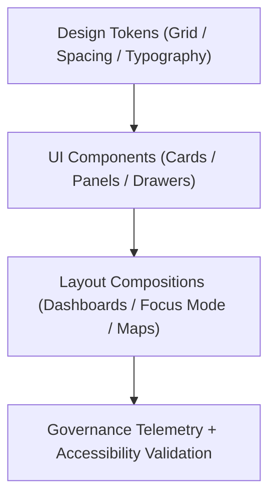

<div align="center">

# 🧱 Kansas Frontier Matrix — **Layout Design Patterns**
`docs/design/patterns/layout-patterns.md`

**Purpose:**  
Defines the **responsive layout architecture**, **spatial hierarchy**, and **ethical composition rules** that shape every interface across the **Kansas Frontier Matrix (KFM)**.  
Each layout follows FAIR+CARE, WCAG 2.2, and ISO 9241-210 usability principles to balance visual clarity, accessibility, and narrative transparency in Focus Mode, Governance Dashboards, and Data Explorer interfaces.

[](../../../docs/standards/faircare-validation.md)
[]()
[]()
[](../../../LICENSE)

</div>

---

## 📚 Overview

The **Layout Design Framework** defines structural blueprints for all KFM user interfaces — ensuring spatial harmony, accessibility, and ethical representation of complex data.  
It governs both **page-level compositions** and **component-level arrangements**, linking UI tokens, accessibility metadata, and governance telemetry to design sustainability.

Each layout pattern enforces:
- FAIR+CARE compliance through consistent information architecture.  
- Semantic markup for accessibility and screen-reader compatibility.  
- Provenance-linked telemetry to record design performance and ethical validation.  
- ISO-aligned ergonomic and human-centered visual standards.

---

## 🧭 Layout Architecture Framework



### Layout Layers

| Layer | Description | Source |
|--------|--------------|---------|
| **Design Tokens** | Defines spacing, grid, typography, and color foundation. | `docs/design/tokens/` |
| **Components** | Core building blocks defining boundaries and responsiveness. | `web/src/components/` |
| **Compositions** | Higher-order structures like maps, panels, and dashboards. | `web/src/layouts/` |
| **Governance Layer** | Logs layout telemetry and FAIR+CARE compliance events. | `releases/v9.6.0/focus-telemetry.json` |

---

## 🧩 Core Layout Patterns

| Pattern | Description | Ethical Function |
|----------|--------------|------------------|
| **12-Column Grid** | Foundational structure for all pages ensuring consistency. | FAIR Reusability / ISO 9241 Alignment |
| **Split-Panel Layout** | Balances dual-view experiences (e.g., map + details). | Cognitive transparency |
| **Timeline Layout** | Horizontally scrolling data visualization for temporal context. | FAIR Findability |
| **Dashboard Card Grid** | Displays modular metrics or validation results. | Ethical data summarization |
| **Governance Drawer Layout** | Interactive provenance side panel with live FAIR+CARE updates. | Transparency & Accountability |
| **Narrative Scroll Sync** | Synchronized story-to-map or AI reasoning flow. | Accessibility in storytelling |
| **Modal Layer Pattern** | Lightweight overlays for ethical confirmations or explainability. | CARE Responsibility |
| **Flex Adaptive Layout** | Adjusts column ratios dynamically by screen width. | WCAG 2.2 Responsiveness |

---

## ⚙️ Responsive Grid Framework

KFM employs a **12-column grid system** with dynamic breakpoints to accommodate device accessibility and FAIR+CARE display standards.

| Breakpoint | Device Type | Column Width | Margin | Padding | Behavior |
|-------------|--------------|--------------|---------|----------|-----------|
| `xs` | Mobile (≤480px) | 4 | 8px | 8px | Single-column, full-width content |
| `sm` | Tablet (481–768px) | 8 | 12px | 16px | Collapsible sections and modular cards |
| `md` | Laptop (769–1024px) | 12 | 16px | 24px | Primary grid layout for dashboards |
| `lg` | Desktop (≥1025px) | 12 | 20px | 32px | Fixed multi-panel layout |
| `xl` | Wide / Wall Displays | 16 | 24px | 40px | Grid expands for contextual visualization |

---

## 🧱 Spatial Composition Patterns

| Composition | Description | FAIR+CARE Purpose |
|--------------|--------------|-------------------|
| **Map-Focus Composition** | Primary split view linking timeline and geospatial analysis. | Transparency in spatial-temporal data |
| **Governance Dashboard Composition** | Summarizes ethical, AI, and validation metrics. | FAIR+CARE Responsibility |
| **Story Panel Composition** | Full-width immersive storytelling layout. | Accessibility and empathy design |
| **Data Comparison Composition** | Dual-table view for version and schema diff analysis. | Provenance and traceability |
| **AI Insight Composition** | Integrates explainability graphs beside text context. | Explainability and cognitive clarity |

---

## 🧩 Accessibility & Ethical Layout Patterns

| Pattern | Description | Standard |
|----------|--------------|----------|
| **Skip-to-Content Anchor** | Quick keyboard navigation to main content regions. | WCAG 2.4.1 |
| **Reduced Motion Layer** | Optional static layout for vestibular accessibility. | WCAG 2.3.3 |
| **Contrast Safe Zone** | Layout boundaries preserve 4.5:1 color contrast. | WCAG 1.4.3 |
| **Readable Grid Scaling** | 1.5x scaling for low-vision users without breaking grid. | WCAG 1.4.4 |
| **Ethical Loading State** | Informative placeholders with contextual meaning (no bias). | FAIR+CARE Ethics |

---

## 📊 Layout Telemetry Example

Each layout is evaluated through continuous telemetry reporting to maintain performance, accessibility, and energy sustainability benchmarks.

```json
{
  "layout_id": "dashboard_faircare_v9.6.0",
  "component_density": 0.74,
  "contrast_ratio": 5.1,
  "readability_score": 98.4,
  "a11y_compliance": "AA",
  "energy_use_wh": 15.8,
  "fairstatus": "certified",
  "timestamp": "2025-11-03T19:10:00Z"
}
```

Telemetry data stored in:  
`releases/v9.6.0/focus-telemetry.json`

---

## ⚖️ FAIR+CARE Layout Governance Matrix

| Principle | Implementation | Oversight |
|------------|----------------|------------|
| **Findable** | Layout templates and compositions indexed in manifest.json. | @kfm-data |
| **Accessible** | Fully WCAG 2.2 AA-compliant design standards. | @kfm-accessibility |
| **Interoperable** | Reusable across all front-end KFM modules. | @kfm-architecture |
| **Reusable** | Modular compositions follow open design token contracts. | @kfm-design |
| **Collective Benefit** | Enhances accessibility for all users and researchers. | @faircare-council |
| **Authority to Control** | FAIR+CARE Council reviews all major layout changes. | @kfm-governance |
| **Responsibility** | Accessibility and energy metrics logged quarterly. | @kfm-telemetry |
| **Ethics** | Inclusive and culturally neutral design layouts. | @kfm-ethics |

---

## 🌱 Sustainable Design Metrics

| Metric | Target | Verified By |
|---------|---------|--------------|
| Layout Reusability | ≥ 90% | @kfm-design |
| Accessibility Compliance | ≥ 95% | @kfm-accessibility |
| Layout Energy Efficiency | ≤ 20 Wh per render | @kfm-sustainability |
| FAIR+CARE Governance Retention | Permanent | @kfm-governance |

Metrics validated and logged via:  
`focus-telemetry.json`

---

## 🧾 Internal Use Citation

```text
Kansas Frontier Matrix (2025). Layout Design Patterns (v9.6.0).
Defines ethical, accessible, and responsive layout structures under FAIR+CARE and ISO standards.
Ensures usability, sustainability, and provenance traceability across all KFM web and Focus Mode interfaces.
```

---

## 🧾 Version Notes

| Version | Date | Notes |
|----------|------|--------|
| v9.6.0 | 2025-11-03 | Added accessible timeline layout and FAIR+CARE dashboard compositions. |
| v9.5.0 | 2025-11-02 | Introduced ethical modal and provenance drawer layout patterns. |
| v9.3.2 | 2025-10-28 | Established baseline layout grid and accessibility scaling framework. |

---

<div align="center">

**Kansas Frontier Matrix** · *Spatial Design × FAIR+CARE Ethics × Sustainable Interface Architecture*  
[🔗 Repository](https://github.com/bartytime4life/Kansas-Frontier-Matrix) • [🎨 Design Docs](../README.md) • [⚖️ Governance Ledger](../../../docs/standards/governance/DATA-GOVERNANCE.md)

</div>