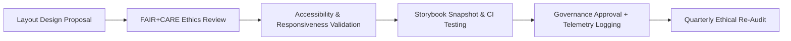

<div align="center">

# 📐 **Kansas Frontier Matrix — Layout & Grid System Patterns**
`docs/design/patterns/layouts.md`

**Purpose:**  
Define the **responsive layout, grid, and page architecture standards** for the **Kansas Frontier Matrix (KFM)** user interfaces, ensuring visual consistency, accessibility, and energy-efficient rendering under **FAIR+CARE** and **ISO 9241-210** design ethics.

[](../../README.md)
[](../../standards/faircare.md)
[](../../../LICENSE)
[](../../../releases/v10.0.0/manifest.zip)

</div>

---

## 📘 Overview

The **KFM Layout & Grid System** establishes responsive, modular page templates that unify the visual language of dashboards, Focus Mode views, data browsers, and governance portals.  
These patterns ensure that every layout is:
- **Accessible** (WCAG 2.1 AA compliant)  
- **FAIR+CARE Certified** for ethical visual balance  
- **Consistent** with the design token system  
- **Responsive and performant** across devices and screen readers  

Layouts are validated automatically through **MCP CI/CD workflows** and reviewed quarterly by the **FAIR+CARE Design Council**.

---

## 🗂️ Directory Layout

```
docs/design/patterns/
├── README.md                 # Overview of design patterns
├── layouts.md                # Layout & grid system standards
├── dashboards.md             # Dashboard visualization templates
├── map-ui.md                 # MapLibre / Cesium 3D interface guidelines
└── story-cards.md            # Historical narrative layout documentation
```

---

## 🧩 Layout System Structure

| Layer | Description | Framework |
|---|---|---|
| **Root Wrapper** | Defines the global content width, background, and navigation structure. | `<main>` / `<section>` |
| **Grid Container** | Houses responsive column grid (12-column base). | Tailwind CSS Grid / Flexbox |
| **Modules** | Independent content blocks (cards, panels, or maps). | KFM UI Components |
| **Panels** | Thematic groupings (AI narratives, telemetry, reports). | `<aside>` / `<article>` |
| **Footer / Metadata** | Provides navigation, provenance, and FAIR+CARE disclaimers. | `<footer>` |

---

## 🎨 Layout Tokens

| Token | Description | Value | Compliance |
|---|---|---|---|
| `grid.columns` | Default column count | `12` | Responsive design |
| `grid.gap` | Space between columns | `1rem` | WCAG 1.4.8 |
| `container.maxWidth` | Page content width | `1200px` | ISO 9241-210 |
| `spacing.section.padding` | Section padding | `2rem` | KFM Design Tokens |
| `color.bg.surface` | Default layout background | `#FFFFFF` | WCAG contrast ≥ 4.5:1 |
| `color.bg.alt` | Alternate section background | `#F9FAFB` | Ethical readability standard |

---

## 🧭 Page Layout Types

| Layout | Description | Example Use |
|---|---|---|
| **Standard Grid Layout** | Primary pattern with header, sidebar, and flexible content. | Dashboards, documentation pages. |
| **Full-Width Map Layout** | Expands content horizontally for data visualizations. | MapLibre, Cesium. |
| **Split Panel Layout** | Two-column responsive design for side-by-side comparison. | Focus Mode (narrative + map). |
| **Card Grid Layout** | Modular grid of story or dataset cards. | Archive explorer, AI narratives. |
| **Governance Layout** | Timeline-style content for version logs and council minutes. | Governance and audit reports. |

---

## ♿ Accessibility Standards

| Requirement | Implementation | Validation |
|---|---|---|
| **Landmark Roles** | Use `<header>`, `<main>`, `<nav>`, `<footer>` for structure. | `accessibility_scan.yml` |
| **Keyboard Navigation** | Logical tab order following visual hierarchy. | Manual Audit |
| **Skip Links** | “Skip to Content” and “Skip to Navigation” links for screen readers. | Automated |
| **Contrast Ratio** | ≥ 4.5:1 between text and background. | WCAG 1.4.3 |
| **Responsive Reflow** | Supports zoom and viewport scaling to 200%. | WCAG 1.4.10 |

---

## 🧠 FAIR+CARE Ethical Layout Principles

| Principle | Design Guidance |
|---|---|
| **Collective Benefit** | Layouts prioritize education and equitable knowledge sharing over persuasion or advertising. |
| **Authority to Control** | Content visibility honors community or Indigenous consent metadata. |
| **Responsibility** | UI structure minimizes cognitive overload; clearly separates factual and interpretive data. |
| **Ethics** | Avoid manipulative hierarchy (e.g., over-emphasizing certain data visually). |

> Layouts must maintain **truthful balance** — no visual hierarchy should distort meaning.

---

## 🧾 Example: Responsive Dashboard Layout

```tsx
<main className="min-h-screen bg-surface text-body">
  <header className="p-4 bg-primary text-white">
    <h1 className="text-2xl font-bold">Kansas Frontier Matrix Dashboard</h1>
  </header>

  <div className="grid grid-cols-1 md:grid-cols-3 gap-4 p-4">
    <section className="col-span-2 bg-white rounded shadow p-4">
      <h2 className="text-lg font-semibold">Climate Trends</h2>
      <div role="figure" aria-label="Temperature data chart"></div>
    </section>
    <aside className="bg-alt rounded shadow p-4">
      <h2 className="text-lg font-semibold">FAIR+CARE Provenance</h2>
      <p>Source: NOAA · Certified by FAIR+CARE Council</p>
    </aside>
  </div>

  <footer className="p-4 text-sm text-muted bg-neutral-100">
    © 2025 Kansas Frontier Matrix — FAIR+CARE Certified
  </footer>
</main>
```

**Accessibility & Ethics Review**
- Semantic structure with landmarks.  
- Accessible chart annotation via `role="figure"`.  
- Ethical provenance displayed clearly.  

---

## 🧩 Example: Focus Mode Split Layout

```tsx
<div className="grid grid-cols-1 lg:grid-cols-2 h-full">
  <section aria-label="Map Region" className="bg-map border-r border-neutral-200">
    {/* MapLibre or Cesium visualization */}
  </section>
  <aside
    aria-label="Narrative Panel"
    className="overflow-y-auto p-4 bg-surface"
  >
    <h2 className="text-lg font-semibold">Historical Context</h2>
    <p>AI-generated narrative verified by FAIR+CARE ethics filters.</p>
  </aside>
</div>
```

**Key Points**
- Split layout responsive down to mobile.  
- Focus Mode content fully keyboard navigable.  
- Provenance and consent displayed for AI narratives.  

---

## ⚙️ Validation Workflows

| Workflow | Function | Artifact |
|---|---|---|
| `ux-pattern-validate.yml` | Tests layout grid responsiveness and token use. | `reports/ui/ux-pattern-validation.json` |
| `accessibility_scan.yml` | Confirms ARIA landmarks and reflow behavior. | `reports/self-validation/web/a11y_summary.json` |
| `faircare-visual-audit.yml` | Checks ethical use of space, hierarchy, and visibility. | `reports/faircare-visual-validation.json` |
| `layout-performance.yml` | Monitors energy and rendering efficiency. | `reports/ui/layout-performance.json` |

---

## 📊 Layout Performance Metrics

| Metric | Target | Verified By |
|---|---|---|
| **Responsive Load Time** | ≤ 1.5s (initial paint) | Lighthouse CI |
| **Reflow Accuracy** | 100% | `accessibility_scan.yml` |
| **Contrast Compliance** | ≥ 4.5:1 | `design-tokens-validate.yml` |
| **Cultural Visibility Balance** | ≥ 95% ethical approval | FAIR+CARE Audit |
| **Energy Efficiency (ISO 50001)** | ≤ 0.2Wh per render | Performance Logs |

---

## 🧮 Layout Lifecycle



All layouts undergo recurring validation under MCP workflows to maintain FAIR+CARE certification.

---

## 🕰️ Version History

| Version | Date | Author | Summary |
|---|---|---|---|
| v10.0.0 | 2025-11-10 | FAIR+CARE Design Council | Introduced comprehensive layout and grid system standards integrating accessibility, ethical visibility, and sustainable design performance metrics. |

---

<div align="center">

**© 2025 Kansas Frontier Matrix — CC-BY 4.0**  
Developed under **Master Coder Protocol v6.3** · Reviewed by **FAIR+CARE Design Council**  
[⬅ Back to Design Patterns Index](README.md) · [Dashboards →](dashboards.md)

</div>