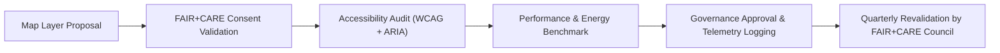

<div align="center">

# 🗺️ **Kansas Frontier Matrix — Map UI & Geospatial Interaction Patterns**
`docs/design/patterns/map-ui.md`

**Purpose:**  
Define the **interactive geospatial interface standards** for **MapLibre**, **Cesium**, and other mapping tools used in the **Kansas Frontier Matrix (KFM)** platform.  
This document establishes accessibility, cultural sensitivity, and FAIR+CARE compliance rules for **map interactions**, **layer management**, and **narrative overlays**.

[](../../README.md)
[](../../standards/faircare.md)
[](../../../LICENSE)
[](../../../releases/v10.0.0/manifest.zip)

</div>

---

## 📘 Overview

The **KFM Map UI Pattern** governs all interactive geospatial components across the platform, including:
- 2D/3D map rendering with **MapLibre GL** and **CesiumJS**  
- FAIR+CARE-compliant **layer visibility and consent handling**  
- Keyboard and screen-reader accessible interactions  
- Integration of **Focus Mode AI narratives** with spatial context  

These patterns ensure KFM’s map interfaces remain inclusive, ethical, and reproducible.

---

## 🗂️ Directory Layout

```
docs/design/patterns/
├── README.md
├── map-ui.md                     # Map UI and interaction guidelines
├── dashboards.md                 # Dashboard visualization standards
├── layouts.md                    # Responsive grid and layout rules
└── story-cards.md                # Historical story presentation templates
```

---

## 🧭 Map UI Principles

| Principle | Description | Standard |
|---|---|---|
| **Accessibility First** | All map controls and overlays must be operable by keyboard and assistive tech. | WCAG 2.1 AA |
| **Ethical Transparency** | Every visible dataset shows license, provenance, and consent status. | FAIR+CARE |
| **Cultural Sensitivity** | Indigenous or heritage layers must be protected and consent-flagged. | IDGB Protocol |
| **Reproducibility** | All interactions are versioned and logged in telemetry. | MCP-DL v6.3 |
| **Sustainability** | 3D rendering optimized to minimize energy load. | ISO 50001 |

---

## 🎨 Visual Specifications

| UI Element | Description | Token Reference | Example Value |
|---|---|---|---|
| **Base Map** | Default terrain and vector style. | `map.style.default` | `kfm-light.json` |
| **Focus Highlight** | Outline color for selected entity. | `focus.outline.color` | `#FFB300` |
| **Layer Control** | Panel background and borders. | `color.bg.surface` | `#FFFFFF` |
| **Popup Panel** | Accessible data summary view. | `spacing.padding.md` | `1rem` |
| **3D Camera Transition** | Motion preference aware. | `motion.prefersReduced` | `true` |

All map colors and icons must maintain ≥ 4.5:1 contrast ratio and respect accessibility tokens.

---

## ♿ Accessibility Requirements

| Requirement | Implementation | Validation |
|---|---|---|
| **Keyboard Navigation** | Arrow keys pan, `+/-` zoom, `Tab` focuses controls. | Manual & CI |
| **Focus Indicators** | Visual outline on active map features. | WCAG 2.4.7 |
| **ARIA Live Regions** | Announce viewport and layer changes. | `aria-live="polite"` |
| **Accessible Popups** | Descriptive text summaries for spatial data. | `aria-describedby` |
| **Skip Navigation** | Link to skip directly to non-map content. | WCAG 2.4.1 |
| **Motion Control** | Disables 3D fly-throughs for reduced motion users. | `prefers-reduced-motion` |

---

## 🧠 FAIR+CARE Ethical Map Layers

| Layer Category | Description | Access Level | Consent Policy |
|---|---|---|---|
| **Public Data Layers** | Environmental, geological, and climatic datasets. | Open | Public Domain / CC-BY |
| **Cultural Heritage Layers** | Indigenous boundaries, heritage sites, oral maps. | Controlled | Requires IDGB Approval |
| **AI Narrative Overlays** | Contextual Focus Mode spatial stories. | Open | FAIR+CARE Verified |
| **Sensitive Data Layers** | Sacred sites, ceremonial grounds, private deeds. | Restricted | Not publicly viewable |

> FAIR+CARE rules: No cultural or personal data displayed without explicit, traceable consent metadata.

---

## 🧾 Example: Accessible Map Container

```tsx
<section
  id="map-container"
  role="application"
  aria-label="Kansas Frontier Matrix Map"
  aria-describedby="map-summary"
  className="relative h-screen w-full"
>
  <div id="map" role="region" aria-label="Interactive map region"></div>
  <p id="map-summary" className="sr-only">
    Interactive map displaying Kansas historical, cultural, and environmental data layers. Use arrow keys to navigate and Enter to open layer details.
  </p>
</section>
```

- Screen-reader friendly with semantic roles.  
- `aria-describedby` provides context for non-visual users.  
- Focus and keyboard navigation tested with NVDA and VoiceOver.

---

## 🗺️ Example: FAIR+CARE Layer Control Panel

```tsx
<aside
  aria-label="Layer Controls"
  className="absolute top-4 left-4 bg-white rounded-lg p-3 shadow-lg border border-neutral-200"
>
  <h3 className="text-base font-semibold">Map Layers</h3>
  <ul>
    <li>
      <input type="checkbox" id="noaa-layer" checked aria-checked="true" />
      <label htmlFor="noaa-layer" className="ml-2">NOAA Climate Data</label>
    </li>
    <li>
      <input type="checkbox" id="heritage-layer" aria-checked="false" />
      <label htmlFor="heritage-layer" className="ml-2">
        Indigenous Heritage Sites <span title="Controlled Access">⚠️</span>
      </label>
    </li>
  </ul>
</aside>
```

**Accessibility Highlights**
- Checkbox-style layer toggles with ARIA state (`aria-checked`).  
- Labels provide context and access tier badges.  
- All controls navigable via keyboard.  

---

## 🧩 Example: Map Popup (FAIR+CARE Provenance)

```tsx
<div
  role="dialog"
  aria-modal="false"
  aria-labelledby="popup-title"
  aria-describedby="popup-content"
  className="absolute bottom-4 left-4 bg-white border border-neutral-200 rounded-lg shadow-lg p-4 max-w-sm"
>
  <h4 id="popup-title" className="text-lg font-semibold text-primary">
    Fort Larned Historic Site
  </h4>
  <p id="popup-content" className="text-sm text-body">
    Established in 1859, this site served as a U.S. Army outpost on the Santa Fe Trail. 
    <span className="block mt-2 text-xs text-muted">
      Source: Kansas Historical Society — FAIR+CARE Certified
    </span>
  </p>
</div>
```

**Ethical Review**
- Historical narrative tone verified neutral and factual.  
- FAIR+CARE certification visible within content.  
- Provenance citation linked to dataset metadata.  

---

## ⚙️ CI/CD Validation Workflows

| Workflow | Function | Artifact |
|---|---|---|
| `map-accessibility.yml` | Validates keyboard navigation, ARIA regions, and motion control. | `reports/ui/map-accessibility.json` |
| `faircare-layer-audit.yml` | Ensures cultural consent metadata for heritage datasets. | `reports/data/faircare-validation.json` |
| `design-tokens-validate.yml` | Checks color contrast and token usage across map UI. | `reports/ui/design-token-lint.json` |
| `performance-energy.yml` | Measures rendering efficiency and ISO 50001 compliance. | `reports/ui/performance-metrics.json` |

---

## 📊 Quality Metrics

| Metric | Target | Verified By |
|---|---|---|
| **Accessibility (WCAG 2.1 AA)** | ≥ 95 | `map-accessibility.yml` |
| **Consent Metadata Coverage** | 100% (heritage datasets) | `faircare-layer-audit.yml` |
| **Contrast Compliance** | ≥ 4.5:1 | `design-tokens-validate.yml` |
| **Motion Reduction Coverage** | 100% | Accessibility Council Review |
| **Render Efficiency (ISO 50001)** | ≤ 0.3 Wh per map view | CI Energy Audit |

---

## 🧮 Map UI Lifecycle



All map components, datasets, and controls must pass ethical and accessibility audits before being published or updated in KFM’s STAC/DCAT catalogs.

---

## 🕰️ Version History

| Version | Date | Author | Summary |
|---|---|---|---|
| v10.0.0 | 2025-11-10 | FAIR+CARE Design & Geospatial Council | Created standardized Map UI patterns ensuring accessibility, cultural consent compliance, and ethical FAIR+CARE integration for MapLibre and Cesium-based interactions. |

---

<div align="center">

**© 2025 Kansas Frontier Matrix — CC-BY 4.0**  
Maintained under **Master Coder Protocol v6.3** · Verified by **FAIR+CARE Council**  
[⬅ Back to Design Patterns Index](README.md) · [Story Cards →](story-cards.md)

</div>