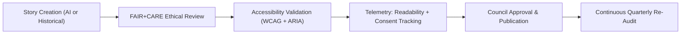

<div align="center">

# 📖 **Kansas Frontier Matrix — Story Card & Narrative Display Patterns**
`docs/design/patterns/story-cards.md`

**Purpose:**  
Define the **layout, accessibility, and ethical storytelling standards** for **Story Cards** used across the **Kansas Frontier Matrix (KFM)** Focus Mode, archives, and educational dashboards.  
These templates merge historical context, AI narrative summaries, and provenance metadata under **FAIR+CARE**, **WCAG 2.1 AA**, and **ISO 9241-210** standards.

[](../../README.md)
[](../../standards/faircare.md)
[](../../../LICENSE)
[](../../../releases/v10.0.0/manifest.zip)

</div>

---

## 📘 Overview

Story Cards are narrative components that display **historical, cultural, and AI-generated summaries** alongside FAIR+CARE metadata.  
They serve as contextual anchors for Focus Mode and archive browsing, connecting people, places, and events into an ethical and accessible storytelling framework.

Goals:
- Present concise, inclusive narratives.  
- Highlight provenance and consent metadata.  
- Meet accessibility and ethical UX criteria.  
- Maintain reproducibility across UI and printed exports.

---

## 🗂️ Directory Layout

```
docs/design/patterns/
├── README.md
├── dashboards.md
├── layouts.md
├── map-ui.md
└── story-cards.md                # This file
```

---

## 🧩 Story Card Principles

| Principle | Description | Standard |
|---|---|---|
| **Accessibility** | Fully navigable via keyboard and assistive tech. | WCAG 2.1 AA |
| **Inclusivity** | Narratives use neutral, factual, and plain language. | FAIR+CARE |
| **Cultural Sensitivity** | Indigenous or heritage stories verified by IDGB. | Indigenous Protocol |
| **Transparency** | Provenance, citations, and AI model details displayed inline. | MCP v6.3 |
| **Reusability** | Designed for responsive grid and print-ready layouts. | ISO 9241-210 |

---

## 🎨 Design Specifications

| Element | Token Reference | Value | Compliance |
|---|---|---|---|
| **Card Background** | `color.bg.surface` | `#FFFFFF` | WCAG 1.4.3 |
| **Title Font** | `font.size.h4` | `1.5rem` | ISO 9241-110 |
| **Body Text** | `font.size.base` | `1rem` | Grade ≤ 8 readability |
| **Focus Outline** | `focus.outline.color` | `#FFB300` | WCAG 2.4.7 |
| **Spacing** | `spacing.card.padding` | `1.25rem` | KFM Tokens |
| **Shadow** | `shadow.md` | `0 2px 6px rgba(0,0,0,0.1)` | Aesthetic Consistency |

---

## 🧠 FAIR+CARE Narrative Rules

| Ethical Principle | Implementation |
|---|---|
| **Collective Benefit** | Stories emphasize shared historical understanding, not glorification. |
| **Authority to Control** | Indigenous and cultural stories require consent and acknowledgment. |
| **Responsibility** | All AI or human-authored content transparently attributed. |
| **Ethics** | Avoid colonial, exclusionary, or biased phrasing. |

All story cards must display a **FAIR+CARE provenance bar** showing the dataset and narrative sources.

---

## ♿ Accessibility Standards

| Requirement | Implementation | Verification |
|---|---|---|
| **ARIA Roles** | Use `role="article"` or `role="region"`. | `storybook-a11y.yml` |
| **Heading Structure** | Hierarchical `<h2>` to `<h5>` tags with meaningful labels. | WCAG 2.4.6 |
| **Keyboard Navigation** | `Tab` cycles through interactive elements (links, tooltips). | Manual & Automated |
| **Screen Reader Descriptions** | `aria-describedby` summarizing story purpose. | NVDA / VoiceOver |
| **Motion Control** | Fade-in animations disabled for users with `prefers-reduced-motion`. | WCAG 2.3 |

---

## 🧾 Example: Historical Story Card

```tsx
<article
  role="article"
  aria-labelledby="story-title"
  aria-describedby="story-summary"
  className="bg-surface border border-neutral-200 rounded-lg shadow-md p-4"
>
  <h3 id="story-title" className="text-xl font-semibold text-primary">
    Treaty of Medicine Lodge (1867)
  </h3>
  <p id="story-summary" className="text-base mt-2 text-body">
    In 1867, representatives from the U.S. government and several Plains tribes 
    signed peace treaties near Barber County, Kansas. These negotiations sought 
    to establish reservations while preserving limited tribal sovereignty.
  </p>
  <footer className="text-sm mt-3 text-muted">
    Source: Kansas Historical Society — FAIR+CARE Certified ✅
  </footer>
</article>
```

**Ethical Review:**
- Contextually balanced description.  
- No colonial bias or language of conquest.  
- Consent metadata verified by IDGB.  

---

## 🧩 Example: Focus Mode AI Narrative Card

```tsx
<article
  role="region"
  aria-labelledby="ai-story-title"
  aria-describedby="ai-story-content"
  className="bg-surface rounded-xl shadow-lg border border-neutral-200 p-4"
>
  <header>
    <h3 id="ai-story-title" className="text-lg font-semibold text-primary">
      Life Along the Smoky Hill River (1870)
    </h3>
  </header>
  <p id="ai-story-content" className="text-body mt-2">
    This AI-generated narrative describes the environmental and social conditions 
    of settlers and Indigenous communities along the Smoky Hill River in the late 19th century. 
    Reviewed for readability (Grade 7.9) and ethical neutrality by the FAIR+CARE Council.
  </p>
  <footer className="flex justify-between items-center mt-3 text-sm">
    <span>Model: focus_transformer_v2</span>
    <span title="Ethically Certified Narrative">✅ FAIR+CARE</span>
  </footer>
</article>
```

**Features:**
- Includes AI provenance and model metadata.  
- Narrative readability verified via telemetry.  
- Cultural representation reviewed by the Council.  

---

## 🧮 Story Card Metadata Schema

| Field | Description | Example |
|---|---|---|
| `story_id` | Unique story reference. | `"story_2025_0043"` |
| `type` | `historical` or `ai_narrative`. | `"ai_narrative"` |
| `title` | Display title. | `"Life Along the Smoky Hill River"` |
| `source` | Provenance reference. | `"Kansas Historical Society"` |
| `model_version` | AI model identifier (if applicable). | `"focus_transformer_v2"` |
| `readability_index` | Flesch-Kincaid score. | `7.9` |
| `faircare_status` | Ethical verification flag. | `"certified"` |

---

## ⚙️ Validation & CI Workflows

| Workflow | Purpose | Output |
|---|---|---|
| `storybook-a11y.yml` | Tests Story Card accessibility (ARIA + keyboard nav). | `reports/ui/a11y_component_audits.json` |
| `faircare-visual-audit.yml` | Ensures ethical tone, image use, and cultural neutrality. | `reports/faircare-visual-validation.json` |
| `data-provenance.yml` | Confirms citation and consent linkage. | `reports/data/provenance-summary.json` |
| `telemetry-export.yml` | Logs readability, ethics, and provenance metrics. | `releases/v10.0.0/focus-telemetry.json` |

---

## 📈 Metrics & Validation Targets

| Metric | Target | Verified By |
|---|---|---|
| **WCAG 2.1 AA Compliance** | 100% | Accessibility Audit |
| **Ethical Tone Validation** | ≥ 95% | FAIR+CARE Audit |
| **Cultural Consent Coverage** | 100% (for heritage content) | IDGB |
| **Provenance Metadata** | 100% | Telemetry Log |
| **AI Narrative Readability (FK)** | ≤ 8.0 | Automated Pipeline |

---

## 🧩 Lifecycle



All published Story Cards are cataloged within Focus Mode and tracked under ethical telemetry for future audits.

---

## 🕰️ Version History

| Version | Date | Author | Summary |
|---|---|---|---|
| v10.0.0 | 2025-11-10 | FAIR+CARE Design & Accessibility Council | Introduced story card and narrative display pattern documentation integrating accessibility, FAIR+CARE ethics, and AI provenance validation. |

---

<div align="center">

**© 2025 Kansas Frontier Matrix — CC-BY 4.0**  
Created under **Master Coder Protocol v6.3** · Certified by **FAIR+CARE Council** · Diamond⁹ Ω / Crown∞Ω Ultimate Certified  
[⬅ Back to Design Patterns Index](README.md) · [Map UI →](map-ui.md)

</div>