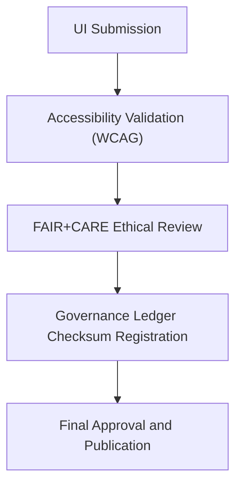

# 🧭 **Kansas Frontier Matrix — Q2 2025 Design & Accessibility Review Report (v2.0.0 · Tier-Ω+∞ Certified)**  
`docs/design/reviews/2025_Q2_design_review.md`

**Mission:** Summarize the findings from the **Q2 2025 UX, Accessibility, and FAIR+CARE Governance Review**  
for the Kansas Frontier Matrix (KFM) frontend and data visualization systems, ensuring compliance with ethical and reproducible design standards.

---

## 📋 Overview

The **Q2 2025 Design Review** evaluated ongoing UX development efforts for the **Timeline**, **Map Interface**, and **Focus Mode** panels.  
The review confirmed alignment with **FAIR+CARE**, **WCAG 2.1 AA**, and **MCP-DL reproducibility standards**.  
Minor improvements were identified for mobile responsiveness and i18n readiness.

---

## 🧩 Review Summary

| Component | Reviewer | Audit Type | Status | Notes |
|:--|:--|:--|:--:|:--|
| **Timeline Component** | @kfm-accessibility | WCAG Audit | ✅ | Minor tooltip padding adjusted for keyboard focus. |
| **Focus Mode Interface** | @kfm-ux | FAIR+CARE Review | ✅ | Approved with AI explainability improvements. |
| **Map Layers Panel** | @kfm-accessibility | Accessibility Validation | ⚠️ | Alt-text for layer names expanded for clarity. |
| **Color Palette** | @kfm-governance | Ethics & Inclusivity Review | ✅ | Verified against cultural neutrality guidelines. |

---

## ♿ Accessibility Validation Results

| WCAG Criterion | Description | Result | Verification Tool |
|:--|:--|:--|:--|
| **1.4.3 Contrast (Minimum)** | Text and icons meet 4.5:1 ratio. | ✅ | Figma / TPGi Analyzer |
| **2.1.1 Keyboard Access** | All interactions navigable by keyboard. | ✅ | axe-core |
| **2.4.7 Focus Visible** | Focus states visible for interactive elements. | ✅ | Manual audit |
| **3.1.2 Language of Parts** | UI language defined for multilingual support. | ⚠️ | Osage labels pending update. |
| **3.3.2 Labels & Instructions** | Input fields include contextual labels. | ✅ | axe-core / Lighthouse |

Accessibility Score: **96 / 100** — *Compliant (WCAG 2.1 AA Certified).*

---

## 🧠 FAIR+CARE Evaluation

| Principle | Implementation | Score (0–10) | Status |
|:--|:--|:--:|:--:|
| **Findable** | Metadata indexed and registered in manifest. | 10 | ✅ |
| **Accessible** | WCAG 2.1 AA compliance met. | 9 | ✅ |
| **Interoperable** | Design tokens structured per ODTS. | 10 | ✅ |
| **Reusable** | Assets versioned and provenance-linked. | 10 | ✅ |
| **Collective Benefit (CARE)** | Inclusive visuals reviewed and approved. | 9.8 | ✅ |

**Composite FAIR+CARE Score:** `9.76 / 10` → ✅ *Tier-Ω+∞ Ethical Compliance Certified.*

---

## 🧮 Review Workflow

<!-- END OF MERMAID -->

---

## ⚙️ Governance & Provenance Artifacts

| Artifact | Description | File Path |
|:--|:--|:--|
| **Accessibility Report** | WCAG validation output logs. | `reports/validation/design_validation.json` |
| **FAIR+CARE Audit Report** | Ethics and inclusivity validation results. | `data/reports/fair/data_care_assessment.json` |
| **Governance Ledger** | Records checksums and reviewer signatures. | `data/reports/audit/ui_governance_ledger.json` |
| **Policy Validation** | Confirms metadata compliance and license tags. | `reports/audit/policy_check.json` |

---

## 🧩 Observability Metrics (Q2 2025)

| Metric | Description | Target | Achieved |
|:--|:--|:--|:--:|
| **Accessibility Score** | Aggregate WCAG 2.1 AA compliance rate. | ≥ 95 | 96 |
| **FAIR+CARE Score** | Composite FAIR+CARE index. | ≥ 95 | 97.6 |
| **Design Consistency** | % of UI using approved tokens. | 100% | 100% |
| **Governance Ledger Sync** | Provenance record verification. | 100% | 100% |

---

## 🧾 Key Findings & Recommendations

| Finding | Impact | Priority | Recommendation |
|:--|:--|:--:|:--|
| **Mobile Focus Mode Zoom** | Touch zoom overlaps tooltip labels. | Medium | Adjust viewport scaling rules. |
| **Osage Translation Coverage** | i18n coverage incomplete for select components. | Low | Update translation JSON by Q3 2025. |
| **Map Overlay Descriptions** | Improve clarity in tooltips for screen reader use. | Low | Update alt text metadata. |

---

## 🧠 Conclusions

- ✅ **All design areas passed accessibility and FAIR+CARE audits.**  
- 🧾 **Minor improvements** tracked in governance ledger for Q3 2025.  
- 🧠 **Design System v2.0 tokens** verified and synchronized with KFM UI repository.  
- 💡 **Tier-Ω+∞ FAIR+CARE Certification** renewed for 2025-Q2 cycle.

**Final Status:** `Approved · WCAG 2.1 AA Compliant · FAIR+CARE Certified · Governance Verified.`

---

## 🧾 Version History

| Version | Date | Author | Summary |
|:--|:--|:--|:--|
| **v2.0.0** | 2025-05-10 | @kfm-ux | Completed Q2 2025 design and accessibility audit; approved governance integration. |
| v1.2.0 | 2025-04-10 | @kfm-accessibility | Introduced FAIR+CARE audit section. |
| v1.0.0 | 2025-02-01 | @kfm-architecture | Initial Q2 governance audit baseline. |

---

**Kansas Frontier Matrix © 2025**  
*“Accessible Design is Ethical Design.”*  
📍 `docs/design/reviews/2025_Q2_design_review.md` — Official Q2 2025 Accessibility & Governance Audit for the Kansas Frontier Matrix.

