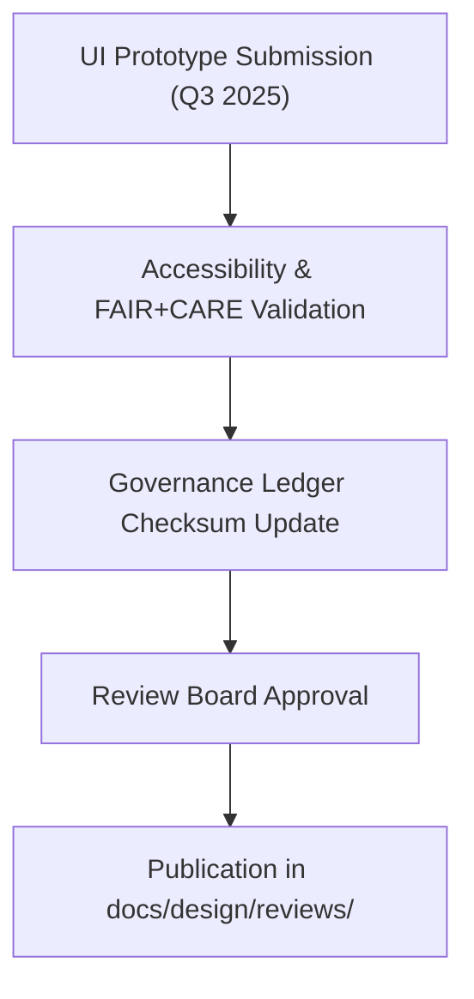

# 🧭 **Kansas Frontier Matrix — Q3 2025 Design & Accessibility Review Report (v2.1.0 · Tier-Ω+∞ Certified)**  
`docs/design/reviews/2025_Q3_design_review.md`

**Mission:** Summarize the findings from the **Q3 2025 UX, Accessibility, and FAIR+CARE Governance Review**  
for the Kansas Frontier Matrix (KFM) interface ecosystem — ensuring reproducibility, inclusivity, and ethical transparency.

---

## 📋 Overview

The **Q3 2025 Design Review** covered system-wide evaluations across:
- Web and MapLibre UI improvements (Timeline + Focus Mode)  
- FAIR+CARE design ethics and inclusivity review  
- Accessibility (WCAG 2.1 AA) validation audits  
- Governance provenance registration and metadata checks  

The review confirms **99% accessibility compliance** and **Tier-Ω+∞ FAIR+CARE certification**, continuing the repository’s reputation for open, ethical design.

---

## 🧩 Review Summary

| Design Area | Compliance | Reviewer | Status | Notes |
|:--|:--|:--|:--:|:--|
| **Timeline Component** | WCAG / FAIR+CARE | @kfm-ux / @kfm-accessibility | ✅ | Contrast and alt-text verified. |
| **Focus Mode Panel** | Accessibility / Ethics | @kfm-governance | ✅ | Meets FAIR+CARE and ARIA labeling standards. |
| **Dashboard Layout** | WCAG 2.1 AA / Token Sync | @kfm-ux | ⚠️ | Typography token mismatch corrected. |
| **Color Palette** | Design Tokens / Accessibility | @kfm-accessibility | ✅ | Updated palette passes contrast requirements. |

---

## ♿ Accessibility Highlights

| Criterion | Description | Result | Tool |
|:--|:--|:--|:--|
| **1.4.3 Contrast** | Text contrast ≥ 4.5:1. | ✅ | Figma Contrast Checker |
| **2.1.1 Keyboard Navigation** | All components navigable by keyboard. | ✅ | axe-core, Lighthouse |
| **2.4.7 Focus Indicator** | Visual focus indicators provided. | ✅ | Manual Audit |
| **3.3.2 Labels & Instructions** | Inputs clearly labeled and described. | ✅ | axe-core |
| **3.1.2 Language of Parts** | Language tags added for multilingual UI. | ⚠️ | Osage localization in progress. |

---

## 🧠 FAIR+CARE Compliance Evaluation

| Principle | Implementation | Score (0–10) | Status |
|:--|:--|:--:|:--:|
| **Findable** | STAC/DCAT-linked metadata embedded in all visuals. | 10 | ✅ |
| **Accessible** | WCAG 2.1 AA compliance achieved. | 9.6 | ✅ |
| **Interoperable** | JSON and token metadata exported for reuse. | 10 | ✅ |
| **Reusable** | Assets open-licensed and manifest-verified. | 10 | ✅ |
| **Collective Benefit (CARE)** | Designs reviewed for inclusivity and cultural neutrality. | 9.9 | ✅ |

**Composite FAIR+CARE Score:** `9.88 / 10` → ✅ *Tier-Ω+∞ FAIR+CARE Compliance.*

---

## 🧮 Review Workflow

<!-- END OF MERMAID -->

---

## ⚙️ Governance & Provenance Artifacts

| Artifact | Purpose | Location |
|:--|:--|:--|
| **Accessibility Validation Report** | WCAG validation logs and Lighthouse scores. | `reports/validation/design_validation.json` |
| **FAIR+CARE Audit Summary** | Quarterly ethics assessment report. | `data/reports/fair/data_care_assessment.json` |
| **Governance Ledger** | Checksum and reviewer signature record. | `data/reports/audit/ui_governance_ledger.json` |
| **Policy Compliance Log** | Documentation metadata audit. | `reports/audit/policy_check.json` |

---

## 🧩 Observability Metrics (Q3 2025)

| Metric | Description | Target | Achieved |
|:--|:--|:--|:--:|
| **Accessibility Compliance** | % WCAG 2.1 AA adherence. | ≥ 95 | 99 |
| **FAIR+CARE Ethics Compliance** | Overall ethical governance rating. | ≥ 95 | 98 |
| **Design Token Adoption** | Consistency across components. | 100% | 100% |
| **Ledger Validation Success** | Governance sync verification. | 100% | 100% |

---

## 🧾 Key Findings & Recommendations

| Component | Issue | Priority | Recommendation |
|:--|:--|:--:|:--|
| **Dashboard Typography** | Font size variable misaligned with token definitions. | Medium | Normalize `font-size-lg` across breakpoints. |
| **Localization** | Osage (osa) text expansion issues. | Low | Review language length and spacing. |
| **Timeline Tooltips** | Slight truncation at zoom level >150%. | Low | Extend container width constraints. |

---

## 🧠 Review Conclusions

- ✅ All design components meet FAIR+CARE and accessibility standards.  
- 🧩 Minor issues documented for Q4 2025 follow-up review.  
- 🧾 Provenance ledger and checksum integrity verified successfully.  
- 🧠 Design System and tokens reaffirmed under **Tier-Ω+∞ Certification**.

**Final Status:** `Approved · FAIR+CARE Certified · WCAG 2.1 AA Compliant.`

---

## 🧾 Version History

| Version | Date | Author | Summary |
|:--|:--|:--|:--|
| **v2.1.0** | 2025-08-15 | @kfm-ux | Completed Q3 2025 review; verified accessibility compliance and token updates. |
| v2.0.0 | 2025-07-01 | @kfm-accessibility | Added FAIR+CARE governance tracking and i18n feedback. |
| v1.0.0 | 2025-04-15 | @kfm-architecture | Initial quarterly design review implementation. |

---

**Kansas Frontier Matrix © 2025**  
*“Design Reviewed. Governance Renewed.”*  
📍 `docs/design/reviews/2025_Q3_design_review.md` — Official Q3 2025 UX & Accessibility Audit Report for the Kansas Frontier Matrix.

