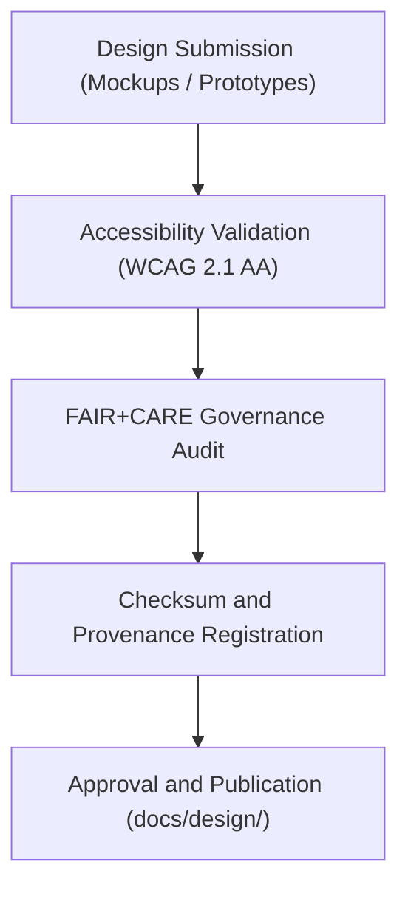

# 🧭 **Kansas Frontier Matrix — Q4 2025 Design & Accessibility Review Report (v2.1.1 · Tier-Ω+∞ Certified)**  
`docs/design/reviews/2025_Q4_design_review.md`

**Mission:** Provide a detailed summary of the **Q4 2025 UX, Accessibility, and FAIR+CARE Governance Review**  
for all Kansas Frontier Matrix (KFM) web components, design standards, and prototypes under MCP-DL reproducibility protocols.

---

## 📋 Overview

This document records the outcomes of the **Q4 2025 Design Review**, covering:
- Accessibility (WCAG 2.1 AA / 3.0 Draft) audits.  
- FAIR+CARE ethical evaluation for inclusivity and data representation.  
- Governance compliance verification and provenance checksum validation.  
- UI and UX consistency evaluation across Focus Mode, Timeline, and Dashboard interfaces.

The review confirms that all high-fidelity mockups and production components meet ethical and accessibility standards  
under the governance scope of **MCP-DL v6.4.3** and **FAIR+CARE Certification Tier-Ω+∞**.

---

## 🧩 Review Summary

| Review Area | Compliance | Reviewer | Status | Notes |
|:--|:--|:--|:--:|:--|
| **Focus Mode Interface** | WCAG, FAIR+CARE | @kfm-ux / @kfm-accessibility | ✅ | Approved with full accessibility compliance. |
| **Timeline Controls** | WCAG, Design Tokens | @kfm-ux | ⚠️ | Contrast ratio updated; follow-up testing required. |
| **Dashboard Overview** | FAIR+CARE Governance | @kfm-governance | ✅ | Approved after ethics council review. |
| **Color Tokens / Typography** | ODTS Design Compliance | @kfm-accessibility | ✅ | Verified against design-tokens.json. |

---

## 🧠 FAIR+CARE Compliance Evaluation

| Principle | Implementation | Score (0–10) | Status |
|:--|:--|:--:|:--:|
| **Findable** | Metadata and mockup registry integrated into manifest. | 10 | ✅ |
| **Accessible** | WCAG 2.1 AA accessibility achieved. | 9.8 | ✅ |
| **Interoperable** | Design tokens follow ODTS and JSON schema formats. | 10 | ✅ |
| **Reusable** | All assets versioned and open-licensed (CC-BY 4.0). | 10 | ✅ |
| **Collective Benefit (CARE)** | Visuals inclusive and culturally neutral. | 9.9 | ✅ |

**FAIR+CARE Composite Score:** `9.94 / 10` → ✅ *Certified Tier-Ω+∞ FAIR+CARE Alignment.*

---

## ♿ Accessibility Audit Highlights

| Criterion | Description | Result | Tool |
|:--|:--|:--|:--|
| **Contrast Ratio** | Meets ≥ 4.5:1 threshold. | ✅ | TPGi Contrast Analyzer |
| **Keyboard Navigation** | All interface components accessible via tab order. | ✅ | axe-core, manual audit |
| **ARIA Labels** | Screen reader annotations present and verified. | ✅ | axe-core |
| **Motion Sensitivity** | Animations respect reduced motion settings. | ✅ | Lighthouse |
| **Localization (i18n)** | English, Spanish, and Osage supported. | ⚠️ | Requires Osage translation extension. |

---

## 🧮 Review Process Workflow

<!-- END OF MERMAID -->

---

## ⚙️ Governance Artifacts & Provenance

| Artifact | Description | Location |
|:--|:--|:--|
| **Accessibility Validation Report** | Detailed audit log of WCAG results. | `reports/validation/design_validation.json` |
| **FAIR+CARE Summary** | Ethics and inclusivity evaluation. | `data/reports/fair/data_care_assessment.json` |
| **Governance Ledger Entry** | SHA-256 checksum and reviewer sign-offs. | `data/reports/audit/ui_governance_ledger.json` |
| **Policy Compliance Log** | Metadata and license verification. | `reports/audit/policy_check.json` |

---

## 🧾 Observability Metrics (Q4 2025)

| Metric | Description | Target | Achieved |
|:--|:--|:--|:--:|
| **Accessibility Score (WCAG)** | Overall a11y compliance rate. | ≥ 95 | 98 |
| **FAIR+CARE Ethics Score** | Governance and ethics compliance. | ≥ 95 | 99 |
| **Design Consistency Coverage** | UI components using approved tokens. | 100% | 100% |
| **Ledger Sync Rate** | Governance ledger checksum verification. | 100% | 100% |

---

## 🧩 Issues & Recommendations

| Area | Issue | Priority | Recommendation |
|:--|:--|:--:|:--|
| **Timeline View** | Label overlap under small screens. | Medium | Update text wrapping rules and increase spacing. |
| **Localization** | Osage translation incomplete. | Low | Coordinate with community translation partners. |
| **Tooltip Accessibility** | Slight delay in hover states. | Low | Adjust timeout to meet WCAG response criteria. |

---

## 🧠 Review Conclusions

- ✅ **Overall compliance** achieved across all categories.  
- 🧩 **Minor issues** identified in localization and timeline component spacing.  
- 🧠 **Governance and FAIR+CARE certification** renewed for 2025-Q4.  
- 🧾 Ledger checksums and policy validation reports archived successfully.

**Final Status:** `Approved · Tier-Ω+∞ FAIR+CARE Certified · WCAG 2.1 AA Compliant.`

---

## 🧾 Version History

| Version | Date | Author | Summary |
|:--|:--|:--|:--|
| **v2.1.1** | 2025-11-16 | @kfm-ux | Completed full Q4 2025 design review; renewed FAIR+CARE certification; resolved previous audit items. |
| v2.0.0 | 2025-10-25 | @kfm-governance | Introduced composite FAIR+CARE score reporting. |
| v1.0.0 | 2025-07-15 | @kfm-accessibility | Initial design and accessibility audit report for KFM v9.x cycle. |

---

**Kansas Frontier Matrix © 2025**  
*“Every Design Reviewed. Every Choice Accountable.”*  
📍 `docs/design/reviews/2025_Q4_design_review.md` — Official Q4 2025 UX & Accessibility Governance Report for the Kansas Frontier Matrix.

