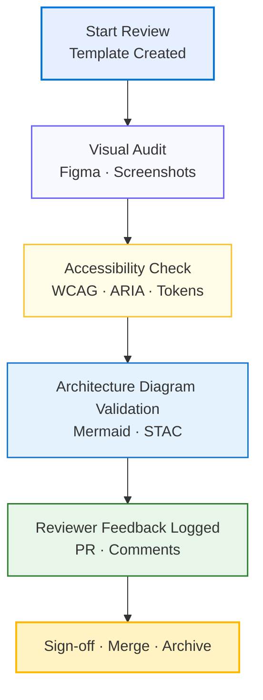

<div align="center">

# 🧩 Kansas Frontier Matrix — Design Reviews  
`docs/design/reviews/`

**Purpose:** Centralize design-review templates, guidelines, and outcomes  
for all visual, interaction, and architectural components of the KFM system.

[](../../)  
[](../)  
[](#accessibility--compliance)  
[](../../LICENSE)

</div>

---

## 🎯 Purpose

This directory houses **design-review documentation** for Kansas Frontier Matrix (KFM), covering:

- 🖼️ Visual & UX audits  
- 🧭 Component-level feedback (Figma → React → MapLibre)  
- ♿ Accessibility evaluations (WCAG 2.1 AA + ARIA)  
- 🧱 Architecture diagram reviews (Mermaid/GitHub render)  
- 🎨 Design-token and style-system consistency checks  
- 🤖 AI-assistant and interaction-UX evaluations  

Design reviews ensure that **time, space, and story** remain synchronized across all user interactions — meeting  
the **Master Coder Protocol (MCP)** standard of *documentation-first reproducibility*.

---

## 🗂️ Directory Structure

```text
docs/design/reviews/
├── README.md                     # This index
├── ui_components/                # Component reviews (Figma → React)
│   ├── navigation.md
│   ├── timeline.md
│   ├── map_controls.md
│   └── ai_assistant.md
├── accessibility/                # WCAG/ARIA audits
│   ├── color_contrast.md
│   ├── keyboard_focus.md
│   └── screen_reader.md
├── architecture/                 # Diagram + flow reviews
│   ├── web_ui_architecture_review.md
│   ├── pipeline_overview_review.md
│   └── provenance_chain_review.md
└── templates/                    # Reusable review forms
    ├── design_review_template.md
    ├── accessibility_checklist.md
    └── component_audit_form.md
````

---

## 🪶 Review Types

| Review Type              | Scope                                        | Deliverables                           | Frequency       |
| ------------------------ | -------------------------------------------- | -------------------------------------- | --------------- |
| **Visual Design**        | Layouts · colors · typography                | Annotated screenshots / Figma comments | Per component   |
| **Interaction Design**   | Map + Timeline sync · gestures · search flow | Updated wireframes · interaction logs  | Major release   |
| **Architecture Diagram** | Mermaid & STAC flowcharts                    | Validated `.mmd` + SVG exports         | Quarterly       |
| **Accessibility**        | Keyboard · color · screen reader             | Checklist + compliance score           | Every milestone |
| **AI UX Review**         | Prompt flow · AI panel · summaries           | Feedback log + UI iteration notes      | As needed       |

---

## 🧩 Review Process

1. **Initiate** — Create a new file from `templates/design_review_template.md`.
2. **Reference** — Link related mockups, PRs, or `.mmd` diagrams.
3. **Evaluate** — Apply MCP checklist → clarity · consistency · compliance · reproducibility.
4. **Record** — Document findings, recommendations, and version metadata.
5. **Approve** — Tag reviewers · assign version bump (semver patch / minor).
6. **Archive** — Move closed reviews to `/archive/` for provenance.

---

## 🧠 Evaluation Checklist (MCP-Aligned)

| Category               | Criteria                                     | Status |
| ---------------------- | -------------------------------------------- | ------ |
| **Readability**        | Font ≥ 16 px; clear hierarchy                | ☐      |
| **Contrast**           | Meets WCAG AA (≥ 4.5:1 text/bg)              | ☐      |
| **Layout**             | Responsive on ≥ 3 breakpoints                | ☐      |
| **Interactivity**      | Hover/focus states visible; tooltips labeled | ☐      |
| **Timeline Sync**      | Map ↔ timeline update < 200 ms               | ☐      |
| **Semantic Structure** | Proper ARIA roles; heading hierarchy         | ☐      |
| **Color System**       | Follows design tokens (`--kfm-color-*`)      | ☐      |
| **Performance**        | ≤ 2 s first paint on median hardware         | ☐      |
| **Documentation**      | README + diagram updated; version tagged     | ☐      |

---

## 🧩 Mermaid Example — Design Review Flow



---

## 🔒 Accessibility & Compliance

All design components must satisfy **WCAG 2.1 AA**, **Section 508**, and **MCP reproducibility** standards.
Reviews assess both **technical accessibility** (markup · ARIA) and **cognitive accessibility**
(color · motion · clarity). Any failed criterion must document remediation steps.

---

## 🧾 Provenance & Versioning

Every review record includes:

| Field                  | Description                             |
| ---------------------- | --------------------------------------- |
| **commit**             | Git hash of design version under review |
| **mockup_version**     | Figma frame ID / export tag             |
| **reviewed_by**        | GitHub handles of reviewers             |
| **approved_on**        | ISO 8601 date                           |
| **stac_id (optional)** | Related visual layer asset ID           |

Completed reviews link to related PRs and STAC metadata for full traceability.

---

## 🧰 Related Documentation

* [Architecture Overview](../architecture/)
* [Mockups Index](../mockups/)
* [UI Component Specs](../mockups/figma/components/)
* [Accessibility Checklist Template](./templates/accessibility_checklist.md)

---

## ⚙️ Continuous Integration (Design QA)

All design reviews are validated via **GitHub Actions** (`design-review.yml`):

* Lints Markdown for heading hierarchy and table integrity.
* Validates Mermaid syntax (`@mermaid-js/mermaid-cli`).
* Checks WCAG JSON reports for contrast violations.
* Posts summary to PR comment via GitHub Bot.

```yaml
# .github/workflows/design-review.yml
on:
  pull_request:
    paths:
      - "docs/design/reviews/**/*.md"
jobs:
  lint-design-docs:
    runs-on: ubuntu-latest
    steps:
      - uses: actions/checkout@v4
      - run: npx @mermaid-js/mermaid-cli --version
      - name: Validate Mermaid blocks
        run: npx @mermaid-js/mermaid-cli -i docs/design/reviews/README.md -o temp.svg
      - name: Lint Markdown
        run: npx markdownlint-cli2 "docs/design/reviews/**/*.md"
```

---

## 🪪 License

All review documents are released under **Creative Commons CC-BY 4.0**.
© 2025 Kansas Frontier Matrix Design Collective.

---

<div align="center">

### 🧭 Kansas Frontier Matrix — Documentation-First Design Governance

**Spatial · Temporal · Narrative · Reproducible**

</div>
