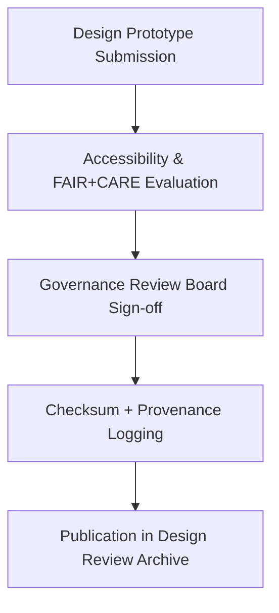

<div align="center">

# 🧭 **Kansas Frontier Matrix — Design Review & Validation Records (v2.1.1 · Tier-Ω+∞ Certified)**  
`docs/design/reviews/README.md`

**Mission:** Centralize all **UX design reviews, accessibility validations, and FAIR+CARE ethical approvals**  
conducted under the **Kansas Frontier Matrix (KFM)** governance framework — ensuring design reproducibility, inclusivity, and provenance.

[](../../../docs/)
[](../../../docs/standards/accessibility.md)
[](../../../docs/standards/faircare-validation.md)
[](../../../LICENSE)

</div>

---

## 📚 Overview

The **Design Review Archive** documents all accessibility and governance evaluations for KFM’s design system and interfaces.  
Each review ensures alignment with:
- **FAIR+CARE principles** for ethical and inclusive design.  
- **WCAG 2.1 / 3.0 standards** for accessibility.  
- **MCP-DL** governance for reproducible documentation.  

All records are cross-referenced with governance ledgers and stored permanently for provenance tracking.

---

## 🗂️ Directory Layout

```bash
docs/design/reviews/
├── README.md                          # This file — design review archive overview
├── 2025_Q4_design_review.md           # Most recent quarterly UX & accessibility audit
├── 2025_Q3_design_review.md
├── 2025_Q2_design_review.md
└── templates/
    ├── review-template.md             # Template for new design review reports
    └── accessibility-checklist.md     # Checklist used during accessibility audits
```

---

## ⚙️ Review Process Overview


<!-- END OF MERMAID -->

---

## 🧱 Design Review Criteria

| Category | Evaluation Metric | Reviewer | Validation Workflow |
|:--|:--|:--|:--|
| **Accessibility (WCAG 2.1)** | Contrast, navigation, screen reader compatibility. | @kfm-accessibility | `design-validate.yml` |
| **Ethical Use (FAIR+CARE)** | Inclusivity, language neutrality, community respect. | @kfm-governance | `faircare-validate.yml` |
| **Design Consistency** | Token usage, spacing, layout uniformity. | @kfm-ux | `policy-check.yml` |
| **Localization (i18n)** | Label readiness and translation structure. | @kfm-docs | i18n Audit |
| **Governance Provenance** | Metadata completeness, checksum registration. | @kfm-architecture | `governance-ledger.yml` |

---

## 🧩 FAIR + CARE Review Model

| Principle | Implementation | Audit Evidence |
|:--|:--|:--|
| **Findable** | Mockups and design tokens registered with manifest IDs. | `manifest.zip` |
| **Accessible** | WCAG-tested components across all prototypes. | Accessibility Audit |
| **Interoperable** | Figma + JSON schema export for reuse. | Design Token Library |
| **Reusable** | Design patterns versioned and archived. | `mockups/hi_fidelity/` |
| **Collective Benefit (CARE)** | Transparent and inclusive visual design standards. | Governance Audit Records |

---

## 🧩 Governance Integration

| Workflow | Function | Output |
|:--|:--|:--|
| `design-validate.yml` | Runs automated accessibility and metadata validation. | `reports/validation/design_validation.json` |
| `faircare-validate.yml` | Performs FAIR+CARE ethical checks on design data. | `reports/fair/data_care_assessment.json` |
| `policy-check.yml` | Ensures README + frontmatter compliance for design docs. | `reports/audit/policy_check.json` |
| `governance-ledger.yml` | Logs all validated design reviews and checksum entries. | `data/reports/audit/ui_governance_ledger.json` |

---

## 🧠 Example Review Record

```yaml
---
review_id: "2025_Q4_UI_Audit"
conducted_on: "2025-11-12"
reviewers: ["@kfm-ux","@kfm-accessibility","@kfm-governance"]
design_scope: ["Focus Mode", "Timeline", "Dashboard"]
findings:
  accessibility_score: 98
  faircare_alignment: true
  issues_found: 3
  resolved: 3
recommendations:
  - Improve timeline label spacing for i18n clarity.
  - Add extended alt text for event markers.
  - Review future animations for vestibular sensitivity.
status: "approved"
ledger_entry: "data/reports/audit/ui_governance_ledger.json"
checksum: "sha256:de94bc97b4e0a6fbd1f4b2aa74..."
---
```

---

## 🧩 Observability Metrics

| Metric | Description | Target | Source |
|:--|:--|:--|:--|
| **a11y_compliance_score** | WCAG 2.1 AA accessibility compliance rate. | ≥ 95% | `design-validate.yml` |
| **faircare_review_completion** | FAIR+CARE ethical review completion per quarter. | 100% | `faircare-validate.yml` |
| **governance_record_sync** | Percentage of reviews logged in ledger. | 100% | `governance-ledger.yml` |
| **issues_resolved_rate** | Ratio of resolved design audit issues. | ≥ 90% | Governance Reports |

---

## 🧾 Quarterly Review Cadence

| Quarter | Review Type | Chair | Deliverable |
|:--|:--|:--|:--|
| **Q1** | Accessibility Review | @kfm-accessibility | Accessibility Report |
| **Q2** | FAIR+CARE Ethical Audit | @kfm-governance | FAIR+CARE Validation |
| **Q3** | Design System Consistency Audit | @kfm-ux | Governance Findings |
| **Q4** | Full Annual UI Audit | @kfm-architecture | `2025_Q4_design_review.md` |

---

## 🧾 Version History

| Version | Date | Author | Summary |
|:--|:--|:--|:--|
| **v2.1.1** | 2025-11-16 | @kfm-governance | Established full review workflow, FAIR+CARE integration, and observability metrics. |
| v2.0.0 | 2025-10-25 | @kfm-ux | Added quarterly audit cadence and governance linkage. |
| v1.0.0 | 2025-10-04 | @kfm-architecture | Initial design review documentation. |

---

<div align="center">

**Kansas Frontier Matrix © 2025**  
*“Ethical Design is Continuous Governance.”*  
📍 `docs/design/reviews/README.md` — Central record of all design and accessibility review documentation for the Kansas Frontier Matrix.

</div>
