<div align="center">

# 🧩 Kansas Frontier Matrix — **Design Reviews**  
`docs/design/reviews/`

**Mission:** Centralize **design-review templates, guidelines, workflows, and outcomes** for all visual,  
interaction, accessibility, and architectural artifacts in **Kansas Frontier Matrix (KFM)** — ensuring that  
**time**, **space**, and **story** remain synchronized and **reproducible** across every release.

[](../../standards/documentation.md)
[](../../.github/workflows/site.yml)
[](../../.github/workflows/policy-check.yml)
[](../ui-guidelines.md#-accessibility)
[](../metadata-standards.md)
[](../../LICENSE)

</div>

---

```yaml
---
title: "🧩 Kansas Frontier Matrix — Design Reviews"
document_type: "README"
version: "v2.2.0"
last_updated: "2025-10-19"
created: "2023-09-14"
owners: ["@kfm-design","@kfm-web","@kfm-accessibility","@kfm-architecture"]
status: "Stable"
maturity: "Production"
license: "CC-BY-4.0"
tags: ["design-review","governance","a11y","ux","ui","tokens","mockups","architecture","mermaid","provenance"]
alignment:
  - MCP-DL v6.3
  - WCAG 2.1 AA
  - WAI-ARIA 1.2
  - CIDOC CRM
  - OWL-Time
  - STAC 1.0
  - DCAT 2.0
  - FAIR Principles
  - PROV-O
dependencies:
  - tokens.css Design System
  - React + MapLibre UI
  - Mermaid CLI / SVG export
  - Lighthouse · Axe · Playwright
review_cycle: "Per PR + Quarterly Audit"
governance_board: ["@kfm-design-council","@kfm-accessibility-lead"]
maturity_score: "A+"
validation:
  lighthouse_min_score: 95
  axe_blocking_violations: 0
  contrast_min_ratio: 4.5
  keyboard_traps: "none"
  mermaid_parse: true
  schema_checks: true
provenance:
  reviewed_by: ["@kfm-accessibility","@kfm-editorial","@kfm-frontend"]
  workflow_ref: ".github/workflows/design-review.yml"
  artifact_retention_days: 90
versioning:
  policy: "Semantic Versioning (MAJOR.MINOR.PATCH)"
  major_change: "Breaking UX/a11y standards or design framework changes"
  minor_change: "New templates, checklists, or CI validations"
  patch_change: "Typos, link fixes, or small clarifications"
telemetry:
  metrics_collected: ["A11y Compliance %","Contrast Failures","Keyboard Coverage","Visual Regression Count","Review Turnaround Time"]
  privacy_policy: "Anonymous, opt-in metrics; no PII; conforms to W3C Privacy Principles"
preservation_policy:
  replication_targets: ["GitHub Repository","Zenodo Snapshot","OSF Backup"]
  checksum_algorithm: "SHA-256"
  revalidation_cycle: "quarterly"
review_frequency: "Per release and quarterly audit"
semantic_alignment:
  - CIDOC CRM (review provenance)
  - OWL-Time (temporal version tracking)
  - FAIR Principles (design-data reusability)
  - PROV-O (review traceability ontology)
---
```

---

## 🎯 Purpose

This directory houses **design-review documentation** that governs how KFM evaluates and approves:

- 🖼️ **Visual & UX** (mockups → components)  
- 🧭 **Interaction** (map, timeline, focus mode, search, legends)  
- ♿ **Accessibility** (WCAG 2.1 AA · ARIA · keyboard flows · reduced motion)  
- 🧱 **Architecture diagrams** (Mermaid → SVG)  
- 🎨 **Design tokens** (color, type, motion, spacing)  
- 🤖 **AI UX** (assistant panel, summaries, confidence/citation UX)

Design reviews ensure changes are **traceable, testable, ethical, and reproducible** — meeting **MCP-DL v6.3**.

---

## 🧭 Design Review Lifecycle

```mermaid
flowchart TD
  P["Proposal · Issue Created"] --> D["Design Review In Progress\n(template + checklist)"]
  D --> A["Approved & Archived\n(version bump)"]
  A --> F["Feedback Logged\n(iteration notes)"]
  F --> P
```


<!-- END OF MERMAID -->

---

## 🪶 Review Types

| Review Type | Scope | Deliverables | Frequency |
|:--|:--|:--|:--|
| **Visual Design** | Layouts · color · typography | Annotated screenshots / Figma comments | Per component |
| **Interaction Design** | Map + Timeline sync, gestures, search | Updated flows and interaction logs | Major release |
| **Architecture Diagram** | Mermaid & STAC flowcharts | Validated `.mmd` + SVG export | Quarterly |
| **Accessibility** | Keyboard · color · screen reader | Checklist + compliance score | Each milestone |
| **AI UX Review** | Prompt logic · AI panel · summaries | Feedback log + iteration notes | As needed |

---

## 🧩 Review Process

1. **Initiate** — Create a new file from `templates/design_review_template.md`.  
2. **Reference** — Link mockups, PRs, diagrams, and design tokens.  
3. **Evaluate** — Apply **MCP checklist** → clarity · consistency · compliance · reproducibility.  
4. **Record** — Document findings, rationale, and version metadata.  
5. **Approve** — Tag reviewers; assign **semver bump**.  
6. **Archive** — Move closed reviews to `/archive/`; generate digest quarterly.

---

## ✅ MCP-Aligned Evaluation Checklist

| Category | Criteria | Status |
|:--|:--|:--:|
| **Readability** | ≥16 px text; clear hierarchy | ☐ |
| **Contrast** | AA contrast ≥ 4.5:1 | ☐ |
| **Layout** | Responsive across ≥3 breakpoints | ☐ |
| **Keyboard** | 100% reachability; no traps | ☐ |
| **Screen Reader** | Landmarks and ARIA roles valid | ☐ |
| **Timeline Sync** | Map ↔ timeline update < 200 ms | ☐ |
| **Color System** | Semantic tokens `--kfm-*` used | ☐ |
| **Performance** | First paint ≤ 2 s | ☐ |
| **Documentation** | Updated + version tagged | ☐ |

---

## ♿ Accessibility Audit Metrics

| Metric | Target | Status |
|:--|:--|:--:|
| **Contrast compliance** | ≥ 4.5 : 1 text / 3 : 1 icons | ☐ |
| **Keyboard reachability** | 100 % coverage | ☐ |
| **Screen-reader coverage** | 100 % tested views | ☐ |
| **Reduced-motion coverage** | 100 % | ☐ |
| **ARIA label accuracy** | ≥ 95 % | ☐ |

---

## ⌨️ Keyboard Interaction Table

| Function | Key | Requirement |
|:--|:--|:--|
| Navigate checklist | `Tab / Shift+Tab` | Sequential focus order |
| Toggle status | `Space` | Changes `[☐] → [☑]` |
| Expand details | `Enter` | Opens nested sections |
| Close modal | `Esc` | Returns focus to last element |

---

## 🧠 Ethical & Cognitive Review Standards

- Respect Indigenous and community data sovereignty.  
- Use plain, inclusive language; avoid jargon.  
- Limit visual cognitive load: ≤ 5 UI elements per viewport.  
- Flag trauma or sensitive narratives with content notes.  
- AI-generated content must cite sources and include confidence levels.

---

## 🗄️ Archival Policy

- Archived reviews are immutable after approval.  
- Reviews are stored in `/archive/YYYY/` by year.  
- SHA-256 checksum and metadata stored under `/data/checksums/`.  
- Reviews older than 18 months summarized in annual digest reports.  

---

## 📊 Review Metrics & Telemetry

| Metric | Target |
|:--|:--|
| **Average Review Duration** | ≤ 5 days |
| **Accessibility Fail Rate** | < 5 % |
| **Visual Regression Count** | ≤ 0.1 % of pixels |
| **Reviewer Participation** | ≥ 3 reviewers per major component |
| **Archival Compliance** | 100 % of closed reviews logged |

---

## ⚙️ Continuous Integration (Design QA)

**Workflow:** `.github/workflows/design-review.yml`

- Validates Mermaid syntax and Markdown structure.  
- Runs Axe/Pa11y + Lighthouse audits.  
- Lints front-matter and table formatting.  
- Uploads artifacts to `/data/work/logs/design/`.

---

## 🔍 Compliance Matrix (MCP-DL v6.3)

| Standard | Description | Verified |
|:--|:--|:--:|
| **MCP-DL v6.3** | Documentation & governance framework | ✅ |
| **WCAG 2.1 AA** | Accessibility compliance | ✅ |
| **CIDOC CRM** | Review provenance model | ✅ |
| **OWL-Time** | Temporal audit trail | ✅ |
| **STAC 1.0** | Asset/legend linkage | ✅ |
| **FAIR Principles** | Reusable and findable design assets | ✅ |

---

## 📎 Related Documentation

- [🎨 Visual Style Guide](../style-guide.md)  
- [🧭 UI/UX Guidelines](../ui-guidelines.md)  
- [🧩 Interaction Patterns](../interaction-patterns.md)  
- [📖 Storytelling & Narrative Design](../storytelling.md)  
- [⚙️ Accessibility Standards](../standards/accessibility.md)  
- [📘 Design Governance Index](../README.md)

---

## 📅 Version Policy & History

| Level | Trigger | Example |
|:--|:--|:--|
| **Major** | Structural change or breaking standard | v3.0.0 |
| **Minor** | New templates, metrics, or CI hooks | v2.2.0 |
| **Patch** | Typos, clarifications, or metadata updates | v2.1.1 |

| Version | Date | Author | Summary | Type |
|:--|:--|:--|:--|:--|
| **v2.2.0** | 2025-10-19 | @kfm-design | Added lifecycle diagram, accessibility metrics, cognitive standards, and telemetry. | Minor |
| **v2.1.0** | 2025-10-10 | @kfm-accessibility | Expanded a11y and ethical review standards. | Minor |
| **v2.0.0** | 2024-12-05 | @kfm-web | Reorganized directory; added templates and archive policy. | Major |
| **v1.0.0** | 2023-09-14 | @kfm-core | Initial design reviews index. | Major |

---

<div align="center">

### 🧭 Kansas Frontier Matrix — Documentation-First Design Governance  
**Spatial · Temporal · Narrative · Accessible · Reproducible**

</div>
