<div align="center">

# 🧩 Kansas Frontier Matrix — **Design Reviews**  
`docs/design/reviews/`

**Purpose:** Centralize **design-review templates, guidelines, workflows, and outcomes** for all visual,  
interaction, accessibility, and architectural artifacts in **Kansas Frontier Matrix (KFM)** — ensuring that  
**time**, **space**, and **story** remain synchronized and **reproducible** across releases.

[](../../standards/documentation.md)
[](../../.github/workflows/site.yml)
[](../../.github/workflows/policy-check.yml)
[](../ui-guidelines.md#-accessibility)
[](../metadata-standards.md)
[](../../LICENSE)

</div>

---

```yaml
---
title: "🧩 Kansas Frontier Matrix — Design Reviews"
document_type: "README"
version: "v2.1.0"
last_updated: "2025-10-19"
created: "2023-09-14"
owners: ["@kfm-design","@kfm-web","@kfm-accessibility","@kfm-architecture"]
status: "Stable"
maturity: "Production"
license: "CC-BY-4.0"
tags: ["design-review","governance","a11y","ux","ui","tokens","mockups","architecture","mermaid"]
alignment:
  - MCP-DL v6.3
  - WCAG 2.1 AA
  - WAI-ARIA 1.2
  - CIDOC CRM
  - OWL-Time
  - STAC 1.0
  - DCAT 2.0
  - FAIR Principles
dependencies:
  - tokens.css Design System
  - React + MapLibre UI
  - Mermaid CLI / SVG export
  - Lighthouse · Axe · Playwright
review_cycle: "Per PR + Quarterly Audit"
validation:
  lighthouse_min_score: 95
  axe_blocking_violations: 0
  contrast_min_ratio: 4.5
  keyboard_traps: "none"
  mermaid_parse: true
  schema_checks: true
provenance:
  reviewed_by: ["@kfm-accessibility","@kfm-editorial","@kfm-frontend"]
  workflow_ref: ".github/workflows/design-review.yml"
  artifact_retention_days: 90
versioning:
  policy: "Semantic Versioning (MAJOR.MINOR.PATCH)"
  major_change: "Breaking UX/a11y standards or design framework changes"
  minor_change: "New templates, checklists, or CI validations"
  patch_change: "Typos, link fixes, small clarifications"
telemetry:
  metrics_collected: ["A11y Compliance %","Contrast Failures","Keyboard Coverage","Visual Regression Count"]
  privacy_policy: "Anonymous, opt-in metrics; no PII; W3C Privacy Principles"
preservation_policy:
  replication_targets: ["GitHub Repo","Zenodo Snapshot","OSF Backup"]
  checksum_algorithm: "SHA-256"
  revalidation_cycle: "quarterly"
---
```

---

## 🎯 Purpose

This directory houses **design-review documentation** that governs how KFM evaluates and approves:

- 🖼️ **Visual & UX** (mockups → components)  
- 🧭 **Interaction** (map, timeline, focus mode, search, legends)  
- ♿ **Accessibility** (WCAG 2.1 AA · ARIA · keyboard flows · reduced motion)  
- 🧱 **Architecture diagrams** (Mermaid → SVG)  
- 🎨 **Design tokens** (color, type, motion, spacing)  
- 🤖 **AI UX** (assistant panel, summaries, confidence/citation UX)

Design reviews ensure changes are **traceable, testable, and reproducible** — meeting **MCP-DL v6.3**.

---

## 🗂️ Directory Structure

```text
docs/design/reviews/
├── README.md                         # This index
├── templates/                        # Reusable review forms (source of truth)
│   ├── design_review_template.md
│   ├── accessibility_checklist.md
│   └── component_audit_form.md
├── ui_components/                    # Component reviews (Figma → React)
│   ├── navigation.md
│   ├── timeline.md
│   ├── map_controls.md
│   └── ai_assistant.md
├── accessibility/                    # WCAG/ARIA audits
│   ├── color_contrast.md
│   ├── keyboard_focus.md
│   └── screen_reader.md
├── architecture/                     # Diagram/state reviews
│   ├── web_ui_architecture_review.md
│   ├── pipeline_overview_review.md
│   └── provenance_chain_review.md
└── archive/                          # Closed reviews (immutable historic record)
```

> **Naming rule:** `YYYY-MM-DD_short-title.md` with YAML front matter (version, reviewers, status).

---

## 🧭 Review Governance Flow

```mermaid
flowchart TD
  A[Open Issue · Design Proposal] --> B[Prototype · Wireframe · Mock]
  B --> C[Accessibility & Policy Check · Tokens · Keyboard · Contrast]
  C --> D[Implementation · React/MapLibre · tokens.css]
  D --> E[Design Review · PR Comments · ADR Snapshot]
  E --> F[Sign-off · Version Bump · Archive]
```


<!-- END OF MERMAID -->

**Who does what**
- **Author**: drafts review using a template; links mockups and PR.  
- **Accessibility reviewer**: validates WCAG/ARIA, keyboard, reduced motion.  
- **Design council**: resolves trade-offs; approves version bump.  
- **Maintainer**: merges, archives, and tags release.

---

## 🪶 Review Types

| Review Type | Scope | Deliverables | Frequency |
|:--|:--|:--|:--|
| **Visual Design** | Layout, color, type, spacing | Annotated screenshots/Figma links | Per component |
| **Interaction Design** | Map + timeline sync, gestures, search | Updated flows + interaction logs | Major releases |
| **Architecture Diagram** | Mermaid flow/state diagrams | Valid `.mmd` + SVG export | Quarterly |
| **Accessibility** | Keyboard, contrast, SR behavior | Checklist + compliance score | Every milestone |
| **AI UX Review** | Prompts, citations, confidence UI | Feedback log + iteration notes | As needed |

---

## 🧩 Review Process

1. **Initiate** — Create a new file from `templates/design_review_template.md`.  
2. **Reference** — Link mockups, PRs, Mermaid `.mmd`, data sources, and token diffs.  
3. **Evaluate** — Apply the **MCP checklist** (clarity · consistency · compliance · reproducibility).  
4. **Record** — Document findings, **version metadata**, and recommended changes.  
5. **Approve** — Tag reviewers; assign **semver bump** (patch/minor/major).  
6. **Archive** — Move closed reviews to `/archive/` and reference in release notes.

---

## ✅ MCP-Aligned Evaluation Checklist

| Category | Criteria | Status |
|:--|:--|:--:|
| **Readability** | ≥ 16px base text; clear hierarchy; adequate spacing | ☐ |
| **Contrast** | AA contrast ≥ 4.5:1 for text; icons ≥ 3:1 | ☐ |
| **Layout** | Works at ≥ 3 breakpoints; RTL safe | ☐ |
| **Keyboard** | 100% reachability; visible focus; no traps | ☐ |
| **Screen Reader** | Landmarks, roles, names, states correct | ☐ |
| **Timeline Sync** | Map ↔ timeline updates < 200 ms | ☐ |
| **Color System** | Uses semantic tokens `--kfm-*` | ☐ |
| **Performance** | First paint ≤ 2 s on median hardware | ☐ |
| **Documentation** | README + diagrams updated; version tagged | ☐ |

> Add any **content notes** for sensitive narratives and confirm **reduced-motion** parity.

---

## ♿ Accessibility & Compliance

All design components must satisfy **WCAG 2.1 AA**, **Section 508**, and **MCP reproducibility**.  
Reviews cover **technical** (markup/ARIA), **cognitive** (plain language, motion), and **cultural** (respectful tone) accessibility.

- Keyboard-first; visible focus; logical tab order.  
- `prefers-reduced-motion` respected; provide fades only.  
- Tokenized contrast + large-text fallbacks.  
- Media alternatives: captions, transcripts, alt/longdesc.  
- **Localization**: RTL mirroring via logical properties.

---

## 🧾 Provenance & Version Metadata

Every review record includes:

| Field | Description |
|:--|:--|
| **commit** | Git SHA of reviewed change |
| **mockup_version** | Figma frame link/tag |
| **reviewed_by** | GitHub handles of reviewers |
| **approved_on** | ISO 8601 date |
| **stac_id** (optional) | Related visual layer asset ID |
| **semver_bump** | `major` / `minor` / `patch` |

Closed reviews **link** to PRs and STAC items for complete traceability.

---

## ⚙️ Continuous Integration (Design QA)

**Workflow:** `.github/workflows/design-review.yml`

- Lints Markdown (headings, lists, tables, front matter).  
- Validates Mermaid syntax (`@mermaid-js/mermaid-cli`).  
- Runs Axe/Pa11y & Lighthouse on review links.  
- Posts a bot summary to the PR; exports artifacts to `/data/work/logs/design/`.

```yaml
# .github/workflows/design-review.yml
on:
  pull_request:
    paths:
      - "docs/design/reviews/**/*.md"
jobs:
  lint-and-validate:
    runs-on: ubuntu-latest
    steps:
      - uses: actions/checkout@v4
      - run: npm i -g @mermaid-js/mermaid-cli markdownlint-cli2 pa11y-ci
      - name: Mermaid check
        run: mmdc -i docs/design/reviews/README.md -o /tmp/review.svg
      - name: Markdownlint
        run: markdownlint-cli2 "docs/design/reviews/**/*.md"
      - name: Pa11y
        run: pa11y-ci --config .pa11yci.json || true
```

---

## 🧰 Templates (Start Here)

- `templates/design_review_template.md` — **standard review** with rationale, screenshots, token refs.  
- `templates/accessibility_checklist.md` — **WCAG/ARIA** verification.  
- `templates/component_audit_form.md` — **component-level** anatomy, states, and a11y.  

> Copy a template, fill out the YAML header, and submit via PR.

---

## 🔍 Compliance Matrix (MCP-DL v6.3)

| Standard | Description | Verified |
|:--|:--|:--:|
| **MCP-DL v6.3** | Documentation & governance framework | ✅ |
| **WCAG 2.1 AA** | Accessibility compliance | ✅ |
| **CIDOC CRM** | Design provenance / entity semantics | ✅ |
| **OWL-Time** | Temporal representation of flows | ✅ |
| **STAC 1.0** | Asset and legend catalog linkage | ✅ |
| **FAIR** | Reusable, findable design assets | ✅ |

---

## 📎 Related Documentation

- [🎨 Visual Style Guide](../style-guide.md)  
- [🧭 UI/UX Guidelines](../ui-guidelines.md)  
- [🧩 Interaction Patterns](../interaction-patterns.md)  
- [📖 Storytelling & Narrative Design](../storytelling.md)  
- [🧱 Architecture · Component Model](../architecture/component-architecture.md)

---

## 📅 Version History

| Version | Date | Author | Summary | Type |
|:--|:--|:--|:--|:--|
| **v2.1.0** | 2025-10-19 | @kfm-design | Added governance YAML, compliance matrix, telemetry, and CI workflow section. | Minor |
| v2.0.0 | 2024-12-05 | @kfm-web | Reorganized directory; added templates and archive policy. | Major |
| v1.0.0 | 2023-09-14 | @kfm-core | Initial design reviews index. | Major |

---

<div align="center">

### 🧭 Kansas Frontier Matrix — Documentation-First Design Governance  
**Spatial · Temporal · Narrative · Reproducible**

</div>
