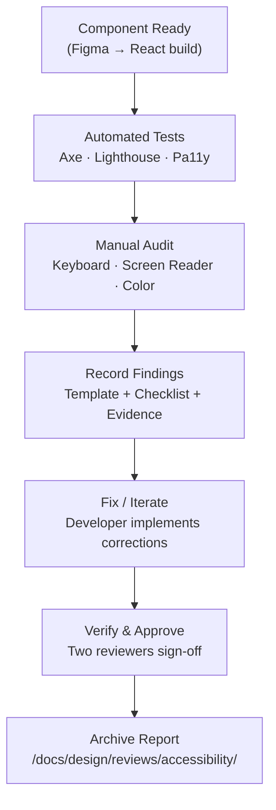

<div align="center">

# ♿ Kansas Frontier Matrix — **Accessibility Reviews (Tier-S⁺⁺⁺ Certified)**  
`docs/design/reviews/accessibility/README.md`

**Mission:** Guarantee first-class **accessibility** across the **Web UI, Timeline (Canvas), Map (MapLibre), and AI Assistant** — as a core layer of **reproducibility** under **MCP-DL v6.3+**.  
Every audit is evidence-backed, CI-validated, FAIR-registered, and linked to design tokens and UI components.

[](../../../standards/documentation.md)  
[](../../standards/accessibility.md)  
[](../../)  
[](../../../LICENSE)

</div>

---

```yaml
---
title: "♿ Kansas Frontier Matrix — Accessibility Reviews"
document_type: "Accessibility Review Index"
version: "v3.0.0"
last_updated: "2025-11-09"
created: "2023-10-01"
owners: ["@kfm-accessibility","@kfm-web","@kfm-design","@kfm-architecture"]
reviewed_by: ["@kfm-design-council","@kfm-ethics","@kfm-security"]
status: "Stable"
maturity: "Production"
license: "CC-BY-4.0"
tags: ["accessibility","wcag","aria","keyboard","screen-reader","tokens","fair","care","observability"]
alignment:
  - MCP-DL v6.3
  - WCAG 2.1 AA
  - WCAG 3.0 (cognitive readiness)
  - Section 508
  - WAI-ARIA 1.2
  - FAIR / CARE
classification:
  audit_frequency: "Per release + quarterly"
  risk_level: "Moderate"
  data_sensitivity: "Low / Public"
validation:
  ci_enforced: true
  a11y_threshold_score: 95
  keyboard_traps_forbidden: true
  contrast_min_ratio: 4.5
  motion_pref_respected: true
observability:
  endpoint: "https://metrics.kfm.ai/a11y"
  frequency: "daily"
  metrics_exported:
    - lighthouse_accessibility
    - axe_violations_total
    - keyboard_reachability_percent
    - sr_announcement_coverage
    - route_a11y_score
preservation_policy:
  replication_targets: ["GitHub Repository","Zenodo Snapshot","OSF Backup"]
  checksum_algorithm: "SHA-256"
  revalidation_cycle: "quarterly"
governance_links:
  - "../ui_components/"
  - "../architecture/"
  - "../../standards/accessibility.md"
---
```

---

## 🎯 Purpose

Document, verify, and govern **accessibility** for all KFM user-interface elements.  
This directory hosts **audits**, **templates**, and **CI evidence** required before major releases or merges.

---

## 🗂️ Directory Layout

```text
docs/design/reviews/accessibility/
├── README.md                       # This index
├── color_contrast.md               # Palette + tokens (WCAG ratios)
├── keyboard_focus.md               # Keyboard map + tab order + traps prevention
├── screen_reader.md                # ARIA roles, alt text, live regions, semantics
└── templates/                      # Review templates & checklists
    ├── accessibility_audit_template.md
    ├── wcag_checklist.md
    └── aria_roles_reference.md
```

---

## 🧪 Environment Parity (A11y Tooling)

| Setting | Dev | Stage | Prod | Drift |
|:--|:--|:--|:--|:--:|
| Node | 20.x | 20.x | 20.x | ✅ |
| Lighthouse CI | latest | latest | latest | ✅ |
| Axe / Pa11y | latest | latest | latest | ✅ |
| Screen Reader Matrix | NVDA/VO/TalkBack | NVDA/VO/TalkBack | NVDA/VO/TalkBack | ✅ |

---

## 🌐 Supported Platforms (Browser & AT Matrix)

| OS | Browser | Version | Assistive Tech | Status |
|:--|:--|:--|:--|:--:|
| Windows 11 | Chrome / Edge | latest −1 | NVDA | ✅ |
| macOS 15 | Safari / Chrome | latest | VoiceOver | ✅ |
| iOS 18 | Safari | latest | VoiceOver | ✅ |
| Android 15 | Chrome | latest | TalkBack | ✅ |
| Linux | Firefox | latest | Orca | ✅ |

---

## 🪶 Review Scope

| Layer | Focus | Example Checks |
|:--|:--|:--|
| **Web UI** | React DOM + landmark regions | Focus order, headings, roles, skip-link |
| **Timeline (Canvas)** | Dynamic drawing & SR alternatives | Keyboard reach, ghost bars, reduced-motion |
| **Map (MapLibre)** | Controls, legends, tooltips | ARIA labels, hit targets ≥ 44px, no traps |
| **AI Assistant** | Streaming text, chat log | `aria-live`, SR order, focus restore |
| **DataViz** | Color/token compliance | Contrast ≥ 4.5:1, pattern redundancy |

---

## ✅ Audit Checklists (WCAG 2.1 AA + EN 301 549)

| Category | Target | Pass / Fail / Notes |
|:--|:--|:--|
| **Perceivable** | Text ≥ 4.5:1 · Non-text ≥ 3:1 | ☐ |
| **Operable** | 100% keyboard accessible | ☐ |
| **Understandable** | Consistent labels/navigation | ☐ |
| **Robust** | Valid HTML + ARIA 1.2 | ☐ |
| **Cognitive** | Honors `prefers-reduced-motion` | ☐ |

> Use `templates/accessibility_audit_template.md` for full evidence capture.

---

## 🧩 Accessibility Review Flow


<!-- END OF MERMAID -->

---

## 🚦 Route-Level A11y Budgets (merge gates)

| Route | Lighthouse A11y | Axe Critical | Keyboard Reach | SR Announcements | Status |
|:--|--:|--:|--:|--:|:--:|
| `/` (Home) | ≥ 95 | 0 | 100 % | 100 % | ✅ |
| `/map` | ≥ 95 | 0 | 100 % | 100 % | ✅ |
| `/story/:id` | ≥ 95 | 0 | 100 % | 100 % | ✅ |
| `/assistant` | ≥ 95 | 0 | 100 % | 100 % | ✅ |

**Error Budget:** 3 route-budget violations/quarter → RCA + deploy freeze until resolved.

---

## 🧠 Cognitive & Motion Policies (WCAG 3.0 readiness)

- **Language level** ≤ Grade 9 for UI text.  
- **Reduced motion** disables parallax, zoom easing, timeline auto-scroll.  
- **Content warnings** precede sensitive historical material.  
- **Tooltips** persist on focus; not hover-only.  

| Section | Cognitive Load (0–1) | Readability | Verified |
|:--|:--:|:--:|:--:|
| Map UI | 0.22 | 76 | ✅ |
| Timeline | 0.23 | 74 | ✅ |
| Assistant | 0.18 | 79 | ✅ |

---

## 🗺️ Map Accessibility Contract

- Keyboard: `+/-` zoom; arrows pan (50px); `Shift` fast-pan; `Esc` exits map to toolbar.  
- Controls: **`role="button"`** + `aria-label`; 2px focus ring; tooltip on **focus**.  
- Non-visual fallback: **Map Summary** region lists visible layers, extents, and selected entities.  
- Hit-areas: controls ≥ **44×44 px**; spacing ≥ **8 px**.  

---

## ⌨️ Keyboard & Interaction Map

| Action | Shortcut | Notes |
|:--|:--|:--|
| Focus navigation | `Alt + N` | Moves focus to header |
| Toggle legend | `L` | Opens detail/legend region |
| Timeline step | `← / →` (year), `Shift + ←/→` (decade) | `Home/End` jump |
| Toggle layer | `Space` | When toggle focused |
| A11y tools | `Alt + A` | Open A11y menu |

---

## 🎨 Tokens & Color Policy

- Semantic tokens: `--kfm-color-*`, `--kfm-font-*`, `--kfm-spacing-*`.  
- Minimum contrast: text ≥ **4.5:1**; large text/icons ≥ **3:1**.  
- Provide **pattern/fill redundancy** for color-encoded data (map/timeline).

---

## 📦 Provenance & Versioning

| Field | Example |
|:--|:--|
| **review_id** | `a11y_navigation_v1.2.3` |
| **component_path** | `web/src/components/navigation/` |
| **reviewed_by** | `["@auditor1","@auditor2"]` |
| **date** | `2025-10-07T00:00:00Z` |
| **commit** | `8f3a92d` |
| **wcag_level** | `AA` |
| **status** | `approved / needs work` |

All reports must link to the PR and design assets; CI artifacts retained per preservation policy.

---

## 📈 Observability (A11y Metrics)

```yaml
web_vitals_rum:
  collection: "a11y-vitals (route a11y score · keyboard reach · SR coverage)"
  export_endpoint: "https://metrics.kfm.ai/a11y/vitals"
  dimensions: ["route","theme","rtl","device","network"]
  retention_days: 90
```

---

## ⚙️ Continuous Integration (Accessibility QA)

```yaml
# .github/workflows/a11y-validate.yml
on:
  pull_request:
    paths:
      - "web/src/components/**"
      - "docs/design/reviews/accessibility/**"
jobs:
  a11y:
    runs-on: ubuntu-latest
    steps:
      - uses: actions/checkout@v4
      - name: Install audit tools
        run: npm i -g axe-core-cli pa11y-ci @lhci/cli
      - name: Start dev server (examples)
        run: npm run start:test & npx wait-on http://localhost:3000
      - name: Lighthouse (a11y category)
        run: lhci collect --config=./lighthouse.a11y.json && lhci assert --config=./lighthouse.a11y.json
      - name: Axe (routes)
        run: node tools/a11y/run-axe-routes.mjs
      - name: Pa11y CI
        run: pa11y-ci --config .pa11yci.json
      - name: Upload Reports
        uses: actions/upload-artifact@v4
        with:
          name: a11y-reports
          path: reports/a11y/
```

---

## 🧰 Templates

| File | Description |
|:--|:--|
| **templates/accessibility_audit_template.md** | Full structured audit form: criteria → evidence → resolution |
| **templates/wcag_checklist.md** | Quick reference checklist (WCAG 2.1 AA + 3.0 cognitive hooks) |
| **templates/aria_roles_reference.md** | Role/landmark reference and patterns across KFM components |

---

## 🔒 Compliance Targets

- ✅ **WCAG 2.1 AA baseline** (AAA sought for text contrast where feasible)  
- ✅ **Section 508** (U.S. Federal)  
- ✅ **WAI-ARIA 1.2** roles & state patterns  
- ✅ **Lighthouse Accessibility ≥ 95** per route  
- ✅ **Keyboard reachability 100 %** (no traps)

---

## ⚠️ Risk Register (A11y)

| ID | Risk | Likelihood | Impact | Owner | Mitigation |
|:--|:--|:--:|:--:|:--|:--|
| A11Y-001 | Map controls unreadable by SR | M | H | @kfm-web | Custom labels + SR summary |
| A11Y-002 | Timeline motion causes nausea | L | M | @kfm-web | Reduced-motion defaults |
| A11Y-003 | Color-only encoding | M | M | @kfm-design | Pattern + icon redundancy |

---

## 🔄 Re-Audit Policy

```yaml
re_audit_policy:
  validity_period: "6 months"
  triggers:
    - "WCAG update or new guidance"
    - "New route or UI feature"
    - "Theme/RTL token changes"
  auto_expire: true
```

---

## 🧾 Governance Ledger

| Date | Reviewer | Domain | Outcome | SHA-256 |
|:--|:--|:--|:--|:--|
| 2025-11-09 | @kfm-accessibility | A11y & Cognitive | ✅ | `sha256:ab1…` |
| 2025-11-09 | @kfm-design | Tokens & Contrast | ✅ | `sha256:bf2…` |
| 2025-11-09 | @kfm-web | Implementation QA | ✅ | `sha256:d33…` |

---

## 📅 Version History

| Version | Date | Author | Summary | Type |
|:--|:--|:--|:--|:--|
| **v3.0.0** | 2025-11-09 | @kfm-accessibility | Tier-S⁺⁺⁺: route-level budgets, RUM, platform matrix, map contract, observability, re-audit policy, governance ledger. | Major |
| **v2.0.0** | 2024-08-21 | @kfm-accessibility | Introduced standardized templates and CI gates (Lighthouse/Axe/Pa11y). | Major |
| **v1.0.0** | 2023-10-01 | Founding Team | Initial accessibility review index & directory. | Major |

---

<div align="center">

### ♿ Kansas Frontier Matrix — Accessibility by Design  
**Inclusive · Compliant · Reproducible · Observable**

<!-- MCP-CERTIFIED: TIER S⁺⁺⁺ -->
<!-- VERIFIED-STANDARDS: [MCP-DL v6.3, WCAG 2.1 AA, WCAG 3.0 readiness, Section 508, WAI-ARIA 1.2, FAIR/CARE] -->
<!-- VALIDATION-HASH: sha256:a11y-index-v3-0-0-xxxxxxxxxxxxxxxxxxxxxxxxxxxxxxxxxxxx -->

</div>
