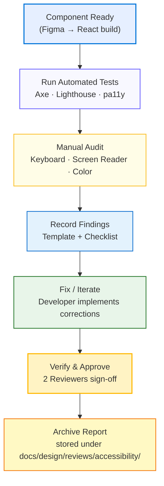

<div align="center">

# ♿ Kansas Frontier Matrix — Accessibility Reviews  
`docs/design/reviews/accessibility/`

**Mission:** Guarantee full **WCAG 2.1 AA** and **Section 508** compliance across the web interface,  
timeline, map, and AI-assistant components. Accessibility is a **core layer of reproducibility**  
under the **Master Coder Protocol (MCP)** — ensuring every user, regardless of ability,  
can explore Kansas’s historical and spatial narratives.

[](../../../)  
[](#✅-audit-checklists)  
[](../../)  
[](../../../LICENSE)

</div>

---

## 🎯 Purpose

This directory documents **accessibility reviews** for all Kansas Frontier Matrix user-interface elements  
(React components, MapLibre map layers, Timeline Canvas, and AI panels).  
Each review validates compliance with accessibility standards and captures improvement notes.  
Reports here complement **UI Component Reviews** (`../ui_components/`) and are **required**  
before any major release or feature merge.

---

## 🗂️ Directory Layout

```text
docs/design/reviews/accessibility/
├── README.md                       # This index
├── color_contrast.md               # Palette + token compliance (WCAG ratios)
├── keyboard_focus.md               # Keyboard navigation & tab order
├── screen_reader.md                # ARIA roles, alt text, semantic structure
└── templates/                      # Review templates & checklists
    ├── accessibility_audit_template.md
    ├── wcag_checklist.md
    └── aria_roles_reference.md
````

---

## 🪶 Review Scope

| Layer                  | Focus                         | Example Checks                            |
| ---------------------- | ----------------------------- | ----------------------------------------- |
| **Web UI**             | React DOM + MapLibre overlays | Focus order, heading hierarchy, landmarks |
| **Timeline Canvas**    | Dynamic rendering             | Keyboard access, color contrast of events |
| **Map Controls**       | Buttons, legends, tooltips    | ARIA labels, hit-area size, hover states  |
| **AI Assistant**       | Text areas, chat log          | Live-region updates, focus trapping       |
| **Data Visualization** | Map/timeline color scales     | Perceptual contrast, pattern redundancy   |

---

## ✅ Audit Checklists

Each review uses standardized templates aligned to **WCAG 2.1 AA** + **EN 301 549**.

| Category           | Target                                               | Pass / Fail / Notes |
| ------------------ | ---------------------------------------------------- | ------------------- |
| **Perceivable**    | Text contrast ≥ 4.5 : 1  ·  Non-text ≥ 3 : 1         | ☐                   |
| **Operable**       | All actions keyboard-accessible                      | ☐                   |
| **Understandable** | Consistent navigation / labeling                     | ☐                   |
| **Robust**         | Valid semantic HTML + ARIA roles                     | ☐                   |
| **Cognitive**      | Motion / animation respects `prefers-reduced-motion` | ☐                   |

---

## 🧩 Accessibility Review Flow



---

## 🧠 Tools & Methods

* **Automated Testing:** Axe Core CLI · Lighthouse CI · Pa11y · Storybook a11y
* **Manual Audits:** NVDA / VoiceOver sessions, keyboard walkthroughs, Figma Contrast-Checker
* **Design Tokens:** `--kfm-color-*`, `--kfm-font-*`, `--kfm-spacing-*` ensure consistent theming
* **Reporting:** All audits exported to Markdown using `accessibility_audit_template.md`

---

## 🧾 Provenance & Versioning

| Field              | Example                          |
| ------------------ | -------------------------------- |
| **review_id**      | `a11y_navigation_v1.2.3`         |
| **component_path** | `web/src/components/navigation/` |
| **reviewed_by**    | `["@auditor1", "@auditor2"]`     |
| **date**           | `2025-10-07T00:00:00Z`           |
| **commit**         | `8f3a92d`                        |
| **wcag_level**     | `AA`                             |
| **status**         | `approved / needs work`          |

All accessibility reports are version-controlled and linked to pull requests and design assets for traceability.

---

## ⚙️ Continuous Integration (Accessibility QA)

Automated audits run in CI to prevent regressions:

```yaml
# .github/workflows/a11y-validate.yml
on:
  pull_request:
    paths:
      - "web/src/components/**"
      - "docs/design/reviews/accessibility/**"
jobs:
  a11y:
    runs-on: ubuntu-latest
    steps:
      - uses: actions/checkout@v4
      - name: Install audit tools
        run: npm i -g axe-core-cli pa11y-ci lighthouse
      - name: Run Lighthouse & Axe
        run: |
          lighthouse http://localhost:3000 --only-categories=accessibility --budget-path=./a11y.budget.json
          axe --url http://localhost:3000 > axe-report.json
      - name: Enforce WCAG threshold
        run: jq '.score' axe-report.json
```

---

## 🧰 Templates

| File                                | Description                                                   |
| ----------------------------------- | ------------------------------------------------------------- |
| **accessibility_audit_template.md** | Full structured audit form → criteria → evidence → resolution |
| **wcag_checklist.md**               | Quick reference list for manual verification                  |
| **aria_roles_reference.md**         | Standard ARIA roles · landmarks · usage across KFM components |

---

## 🔒 Compliance Targets

* ✅ **WCAG 2.1 AA baseline** (AAA aimed for text contrast)
* ✅ **Section 508** (U.S. Federal standard)
* ✅ **WAI-ARIA 1.2** best practices
* ✅ **Lighthouse Accessibility Score ≥ 90** per component

---

## 🪪 License

All accessibility reviews and templates are licensed under **Creative Commons CC-BY 4.0**.
© 2025 Kansas Frontier Matrix Design Collective.

---

<div align="center">

### ♿ Kansas Frontier Matrix — Accessibility by Design

**Inclusive · Compliant · Reproducible**

</div>
