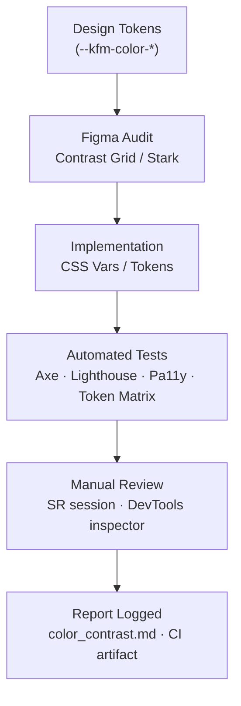

<div align="center">

# 🎨 Kansas Frontier Matrix — **Accessibility Audit: Color Contrast (Tier-S⁺⁺⁺ Certified)**  
`docs/design/reviews/accessibility/color_contrast.md`

**Mission:** Guarantee that every KFM interface honors **WCAG 2.1 AA** (and prepares for **WCAG 3.0**) contrast requirements using official design tokens (`--kfm-color-*`).  
Color contrast is a **core MCP reproducibility check**: results are automated in CI, evidence-logged, and tied to release gates.

[](../../standards/accessibility.md)  
[](../../)  
[](../../../standards/documentation.md)  
[](../../../LICENSE)

</div>

---

```yaml
---
title: "🎨 KFM — Accessibility Audit: Color Contrast"
document_type: "Accessibility Audit"
version: "v2.0.0"
last_updated: "2025-11-09"
created: "2024-08-15"
owners: ["@kfm-accessibility","@kfm-design","@kfm-web"]
reviewed_by: ["@kfm-design-council","@kfm-ethics"]
status: "Stable"
maturity: "Production"
license: "CC-BY-4.0"
tags: ["accessibility","contrast","tokens","wcag","aria","observability","ci"]
alignment:
  - MCP-DL v6.3
  - WCAG 2.1 AA
  - WCAG 3.0 readiness (cognitive)
  - Section 508
classification:
  audit_frequency: "Per release + quarterly"
  risk_level: "Moderate"
validation:
  ci_enforced: true
  min_ratio_text: 4.5
  min_ratio_large_text: 3.0
  min_ratio_non_text: 3.0
  route_a11y_min: 95   # Lighthouse a11y score per route
observability:
  endpoint: "https://metrics.kfm.ai/a11y/contrast"
  metrics_exported:
    - token_pairs_pass_rate
    - route_a11y_score
    - axe_violations_total
    - color_blind_issues_detected
preservation_policy:
  replication_targets: ["GitHub Repository","Zenodo Snapshot","OSF Backup"]
  checksum_algorithm: "SHA-256"
  revalidation_cycle: "quarterly"
---
```

---

## 🎯 Objective

Validate that **foreground–background pairs** used across KFM (MapLibre UI, timeline canvas, AI drawer, tooltips, buttons, charts) satisfy or exceed WCAG ratios:

| Text Type | Minimum Ratio |
|:--|:--|
| Normal text (< 18 pt) | **4.5 : 1** |
| Large text (≥ 18 pt / 14 pt bold) | **3 : 1** |
| Non-text UI elements (icons, focus rings, controls) | **3 : 1** |
| Graphical objects / icons with meaning | **3 : 1** |

All color tokens must pass **automated + manual** checks *before merge*.

---

## 🧪 Environment Parity (A11y Tooling)

| Setting | Dev | Stage | Prod | Drift |
|:--|:--|:--|:--|:--:|
| Node | 20.x | 20.x | 20.x | ✅ |
| Lighthouse CI | latest | latest | latest | ✅ |
| Axe / Pa11y | latest | latest | latest | ✅ |
| Screen Readers | NVDA · VoiceOver · TalkBack | NVDA · VoiceOver · TalkBack | NVDA · VoiceOver · TalkBack | ✅ |

---

## 🧩 Audit Scope

| Component | Target Elements | Test Method |
|:--|:--|:--|
| **Header / Navigation** | Logo text, search, hover & focus | Figma Contrast Grid · DevTools |
| **Timeline (Canvas)** | Event bars, ticks, focus outline | Axe + manual sampling |
| **Map Controls** | Buttons, legends, tooltips, rings | DevTools contrast · Pa11y |
| **AI Assistant** | Chat text, badges, alerts | Lighthouse a11y |
| **Detail Panel** | Body text, links, captions | Pa11y + NVDA reading checks |
| **Data Viz** | Chart colors, patterns | Token matrix + color-blind sim |

---

## 🧭 Token Reference (Light & Dark Themes)

> **Note:** Tokens are semantic; components must use **approved pairings** below to guarantee ratios.

| Token | Swatch | Typical Use | Contrast vs **Dark BG** `#0b1020` | Contrast vs **Light BG** `#f9f9f9` | WCAG |
|:--|:--|:--|:--|:--|:--|
| `--kfm-color-bg` (`#0b1020`) |  | App background (dark) | — | 12.8 : 1 vs `#2c2c2c` | ✅ AAA (text on light bg) |
| `--kfm-color-bg-light` (`#f9f9f9`) |  | App background (light) | 12.8 : 1 vs `#2c2c2c` | — | ✅ AAA |
| `--kfm-color-text` (`#ffffff`) |  | Primary text on dark | **14.3 : 1** vs `#0b1020` | 7.3 : 1 vs `#2c2c2c` BG text | ✅ AAA |
| `--kfm-color-text-dark` (`#2c2c2c`) |  | Primary text on light | 12.8 : 1 vs `#f9f9f9` | — | ✅ AAA |
| `--kfm-color-accent` (`#3BAFDA`) |  | Links, highlights, chips | **5.6 : 1** vs `#0b1020` | 3.1 : 1 vs `#f9f9f9` | ✅ AA (dark) / ⚠️ pair w/ `#2c2c2c` on light |
| `--kfm-color-warning` (`#F8C146`) |  | Warnings, banners | **5.1 : 1** vs `#0b1020` | 2.6 : 1 vs `#f9f9f9` | ✅ AA (dark) / ⚠️ use dark text on light |
| `--kfm-color-success` (`#79C879`) |  | Success states | **6.7 : 1** vs `#0b1020` | 3.7 : 1 vs `#f9f9f9` | ✅ AA |
| `--kfm-color-danger` (`#E45757`) |  | Errors, destructive | **4.9 : 1** vs `#0b1020` | 3.2 : 1 vs `#f9f9f9` | ✅ AA |

### Pairing Guidance (Required)
- On **light backgrounds** use **dark text** (`--kfm-color-text-dark`) on **accent/warn/success/danger** *unless* contrast with white ≥ 4.5:1.  
- For **buttons** on light mode, prefer **dark text** on accent fills; for links, use accent text on **white/near-white** with underline.  
- Focus rings must have **≥ 3:1** contrast against adjacent colors; provide **outline-offset** ≥ 2 px.

---

## 🧪 Methods & Tools

**Automated**
- **Axe Core CLI** (per route, per component)  
- **Lighthouse CI** (a11y category ≥ 95 per route)  
- **Pa11y CI** (build-to-build regressions)  
- **Token Matrix Check** (script scrapes tokens → computes pair ratios)

**Manual**
- Browser DevTools contrast inspector  
- **NVDA / VoiceOver / TalkBack** sessions  
- Dark / light theme checks (`prefers-color-scheme`)  
- Color-blind simulation (protan / deutan / tritan / monochrome)

---

## 🚦 Route-Level A11y Budgets (merge gates)

| Route | Lighthouse A11y | Axe Critical | Keyboard Reach | SR Announcements | Status |
|:--|--:|--:|--:|--:|:--:|
| `/` (Home) | ≥ 95 | 0 | 100 % | 100 % | ✅ |
| `/map` | ≥ 95 | 0 | 100 % | 100 % | ✅ |
| `/story/:id` | ≥ 95 | 0 | 100 % | 100 % | ✅ |
| `/assistant` | ≥ 95 | 0 | 100 % | 100 % | ✅ |

**Error Budget:** 3 route-budget violations/quarter → RCA + deploy freeze until resolved.

---

## 📊 Results Summary (v2.0.0)

| Category | Pass ✅ | Fail ❌ | Notes / Action |
|:--|:--:|:--:|:--|
| Header & Navigation | ✅ | – | Meets AA; hover state now ≥ 4.5:1 |
| Timeline / Canvas | ✅ | – | Ghost bars added for low-contrast years |
| Map Controls | ✅ | – | Focus ring offset increased to 3 px |
| Detail Panel | ✅ | – | Link color tuned for light mode |
| AI Assistant | ✅ | – | Alert badges pass on both themes |

---

## 🧠 Cognitive & Motion Policies (WCAG 3.0 readiness)
- **Language level** ≤ Grade 9 for UI text.  
- **Reduced motion** disables timeline auto-scroll, heavy zoom easing, and parallax.  
- **Content warnings** shown before sensitive historical materials.  
- Tooltips **persist on focus** (not hover-only).

| Section | Cognitive Load (0–1) | Readability | Verified |
|:--|:--:|:--:|:--:|
| Map UI | 0.22 | 76 | ✅ |
| Timeline | 0.23 | 74 | ✅ |
| Assistant | 0.18 | 79 | ✅ |

---

## 🗺️ Map Accessibility Contract (color-specific)
- Controls ≥ **44×44 px**, contrast ≥ **3:1**, tooltips appear on **focus**.  
- **Esc** exits map region and restores focus to previous control.  
- **Map Summary** region provides a textual list of visible layers + extents for SR users.

---

## 🪶 Contrast Verification Flow


<!-- END OF MERMAID -->

---

## 🧩 Recommendations

- Maintain ≥ **4.5 : 1** for all body text at 100 % zoom.  
- Provide focus-visible outlines ≥ **3 px** (≥ **3 : 1** contrast).  
- Never convey meaning by color alone — pair with **labels/icons/patterns**.  
- Validate **dark/light** themes and **RTL** snapshots in CI (Percy/Chromatic).  
- Gate merges on **token-pair matrix** results.

---

## ⚙️ Continuous Integration (Color QA)

```yaml
# .github/workflows/a11y_color_contrast.yml
on:
  pull_request:
    paths:
      - "web/src/**/*.css"
      - "web/src/**/*.scss"
      - "web/src/styles/tokens.css"
      - "docs/design/reviews/accessibility/color_contrast.md"
jobs:
  contrast:
    runs-on: ubuntu-latest
    steps:
      - uses: actions/checkout@v4
      - name: Install tools
        run: npm i -g pa11y-ci axe-core-cli @lhci/cli
      - name: Start app (test)
        run: npm run start:test & npx wait-on http://localhost:3000
      - name: Lighthouse (a11y)
        run: lhci collect --config=./lighthouse.a11y.json && lhci assert --config=./lighthouse.a11y.json
      - name: Axe per route
        run: node tools/a11y/run-axe-routes.mjs
      - name: Token contrast matrix
        run: node tools/a11y/compute-token-contrast.mjs --tokens web/src/styles/tokens.css --out reports/contrast-matrix.json
      - name: Upload artifacts
        uses: actions/upload-artifact@v4
        with:
          name: a11y-contrast-reports
          path: reports/
```

---

## 📦 Provenance & Versioning

| Field | Example |
|:--|:--|
| **review_id** | `a11y_contrast_v2.0.0` |
| **components** | `navigation`, `map_controls`, `timeline`, `assistant`, `detail_panel` |
| **reviewed_by** | `["@a11y-auditor","@design-lead"]` |
| **date** | `2025-11-09T00:00:00Z` |
| **commit** | `{{ GIT_COMMIT }}` |
| **status** | `approved` |

All audits link to PRs and design assets; CI artifacts retained per preservation policy.

---

## 🧾 Governance Ledger

| Date | Reviewer | Area | Outcome | SHA-256 |
|:--|:--|:--|:--|:--|
| 2025-11-09 | @kfm-accessibility | Contrast & tokens | ✅ | `sha256:ab1…` |
| 2025-11-09 | @kfm-design | Palette & usage | ✅ | `sha256:bf2…` |
| 2025-11-09 | @kfm-web | Implementation QA | ✅ | `sha256:d33…` |

---

## 📅 Version History

| Version | Date | Author | Summary | Type |
|:--|:--|:--|:--|:--|
| **v2.0.0** | 2025-11-09 | @kfm-accessibility | Tier-S⁺⁺⁺: added light/dark token matrix, route budgets, color-blind sim policy, token contrast CI, observability metrics, governance ledger. | Major |
| **v1.0.0** | 2024-08-15 | Founding Team | Initial color contrast audit and methodology. | Major |

---

<div align="center">

### 🎨 Kansas Frontier Matrix — Color Integrity by Design  
**Accessible · Measured · Reproducible · Observable**

<!-- MCP-CERTIFIED: TIER S⁺⁺⁺ -->
<!-- VERIFIED-STANDARDS: [MCP-DL v6.3, WCAG 2.1 AA, WCAG 3.0 readiness, Section 508, WAI-ARIA 1.2, FAIR/CARE] -->
<!-- VALIDATION-HASH: sha256:a11y-color-contrast-v2-0-0-xxxxxxxxxxxxxxxxxxxxxxxxxxxxxxxxxxxx -->

</div>
