<div align="center">

# ⌨️ Kansas Frontier Matrix — **Accessibility Audit: Keyboard & Focus (Tier-S⁺⁺⁺ Certified)**  
`docs/design/reviews/accessibility/keyboard_focus.md`

**Mission:** Validate and govern that **all interactive UI** in the **Kansas Frontier Matrix (KFM)** — MapLibre map, Timeline (Canvas), AI Assistant drawer, panels, navigation — is **fully operable via keyboard** with **visible, high-contrast focus** per **WCAG 2.1 AA** (and 3.0 readiness).  
Keyboard accessibility is a **core MCP reproducibility layer** with CI merge gates, evidence logs, and observability metrics.

[](../../standards/accessibility.md)  
[](../../../standards/documentation.md)  
[](../../)  
[](../../../LICENSE)

</div>

---

```yaml
---
title: "⌨️ KFM — Accessibility Audit: Keyboard & Focus"
document_type: "Accessibility Audit"
version: "v2.0.0"
last_updated: "2025-11-09"
created: "2024-08-15"
owners: ["@kfm-accessibility","@kfm-web","@kfm-design"]
reviewed_by: ["@kfm-design-council","@kfm-ethics"]
status: "Stable"
maturity: "Production"
license: "CC-BY-4.0"
tags: ["accessibility","keyboard","focus","aria","tokens","wcag","observability","ci","mermaid"]
alignment:
  - MCP-DL v6.3
  - WCAG 2.1 AA
  - WCAG 3.0 readiness (cognitive)
  - Section 508
  - WAI-ARIA 1.2
classification:
  audit_frequency: "Per release + quarterly"
  risk_level: "Moderate"
  data_sensitivity: "Low / Public"
validation:
  ci_enforced: true
  keyboard_reachability_required: 100    # all TAB-reachable
  visible_focus_required: true           # ≥ 3px + ≥ 3:1 contrast
  focus_traps_forbidden: true
  escape_close_required: true
observability:
  endpoint: "https://metrics.kfm.ai/a11y/keyboard"
  metrics_exported:
    - keyboard_reachability_percent
    - focus_trap_incidents
    - sr_announcement_coverage
    - route_a11y_score
preservation_policy:
  replication_targets: ["GitHub Repository","Zenodo Snapshot","OSF Backup"]
  checksum_algorithm: "SHA-256"
  revalidation_cycle: "quarterly"
governance_links:
  - "../README.md"
  - "../accessibility_component_audit.md"
  - "../../architecture/web_ui_architecture_review.md"
---
```

---

## 🎯 Purpose

Establish a measurable, reproducible guarantee that **every focusable element** in KFM is:
1) **Reachable** in logical order,  
2) **Operable** with Enter/Space/Arrows,  
3) **Visible** with high-contrast outlines, and  
4) **Recoverable** (focus returns to the originating control after dialogs/drawers).

---

## 🧭 Scope & Expected Behaviors

| UI Region | Expected Behavior | WCAG Ref |
|:--|:--|:--|
| **Header / Navigation** | Tab order: logo → search → help → login; `Esc` closes menus; skip-link is first focus | 2.1.1 / 2.4.1 / 2.4.3 |
| **Timeline (Canvas)** | Arrow keys move through events; `Home/End` jump; focused event is announced | 2.1.1 / 2.4.7 |
| **Map (MapLibre GL)** | Tab cycles toolbar → layer toggles → zoom → legend; `Esc` exits map region | 2.1.1 / 2.4.3 |
| **AI Assistant Drawer** | Focus trapped while open; `Esc` closes; focus restored to trigger | 2.1.2 / 2.4.3 |
| **Detail Panel** | Focusable headings/links; close button operable; scroll by keyboard | 2.1.1 / 2.4.7 |
| **Global Skip Link** | “Skip to Main Content” visible on first Tab press; lands on `<main>` | 2.4.1 |

---

## 🧪 Environment Parity (A11y Tooling)

| Setting | Dev | Stage | Prod | Drift |
|:--|:--|:--|:--|:--:|
| Node | 20.x | 20.x | 20.x | ✅ |
| Lighthouse CI | latest | latest | latest | ✅ |
| Axe / Pa11y | latest | latest | latest | ✅ |
| Screen Readers | NVDA · VoiceOver · TalkBack | Same | Same | ✅ |

---

## 🚦 Route-Level Keyboard Budgets (merge gates)

| Route | Axe Critical | Keyboard Reach | Focus Traps | SR Announce Coverage | Status |
|:--|--:|--:|--:|--:|:--:|
| `/` | 0 | 100 % | 0 | 100 % | ✅ |
| `/map` | 0 | 100 % | 0 | 100 % | ✅ |
| `/story/:id` | 0 | 100 % | 0 | 100 % | ✅ |
| `/assistant` | 0 | 100 % | 0 | 100 % | ✅ |

> **Error Budget:** 3 route-budget violations/quarter → RCA + deploy freeze until resolved.

---

## 🧩 Checklist (Quick)

| # | Test | Expected | Status |
|:--:|:--|:--|:--:|
| 1 | Tab order follows logical DOM | Left→right, top→down | ✅ |
| 2 | Focus visible on every interactive | ≥ 3 px outline · ≥ 3:1 contrast | ✅ |
| 3 | No focus traps (modals/drawers) | Focus restored to trigger | ✅ |
| 4 | Enter/Space activate controls | All custom controls operable | ✅ |
| 5 | ARIA roles + `tabindex` | Non-native widgets announced | ✅ |
| 6 | `Esc` closes drawers/menus | Immediate, without residual focus | ✅ |
| 7 | Timeline keyboard scrubbing | Arrows/Pg/Home/End work | ✅ |
| 8 | Map controls navigable | Toolbar → toggles → zoom → legend | ⚙️ Patch queued |
| 9 | Skip link visible & landing | First Tab → `<main>` | ✅ |
| 10 | SR announcements on change | `aria-live` for async updates | ✅ |

---

## 🧭 Focus Order Flow (Web App Overview)

```mermaid
flowchart LR
  A["Header\nLogo → Search → Lang → Help"] --> B["Sidebar\nLayer Toggles → Legend"]
  B --> C["Map Controls\nZoom → Locate → Timeline Link"]
  C --> D["Timeline Canvas\nEvents → Scrubber"]
  D --> E["Detail Panel\nHeadings → Links → Close"]
  E --> F["AI Assistant Drawer\nInput → Send → Close"]
  F --> G["Footer\nDocs Link"]
```


<!-- END OF MERMAID -->

---

## 🎨 Focus Styling Tokens

| Variable | Purpose | Example |
|:--|:--|:--|
| `--kfm-focus-outline` | Primary outline color | `#3BAFDA` |
| `--kfm-focus-width` | Outline thickness | `3px` |
| `--kfm-focus-offset` | Offset from element edge | `2px` |
| `--kfm-focus-contrast-min` | Contrast vs surroundings | `3:1` |

```css
:where(:focus-visible){
  outline: var(--kfm-focus-width) solid var(--kfm-focus-outline);
  outline-offset: var(--kfm-focus-offset);
}
```

*Never remove outlines (`outline: none`) without an equally visible alternative.*

---

## ⌨️ Keyboard Map (Global)

| Action | Shortcut | Notes |
|:--|:--|:--|
| Focus navigation | `Alt + N` | Jump to header/navbar |
| Toggle legend | `L` | Expand/collapse legend region |
| Timeline step | `← / →` (year), `Shift + ←/→` (decade), `Home/End` bounds | |
| Toggle layer | `Space` | When toggle focused |
| Open A11y menu | `Alt + A` | Contrast/motion tools |
| Exit map region | `Esc` | Returns to toolbar trigger |

---

## 🧠 Test Setup

| Tool / Env | Purpose |
|:--|:--|
| Chrome DevTools A11y Tree | Validate tab stops & DOM order |
| NVDA / VoiceOver | Check announcements & landmarks |
| Axe DevTools / Pa11y CI | Detect traps and missing roles |
| Storybook A11y Addon | Component-level scenarios |
| Keyboard Simulation (Playwright) | Replay end-to-end key sequences |

---

## 🧠 Cognitive & Motion Policies (WCAG 3.0 readiness)

- **Reduced motion** disables auto-scrolling, heavy zoom easing, and parallax by default for R-M users.  
- **Persistent tooltips**: appear and remain on **focus**, not hover-only.  
- **Plain language**: UI helper text ≤ Grade 9 reading level.  

| Section | Cognitive Load (0–1) | Readability | Verified |
|:--|:--:|:--:|:--:|
| Map UI | 0.22 | 76 | ✅ |
| Timeline | 0.23 | 74 | ✅ |
| Assistant | 0.18 | 79 | ✅ |

---

## 🧰 Focus Regression Guard (CI Gate)

```yaml
regression_guard:
  fail_on_focus_trap: true
  require_focus_visible_for_all_controls: true
  require_skip_link: true
  notify_slack: "#a11y-alerts"
```

---

## ⚙️ Continuous Integration (Keyboard/Focus QA)

```yaml
# .github/workflows/a11y_keyboard_focus.yml
on:
  pull_request:
    paths:
      - "web/src/components/**"
      - "docs/design/reviews/accessibility/keyboard_focus.md"
jobs:
  focus:
    runs-on: ubuntu-latest
    steps:
      - uses: actions/checkout@v4
      - name: Install tools
        run: npm i -g axe-core-cli pa11y-ci @playwright/test
      - name: Start test app
        run: npm run start:test & npx wait-on http://localhost:3000
      - name: Axe (routes)
        run: node tools/a11y/run-axe-routes.mjs
      - name: Playwright keyboard flows
        run: npx playwright test tests/a11y/keyboard-flow.spec.ts --reporter=line
      - name: Pa11y (focus)
        run: pa11y-ci --config .pa11yci.focus.json > reports/focus-report.json
      - name: Upload artifact
        uses: actions/upload-artifact@v4
        with:
          name: focus-audit-report
          path: reports/
```

---

## 🧾 Evidence & Findings (attach links)

| Evidence | Path / Link |
|:--|:--|
| Axe route report | `/reports/a11y/axe-routes.json` |
| Playwright keyflow | `/reports/a11y/keyboard-flow.html` |
| Pa11y report | `/reports/a11y/focus-report.json` |
| SR test notes (NVDA/VO) | `/reports/a11y/sr-notes.md` |

---

## ⚠️ Risk Register (A11y-Focus)

| ID | Risk | Likelihood | Impact | Owner | Mitigation |
|:--|:--|:--:|:--:|:--|:--|
| KF-001 | Map controls unreachable | M | H | @kfm-web | ARIA + tabindex + custom handlers |
| KF-002 | Drawer focus not restored | L | M | @kfm-web | Save/restore focus on close |
| KF-003 | Skip-link hidden offscreen | L | M | @kfm-design | Always visibly focusable |
| KF-004 | Focus ring low contrast | M | M | @kfm-design | Use `--kfm-focus-contrast-min ≥ 3:1` |

---

## 🧩 Recommendations

1. Enforce `.focus-visible` utility for consistent outlines across browsers.  
2. Apply `role="application"` **only** to the map region; keep semantics elsewhere.  
3. Ensure all custom widgets use **keyboard events** (Enter/Space) and proper ARIA role.  
4. Add **“Return to last focus”** utility for drawers and modals.  
5. Expand Playwright test suite to include **RTL** and **dark-mode** snapshots for focus styling.

---

## 🧾 Provenance

| Field | Value |
|:--|:--|
| **review_id** | `a11y_keyboard_focus_v2.0.0` |
| **components** | Navigation v0.3.2 · Timeline v0.4.0 · Map v0.5.1 · Assistant v0.7.0 |
| **reviewed_by** | `["@a11y-auditor","@design-lead"]` |
| **date** | `2025-11-09T00:00:00Z` |
| **commit** | `{{ GIT_COMMIT }}` |
| **result** | ✅ AA Compliant (minor MapLibre patch queued) |

---

## 🔄 Re-Audit Policy

```yaml
re_audit_policy:
  validity_period: "6 months"
  triggers:
    - "New route or feature"
    - "Token/theme changes"
    - "WCAG update"
  archive_on_expire: true
```

---

## 🧾 Governance Ledger

| Date | Reviewer | Area | Outcome | SHA-256 |
|:--|:--|:--|:--|:--|
| 2025-11-09 | @kfm-accessibility | Keyboard & focus | ✅ | `sha256:ab1…` |
| 2025-11-09 | @kfm-design | Focus styling tokens | ✅ | `sha256:bf2…` |
| 2025-11-09 | @kfm-web | Implementation QA | ✅ | `sha256:d33…` |

---

## 📅 Version History

| Version | Date | Author | Summary | Type |
|:--|:--|:--|:--|:--|
| **v2.0.0** | 2025-11-09 | @kfm-accessibility | Tier-S⁺⁺⁺: route-level keyboard budgets, focus regression guard, Playwright keyflows, observability metrics, governance ledger. | Major |
| **v1.0.0** | 2024-08-15 | Founding Team | Initial keyboard & focus audit (checklist + CI). | Major |

---

<div align="center">

### ⌨️ Kansas Frontier Matrix — Keyboard Navigation by Design  
**Accessible · Predictable · Reproducible · Observable**

<!-- MCP-CERTIFIED: TIER S⁺⁺⁺ -->
<!-- VERIFIED-STANDARDS: [MCP-DL v6.3, WCAG 2.1 AA, WCAG 3.0 readiness, Section 508, WAI-ARIA 1.2] -->
<!-- VALIDATION-HASH: sha256:a11y-keyboard-focus-v2-0-0-xxxxxxxxxxxxxxxxxxxxxxxxxxxxxxxxxxxx -->

</div>
