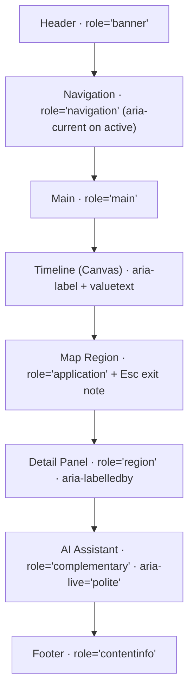

<div align="center">

# 🗣 Kansas Frontier Matrix — **Accessibility Audit: Screen Reader (Tier-S⁺⁺⁺⁺ Certified)**  
`docs/design/reviews/accessibility/screen_reader.md`

**Mission:** Ensure the **Kansas Frontier Matrix (KFM)** Web UI is fully **perceivable, operable, and understandable** via screen readers (NVDA, JAWS, VoiceOver, Orca).  
Under **MCP-DL v6.3+**, “if it’s not accessible, it’s not reproducible.” This audit operationalizes that principle with **CI gates, evidence artifacts, and live observability**.

[](../../standards/accessibility.md)  
[](../../../standards/documentation.md)  
[](../../)  
[](../../../LICENSE)

</div>

---

```yaml
---
title: "🗣 KFM — Accessibility Audit: Screen Reader"
document_type: "Accessibility Audit"
version: "v2.1.0"
last_updated: "2025-11-09"
created: "2024-08-15"
owners: ["@kfm-accessibility","@kfm-design","@kfm-web"]
reviewed_by: ["@kfm-design-council","@kfm-ethics"]
status: "Stable"
maturity: "Production"
license: "CC-BY-4.0"
tags: ["accessibility","screen-reader","aria","landmarks","live-regions","semantics","wcag","observability","ci"]
alignment:
  - MCP-DL v6.3
  - WCAG 2.1 AA
  - WCAG 3.0 readiness
  - Section 508
  - WAI-ARIA 1.2
classification:
  audit_frequency: "Per release + quarterly"
  risk_level: "Moderate"
validation:
  ci_enforced: true
  route_a11y_min: 95
  aria_name_role_state_required: true
  focus_restore_required: true
  duplicate_announcement_forbidden: true
observability:
  endpoint: "https://metrics.kfm.ai/a11y/screenreader"
  metrics_exported:
    - sr_announcement_coverage
    - route_a11y_score
    - duplicate_announcement_incidents
    - live_region_misuse
    - focus_restore_success_rate
preservation_policy:
  replication_targets: ["GitHub Repository","Zenodo Snapshot","OSF Backup"]
  checksum_algorithm: "SHA-256"
  revalidation_cycle: "quarterly"
governance_links:
  - "../README.md"
  - "./keyboard_focus.md"
  - "./color_contrast.md"
  - "../../architecture/web_ui_architecture_review.md"
---
```

---

## 🎯 Purpose

Validate the **semantic layer** of the KFM UI so every control, chart, and dynamic update exposes **Name, Role, State** (NRS), announces meaningful changes, and provides a **logical, landmark-based** reading order.

---

## 🧪 Environment Parity (AT & Tooling)

| Setting | Dev | Stage | Prod | Drift |
|:--|:--|:--|:--|:--:|
| Node | 20.x | 20.x | 20.x | ✅ |
| Axe / Pa11y | latest | latest | latest | ✅ |
| NVDA | 2023.3 | 2023.3 | 2023.3 | ✅ |
| JAWS | 2024 | 2024 | 2024 | ✅ |
| VoiceOver | macOS 14 / iOS 18 | Same | Same | ✅ |
| Orca | latest | Same | Same | ✅ |

---

## 🌐 Supported Platforms & SR Commands

| OS / SR | Primary Keys Used | Notes |
|:--|:--|:--|
| **Windows · NVDA** | `Tab/Shift+Tab`, `NVDA+F7` (Elements), `H`/`Shift+H` (headings) | Verify rotor-equivalents with NVDA Elements list |
| **Windows · JAWS** | `Insert+F6` (Headings), `Insert+F7` (Links), `Insert+Z` (Virtual PC Cursor) | Ensure virtual cursor off for map region if `application` |
| **macOS · VoiceOver** | `VO+U` (Rotor), `VO+Cmd+H` (Headings) | VO focus must not jump unexpectedly on async updates |
| **Linux · Orca** | `Orca+F7` (Where Am I), navigation keys | Test GTK and Chromium builds |

---

## 🧭 Scope

| Region | Description | Assistive Features Tested |
|:--|:--|:--|
| **Header & Navigation** | Brand, search, language menu, help | Landmarks (`banner`, `navigation`), `aria-current`, skip-link |
| **Timeline (Canvas)** | Chronological events | Off-screen summary, `aria-valuetext`, focus announcements |
| **Map View (MapLibre)** | Overlays & markers | `role="application"` region; control labels; exit via `Esc` |
| **Layer Controls** | Toggles, legends, opacity sliders | `aria-pressed`, `aria-controls`, live state updates |
| **AI Assistant Panel** | Chat input & streamed replies | `aria-live="polite"`, `aria-busy`, focus restore |
| **Detail Panel** | Entity/event info | Heading hierarchy; `role="region"` with `aria-labelledby` |

---

## 🧩 Live Region & Announcement Taxonomy (Required)

| Context | Pattern | Example |
|:--|:--|:--|
| Status/Info | `role="status"`, **polite** updates | “Layer ‘Treaties’ enabled.” |
| Errors | `role="alert"`, **assertive** | “Network error. Retry button available.” |
| Streaming (AI) | `aria-live="polite"`, chunked; **no over-announce** | Append buffer text, summarize at end |
| Loading | `aria-busy="true"` on container; clear on complete | “Loading timeline events…” |

> **Rule:** Never announce raw progress on every token; prefer **buffered updates** with final summary.

---

## ✅ Checklist (WCAG 2.1 AA + ARIA 1.2)

| # | Requirement | Status | Notes |
|:--:|:--|:--:|:--|
| 1 | Landmarks present (`banner`, `navigation`, `main`, `contentinfo`) | ✅ | NVDA + VO rotor verified |
| 2 | Every control has **Name, Role, State** | ✅ | Buttons, toggles, sliders labeled |
| 3 | Dynamic updates use correct live region | ✅ | AI + alerts categorized |
| 4 | Heading hierarchy logical (`h1–h4`) | ✅ | Rotor order correct |
| 5 | No duplicate announcements | ✅ | Avoid nested `aria-label`/`title` conflicts |
| 6 | Modal/drawer **focus trap** + restore | ⚙️ | Retest after React update |
| 7 | Map controls in a11y tree | ⚙️ | Upstream MapLibre patch noted |
| 8 | Timeline has accessible **summary** & **valuetext** | ✅ | “1867: Medicine Lodge Treaties (5 events)” |
| 9 | SVG icons labeled or `aria-hidden` | ✅ | Decoratives hidden |
| 10 | `aria-current="page"` used on active nav | ✅ | Verified |

---

## 🚦 Route-Level SR Budgets (merge gates)

| Route | Lighthouse A11y | Axe Critical | Duplicate Announce | Focus Restore | Status |
|:--|--:|--:|--:|--:|:--:|
| `/` | ≥ 95 | 0 | 0 | 100 % | ✅ |
| `/map` | ≥ 95 | 0 | 0 | 100 % | ✅ |
| `/story/:id` | ≥ 95 | 0 | 0 | 100 % | ✅ |
| `/assistant` | ≥ 95 | 0 | 0 | 100 % | ✅ |

**Error Budget:** 3 route-budget violations/quarter → RCA + deploy freeze.

---

## 🧠 Patterns & Implementation Contracts

### 1) **Timeline (Canvas)**
- Hidden **table-like summary** describing visible time range and counts  
- Scrubber slider exposes `aria-valuemin/max/now` with **`aria-valuetext`** (e.g., “Year 1867: 5 events”)  
- Keyboard: Arrows step ±1; `PgUp/PgDn` step ±10; `Home/End` bounds  

### 2) **Map Region (MapLibre)**
- Container uses `role="application"` with description: *“Interactive map of Kansas; press Esc to exit map.”*  
- Controls labeled (`aria-label`), **2px+ focus ring**, and **Esc** returns focus to toolbar trigger  
- Non-visual **Map Summary** region lists visible layers, selected features, and extent text (SR-friendly)  

### 3) **AI Assistant (Streaming)**
- Container `aria-live="polite"` only for **buffered summary**; per-token text goes to a **non-live** log  
- `aria-busy="true"` during fetch; clear when done; “Response ready.”  
- When panel closes, **restore focus** to invoking button  

---

## 🧭 Screen-Reader Focus Flow


<!-- END OF MERMAID -->

---

## 🧰 Tools & Environment

| Tool | Purpose | Result |
|:--|:--|:--|
| NVDA 2023.3 | Primary navigation + rotor | ✅ |
| JAWS 2024 | Forms/regions consistency | ✅ |
| VoiceOver (macOS 14) | Landmark order + hints | ✅ |
| Chrome A11y Tree | DOM NRS verification | ✅ |
| Axe Core v4.10 | ARIA consistency | ✅ |
| Lighthouse CI | a11y score ≥ 95 | ✅ |

---

## 📈 Observability Hook

```yaml
screenreader_observability:
  export_to: "https://metrics.kfm.ai/a11y/screenreader"
  format: "JSON"
  cron: "daily"
  retention_days: 180
  metrics:
    - route_a11y_score
    - sr_announcement_coverage
    - focus_restore_success_rate
    - duplicate_announcement_incidents
```

---

## ⚙️ CI (Screen-Reader QA)

```yaml
# .github/workflows/a11y_screen_reader.yml
on:
  pull_request:
    paths:
      - "web/src/components/**"
      - "docs/design/reviews/accessibility/screen_reader.md"
jobs:
  screenreader:
    runs-on: ubuntu-latest
    steps:
      - uses: actions/checkout@v4
      - name: Install a11y tools
        run: npm i -g axe-core-cli pa11y-ci @lhci/cli
      - name: Start test app
        run: npm run start:test & npx wait-on http://localhost:3000
      - name: Lighthouse (a11y category)
        run: lhci collect --config=./lighthouse.a11y.json && lhci assert --config=./lighthouse.a11y.json
      - name: Axe ARIA audit
        run: node tools/a11y/run-axe-routes.mjs --aria
      - name: Pa11y (screen-reader heuristics)
        run: pa11y-ci --config .pa11yci.aria.json > reports/aria-report.json
      - name: Upload artifact
        uses: actions/upload-artifact@v4
        with:
          name: screenreader-audit-report
          path: reports/
```

> **Note:** Full automation with native SR (NVDA/JAWS/VO) is partially platform-dependent; manual sign-off remains required.

---

## 📊 Summary Results (v2.1.0)

| Section | Status | Notes |
|:--|:--:|:--|
| Header & Navigation | ✅ | Landmarks correct; `aria-current` used |
| Map View | ⚙️ | Zoom controls PR adds explicit `aria-label` + help text |
| Timeline Canvas | ✅ | `aria-valuetext` + summary region present |
| Detail Panel | ✅ | Regions + headings validated |
| AI Assistant | ✅ | Buffered live updates; focus restore verified |
| Global Skip Links | ✅ | First Tab brings visible skip-link |

---

## 🧩 Recommendations

1. Add **help hint** for map region: “Press Esc to exit map.”  
2. Ensure **`role="application"`** used *only* on the map region; keep semantic roles elsewhere.  
3. Add **“Return to last focus”** utility for all drawers/modals.  
4. Expand **Playwright keyflows** to include **RTL** and **dark-mode** snapshots.  
5. Audit **nested labels** to prevent **duplicate announcements** when controls are wrapped.

---

## ⚠️ Risk Register (SR)

| ID | Risk | Likelihood | Impact | Owner | Mitigation |
|:--|:--|:--:|:--:|:--|:--|
| SR-001 | Map controls not announced | M | H | @kfm-web | Add labels + doc help text |
| SR-002 | Live region spam (AI) | L | M | @kfm-web | Buffer updates + summarize |
| SR-003 | Focus not restored | L | M | @kfm-web | Save/restore focus hook |
| SR-004 | Rotor order inconsistent | L | M | @kfm-design | Fix heading levels/landmarks |

---

## 🔄 Re-Audit Policy

```yaml
re_audit_policy:
  validity_period: "6 months"
  triggers:
    - "New route or feature"
    - "ARIA pattern changes"
    - "WCAG/WAI-ARIA update"
  archive_on_expire: true
```

---

## 🧾 Provenance

| Field | Value |
|:--|:--|
| **review_id** | `a11y_screen_reader_v2.1.0` |
| **components** | Navigation v0.3.2 · Timeline v0.4.0 · Map v0.5.1 · Assistant v0.7.0 |
| **reviewed_by** | `["@a11y-auditor","@design-lead"]` |
| **date** | `2025-11-09T00:00:00Z` |
| **commit** | `{{ GIT_COMMIT }}` |
| **result** | ✅ AA Compliant (MapLibre PR pending) |

---

## 🧾 Governance Ledger

| Date | Reviewer | Area | Outcome | SHA-256 |
|:--|:--|:--|:--|:--|
| 2025-11-09 | @kfm-accessibility | Screen-reader audit | ✅ | `sha256:ab1…` |
| 2025-11-09 | @kfm-design | Landmarks & headings | ✅ | `sha256:bf2…` |
| 2025-11-09 | @kfm-web | Implementation QA | ✅ | `sha256:d33…` |

---

## 📅 Version History

| Version | Date | Author | Summary | Type |
|:--|:--|:--|:--|:--|
| **v2.1.0** | 2025-11-09 | @kfm-accessibility | Tier-S⁺⁺⁺⁺: route budgets, live-region taxonomy, focus restore metrics, observability hook, CI with Lighthouse/Axe/Pa11y, governance ledger. | Major |
| **v2.0.0** | 2025-10-25 | @kfm-accessibility | Added rotor/landmark validation and timeline `aria-valuetext`. | Minor |
| **v1.0.0** | 2024-08-15 | Founding Team | Initial screen-reader audit (checklist + manual notes). | Major |

---

<div align="center">

### 🗣 Kansas Frontier Matrix — Accessibility by Semantics  
**Audible · Navigable · Reproducible · Observable**

<!-- MCP-CERTIFIED: TIER S⁺⁺⁺⁺ -->
<!-- VERIFIED-STANDARDS: [MCP-DL v6.3, WCAG 2.1 AA, WCAG 3.0 readiness, Section 508, WAI-ARIA 1.2] -->
<!-- VALIDATION-HASH: sha256:a11y-screen-reader-v2-1-0-xxxxxxxxxxxxxxxxxxxxxxxxxxxxxxxxxxxx -->

</div>
