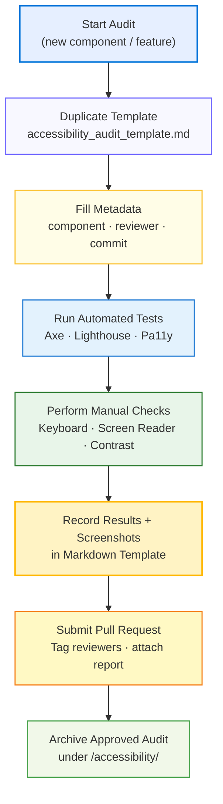

<div align="center">

# 🧩 Kansas Frontier Matrix — Accessibility Templates  
`docs/design/reviews/accessibility/templates/`

**Purpose:** Provide standardized templates and checklists for all accessibility audits  
conducted within the Kansas Frontier Matrix (KFM) design system — ensuring documentation-first,  
reproducible accessibility validation across web, map, and timeline interfaces.

[](../../../../)  
[](../README.md)  
[](../../../)  
[](../../../../LICENSE)

</div>

---

## 🎯 Objective

This folder consolidates reusable **audit templates**, **WCAG checklists**, and **ARIA references**  
used by accessibility and design reviewers under the **Master Coder Protocol (MCP)**.  

Each document ensures:
- Consistent metadata (`commit`, `reviewer`, `component`, `date`)  
- Verifiable evidence (screenshots, test logs, CI reports)  
- Direct linkage to affected code paths and Figma frames  
- Measurable results (Pass / Fail / Needs Review)  

---

## 📁 Directory Layout

```text
docs/design/reviews/accessibility/templates/
├── README.md                       # This index
├── accessibility_audit_template.md # Full a11y audit report form
├── wcag_checklist.md               # Criteria mapping (WCAG 2.1 AA)
└── aria_roles_reference.md         # ARIA role + landmark usage guide
````

---

## 🧩 Template Overview

| File                                | Purpose                                                            | Usage                       |
| ----------------------------------- | ------------------------------------------------------------------ | --------------------------- |
| **accessibility_audit_template.md** | Structured form to document component-level accessibility reviews  | Duplicate for each audit    |
| **wcag_checklist.md**               | Detailed success criteria for WCAG 2.1 AA mapped to KFM UI         | Reference during evaluation |
| **aria_roles_reference.md**         | Quick lookup for ARIA roles, landmarks, and live-region attributes | Use during code review      |

---

## 🪶 Template Usage Flow



---

## 🧠 Best Practices

* 🌓 Test both **light** and **dark** themes using identical checklists.
* 📸 Include **screenshots**, **tool versions**, and **environment details** in every audit.
* 🔗 Link directly to related component paths (e.g., `web/src/components/Timeline/`).
* 🗂 Save final Markdown reports in `docs/design/reviews/accessibility/`.
* 🧾 Use standardized metadata keys in each report:

```yaml
status: pass | fail | needs-review
wcag_level: "AA"
reviewer: "@github-handle"
commit: "{{ GIT_COMMIT }}"
component: "timeline"
date: "{{ ISO8601_DATE }}"
```

---

## ⚙️ Continuous Integration (Accessibility QA)

All accessibility templates integrate with **CI workflows** for automation and validation:

```yaml
# .github/workflows/a11y-template-validate.yml
on:
  pull_request:
    paths:
      - "docs/design/reviews/accessibility/templates/**/*.md"
jobs:
  validate:
    runs-on: ubuntu-latest
    steps:
      - uses: actions/checkout@v4
      - name: Lint Markdown Templates
        run: npx markdownlint-cli2 "docs/design/reviews/accessibility/templates/**/*.md"
      - name: Validate Accessibility JSON
        run: jq . .pa11yci.json
```

> **Tip:** Automated validation ensures templates remain consistent with WCAG mapping and MCP documentation rules.

---

## 🧾 Provenance & Compliance

| Field                    | Description                                       |
| ------------------------ | ------------------------------------------------- |
| **Frameworks Tested**    | React 18 · MapLibre GL · HTML5 Canvas             |
| **Standards Referenced** | WCAG 2.1 AA · Section 508 · WAI-ARIA 1.2          |
| **Automation Tools**     | Axe Core · Pa11y CI · Lighthouse · Storybook A11y |
| **Version Control**      | Each audit includes commit metadata & CI artifact |
| **Audit Frequency**      | Per major UI release or accessibility regression  |

---

## 🪪 License

All accessibility templates and audit forms are licensed under **Creative Commons CC-BY 4.0**
© 2025 Kansas Frontier Matrix Design Collective

---

<div align="center">

### 🧭 Kansas Frontier Matrix — Reproducible Accessibility Framework

**Standardized · Auditable · Inclusive**

</div>
