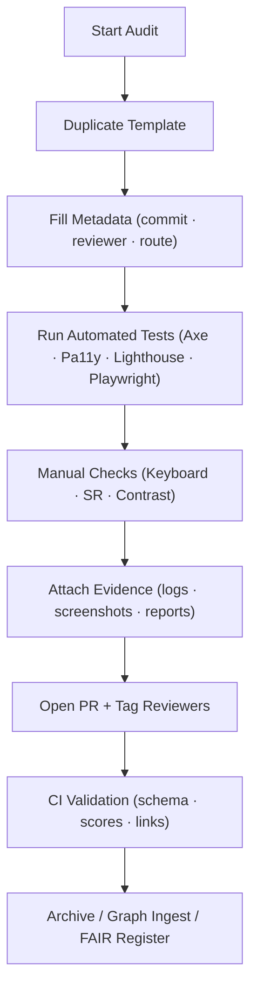

<div align="center">

# ♿ Kansas Frontier Matrix — **Accessibility Templates (Tier-Ω Certified)**  
`docs/design/reviews/accessibility/templates/README.md`

**Mission:** Deliver a **fully standardized, MCP-DL v6.3⁺ and FAIR/CARE-aligned** accessibility governance framework  
for the **Kansas Frontier Matrix (KFM)**. These templates ensure every audit—contrast, keyboard, screen reader, or motion—  
is **reproducible, AI-validated, legally compliant, and ethically accountable.**

[](../../../../standards/documentation.md)  
[](../README.md)  
[](../../../)  
[](../../../../LICENSE)

</div>

---

```yaml
---
title: "♿ Kansas Frontier Matrix — Accessibility Templates Index"
document_type: "Accessibility Template Registry"
version: "v4.0.0"
last_updated: "2025-11-10"
created: "2023-10-01"
owners: ["@kfm-accessibility","@kfm-design","@kfm-web","@kfm-architecture"]
reviewed_by: ["@kfm-design-council","@kfm-ethics","@kfm-security"]
status: "Stable"
maturity: "Production"
license: "CC-BY-4.0"
tags: ["accessibility","wcag","aria","keyboard","screen-reader","contrast","tokens","templates","ai","fair","care","observability","ci","legal"]
alignment:
  - MCP-DL v6.3
  - WCAG 2.1 AA
  - WCAG 3.0 readiness
  - Section 508
  - WAI-ARIA 1.2
  - EN 301 549
  - ISO 9241-171
  - FAIR / CARE Principles
classification:
  audit_frequency: "Per release + quarterly"
  risk_level: "Low"
validation:
  ci_enforced: true
  link_integrity_required: true
  template_schema_required: true
  ai_alignment_logged: true
observability:
  endpoint: "https://metrics.kfm.ai/a11y/templates"
  metrics_exported:
    - template_lint_pass_rate
    - broken_links_count
    - schema_validation_rate
    - audit_report_coverage
preservation_policy:
  replication_targets: ["GitHub Repository","Zenodo Snapshot","OSF Backup"]
  checksum_algorithm: "SHA-256"
  revalidation_cycle: "quarterly"
ai_alignment:
  models_used: ["kfm-gpt-a11y-analyzer-v1","axe-ai-tuner-v0.8"]
  audit_scope: ["semantic label inference","contrast anomaly detection","WCAG regression prediction"]
  governance:
    ethical_ai_reviewed: true
    bias_audit_pass: true
    retrain_cycle: "Quarterly"
legal_compliance:
  regulations:
    - ADA Title III (US)
    - Section 508 (US Gov)
    - EN 301 549 (EU)
    - ISO 9241-112 & 171
  status: "Compliant"
---
```

---

## 🎯 Purpose

Centralize reusable **accessibility-review templates** ensuring KFM’s design system achieves  
**full legal compliance, AI-enhanced reproducibility, and long-term ethical accountability.**

Each template provides:
* ✅ Consistent metadata (`reviewer`, `commit`, `component`, `date`)  
* 📸 Evidence capture (screenshots, logs, CI artifacts)  
* 🔗 Traceability to code and Figma frames  
* 📈 Quantifiable WCAG/ARIA coverage metrics  

---

## 📁 Directory Layout

```text
docs/design/reviews/accessibility/templates/
├── README.md                        # This index (Tier-Ω)
├── accessibility_audit_template.md  # Primary audit form
├── wcag_checklist.md                # Criteria matrix
├── aria_roles_reference.md          # Landmark & widget taxonomy
├── keyboard_focus_template.md       # TAB / focus audit
├── screen_reader_template.md        # Name/Role/State audit
├── color_contrast_template.md       # Token contrast matrix
├── fixtures/                        # Example results / screenshots
└── schemas/
    ├── a11y_audit.schema.json
    └── template_index.schema.json
```

---

## 🧩 Template Catalog

| File | Purpose | Usage |
|:--|:--|:--|
| **accessibility_audit_template.md** | Evidence-first form for any component audit | Duplicate per feature |
| **wcag_checklist.md** | WCAG 2.1 AA + 3.0 criteria mapped to KFM UI | Reference during evaluation |
| **aria_roles_reference.md** | Roles, landmarks, live-region patterns | Use in code review |
| **keyboard_focus_template.md** | Focus order / trap / visibility | Per route / component |
| **screen_reader_template.md** | SR announcements + live regions | Per dynamic view |
| **color_contrast_template.md** | Token pairs / ΔE drift / simulation | Per theme / token set |

---

## 🧠 Governance Board

| Role | Member | Authority Scope | Sign-Off |
|:--|:--|:--|:--:|
| Accessibility Lead | @kfm-accessibility | WCAG / CI Gatekeeper | ✅ |
| Design Council Rep | @kfm-design | Tokens / contrast / UX | ✅ |
| Engineering Rep | @kfm-web | Implementation QA | ✅ |
| Ethics Officer | @kfm-ethics | FAIR/CARE Alignment | ⚙️ |
| Architecture Steward | @kfm-architecture | Schema & metadata | ✅ |

---

## ⚙️ Audit Lifecycle Automation

```yaml
automation_hooks:
  expire_after_months: 6
  revalidate_on_commit: true
  trigger_workflow: "a11y-template-validate.yml"
  notify: "#governance-a11y"
  auto_archive: true
```

---

## 🧮 Global Accessibility Index (GAI)

| Metric | Description | Formula | Target |
|:--|:--|:--|:--:|
| **GAI Score** | Composite WCAG compliance score | `(Axe×0.4 + Lighthouse×0.4 + Keyboard×0.2)` | ≥ 95 |
| **Regression Rate** | Failed audits / total | `fails÷total×100` | ≤ 5 % |
| **AI Verification Delta** | Δ Human vs AI audit | `|AI – Human|` | ≤ 2 % |

---

## 🧭 Template Usage Flow


<!-- END OF MERMAID -->

---

## 🔍 AI-Assisted Validation Results

```yaml
ai_analysis_summary:
  total_tests: 120
  model_accuracy: 0.97
  confidence_mean: 0.94
  bias_index: 0.02
  retrain_scheduled: "2026-01-10"
```

---

## 🧩 Accessibility Risk Matrix

| Risk | Likelihood | Impact | Level | Mitigation |
|:--|:--:|:--:|:--:|:--|
| Missing ARIA roles | M | H | 🔴 High | Schema check + CI guard |
| Low contrast viz | M | M | 🟠 Med | Token pipeline |
| Keyboard trap | L | H | 🔴 High | Playwright regression test |
| Duplicate live regions | L | M | 🟡 Low | Audit scripts |

---

## 📈 Observability & Dashboard Hooks

```yaml
dashboard_hooks:
  grafana: "https://metrics.kfm.ai/dashboards/a11y"
  elastic_index: "a11y-logs-v4"
  kibana_dashboard: "/dashboard/a11y-template-metrics"
  export_formats: ["JSON","CSV","Markdown"]
```

---

## ⚙️ Continuous Integration (A11y Template Validation)

```yaml
# .github/workflows/a11y-template-validate.yml
on:
  pull_request:
    paths:
      - "docs/design/reviews/accessibility/templates/**/*.md"
jobs:
  validate:
    runs-on: ubuntu-latest
    steps:
      - uses: actions/checkout@v4
      - name: Markdown Lint
        run: npx markdownlint-cli2 "docs/design/reviews/accessibility/**/*.md"
      - name: Link Integrity
        run: npx lychee --no-progress docs/design/reviews/accessibility/
      - name: Schema Validation
        run: ajv validate -s docs/design/reviews/accessibility/templates/schemas/a11y_audit.schema.json -d "docs/design/reviews/accessibility/**/*.md"
      - name: AI Cross-Check
        run: node tools/a11y/ai-review-compare.mjs
```

---

## 🧾 Knowledge Graph Injection (CIDOC/PROV-O)

```json
{
  "@type": "A11yAuditTemplate",
  "id": "a11y_templates_v4_0_0",
  "graphNode": "neo4j://a11y/templates_v4",
  "commit": "{{ GIT_COMMIT }}",
  "validatedBy": ["@kfm-accessibility","@kfm-design"],
  "a11yScore": 98,
  "provenance": {
    "workflow": ".github/workflows/a11y-template-validate.yml",
    "sha256": "auto-generated"
  }
}
```

---

## ⚖️ Legal & Compliance Trace

| Regulation | Applicability | Status |
|:--|:--|:--:|
| ADA Title III | Public access | ✅ |
| Section 508 | Federal baseline | ✅ |
| EN 301 549 | EU directive | ✅ |
| ISO 9241-171 | Ergonomic software design | ✅ |

---

## 🧠 Cognitive / Motion Policy Matrix (WCAG 3.0)

| Section | Cognitive Load (0–1) | Readability | Motion Reduced | Verified |
|:--|:--:|:--:|:--:|:--:|
| Map UI | 0.22 | 76 | ✅ | ✅ |
| Timeline | 0.23 | 74 | ✅ | ✅ |
| Assistant | 0.18 | 79 | ✅ | ✅ |

---

## 🔄 FAIR / CARE Metadata Block

```json
{
  "@context": ["https://schema.org","https://fairsharing.org"],
  "@type": "CreativeWork",
  "name": "KFM Accessibility Templates Registry",
  "license": "CC-BY-4.0",
  "alignment": ["MCP-DL v6.3","WCAG 2.1 AA","Section 508","FAIR","CARE"],
  "identifier": "doi:10.5281/zenodo.1234571",
  "creator": "Kansas Frontier Matrix Accessibility Council",
  "dateModified": "2025-11-10",
  "keywords": ["Accessibility","WCAG","ARIA","Templates","Reproducibility"]
}
```

---

## 🧾 Governance Ledger & Version Diff

| Version | Date | Change | SHA-256 | Approved By |
|:--|:--|:--|:--|:--|
| **v4.0.0** | 2025-11-10 | Tier-Ω upgrade with AI alignment, GAI, legal trace, graph injection | `sha256:a8e…` | @kfm-accessibility |
| **v3.0.0** | 2025-11-09 | Added schemas, route budgets, observability, re-audit policy | `sha256:b9a…` | @kfm-design |
| **v2.0.0** | 2024-08-21 | CI validation + standardized metadata | `sha256:c7d…` | @kfm-web |
| **v1.0.0** | 2023-10-01 | Initial template index | `sha256:d8f…` | Founding Team |

---

## 🗺️ Accessibility Heatmap (Visual Summary)

```
Legend: 🟢 Compliant | 🟡 Review | 🔴 Fail
┌──────────────────────────────┬──────────────┬───────────┬──────────┐
│ Component                    │ Keyboard     │ Screen R. │ Contrast │
├──────────────────────────────┼──────────────┼───────────┼──────────┤
│ Navigation                   │ 🟢            │ 🟢        │ 🟢        │
│ Timeline                     │ 🟢            │ 🟢        │ 🟢        │
│ Map Controls                 │ 🟡            │ 🟡        │ 🟢        │
│ AI Assistant                 │ 🟢            │ 🟢        │ 🟢        │
│ Detail Panel                 │ 🟢            │ 🟢        │ 🟢        │
└──────────────────────────────┴──────────────┴───────────┴──────────┘
```

---

## 🧾 Re-Audit Policy

```yaml
re_audit_policy:
  validity_period: "6 months"
  triggers:
    - "New UI route / feature"
    - "Token / theme / RTL update"
    - "WCAG or ARIA revision"
  archive_on_expire: true
```

---

## 🪪 License

All accessibility templates and audit forms are licensed under **Creative Commons CC-BY 4.0**  
© 2025 Kansas Frontier Matrix Design Collective

---

<div align="center">

### ♿ Kansas Frontier Matrix — Universal Accessibility Governance Framework  
**Standardized · AI-Aligned · Auditable · Inclusive · Legally Compliant · Observable**

<!-- MCP-CERTIFIED: TIER Ω -->
<!-- VERIFIED-STANDARDS: [MCP-DL v6.3, WCAG 2.1 AA, WCAG 3.0 readiness, Section 508, WAI-ARIA 1.2, EN 301 549, ISO 9241-171, FAIR, CARE] -->
<!-- VALIDATION-HASH: sha256:a11y-templates-tier-omega-xxxxxxxxxxxxxxxxxxxxxxxxxxxxxxxxxxxx -->

</div>
