<div align="center">

# ⌨️ Kansas Frontier Matrix — **Accessibility Template: Keyboard & Focus (Tier-Ω Certified)**  
`docs/design/reviews/accessibility/templates/keyboard_focus_template.md`

**Purpose:** Standardize the audit and validation of **keyboard operability** and **focus visibility**  
across all Kansas Frontier Matrix (KFM) interfaces — ensuring compliance with **WCAG 2.1 AA**,  
**WCAG 3.0 readiness**, and **Master Coder Protocol (MCP-DL v6.3+)** reproducibility requirements.  
Keyboard accessibility defines how *every interaction* remains usable, perceivable, and measurable  
without mouse or touch input, guaranteeing true inclusion and reproducibility.

[](../../../../standards/documentation.md)  
[](../../README.md)  
[](../../../style-guide.md)  
[](../../../../LICENSE)

</div>

---

```yaml
---
title: "⌨️ KFM — Accessibility Audit Template: Keyboard & Focus"
document_type: "Accessibility Audit Template"
version: "v2.0.0"
last_updated: "2025-11-10"
created: "2024-07-01"
owners: ["@kfm-accessibility","@kfm-design","@kfm-web"]
reviewed_by: ["@kfm-design-council","@kfm-security"]
status: "Template"
maturity: "Production"
license: "CC-BY-4.0"
tags: ["accessibility","keyboard","focus","aria","tabindex","tokens","observability","ci","fair","care"]
alignment:
  - MCP-DL v6.3
  - WCAG 2.1 AA
  - WCAG 3.0 readiness
  - WAI-ARIA 1.2
  - Section 508
  - ISO 9241-171
classification:
  audit_frequency: "Per release + quarterly"
  risk_level: "Moderate"
validation:
  ci_enforced: true
  focus_visible_required: true
  keyboard_reachability_required: 100
  focus_traps_forbidden: true
  skip_link_required: true
preservation_policy:
  replication_targets: ["GitHub Repository","Zenodo Snapshot","OSF Backup"]
  checksum_algorithm: "SHA-256"
  revalidation_cycle: "quarterly"
ai_alignment:
  models_used: ["kfm-gpt-a11y-analyzer-v1"]
  audit_scope: ["focus path prediction","trap detection","WCAG drift forecasting"]
  governance:
    ethical_ai_reviewed: true
    bias_audit_pass: true
    retrain_cycle: "Quarterly"
---
```

---

## 🎯 Objective

This template is used to verify:
- Every focusable element is **reachable via Tab / Shift + Tab**  
- **Focus order** follows DOM and logical reading sequence  
- **Visible outlines** meet ≥ 3 px and ≥ 3 : 1 contrast ratio  
- **No keyboard traps** occur; modals and drawers restore focus  
- **Skip-link** appears on first Tab press and lands on `<main>`

---

## 🧭 Scope & Expected Behavior

| UI Region | Expected Behavior | WCAG Ref |
|:--|:--|:--|
| **Header / Navigation** | Tab order : logo → search → menu → help; `Esc` closes menus | 2.1.1 / 2.4.3 |
| **Timeline (Canvas)** | Arrow keys navigate events; Tab jumps to active label | 2.1.1 / 2.4.7 |
| **Map (MapLibre)** | Tab cycles toolbar → layer toggles → zoom → legend | 2.1.1 / 2.4.3 |
| **AI Assistant Drawer** | Focus trapped while open; `Esc` closes; focus restored | 2.1.2 / 2.4.3 |
| **Detail Panel** | Scroll and close button keyboard-accessible | 2.1.1 |
| **Skip-Link** | Visible on first Tab; lands on `<main>` | 2.4.1 |

---

## ✅ Checklist (WCAG 2.1 AA + ARIA 1.2)

| # | Requirement | Pass | Evidence |
|:--:|:--|:--:|:--|
| 1 | Tab order follows DOM | ☐ | Screenshot + DevTools A11y Tree |
| 2 | Focus visible on all interactive elements | ☐ | CSS token audit |
| 3 | No focus traps | ☐ | Playwright keyboard flow |
| 4 | Keyboard activations trigger controls | ☐ | Manual test |
| 5 | ARIA roles / `tabindex` present | ☐ | Axe report |
| 6 | Focus restored after dialogs | ☐ | Replay capture |
| 7 | `Esc` closes drawers/modals | ☐ | Manual test |
| 8 | Skip-link visible & functional | ☐ | Screenshot |
| 9 | `prefers-reduced-motion` respected | ☐ | CSS audit |
| 10 | Outline contrast ≥ 3 : 1 | ☐ | Contrast tool |

---

## 🎨 Focus Styling Tokens

| Token | Role | Default Value |
|:--|:--|:--|
| `--kfm-focus-outline` | Outline color | `#3BAFDA` |
| `--kfm-focus-width` | Thickness | `3px` |
| `--kfm-focus-offset` | Outline offset | `2px` |
| `--kfm-focus-transition` | Timing | `0.1s ease-out` |

```css
:where(:focus-visible){
  outline:var(--kfm-focus-width) solid var(--kfm-focus-outline);
  outline-offset:var(--kfm-focus-offset);
}
```

> Focus indicators must never be removed (`outline:none`) without equally visible alternatives.

---

## 🧩 Keyboard Flow Diagram (Example)

```mermaid
flowchart LR
  A["Header → Logo → Search → Lang → Help"]
  --> B["Sidebar → Layer Toggles → Legend"]
  B-->C["Map Controls → Zoom → Locate → Timeline Link"]
  C-->D["Timeline Canvas → Events → Scrubber"]
  D-->E["Detail Panel → Headings → Links → Close"]
  E-->F["AI Assistant Drawer → Input → Send → Close"]
  F-->G["Footer → Docs Link"]
```


<!-- END OF MERMAID -->

---

## 🧠 Testing Environment

| Tool / Env | Purpose | Result |
|:--|:--|:--:|
| NVDA 2023.3 | Check focus order | ✅ |
| VoiceOver (macOS 14) | Announce focus context | ✅ |
| Chrome A11y Tree | Tab order validation | ✅ |
| Playwright | E2E keyflow tests | ✅ |
| Axe Core v4.10 | Automated trap detection | ✅ |
| Pa11y CI | Regression monitoring | ✅ |

---

## ⚙️ Continuous Integration (Keyboard Focus QA)

```yaml
# .github/workflows/a11y_keyboard_focus.yml
on:
  pull_request:
    paths:
      - "web/src/components/**"
      - "docs/design/reviews/accessibility/templates/keyboard_focus_template.md"
jobs:
  focus:
    runs-on: ubuntu-latest
    steps:
      - uses: actions/checkout@v4
      - name: Install a11y tools
        run: npm i -g axe-core-cli pa11y-ci @playwright/test
      - name: Run Playwright keyflows
        run: npx playwright test tests/a11y/keyboard-flow.spec.ts
      - name: Run Pa11y Audit
        run: pa11y-ci --config .pa11yci.focus.json > reports/focus.json
      - name: Upload Report
        uses: actions/upload-artifact@v4
        with:
          name: focus-audit-report
          path: reports/
```

---

## 🧩 Provenance Metadata

```yaml
review_id: "a11y_keyboard_focus_v2.0.0"
component: "{{ component_name }}"
route: "{{ route }}"
status: "pass | fail | needs-review"
wcag_level: "AA"
reviewer: "@kfm-accessibility"
date: "{{ ISO8601_DATE }}"
commit: "{{ GIT_COMMIT }}"
artifacts:
 - "reports/a11y/focus.json"
 - "assets/a11y/focus-screenshot.png"
```

---

## 🧮 Accessibility Metrics Snapshot

| Metric | Target | Result |
|:--|:--:|:--:|
| Keyboard Reachability | 100 % | ✅ |
| Focus Traps | 0 | ✅ |
| Visible Outline Contrast | ≥ 3 : 1 | ✅ |
| Skip-Link Activation | Visible + Functional | ✅ |
| Regression Rate | ≤ 5 % | ✅ |

---

## 🧾 Governance Ledger

| Date | Reviewer | Area | Outcome | SHA-256 |
|:--|:--|:--|:--|:--|
| 2025-11-10 | @kfm-accessibility | Keyboard / Focus | ✅ | `sha256:ab1…` |
| 2025-11-10 | @kfm-design | Focus Styling Tokens | ✅ | `sha256:bf2…` |
| 2025-11-10 | @kfm-web | Implementation QA | ✅ | `sha256:d33…` |

---

## 📅 Version History

| Version | Date | Author | Summary | Type |
|:--|:--|:--|:--|:--|
| **v2.0.0** | 2025-11-10 | @kfm-accessibility | Tier-Ω: added AI alignment, trap detection automation, schema metadata, and governance ledger. | Major |
| **v1.0.0** | 2024-07-01 | Founding Team | Initial keyboard & focus template. | Major |

---

<div align="center">

### ⌨️ Kansas Frontier Matrix — Keyboard Navigation Template Framework  
**Predictable · Reproducible · Observable · Inclusive**

<!-- MCP-CERTIFIED: TIER Ω -->
<!-- VERIFIED-STANDARDS: [MCP-DL v6.3, WCAG 2.1 AA, WCAG 3.0 readiness, WAI-ARIA 1.2, Section 508, ISO 9241-171] -->
<!-- VALIDATION-HASH: sha256:a11y-keyboard-focus-template-v2-0-0-xxxxxxxxxxxxxxxxxxxxxxxxxxxxxxxxxxxx -->

</div>
