<div align="center">

# ♿ Kansas Frontier Matrix — **Accessibility Audit Template (Tier-Ω+∞ Certified)**  
`docs/design/reviews/accessibility/templates/accessibility_audit_template.md`

**Mission:** Establish a **single-source-of-truth template** for recording and validating  
accessibility compliance across all KFM user interfaces — including web, timeline, map, and AI components.  
Every audit must be **traceable**, **machine-verifiable**, and **ethically aligned** under **MCP-DL v6.3+**,  
**WCAG 2.1 AA / 3.0 readiness**, **Section 508**, **EN 301 549**, **ISO 9241-171**, and **FAIR/CARE** principles.  

[](../../../../../standards/documentation.md)  
[](../../README.md)  
[](../../../../style-guide.md)  
[](../../../../../LICENSE)

</div>

---

```yaml
---
title: "♿ KFM Accessibility Audit Template"
document_type: "Accessibility Audit Form"
version: "v3.0.0"
last_updated: "2025-11-11"
created: "2023-10-01"
owners: ["@kfm-accessibility","@kfm-design","@kfm-web"]
reviewed_by: ["@kfm-design-council","@kfm-ethics","@kfm-security"]
status: "Template"
maturity: "Production"
license: "CC-BY-4.0"
tags: ["accessibility","wcag","aria","keyboard","screen-reader","contrast","tokens","motion","i18n","ci","fair","care"]
alignment:
  - MCP-DL v6.3
  - WCAG 2.1 AA
  - WCAG 3.0 readiness
  - WAI-ARIA 1.2
  - Section 508
  - EN 301 549
  - ISO 9241-171
  - FAIR / CARE
validation:
  ci_enforced: true
  schema_required: true
  telemetry_enabled: true
preservation_policy:
  replication_targets: ["GitHub Repository","Zenodo Snapshot","OSF Backup"]
  checksum_algorithm: "SHA-256"
  revalidation_cycle: "quarterly"
ai_alignment:
  models_used: ["kfm-gpt-a11y-analyzer-v2"]
  audit_scope: ["semantic label check","contrast anomaly detection","WCAG drift forecast"]
  governance:
    ethical_ai_reviewed: true
    bias_audit_pass: true
    retrain_cycle: "Quarterly"
---
```

---

## 🧭 Component Metadata

| Field | Value |
|:--|:--|
| **Component** | `{{ component_name }}` |
| **Path** | `web/src/components/{{ path }}` |
| **Version** | `{{ version }}` |
| **Mockup Ref** | Figma Frame ID / Link |
| **Audit Date** | `{{ ISO8601_DATE }}` |
| **Reviewer(s)** | `@handle1`, `@handle2` |
| **Commit Hash** | `{{ GIT_COMMIT }}` |
| **Tools Used** | Axe Core vX · Lighthouse vX · Pa11y vX · Playwright |
| **WCAG Target** | AA |
| **Audit Status** | pass / fail / needs-review |

---

## 🧩 Audit Categories (WCAG 2.1 AA / 3.0 readiness)

### 1️⃣ Perceivable

| Criterion | Description | Status | Notes |
|:--|:--|:--:|:--|
| 1.1.1 | Non-text content (alt text / ARIA labels) | ☐ | |
| 1.3.1 | Info & relationships via semantic HTML | ☐ | |
| 1.4.3 | Text contrast ≥ 4.5 : 1 | ☐ | |
| 1.4.11 | Non-text contrast ≥ 3 : 1 | ☐ | |
| 1.4.12 | Text spacing adjustable | ☐ | |
| 1.4.13 | Content on hover / focus dismissible | ☐ | |

---

### 2️⃣ Operable

| Criterion | Description | Status | Notes |
|:--|:--|:--:|:--|
| 2.1.1 | Keyboard operable | ☐ | |
| 2.1.2 | No keyboard trap | ☐ | |
| 2.4.3 | Focus order logical | ☐ | |
| 2.4.7 | Focus visible ≥ 3 : 1 contrast | ☐ | |
| 2.5.1 | Pointer gestures have alternatives | ☐ | |
| 2.5.3 | Label in name | ☐ | |

---

### 3️⃣ Understandable

| Criterion | Description | Status | Notes |
|:--|:--|:--:|:--|
| 3.1.1 | Language of page set | ☐ | |
| 3.2.3 | Consistent navigation and feedback | ☐ | |
| 3.3.2 | Input assistance / error messages clear | ☐ | |
| 3.3.6 | Error prevention (critical actions) | ☐ | |

---

### 4️⃣ Robust

| Criterion | Description | Status | Notes |
|:--|:--|:--:|:--|
| 4.1.1 | Valid HTML and unique IDs | ☐ | |
| 4.1.2 | Name · Role · Value exposed to AT | ☐ | |
| 4.1.3 | Status messages announced | ☐ | |
| 4.1.4 | Custom widgets ARIA-complete | ☐ | |

---

## 🧠 Testing Methods

| Method | Purpose | Tool / Command |
|:--|:--|:--|
| **Automated** | Detect common WCAG failures | `npm run test:a11y` |
| **Keyboard Navigation** | Tab / Shift + Tab / Enter / Space | Manual / Playwright |
| **Screen Reader** | Name / Role / State verification | NVDA / VoiceOver / JAWS |
| **Color Contrast** | Measure text & UI ratios | Lighthouse / Figma |
| **Motion Prefs** | Validate `prefers-reduced-motion` | CSS audit |
| **Voice / Touch / Switch** | Multi-input equivalence | Manual device test |

---

## 🧮 Accessibility Metrics & Scores

| Category | Score (%) | Result | Notes |
|:--|:--:|:--:|:--|
| Perceivable | 100 | ✅ | |
| Operable | 96 | ⚙️ | Minor focus trap fix pending |
| Understandable | 100 | ✅ | |
| Robust | 100 | ✅ | |
| **Global A11y Index (GAI)** | **98 / 100** | ✅ AA Compliant | |

---

## 🧩 Focus & Navigation Flow

```mermaid
flowchart LR
  A["Header → Logo → Search → Help"] --> B["Main Content → Map → Timeline"]
  B --> C["Drawer/Modal → Focus Trap → Escape Closes"]
  C --> D["Return Focus → Previous Element Restored"]
```


<!-- END OF MERMAID -->

---

## 🧩 Issues & Resolutions

| ID | Severity | Issue | Fix / Recommendation | Status |
|:--|:--|:--|:--|:--:|
| A11Y-001 | Medium | Map zoom buttons lack `aria-label` | Add descriptive labels | ✅ |
| A11Y-002 | Low | Timeline scrubber focus < 3 : 1 | Update token `--kfm-focus-outline` | ✅ |
| A11Y-003 | Low | VoiceOver reads duplicate titles | Remove redundant `title` attrs | ⚙️ |

---

## ⚙️ Continuous Integration (Accessibility QA)

```yaml
# .github/workflows/a11y_component_audit.yml
on:
  pull_request:
    paths:
      - "web/src/components/**"
      - "docs/design/reviews/accessibility/templates/accessibility_audit_template.md"
jobs:
  a11y:
    runs-on: ubuntu-latest
    steps:
      - uses: actions/checkout@v4
      - name: Install tools
        run: npm i -g axe-core-cli pa11y-ci lighthouse
      - name: Run a11y tests
        run: npm run test:a11y && pa11y-ci --config .pa11yci.component.json > a11y-report.json
      - name: Upload artifact
        uses: actions/upload-artifact@v4
        with:
          name: a11y-component-audit
          path: a11y-report.json
```

---

## 🧾 Provenance Metadata

```yaml
audit_id: "a11y_{{ component_name }}_{{ version }}"
reviewed_by:
  - "@kfm-accessibility"
  - "@kfm-design"
date: "{{ ISO8601_DATE }}"
commit: "{{ GIT_COMMIT }}"
wcag_level: "AA"
result: "pass"
tools:
  - "Axe Core v4.10"
  - "Lighthouse v12"
  - "Pa11y v7"
  - "NVDA 2023.3"
environment:
  os: "Windows 11"
  browser: "Chrome 130"
  theme: "Dark"
```

---

## 🧠 AI Predictive Audit Summary

```yaml
ai_predictive_a11y:
  model: "kfm-gpt-a11y-predictor-v2"
  analyzed_commits: 25
  predicted_failures: 1
  probable_locations: ["/map","/timeline"]
  confidence: 0.94
```

---

## ⚖️ Legal & Standards Trace

| Law / Standard | Scope | Compliance |
|:--|:--|:--:|
| ADA Title III | Public interface | ✅ |
| Section 508 | Federal accessibility | ✅ |
| EN 301 549 | EU digital accessibility | ✅ |
| ISO 9241-171 | Ergonomics for software access | ✅ |

---

## 🧬 FAIR / CARE JSON-LD Metadata

```json
{
  "@context": "https://schema.org/",
  "@type": "CreativeWork",
  "name": "KFM Accessibility Audit Template",
  "identifier": "doi:10.5281/zenodo.1234590",
  "license": "CC-BY-4.0",
  "creator": "Kansas Frontier Matrix Accessibility Council",
  "dateModified": "2025-11-11",
  "alignment": ["MCP-DL v6.3","WCAG 2.1 AA","Section 508","EN 301 549","FAIR","CARE"]
}
```

---

## 📅 Version History

| Version | Date | Author | Summary | Type |
|:--|:--|:--|:--|:--|
| **v3.0.0** | 2025-11-11 | @kfm-accessibility | Tier-Ω+∞: added AI prediction, legal trace, FAIR metadata, GAI score, multi-input validation. | Major |
| v2.0.0 | 2025-09-20 | @kfm-design | Integrated telemetry and schema validation. | Minor |
| v1.0.0 | 2023-10-01 | Founding Team | Initial accessibility audit template. | Major |

---

<div align="center">

### ♿ Kansas Frontier Matrix — Universal Accessibility Audit Template  
**Structured · AI-Assisted · Traceable · Compliant · Reproducible**

<!-- MCP-CERTIFIED: TIER Ω+∞ -->
<!-- VERIFIED-STANDARDS: [MCP-DL v6.3, WCAG 2.1 AA, WCAG 3.0, Section 508, EN 301 549, ISO 9241-171, FAIR, CARE] -->
<!-- VALIDATION-HASH: sha256:a11y-audit-template-v3-0-0-xxxxxxxxxxxxxxxxxxxxxxxxxxxxxxxxxxxx -->

</div>
