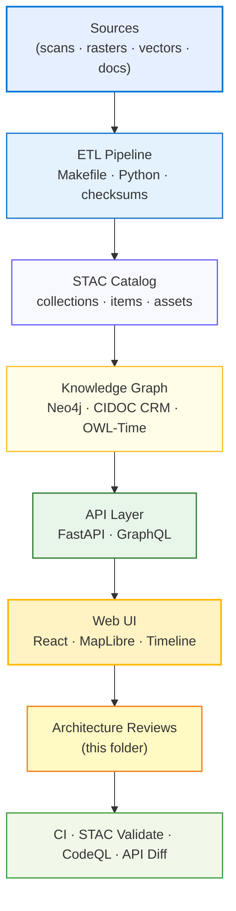

<div align="center">

# 🧱 Kansas Frontier Matrix — **Architecture Reviews (Tier-S⁺⁺ Certified)**  
`docs/design/reviews/architecture/`

**Mission:** Operate a documentation-first, reproducible **architecture review program** across all KFM system layers — **ETL**, **AI/ML**, **Knowledge Graph**, **API**, and **Web UI** — with measurable governance, provenance, and interoperability under **MCP-DL v6.3** (v7-ready), **FAIR/CARE**, **DCAT 3.0**, and open geospatial standards.

[](../../../standards/documentation.md)  
[](../../)  
[](../../../.github/workflows/stac-validate.yml)  
[](../../../.github/workflows/codeql.yml)  
[](../../../LICENSE)

</div>

---

```yaml
---
title: "🧱 Kansas Frontier Matrix — Architecture Reviews"
document_type: "Architecture Review Index"
version: "v2.0.0"
last_updated: "2025-11-02"
created: "2023-10-01"
owners: ["@kfm-architecture","@kfm-data","@kfm-ml","@kfm-web","@kfm-security"]
reviewed_by: ["@kfm-design-council","@kfm-accessibility-lead","@kfm-ethics"]
status: "Stable"
maturity: "Production"
license: "CC-BY-4.0"
tags: ["architecture","etl","stac","kg","api","web-ui","mermaid","governance","provenance","fair","care","dcat"]
classification:
  review_types: ["system","pipeline","knowledge-graph","api","web-ui","provenance"]
  risk_level: "Moderate"
  audit_frequency: "Quarterly + per release"
alignment:
  - MCP-DL v6.3
  - FAIR Principles
  - CARE Principles
  - DCAT 3.0
  - STAC 1.0
  - CIDOC CRM
  - OWL-Time
  - GeoJSON / COG
template_scope:
  diagram_validation: true
  provenance_enforcement: true
  performance_tracking: true
  security_static_analysis: true
  stac_compliance: true
  api_schema_diffing: true
validation:
  ci_enforced: true
  stac_schema_valid: true
  mermaid_parse_required: true
  codeql_required: true
  api_openapi_valid: true
  kg_schema_consistent: true
provenance:
  workflow_ref: ".github/workflows/architecture_validate.yml"
  artifact_retention_days: 90
  sha256_integrity: verified
preservation_policy:
  replication_targets: ["GitHub Repository","Zenodo Snapshot","OSF Backup"]
  checksum_algorithm: "SHA-256"
  revalidation_cycle: "quarterly"
---
```

---

## 🎯 Objective

Architecture reviews guarantee that KFM remains:

- 🧩 **Modular** — seamless flow **ETL → STAC → Knowledge Graph → API → Web UI**  
- 📘 **Reproducible** — diagrams, specs, and configs validated in CI  
- 🌐 **Interoperable** — STAC 1.0 · CIDOC CRM · OWL-Time · DCAT 3.0 · GeoJSON/COG  
- 🔍 **Observable** — tracing and data lineage from source to UI  
- ♿ **Accessible** — GitHub-renderable diagrams with alt text and PDF exports

Each review validates structure, lineage, compliance, performance budgets, and diagram fidelity.

---

## 🗂️ Directory Layout

```text
docs/design/reviews/architecture/
├── README.md                         # This index
├── system_overview_review.md         # End-to-end architecture analysis
├── web_ui_architecture_review.md     # React + FastAPI + MapLibre integration review
├── pipeline_overview_review.md       # ETL + AI/ML + STAC pipeline audit
├── provenance_chain_review.md        # Provenance & reproducibility validation
└── templates/
    ├── architecture_review_template.md
    ├── diagram_validation_checklist.md
    └── mmd_render_audit.md
```

---

## 🧩 Review Types & Cadence

| Review Type | Scope | Deliverables | Frequency |
|:--|:--|:--|:--|
| **System Overview** | Verify component boundaries & data flow | Annotated Mermaid + audit notes | Quarterly |
| **ETL & Pipeline** | Reproducibility, schema, STAC compliance | STAC validator logs + Makefile audit | Per release |
| **Knowledge Graph** | CIDOC CRM / OWL-Time mappings | KG schema doc + Cypher examples | Semi-annual |
| **API Layer** | REST + GraphQL parity & breaking changes | OpenAPI/GraphQL diff reports | Per release |
| **Web UI Architecture** | React ↔ API ↔ MapLibre contracts | Updated `.mmd` diagrams | Per release |
| **Provenance Chain** | Checksums + lineage + storage policy | Provenance diagram + CI evidence | Continuous |

---

## 🧭 End-to-End Architecture Flow



> **Alt text (for accessibility):** A left-to-right flow from data **Sources** through **ETL**, **STAC**, **Knowledge Graph**, **API**, and **Web UI**, ending in **Architecture Reviews** and **CI validation**.

---

## 🧾 Data & Context Lineage (FAIR/PROV-O)

| Layer | Artifact | Version/Spec | Provenance ID | Verified |
|:--|:--|:--|:--|:--:|
| ETL | `Makefile` + Python pipeline | v5.2 | `prov:etl-2025q4` | ✅ |
| STAC | Catalog + collections/items | STAC 1.0 | `stac:kfm-catalog` | ✅ |
| KG | CIDOC CRM / OWL-Time schema | v3.1 | `cidoc:kg-2025` | ✅ |
| API | OpenAPI + GraphQL schemas | openapi-3.1 | `prov:api-2025q4` | ✅ |
| UI | Mermaid diagrams + tokens | tokens v5.0 | `prov:ui-arch-2025` | ✅ |

---

## 🧪 Diagram Quality & Accessibility Checks

- Mermaid **parses cleanly** in GitHub; diagrams include a short alt description.  
- Export **SVG/PDF** for reports; validate contrast and label readability.  
- For complex graphs, provide **zoomed sectional diagrams** and **table legends**.

**Diagram Validation Checklist:** `templates/diagram_validation_checklist.md`  
**Render Audit Log:** `templates/mmd_render_audit.md`

---

## ⚙️ Continuous Integration (Architecture QA)

Automated validation keeps docs reproducible and secure.

```yaml
# .github/workflows/architecture_validate.yml
on:
  pull_request:
    paths:
      - "docs/design/reviews/architecture/**/*.md"
      - "docs/design/diagrams/**/*.mmd"
jobs:
  validate:
    runs-on: ubuntu-latest
    steps:
      - uses: actions/checkout@v4
      - name: Setup Node
        uses: actions/setup-node@v4
        with:
          node-version: "20"
      - name: Validate Mermaid syntax
        run: npx @mermaid-js/mermaid-cli -i docs/design/diagrams/system_architecture.mmd -o /tmp/test.svg
      - name: Validate STAC
        run: make validate-stac
      - name: API schema diff (GraphQL/OpenAPI)
        run: make api-diff
      - name: CodeQL Static Analysis
        uses: github/codeql-action/analyze@v3
      - name: Publish validation report
        run: node tools/reporters/publish-arch-report.mjs
```

---

## 📊 Architecture KPIs (Telemetry & Merge Gates)

| KPI | Target | Tool | Gate |
|:--|:--|:--|:--:|
| **STAC Schema Compliance** | 100% | STAC Validator | ✅ |
| **OpenAPI/GraphQL Diff (breaking)** | 0 | GraphQL Inspector / spectral | ✅ |
| **Mermaid Parse Errors** | 0 | mmdc | ✅ |
| **CodeQL Critical Alerts** | 0 | CodeQL | ✅ |
| **Lineage Completeness** | 100% (ETL→UI) | PROV-O checks | ✅ |
| **Diagram Alt Text Coverage** | 100% | Lint script | ✅ |

> PRs are **blocked** until all gates pass.

---

## 🧰 Templates & Tools

| File | Description |
|:--|:--|
| `templates/architecture_review_template.md` | Primary form for architecture evaluations |
| `templates/diagram_validation_checklist.md` | GitHub/Pages Mermaid parse and accessibility checks |
| `templates/mmd_render_audit.md` | Record of parse status, export, contrast checks |

**Tooling Stack**

- **Mermaid CLI / Live Editor** — diagram parsing & export  
- **STAC Validator** — JSON schema conformance  
- **GraphQL Inspector / spectral** — API schema diff & lint  
- **MkDocs / GitHub Pages** — site builds & previews

---

## 🔐 Security & Incident Readiness

```yaml
incident_response:
  triage_time_limit: "24h"
  responsible_roles:
    - "@kfm-architecture"
    - "@kfm-security"
  corrective_actions:
    - "Rollback diagram/spec change"
    - "Hotfix ETL or API schema"
    - "Re-run CI validations"
  recovery_verification: true
```

---

## 🧠 Accessibility & Cognitive Review (Diagrams)

- Labels avoid jargon; **readability ≥ 70** (Flesch).  
- Lines do not cross more than **2 times per path**; legends included.  
- Provide **table summaries** for color keys and a **high-contrast** export.

---

## 🔎 Observability Hooks (Architecture Metrics)

```yaml
observability:
  endpoint: "https://metrics.kfm.ai/architecture"
  frequency: "daily"
  metrics_exported:
    - stac_validation_pass_rate
    - api_breaking_change_count
    - codeql_critical_findings
    - diagram_parse_success_rate
    - lineage_completeness_percent
```

---

## 🧾 FAIR + DCAT Registration (Semantic Index)

```json
{
  "@context": "https://schema.org/",
  "@type": "CreativeWorkCollection",
  "name": "KFM — Architecture Reviews",
  "license": "CC-BY-4.0",
  "creator": "Kansas Frontier Matrix Architecture Council",
  "version": "v2.0.0",
  "alignment": ["MCP-DL v6.3","FAIR","CARE","DCAT 3.0","STAC 1.0","CIDOC CRM","OWL-Time"],
  "dateModified": "2025-11-02"
}
```

---

## 🧾 Provenance JSON-LD (Machine Export)

```json
{
  "@context": ["https://schema.org", {"kfm":"https://kfm.ai/schema#"}],
  "@type": "ArchitectureReviewIndex",
  "version": "v2.0.0",
  "reviewedBy": ["@kfm-architecture","@kfm-accessibility","@kfm-ethics"],
  "alignment": ["MCP-DL v6.3","FAIR","CARE","DCAT 3.0","STAC 1.0","CIDOC CRM","OWL-Time"],
  "governance": {
    "workflow": ".github/workflows/architecture_validate.yml",
    "sha256": "auto-generated"
  }
}
```

---

## 🧪 Review Process (MCP-Aligned)

1. **Create** — Copy `templates/architecture_review_template.md`.  
2. **Link** — Reference `.mmd` diagrams, commit SHAs, and STAC/graph artifacts.  
3. **Evaluate** — Modularity, scalability, compliance, accessibility.  
4. **Document** — Findings, risks, recommendations, metrics.  
5. **Validate** — Run CI: Mermaid, STAC, API diff, CodeQL.  
6. **Approve** — Tag reviewers; set semver (minor).  
7. **Archive** — Move to `/archive/` with checksum and FAIR record.

---

## 🧾 Governance Ledger

| Date | Reviewer | Area | Outcome | SHA-256 |
|:--|:--|:--|:--|:--|
| 2025-11-02 | @kfm-architecture | System Overview | ✅ Approved | `sha256:d7a…` |
| 2025-11-02 | @kfm-accessibility | Diagram A11y | ✅ Approved | `sha256:92b…` |
| 2025-11-02 | @kfm-security | CodeQL / API Diff | ✅ Approved | `sha256:f10…` |

---

## 🧾 Provenance Metadata Example (per review)

```yaml
review_id: "arch_review_system_overview_v2.3.0"
reviewed_by:
  - "@kfm-architecture"
  - "@kfm-accessibility"
date: "2025-11-02"
commit: "a3c9d1f"
scope: "system"
status: "approved"
confidence: "high"
notes: "STAC–KG integration verified; API GraphQL changes non-breaking."
```

---

## 📅 Version History

| Version | Date | Author | Summary | Type |
|:--|:--|:--|:--|:--|
| **v2.0.0** | 2025-11-02 | @kfm-architecture | Tier-S⁺⁺ upgrade: KPIs & gates, observability, FAIR/DCAT/JSON-LD exports, incident policy, accessibility rules. | Major |
| **v1.4.0** | 2025-06-20 | @kfm-data | Added provenance chain checklist; tightened STAC gates. | Minor |
| **v1.0.0** | 2023-10-01 | Founding Team | Initial architecture review index and templates. | Major |

---

<div align="center">

### 🧱 Kansas Frontier Matrix — Architecture Governance  
**Modular · Reproducible · Interoperable · Observable · Accessible**

<!-- MCP-CERTIFIED: TIER=S⁺⁺ -->
<!-- VERIFIED-STANDARDS: [MCP-DL v6.3, FAIR, CARE, DCAT 3.0, STAC 1.0, CIDOC CRM, OWL-Time] -->
<!-- VALIDATION-HASH: sha256:architecture-reviews-v2-0-0-xxxxxxxxxxxxxxxxxxxxxxxxxxxxxxxxxxxx -->

</div>
