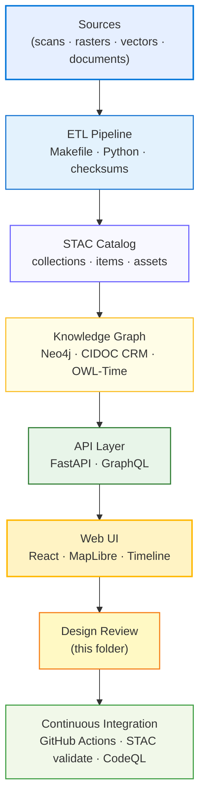

<div align="center">

# 🧱 Kansas Frontier Matrix — Architecture Reviews  
`docs/design/reviews/architecture/`

**Purpose:** Maintain documentation-first, reproducible **architecture design reviews** across all KFM system layers —  
ETL, AI/ML, Knowledge Graph, API, and Web UI — following **Master Coder Protocol (MCP)** best practices.

[](../../../)  
[](../../)  
[](../../../.github/workflows/stac-validate.yml)  
[](../../../.github/workflows/codeql.yml)  
[](../../../LICENSE)

</div>

---

## 🎯 Objective

Architecture reviews ensure the **Kansas Frontier Matrix (KFM)** remains:

- 🧩 **Modular** — seamless flow ETL → STAC → Knowledge Graph → API → Web UI  
- 📘 **Reproducible** — fully documented and validated through CI/CD pipelines  
- 🌐 **Interoperable** — using open standards (STAC 1.0 · CIDOC CRM · OWL-Time · GeoJSON · COG)  
- 🔍 **Observable** — complete tracing and provenance across datasets  
- ♿ **Accessible** — all diagrams GitHub-renderable and exportable for reports  

Each review validates structural integrity, data lineage, compliance, and visual accuracy of system diagrams.

---

## 🗂️ Directory Layout

```text
docs/design/reviews/architecture/
├── README.md                        # This index
├── system_overview_review.md         # End-to-end architecture analysis
├── web_ui_architecture_review.md     # React + FastAPI integration review
├── pipeline_overview_review.md       # ETL + AI/ML + STAC pipeline audit
├── provenance_chain_review.md        # Provenance & reproducibility validation
└── templates/                        # Architecture review templates
    ├── architecture_review_template.md
    ├── diagram_validation_checklist.md
    └── mmd_render_audit.md
````

---

## 🧩 Review Types

| Review Type             | Scope                                                           | Deliverables                             | Frequency   |
| ----------------------- | --------------------------------------------------------------- | ---------------------------------------- | ----------- |
| **System Overview**     | Verify overall stack, component boundaries, and data flow       | Annotated Mermaid diagrams + audit notes | Quarterly   |
| **ETL & Pipeline**      | Validate reproducibility, schema alignment, and STAC compliance | STAC validation log + Makefile audit     | Per release |
| **Knowledge Graph**     | Confirm ontology mappings (CIDOC CRM, OWL-Time)                 | Graph schema doc + Cypher examples       | Semi-annual |
| **API Layer**           | Review REST + GraphQL structure for parity                      | OpenAPI spec validation report           | Per release |
| **Web UI Architecture** | Audit React ↔ FastAPI ↔ MapLibre integration                    | Updated web_ui_architecture.mmd          | Per release |
| **Provenance Chain**    | Confirm checksum + data lineage                                 | Provenance chain diagram + CI evidence   | Continuous  |

---

## 🧠 Review Process (MCP-Aligned)

1. **Create** — Copy `templates/architecture_review_template.md`.
2. **Link** — Reference related `.mmd` diagrams and commit hashes.
3. **Evaluate** — Review for modularity, clarity, scalability, compliance.
4. **Document** — Record findings, recommendations, and metrics.
5. **Validate** — Run CI checks: `make validate`, STAC, CodeQL.
6. **Approve** — Tag reviewers · assign semver version (minor).
7. **Archive** — Move finalized reviews to `/archive/` for provenance.

---

## 🧩 Example Architecture Flow



---

## ⚙️ Continuous Integration (Architecture QA)

Automated validation workflows ensure diagrams and architecture files remain accurate and reproducible.

```yaml
# .github/workflows/architecture_validate.yml
on:
  pull_request:
    paths:
      - "docs/design/reviews/architecture/**/*.md"
      - "docs/design/diagrams/**/*.mmd"
jobs:
  validate:
    runs-on: ubuntu-latest
    steps:
      - uses: actions/checkout@v4
      - name: Setup Node
        uses: actions/setup-node@v4
        with:
          node-version: "20"
      - name: Validate Mermaid syntax
        run: npx @mermaid-js/mermaid-cli -i docs/design/diagrams/system_architecture.mmd -o /tmp/test.svg
      - name: Run STAC validation
        run: make validate-stac
      - name: Run CodeQL
        uses: github/codeql-action/analyze@v3
```

---

## 🧰 Templates & Tools

| File                                | Description                                                       |
| ----------------------------------- | ----------------------------------------------------------------- |
| **architecture_review_template.md** | Primary review form for documenting design evaluations            |
| **diagram_validation_checklist.md** | Step-by-step validation of GitHub-renderable Mermaid diagrams     |
| **mmd_render_audit.md**             | Logs .mmd parsing status, CI validation output, and export status |

**Tooling Stack**

* 🧮 **Mermaid CLI / Live Editor** — diagram validation and conversion
* 📘 **STAC Validator** — JSON schema conformance checks
* 🧩 **GraphQL Inspector** — API schema diff tracking
* 📖 **MkDocs / GitHub Pages** — build and publish architecture documentation

---

## 🧾 Provenance Metadata Example

```yaml
review_id: "architecture_review_{{component}}_{{version}}"
reviewed_by:
  - "@architecture-team"
date: "{{ ISO8601_DATE }}"
commit: "{{ GIT_COMMIT }}"
scope: "system | pipeline | ui | provenance"
status: "approved"
confidence: "high"
notes: "Verified integration between STAC catalog and Knowledge Graph modules"
```

---

## 🪪 License

All architecture review files are released under **Creative Commons CC-BY 4.0**
© 2025 Kansas Frontier Matrix Design Collective

---

<div align="center">

### 🧱 Kansas Frontier Matrix — Architecture Governance

**Modular · Reproducible · Interoperable · Documented**

</div>
