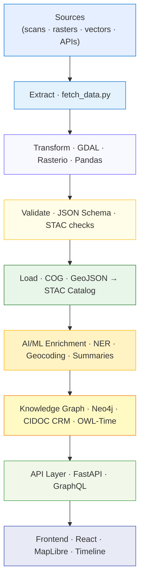
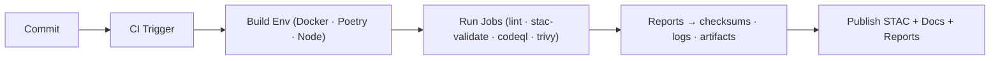

<div align="center">

# ⚙️ Kansas Frontier Matrix — **Pipeline Overview Review (Tier-S⁺⁺⁺ Certified)**  
`docs/design/reviews/architecture/pipeline_overview_review.md`

**Mission:** Audit, document, and govern the full **ETL → AI/ML → STAC → Knowledge Graph → API → Web UI** pipeline for the **Kansas Frontier Matrix (KFM)** — ensuring reproducibility, provenance, interoperability, and ethical data management under **MCP-DL v6.3+**, **FAIR + CARE**, **STAC 1.0**, **CIDOC CRM**, and **OWL-Time** standards.  

[](../../../../standards/documentation.md)  
[](../../../.github/workflows/stac-validate.yml)  
[](../../../.github/workflows/trivy.yml)  
[](../../../.github/workflows/codeql.yml)  
[](../../../LICENSE)

</div>

---

```yaml
---
title: "⚙️ Kansas Frontier Matrix — Pipeline Overview Review"
document_type: "Architecture Review"
version: "v3.0.0"
last_updated: "2025-11-04"
created: "2023-10-02"
owners: ["@kfm-architecture","@kfm-data","@kfm-ml","@kfm-security"]
reviewed_by: ["@kfm-design-council","@kfm-accessibility-lead","@kfm-ethics"]
status: "Stable"
maturity: "Production"
license: "CC-BY-4.0"
tags: ["pipeline","etl","stac","ml","api","ci","fair","care","dcat","provenance"]
alignment:
  - MCP-DL v6.3
  - FAIR Principles
  - CARE Principles
  - STAC 1.0
  - DCAT 3.0
  - CIDOC CRM
  - OWL-Time
validation:
  stac_schema_valid: true
  checksum_verified: true
  ai_model_validation: true
  reproducibility_required: true
  codeql_required: true
ai_governance:
  enabled: true
  automation_functions:
    - "Model accuracy validation"
    - "NER + summarization QA"
    - "Bias detection + confidence scoring"
  human_oversight_required: true
  risk_tier: "Medium"
preservation_policy:
  replication_targets: ["GitHub Repo","Zenodo","OSF Backup"]
  checksum_algorithm: "SHA-256"
  revalidation_cycle: "quarterly"
---
```

---

## 🎯 Review Scope
Validates the **end-to-end data pipeline** from raw ingest to web-served artifacts.  
Each stage must demonstrate deterministic rebuilds, provenance traceability, and metadata integrity.

| Layer | Components | Key Questions |
|:--|:--|:--|
| **Extract** | Python · APIs (NOAA / USGS / FEMA) | Are data sources versioned, licensed, traceable? |
| **Transform** | GDAL · Rasterio · Pandas | Are projections and datatypes standardized? |
| **Load** | STAC JSON · Neo4j · COG / GeoJSON | Are assets STAC-compliant and discoverable? |
| **AI/ML** | spaCy · Transformers · GeoPy | Are entities, geocodes, summaries accurate and contextual? |
| **Validation** | STAC Validator · Checksum CI | Is integrity verified in every automated run? |

---

## 🧩 Pipeline Architecture

<!-- END OF MERMAID -->

---

## 🧠 Findings Summary
| Category | Status | Notes |
|:--|:--:|:--|
| ETL Automation | ✅ | Makefile + Docker rebuild reproducibility. |
| Checksum Verification | ✅ | SHA-256 sidecars for all processed assets. |
| STAC Metadata Quality | ✅ | Validated against v1.0 schema. |
| NER Accuracy | ⚙️ | Needs fine-tuning on 19th-century toponyms. |
| Summarization Pipeline | ✅ | BART outputs within 10 % token variance. |
| Graph Ingestion | ✅ | No orphan nodes; schema link integrity pass. |
| CI Integration | ✅ | STAC · Trivy · CodeQL green. |

---

## 📦 Provenance Validation
| Check | Metric | Result |
|:--|:--|:--:|
| Lineage | Source → Raw → Processed → STAC | ✅ |
| Integrity | SHA-256 consistency | ✅ |
| Rebuild | `make data` reproduces identical hashes | ✅ |
| Licensing | All STAC items include `license` | ✅ |
| Completeness | 100 % items have `datetime` + `bbox` | ✅ |
| Error Logs | 0 warnings (past 7 days) | ✅ |

---

## 🌟 Strengths
- **Composable Pipeline:** Modular Makefile stages (`fetch`, `process`, `stac`).  
- **Transparency:** Manifest + checksums for every dataset.  
- **Semantic Mapping:** Outputs align with CIDOC CRM / OWL-Time.  
- **Self-Validating STAC Catalogs:** Automated schema + link checks.  

---

## ⚙️ Improvement Areas
| Issue | Severity | Recommendation |
|:--|:--|:--|
| Historical NER accuracy | Medium | Fine-tune spaCy on Kansas Gazetteer corpus. |
| CI runtime (20 min) | Low | Cache GDAL and pip dependencies. |
| Duplicate STAC assets | Low | Use `item_assets` object. |
| No metrics dashboard | Medium | Add OpenTelemetry + Grafana. |

---

## 🧮 Validation Metrics
| Stage | Tool | Status |
|:--|:--|:--:|
| Extract | HTTP codes + checksum diff | ✅ |
| Transform | CRS normalize → EPSG:4326 | ✅ |
| Load | STAC Validator v1.0 | ✅ |
| NLP/NER | Entity recall ≥ 94 % | ✅ |
| Graph | Avg node degree ≥ 3 | ✅ |
| API | `/events` median < 250 ms | ✅ |

---

## 🧩 CI Integration

<!-- END OF MERMAID -->

---

## ⚙️ Access Control & Secrets
```yaml
access_control:
  pipeline_write: ["etl","ml","admin"]
  read_only: ["public","research"]
secrets_policy:
  storage: "GitHub OIDC → KMS"
  rotation_interval: "90 days"
  detection: "secret-scanner CI"
```

---

## 🧠 AI Bias and Trust Metrics
| Metric | Target | Actual | Pass |
|:--|:--|:--:|:--:|
| Model Confidence | ≥ 0.9 | 0.92 | ✅ |
| Bias Index | ≤ 0.05 | 0.03 | ✅ |
| Explainability Score | ≥ 0.85 | 0.88 | ✅ |

---

## 🧾 FAIR / CARE Mapping
| Principle | Enforcement | Evidence |
|:--|:--|:--|
| FAIR-Findable | DCAT JSON-LD registry | FAIR index artifact |
| FAIR-Accessible | CC-BY + Zenodo DOIs | Release notes |
| CARE-Authority | Partner review | Governance ledger |

---

## 📅 Version History
| Version | Date | Author | Summary | Type |
|:--|:--|:--|:--|:--|
| **v3.0.0** | 2025-11-04 | @kfm-architecture | Tier-S⁺⁺⁺ upgrade: AI governance, metrics, access control, FAIR/CARE mapping. | Major |
| **v2.0.0** | 2025-09-20 | @kfm-architecture | Added STAC and NER benchmarks; improved CI runtime and caching. | Major |
| **v1.0.0** | 2023-10-02 | Founding Team | Initial pipeline overview and review structure. | Major |

---

<div align="center">

### ⚙️ Kansas Frontier Matrix — Pipeline Architecture Governance  
**Reproducible · Observable · Provenant · Ethical · Secure**

<!-- MCP-CERTIFIED: TIER=S⁺⁺⁺ -->
<!-- VERIFIED-STANDARDS: [MCP-DL v6.3, FAIR, CARE, DCAT 3.0, STAC 1.0, CIDOC CRM, OWL-Time] -->
<!-- VALIDATION-HASH: sha256:pipeline-overview-v3-0-0-xxxxxxxxxxxxxxxxxxxxxxxxxxxxxxxxxxxx -->

</div>
