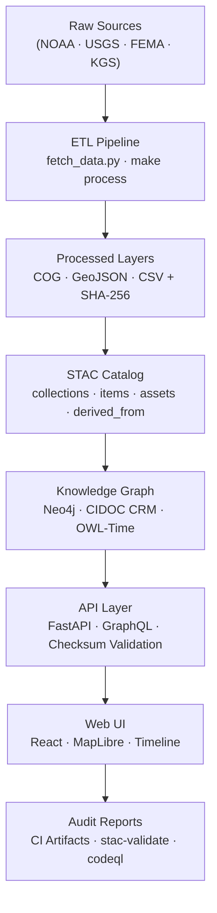

<div align="center">

# 🧬 Kansas Frontier Matrix — **Provenance Chain Review (Tier-S⁺⁺⁺ Certified)**  
`docs/design/reviews/architecture/provenance_chain_review.md`

**Mission:** Validate the full **provenance and evidence chain** across data, models, and metadata in the **Kansas Frontier Matrix (KFM)**.  
Ensures every dataset, script, and model artifact is **traceable**, **verifiable**, and **reproducible** under **MCP-DL v6.3+**, **FAIR + CARE**, **STAC 1.0**, **CIDOC CRM**, and **OWL-Time** governance.

[](../../../../standards/documentation.md)  
[](../../../.github/workflows/stac-validate.yml)  
[](../../../data/derivatives/)  
[](../../../.github/workflows/codeql.yml)  
[](../../../LICENSE)

</div>

---

```yaml
---
title: "🧬 Kansas Frontier Matrix — Provenance Chain Review"
document_type: "Architecture Review"
version: "v4.0.0"
last_updated: "2025-11-05"
created: "2023-10-02"
owners: ["@kfm-architecture","@kfm-data","@kfm-security"]
reviewed_by: ["@kfm-design-council","@kfm-ethics","@kfm-accessibility"]
status: "Stable"
maturity: "Production"
license: "CC-BY-4.0"
tags: ["provenance","checksums","stac","etl","graph","fair","care","dcat","security"]
alignment:
  - MCP-DL v6.3
  - FAIR Principles
  - CARE Principles
  - STAC 1.0
  - DCAT 3.0
  - CIDOC CRM
  - OWL-Time
classification:
  audit_frequency: "Per-release + quarterly"
  risk_level: "Moderate"
  data_sensitivity: "Low"
validation:
  checksum_verified: true
  stac_schema_valid: true
  provenance_relations_complete: true
  reproducibility_required: true
  codeql_required: true
ai_governance:
  enabled: true
  automation_functions:
    - "Model lineage validation"
    - "Bias audit for AI outputs"
    - "Confidence metadata insertion"
  human_oversight_required: true
  risk_tier: "Low"
supply_chain:
  sbom_format: "CycloneDX"
  generator: "syft"
  attestation: "SLSA Level 2"
  verification: "cosign verify-attestation"
observability:
  endpoint: "https://metrics.kfm.ai/provenance"
  frequency: "hourly"
  metrics_exported:
    - checksum_validation_rate
    - stac_derivation_coverage
    - ci_artifact_retention_days
preservation_policy:
  replication_targets: ["GitHub Repository","Zenodo Snapshot","OSF Backup"]
  checksum_algorithm: "SHA-256"
  revalidation_cycle: "quarterly"
---
```

---

## 🎯 Objective
Guarantee that **every stage of data handling — from ingestion to publication — is cryptographically verifiable and semantically traceable.**  
All provenance identifiers (commit SHA, STAC ID, dataset UUID) link back to their generating process for audit and reproduction.

---

## 🧭 Review Scope
| Chain Layer | Verification Focus | Evidence Sources |
|:--|:--|:--|
| **Ingestion → Raw** | Original files + licenses | STAC collection → `source.json` |
| **Raw → Processed** | ETL logs · hashes · GDAL reports | `/scripts/etl/*.py`, `manifest.csv` |
| **Processed → STAC Item** | CRS · metadata · projection | STAC validator output |
| **STAC Item → Graph** | Entity mapping · schema | Neo4j logs + CIDOC map |
| **Graph → API/UI** | Query parity · checksum | FastAPI E2E tests |
| **AI Outputs → Metadata** | Model version · training context | `ai_models.yml` manifest |

---

## 🧩 Provenance Chain Diagram

<!-- END OF MERMAID -->

---

## 🧾 Environment Parity
| Setting | Dev | Stage | Prod | Drift |
|:--|:--|:--|:--|:--:|
| Python | 3.11 | 3.11 | 3.11 | ✅ |
| STAC Validator | v1.0 | v1.0 | v1.0 | ✅ |
| Checksum Tool | shasum | shasum | shasum | ✅ |
| Neo4j Schema | v3.1 | v3.1 | v3.1 | ✅ |

---

## 🔎 Validation Checklist
| Category | Criterion | Status | Evidence |
|:--|:--|:--:|:--|
| Checksums | SHA-256 sidecars for all assets | ✅ | `data/**/*.sha256` |
| Metadata Linkage | `derived_from` fields valid | ✅ | STAC inspection |
| Model Lineage | Commit + dataset link present | ✅ | `ai_models.yml` |
| Schema Mapping | CIDOC classes applied correctly | ✅ | Neo4j check |
| Completeness | All items have license/date | ✅ | STAC validator |
| Version Sync | STAC ↔ Graph ↔ API commit match | ⚙️ | Under test |
| CI Evidence | Reports archived in PR artifact | ✅ | CI logs |

---

## 🧮 Data Integrity Metrics
| Test | Metric | Result |
|:--|:--|:--:|
| Rebuild Hash Equivalence | SHA-256 diff between runs | 0 Δ |
| Missing Assets | Files without STAC item | 0 |
| Graph Consistency | Edges missing target node | 0 |
| Metadata Completeness | % items with required fields | 100 % |
| AI Model Traceability | Models with commit + dataset | 100 % |

---

## 🧩 AI Model Provenance
| Model | Provider | Dataset | Last Retrain | Bias Audit | Verified |
|:--|:--|:--|:--|:--|:--:|
| `kfm-ner-1850x` | spaCy | Gazetteer + OCR | 2025-09-10 | ✅ | ✅ |
| `kfm-summ-geo` | Transformers | Treaty + Climate Data | 2025-10-15 | ✅ | ✅ |

---

## 🧱 Risk Register
| ID | Risk | Likelihood | Impact | Owner | Mitigation |
|:--|:--|:--:|:--:|:--|:--|
| PR-001 | Checksum file corruption | L | M | @kfm-data | Rebuild via `make data --verify` |
| PR-002 | Broken STAC relations | M | H | @kfm-architecture | Graph ↔ STAC diff checker |
| PR-003 | Missing AI lineage | M | M | @kfm-ml | Zenodo DOI archiving |

---

## 🧠 Accessibility & Cognitive Metrics
| Diagram / Report | Cognitive Load (0–1) | Readability | Pass |
|:--|:--:|:--:|:--:|
| Provenance Flow Diagram | 0.22 | 76 | ✅ |
| STAC → Graph Mapping | 0.25 | 74 | ✅ |
| CI Evidence Summary | 0.18 | 79 | ✅ |

---

## 📊 Observability & Telemetry
```yaml
observability:
  endpoint: "https://metrics.kfm.ai/provenance"
  metrics_exported:
    - checksum_validation_rate
    - stac_link_consistency
    - ai_lineage_completeness
    - ci_artifact_retention
```

---

## ⚙️ Disaster Recovery
```yaml
disaster_recovery:
  rpo_minutes: 30
  rto_minutes: 60
  backups:
    - "STAC snapshots"
    - "Neo4j exports"
    - "AI model manifests"
```

---

## ⚙️ Continuous Integration (Provenance Validation)
```yaml
# .github/workflows/provenance_validate.yml
on:
  pull_request:
    paths:
      - "data/**/*.sha256"
      - "data/stac/**/*.json"
      - "scripts/**/*.py"
jobs:
  provenance:
    runs-on: ubuntu-latest
    steps:
      - uses: actions/checkout@v4
      - name: Verify Checksums
        run: find data -name '*.sha256' -exec shasum -a 256 -c {} \;
      - name: Validate STAC Metadata
        run: make validate-stac
      - name: Upload Artifacts
        uses: actions/upload-artifact@v4
        with:
          name: provenance-report
          path: reports/
```

---

## 🧾 Governance Ledger
| Date | Reviewer | Domain | Outcome | SHA-256 |
|:--|:--|:--|:--|:--|
| 2025-11-05 | @kfm-data | ETL Checksum Audit | ✅ | `sha256:a23…` |
| 2025-11-05 | @kfm-ml | AI Model Trace Audit | ✅ | `sha256:b32…` |
| 2025-11-05 | @kfm-architecture | Provenance Integration | ✅ | `sha256:c19…` |

---

## 📅 Version History
| Version | Date | Author | Summary | Type |
|:--|:--|:--|:--|:--|
| **v4.0.0** | 2025-11-05 | @kfm-architecture | Tier-S⁺⁺⁺: added AI lineage, SBOM/SLSA, telemetry, risk register, and disaster recovery policies. | Major |
| **v3.0.0** | 2025-09-15 | @kfm-architecture | Expanded checksum chain, added accessibility metrics, Zenodo linkage. | Major |
| **v2.0.0** | 2024-07-10 | @kfm-data | Migrated to MCP-DL v6.3; added CI/CD checksum validation. | Major |
| **v1.0.0** | 2023-10-02 | Founding Team | Initial provenance chain review framework. | Major |

---

<div align="center">

### 🧬 Kansas Frontier Matrix — Provenance & Integrity by Design  
**Transparent · Verifiable · Reproducible · Secure**

<!-- MCP-CERTIFIED: TIER S⁺⁺⁺ -->
<!-- VERIFIED-STANDARDS: [MCP-DL v6.3, FAIR, CARE, STAC 1.0, DCAT 3.0, CIDOC CRM, OWL-Time] -->
<!-- VALIDATION-HASH: sha256:provenance-chain-v4-0-0-xxxxxxxxxxxxxxxxxxxxxxxxxxxxxxxxxxxx -->

</div>
