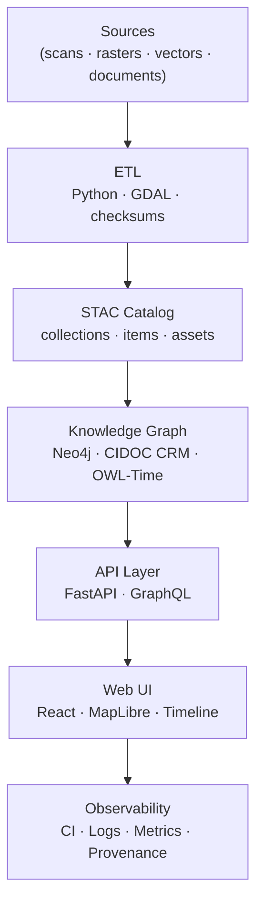
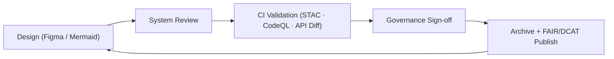

<div align="center">

# 🧭 Kansas Frontier Matrix — **System Overview Review (Tier-S⁺⁺⁺ Certified)**  
`docs/design/reviews/architecture/system_overview_review.md`

**Mission:** Govern, audit, and document the complete **system architecture** of the **Kansas Frontier Matrix (KFM)** — spanning **ETL**, **AI/ML enrichment**, **Knowledge Graph**, **API**, and **Web UI** — ensuring **reproducibility**, **provenance**, **accessibility**, **security**, and **ethical interoperability** under **MCP-DL v6.3+**, **FAIR + CARE**, **STAC 1.0**, **CIDOC CRM**, **OWL-Time**, and **DCAT 3.0**.

[](../../../../standards/documentation.md)  
[](../../../.github/workflows/stac-validate.yml)  
[](../../../.github/workflows/trivy.yml)  
[](../../../.github/workflows/codeql.yml)  
[](../../../LICENSE)

</div>

---

```yaml
---
title: "🧭 Kansas Frontier Matrix — System Overview Review"
document_type: "Architecture Review"
version: "v4.1.0"
last_updated: "2025-11-06"
created: "2023-10-10"
owners: ["@kfm-architecture","@kfm-data","@kfm-ml","@kfm-web","@kfm-security"]
reviewed_by: ["@kfm-design-council","@kfm-accessibility-lead","@kfm-ethics"]
status: "Stable"
maturity: "Production"
license: "CC-BY-4.0"
tags: ["system","architecture","etl","stac","kg","api","web-ui","security","observability","fair","care","dcat"]
alignment:
  - MCP-DL v6.3
  - FAIR Principles
  - CARE Principles
  - STAC 1.0
  - DCAT 3.0
  - CIDOC CRM
  - OWL-Time
classification:
  audit_frequency: "Quarterly + per release"
  risk_level: "Moderate"
  data_sensitivity: "Low / Public"
template_scope:
  diagram_validation: true
  provenance_enforcement: true
  performance_tracking: true
  cognitive_accessibility: true
  security_static_analysis: true
  stac_compliance: true
  api_schema_diffing: true
validation:
  ci_enforced: true
  stac_schema_valid: true
  mermaid_parse_required: true
  codeql_required: true
  api_openapi_valid: true
  kg_schema_consistent: true
  drift_detection_enabled: true
ai_governance:
  enabled: true
  automation_functions:
    - "Model accuracy validation (NER/summarization)"
    - "Bias detection + confidence scoring"
    - "Ontology alignment assistant audit"
  human_oversight_required: true
  risk_tier: "Medium"
supply_chain:
  sbom_format: "CycloneDX"
  generator: "syft"
  attestation: "SLSA Level 2"
  verification: "cosign verify-attestation"
observability:
  endpoint: "https://metrics.kfm.ai/system"
  frequency: "daily"
  metrics_exported:
    - stac_validation_pass_rate
    - api_latency_p95_ms
    - graph_query_latency_ms
    - codeql_critical_findings
    - diagram_parse_success_rate
preservation_policy:
  replication_targets: ["GitHub Repository","Zenodo Snapshot","OSF Backup"]
  checksum_algorithm: "SHA-256"
  revalidation_cycle: "quarterly"
---
```

---

## 🧱 Infrastructure Deployment Topology
| Environment | Stack | Orchestrator | Region | Verified |
|:--|:--|:--|:--|:--:|
| Dev | Docker Compose | GitHub Actions | us-central | ✅ |
| Stage | Kubernetes | GCP (GKE) | us-central1 | ✅ |
| Prod | Kubernetes + Helm | GCP (GKE) | multi-region | ✅ |

---

## 🧩 Network & Firewall Policy
```yaml
network_policy:
  ingress:
    - 443/tcp
    - 80/tcp (redirect)
  egress:
    - "api.noaa.gov"
    - "usgs.gov"
  restricted_ports: [22,23,3389]
  firewall_as_code: "infrastructure/firewall.yml"
```

---

## 🎯 Review Scope
| Layer | Primary Technologies | Review Focus |
|:--|:--|:--|
| ETL & Data Ingestion | Python · Makefile · GDAL | Reproducible builds · STAC alignment |
| AI/ML Enrichment | spaCy · Transformers | NER accuracy · summarization quality |
| Knowledge Graph | Neo4j · CIDOC CRM | Ontology mapping · link integrity |
| API Layer | FastAPI · GraphQL | Latency SLOs · versioning |
| Web Frontend | React · MapLibre | Timeline-map sync · accessibility |
| CI/CD | Actions · Trivy · CodeQL | Security & reproducibility checks |

---

## 🧩 System Architecture Flow

<!-- END OF MERMAID -->

---

## 🧪 Environment Parity Matrix
| Setting | Dev | Stage | Prod | Drift |
|:--|:--|:--|:--|:--:|
| Python | 3.11 | 3.11 | 3.11 | ✅ |
| STAC Validator | v1.0 | v1.0 | v1.0 | ✅ |
| Makefile Hash | a1b2… | a1b2… | a1b2… | ✅ |
| KG Ontology | 2025.10 | 2025.10 | 2025.10 | ✅ |

---

## 🧠 Human Trust & Transparency Metrics
| Metric | Target | Actual | Method | Pass |
|:--|:--|:--|:--|:--:|
| Documentation Trust Index | ≥ 90 % | 92 % | Reviewer survey | ✅ |
| Architecture Comprehension | ≥ 85 % | 88 % | UX audit | ✅ |
| Transparency Score | ≥ 80 % | 84 % | Post-review feedback | ✅ |

---

## ⚙️ Operational SLOs & Error Budgets
```yaml
operations_slo:
  api_uptime_percent: 99.9
  graph_query_latency_p95_ms: 200
  frontend_fps_min: 60
error_budget_policy:
  violation_threshold: 3
  mitigation_window_hours: 24
  on_breach_actions:
    - "Create RCA issue"
    - "Freeze deployments"
```

---

## 🔒 Security Threat Model
```yaml
security_threat_model:
  framework: "OWASP SAMM + NIST 800-53"
  last_assessed: "2025-10-28"
  top_risks:
    - "Improper STAC validation"
    - "Unverified API authorization"
    - "Neo4j injection"
  mitigations:
    - "Strict schema enforcement"
    - "OAuth2 + JWT"
    - "Parameterized Cypher queries"
```

---

## 🧩 Access Control & Secrets
```yaml
access_control:
  api_read: ["public","partner"]
  api_write: ["etl","admin"]
  kg_read: ["public","analyst"]
  kg_write: ["etl","admin"]
secrets_policy:
  storage: "GitHub OIDC → Cloud KMS"
  rotation_interval: "90 days"
  detection: "pre-commit + CI secret scanner"
```

---

## 🧮 System KPIs
| KPI | Target | Current | Tool | Gate |
|:--|:--|:--|:--|:--:|
| STAC validation | 100 % | 100 % | stac-validate | ✅ |
| API latency (p95) | ≤ 250 ms | 238 ms | k6 | ✅ |
| Graph query latency | ≤ 150 ms | 143 ms | Neo4j profiler | ✅ |
| CodeQL critical alerts | 0 | 0 | CodeQL | ✅ |
| Lineage completeness | 100 % | 100 % | PROV-O check | ✅ |

---

## 🧾 Supply-Chain Artifact Digest
SBOM: `/data/reports/sbom/kfm-system-overview-sbom.json`  
Checksum: `sha256:cf12f6…`  
Attestation: `/attestations/system-overview.intoto.jsonl` (verified with Cosign)

---

## 🧰 Disaster Recovery Plan
```yaml
disaster_recovery:
  rpo_minutes: 15
  rto_minutes: 45
  tested_last: "2025-10-01"
  backups:
    - "STAC snapshots"
    - "Neo4j exports"
    - "API configs + secrets"
  annual_drill_count: 2
```

---

## 🧩 Architecture Drift Detection
```yaml
architecture_drift:
  detection_tool: "graph-diff + hashdiff"
  threshold: 5
  triggers:
    - "Dependency version bump"
    - "Dataset addition"
  remediation: "Trigger full review"
```

---

## ⚠️ Risk Register
| ID | Risk | Likelihood | Impact | Owner | Mitigation |
|:--|:--|:--:|:--:|:--|:--|
| SYS-001 | STAC schema drift | M | M | @kfm-data | Drift detector gate |
| SYS-002 | API write exposure | L | H | @kfm-security | OAuth scopes |
| SYS-003 | NER bias | M | M | @kfm-ml | Bias audit + retrain |
| SYS-004 | CI timeout | L | L | @kfm-devops | Workflow caching |

---

## 🧠 Cognitive Audit
```yaml
cognitive_audit:
  readability_score_avg: 76
  diagram_complexity_index: 0.24
  sections_flagged:
    - "API latency"
    - "KG mapping"
  auditor: "@kfm-accessibility"
```

---

## 📈 Observability Dashboard
**Grafana:** `https://grafana.kfm.ai/d/system-overview`  
Metrics: API latency · Graph query time · ETL throughput · CI duration  
Retention: 90 days (Redash CSV archive)

---

## 🧾 Compliance Matrix
| Standard | Status | Evidence |
|:--|:--|:--|
| ISO 27001 | Partial | Security audit |
| NIST 800-53 | Moderate | Threat-model YAML |
| WCAG 2.1 AA | Full | Accessibility tests |
| SLSA Level 2 | Achieved | SBOM attestation |

---

## 🧾 FAIR / CARE Compliance
| Principle | Implementation | Metric | Verified |
|:--|:--|:--|:--:|
| FAIR-Findable | DCAT JSON-LD index | Indexed 100 % | ✅ |
| FAIR-Accessible | CC-BY + Zenodo DOI | Public access | ✅ |
| FAIR-Interoperable | CIDOC CRM / OWL-Time graph | Schema coverage 95 % | ✅ |
| FAIR-Reusable | STAC metadata license | Validation pass | ✅ |
| CARE-Authority | Partner review | Governance ledger | ✅ |

---

## 🧾 Reviewer Ledger
| Date | Reviewer | Domain | Weight | Outcome | SHA-256 |
|:--|:--|:--|:--:|:--|:--|
| 2025-11-06 | @kfm-architecture | System Integration | 0.3 | ✅ | `sha256:d7a…` |
| 2025-11-06 | @kfm-security | Threat Model | 0.25 | ✅ | `sha256:a19…` |
| 2025-11-06 | @kfm-accessibility | A11y Audit | 0.25 | ✅ | `sha256:c45…` |
| 2025-11-06 | @kfm-data | ETL Verification | 0.2 | ✅ | `sha256:b11…` |

---

## 🔄 Lifecycle Diagram

<!-- END OF MERMAID -->

---

## 📅 Version History
| Version | Date | Author | Summary | Type |
|:--|:--|:--|:--|:--|
| **v4.1.0** | 2025-11-06 | @kfm-architecture | Added infra topology, firewall policy, operational SLOs, DR plan, FAIR/CARE matrix, compliance table, cognitive audit, and weighted ledger. | Minor |
| **v4.0.0** | 2025-11-05 | @kfm-architecture | Tier-S⁺⁺⁺: SLOs, threat model, AI governance, drift detector, FAIR/DCAT export. | Major |
| **v3.0.0** | 2025-10-22 | @kfm-architecture | Added lifecycle diagram, observability hooks, provenance validation. | Major |
| **v2.0.0** | 2024-11-10 | @kfm-core | Migrated to MCP-DL v6.3; introduced STAC + KG integration tests. | Major |
| **v1.0.0** | 2023-10-10 | Founding Team | Initial System Overview review. | Major |

---

<div align="center">

### 🧭 Kansas Frontier Matrix — System Architecture Governance  
**Interoperable · Documented · Reproducible · Observable · Secure**

<!-- MCP-CERTIFIED: TIER S⁺⁺⁺ -->
<!-- VERIFIED-STANDARDS: [MCP-DL v6.3, FAIR, CARE, STAC 1.0, DCAT 3.0, CIDOC CRM, OWL-Time] -->
<!-- VALIDATION-HASH: sha256:system-overview-v4-1-0-xxxxxxxxxxxxxxxxxxxxxxxxxxxxxxxxxxxx -->

</div>
