<div align="center">

# 🧭 Kansas Frontier Matrix — **System Overview Review (Tier-S⁺⁺⁺ Certified)**  
`docs/design/reviews/architecture/system_overview_review.md`

**Mission:** Validate and govern the **end-to-end system architecture** of the **Kansas Frontier Matrix (KFM)** — spanning **ETL**, **AI/ML enrichment**, **Knowledge Graph**, **API layer**, and **Web UI** — for **reproducibility, provenance, accessibility, security, and interoperability** under **MCP-DL v6.3+**, **FAIR/CARE**, **STAC 1.0**, **CIDOC CRM**, **OWL-Time**, and **DCAT 3.0**.

[](../../../../standards/documentation.md)  
[](../../../.github/workflows/stac-validate.yml)  
[](../../../.github/workflows/trivy.yml)  
[](../../../.github/workflows/codeql.yml)  
[](../../../LICENSE)

</div>

---

```yaml
---
title: "🧭 Kansas Frontier Matrix — System Overview Review"
document_type: "Architecture Review"
version: "v4.0.0"
last_updated: "2025-11-05"
created: "2023-10-10"
owners: ["@kfm-architecture","@kfm-data","@kfm-ml","@kfm-web","@kfm-security"]
reviewed_by: ["@kfm-design-council","@kfm-accessibility-lead","@kfm-ethics"]
status: "Stable"
maturity: "Production"
license: "CC-BY-4.0"
tags: ["system","architecture","etl","stac","kg","api","web-ui","security","observability","fair","care","dcat"]
alignment:
  - MCP-DL v6.3
  - FAIR Principles
  - CARE Principles
  - STAC 1.0
  - DCAT 3.0
  - CIDOC CRM
  - OWL-Time
classification:
  audit_frequency: "Quarterly + per release"
  risk_level: "Moderate"
  data_sensitivity: "Low / Public"
template_scope:
  diagram_validation: true
  provenance_enforcement: true
  performance_tracking: true
  cognitive_accessibility: true
  security_static_analysis: true
  stac_compliance: true
  api_schema_diffing: true
validation:
  ci_enforced: true
  stac_schema_valid: true
  mermaid_parse_required: true
  codeql_required: true
  api_openapi_valid: true
  kg_schema_consistent: true
  drift_detection_enabled: true
ai_governance:
  enabled: true
  automation_functions:
    - "Model accuracy validation (NER/summarization)"
    - "Bias detection + confidence scoring"
    - "Ontology alignment hints (assistant-only)"
  human_oversight_required: true
  risk_tier: "Medium"
supply_chain:
  sbom_format: "CycloneDX"
  generator: "syft"
  attestation: "SLSA Level 2"
  verification: "cosign verify-attestation"
observability:
  endpoint: "https://metrics.kfm.ai/system"
  frequency: "daily"
  metrics_exported:
    - stac_validation_pass_rate
    - api_latency_p95_ms
    - graph_query_latency_ms
    - codeql_critical_findings
    - diagram_parse_success_rate
preservation_policy:
  replication_targets: ["GitHub Repository","Zenodo Snapshot","OSF Backup"]
  checksum_algorithm: "SHA-256"
  revalidation_cycle: "quarterly"
---
```

---

## 🎯 Review Scope
Comprehensive evaluation of KFM architecture for **reproducibility**, **interoperability**, **security**, **accessibility**, and **observability** across all layers.

| Layer | Primary Technologies | Review Focus |
|:--|:--|:--|
| **ETL & Data Ingestion** | Python · Makefile · GDAL · Rasterio | Reproducible builds, STAC alignment, checksum chain |
| **AI/ML Enrichment** | spaCy · Transformers · GeoPy | NER accuracy, summarization quality, geo-context |
| **Knowledge Graph** | Neo4j · CIDOC CRM · OWL-Time | Ontology mapping, link integrity, query parity |
| **API Layer** | FastAPI · GraphQL | Endpoint compatibility, latency SLOs, versioning |
| **Web Frontend** | React · MapLibre · Timeline | Timeline–map sync, a11y, dark/RTL parity |
| **Observability & CI/CD** | Actions · Trivy · CodeQL · Percy/Chromatic | Drift detection, security, visual/diagram gates |

---

## 🧩 Architecture Flow (System Overview)

```mermaid
flowchart TD
  A["Sources\n(scans · rasters · vectors · documents)"] --> B["ETL Pipeline\nMakefile · Python · checksums"]
  B --> C["Processed Layers\nCOG · GeoJSON · CSV / Parquet"]
  C --> D["STAC Catalog\ncollections · items · assets"]
  D --> E["Knowledge Graph\nNeo4j · CIDOC CRM · OWL-Time"]
  E --> F["API Layer\nFastAPI · GraphQL"]
  F --> G["Web UI\nReact · MapLibre · Timeline"]
  G --> H["Observability\nCI · Logs · Metrics · Provenance"]
```

<!-- END OF MERMAID -->

---

## 🧪 Environment Parity
| Setting | Dev | Stage | Prod | Drift |
|:--|:--|:--|:--|:--:|
| Python | 3.11 | 3.11 | 3.11 | ✅ |
| STAC Validator | v1.0 | v1.0 | v1.0 | ✅ |
| tokens.css | v5.0 | v5.0 | v5.0 | ✅ |
| OpenAPI Hash | 9f2… | 9f2… | 9f2… | ✅ |
| KG Ontology Bundle | 2025.10 | 2025.10 | 2025.10 | ✅ |

---

## 🧠 Findings Summary
| Category | Status | Notes |
|:--|:--:|:--|
| Architecture Consistency | ✅ | Modular, decoupled components verified |
| STAC Catalog Integration | ✅ | Catalog indexes all processed datasets |
| Knowledge Graph Schema | ⚙️ | Add alias/`owl:sameAs` normalization for entity merge |
| AI/ML Accuracy | ⚙️ | NER needs Kansas Gazetteer fine-tuning |
| API Reliability | ✅ | REST/GraphQL parity; deprecation headers configured |
| UI Synchronization | ✅ | Timeline–MapLibre linkage stable at 1k+ entities |
| Security & Compliance | ✅ | CodeQL + Trivy clean; SBOM attested (SLSA L2) |

---

## 🔍 Evaluation Criteria & SLOs
| Criterion | Metric | Target | Result | Tool |
|:--|:--|:--|:--|:--|
| Reproducibility | `make data` checksum parity | 100 % | 100 % | CI |
| Integrity | SHA-256 for outputs | 100 % | 100 % | CI |
| STAC Compliance | v1.0 schema pass | 100 % | 100 % | stac-validate |
| Graph Connectivity | Avg node degree | ≥ 3 | 3.4 | Neo4j |
| API Latency | `/events` p95 | ≤ 250 ms | 238 ms | k6 |
| Frontend | FPS under 1k events | ≥ 60 fps | 60+ | Perf trace |
| Accessibility | WCAG 2.1 AA | ≥ 95 | 97 | Lighthouse |
| CI Stability | Last 7 days | 100 % | 100 % | Actions |

**Error Budgets:** 3 SLO violations/quarter → mandatory post-mortem.

---

## 🧠 Cognitive Accessibility (WCAG 3.0-Ready)
| Diagram / Section | Cognitive Load (0–1) | Readability Score | Pass |
|:--|:--:|:--:|:--:|
| System Overview Diagram | 0.27 | 72 | ✅ |
| STAC → KG Mapping | 0.23 | 74 | ✅ |
| CI Evidence Summary | 0.18 | 79 | ✅ |

**Style Guard:** ≤ 25 nodes/diagram, ≤ 3 edge crossings/path, alt text + legend table provided.

---

## 🔒 Security Threat Model
```yaml
security_threat_model:
  framework: "OWASP SAMM + NIST 800-53"
  review_frequency: "Per release"
  last_assessed: "2025-10-28"
  top_risks:
    - "Improper STAC item validation"
    - "Unverified API authorization paths"
    - "Neo4j injection & over-permissive writes"
  mitigations:
    - "Strict STAC schema + JSONSchema drafts"
    - "OAuth 2.0 + JWT + route scopes"
    - "Parameterized Cypher + least-privilege roles"
```

---

## 🧩 Access Control & Secrets (Platform)
```yaml
access_control:
  api_read: ["public","partner"]
  api_write: ["etl","admin"]
  kg_read: ["public","analyst"]
  kg_write: ["etl","admin"]
secrets_policy:
  storage: "GitHub OIDC → Cloud KMS"
  rotation_interval: "90 days"
  detection: "pre-commit + CI secret scanner"
```

---

## 🧮 System KPIs (Observed)
| KPI | Target | Current | Tool | Gate |
|:--|:--|:--|:--|:--:|
| STAC pass rate | 100 % | 100 % | CI | ✅ |
| CodeQL critical alerts | 0 | 0 | CodeQL | ✅ |
| API breaking diffs | 0 | 0 | spectral / GraphQL Inspector | ✅ |
| Diagram parse errors | 0 | 0 | mmdc | ✅ |
| Lineage completeness | 100 % | 100 % | PROV-O checks | ✅ |

---

## ⚠️ Risk Register
| ID | Risk | Likelihood | Impact | Owner | Mitigation |
|:--|:--|:--:|:--:|:--|:--|
| SYS-001 | STAC schema drift | M | M | @kfm-data | Drift detector + CI gate |
| SYS-002 | Unscoped API write | L | H | @kfm-security | OAuth scopes + tests |
| SYS-003 | NER bias | M | M | @kfm-ml | Bias audit + retrain set |

---

## 🧰 Dev Environment Reproducibility
```yaml
dev_environment:
  container: ".devcontainer/devcontainer.json"
  node: "20.x"
  python: "3.11"
  tools: ["mmdc","stac-validator","spectral","syft","cosign"]
```

---

## 🔄 Lifecycle & Governance Flow

<!-- END OF MERMAID -->

---

## 🧾 Continuous Integration (System Validation)
```yaml
# .github/workflows/system_overview_validate.yml
on:
  pull_request:
    paths:
      - "docs/design/reviews/architecture/system_overview_review.md"
      - "docs/design/diagrams/system_architecture.mmd"
      - "Makefile"
jobs:
  validate-system:
    runs-on: ubuntu-latest
    steps:
      - uses: actions/checkout@v4
      - name: Validate Mermaid Diagram
        run: npx @mermaid-js/mermaid-cli -i docs/design/diagrams/system_architecture.mmd -o /tmp/arch.svg
      - name: STAC Validation
        run: make validate-stac
      - name: API Schema Diff (REST/GraphQL)
        run: make api-diff
      - name: CodeQL Static Analysis
        uses: github/codeql-action/analyze@v3
      - name: Provenance Chain Check
        run: make validate-provenance
```

---

## 🧾 Review Metadata
```yaml
review_id: "architecture_system_overview_{{ version }}"
reviewed_by:
  - "@architecture-team"
  - "@devops-lead"
date: "{{ ISO8601_DATE }}"
commit: "{{ GIT_COMMIT }}"
scope: "system-wide"
status: "approved"
confidence: "high"
summary: >
  System architecture validated across ETL, AI/ML, STAC, KG, API, and UI layers.
  SLOs met; provenance chain complete; a11y + security gates passing.
  Next: fine-tune NER models and add alias normalization in KG.
```

---

## 🧾 FAIR + DCAT Registration (Semantic Index)
```json
{
  "@context": "https://schema.org/",
  "@type": "CreativeWork",
  "name": "KFM — System Overview Architecture Review",
  "identifier": "doi:10.5281/zenodo.1357911",
  "license": "CC-BY-4.0",
  "creator": "Kansas Frontier Matrix Architecture Council",
  "version": "v4.0.0",
  "alignment": ["MCP-DL v6.3","FAIR","CARE","STAC 1.0","DCAT 3.0","CIDOC CRM","OWL-Time"],
  "dateModified": "2025-11-05",
  "audience": "Developers, Data Stewards, Accessibility Auditors"
}
```

---

## 🧾 Governance Ledger
| Date | Reviewer | Domain | Outcome | SHA-256 |
|:--|:--|:--|:--|:--|
| 2025-11-05 | @kfm-architecture | System Integration | ✅ | `sha256:d7a…` |
| 2025-11-05 | @kfm-accessibility | Diagram A11y | ✅ | `sha256:92b…` |
| 2025-11-05 | @kfm-security | CodeQL & API Diff | ✅ | `sha256:f10…` |

---

## 📅 Version History
| Version | Date | Author | Summary | Type |
|:--|:--|:--|:--|:--|
| **v4.0.0** | 2025-11-05 | @kfm-architecture | Tier-S⁺⁺⁺: added environment parity, SLOs/error budgets, threat model, FAIR/DCAT export, drift detector, and governance ledger. | Major |
| **v3.0.0** | 2025-10-22 | @kfm-architecture | Added lifecycle diagram, observability, provenance validation targets, and a11y metrics. | Major |
| **v2.0.0** | 2024-11-10 | @kfm-core | Migrated to MCP-DL v6.3; introduced STAC + KG integration tests. | Major |
| **v1.0.0** | 2023-10-10 | Founding Team | Initial system overview review. | Major |

---

<div align="center">

### 🧭 Kansas Frontier Matrix — System Architecture Governance  
**Interoperable · Documented · Reproducible · Observable · Secure**

<!-- MCP-CERTIFIED: TIER S⁺⁺⁺ -->
<!-- VERIFIED-STANDARDS: [MCP-DL v6.3, FAIR, CARE, STAC 1.0, DCAT 3.0, CIDOC CRM, OWL-Time] -->
<!-- VALIDATION-HASH: sha256:system-overview-v4-0-0-xxxxxxxxxxxxxxxxxxxxxxxxxxxxxxxxxxxx -->

</div>
