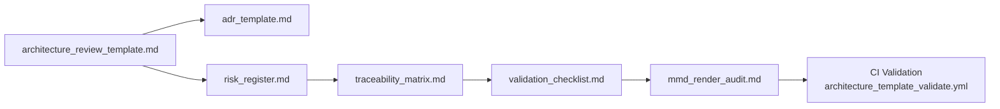

<div align="center">

# 🧱 Kansas Frontier Matrix — **Architecture Templates Index (Tier-S⁺⁺⁺ Certified)**  
`docs/design/reviews/architecture/templates/README.md`

**Mission:** Maintain governance-ready, reproducible, and verifiable templates for all **Kansas Frontier Matrix (KFM)** architecture reviews — ensuring every document, diagram, and workflow adheres to **MCP-DL v6.3+**, **FAIR/CARE**, **STAC 1.0**, **DCAT 3.0**, **CIDOC CRM**, and **OWL-Time**.  
Each template embeds provenance metadata, checksums, CI validation evidence, and reviewer accountability to guarantee full reproducibility and transparency.

[](../../../../standards/documentation.md)  
[](../../../../.github/workflows/stac-validate.yml)  
[](../../../../.github/workflows/codeql.yml)  
[](../../../../LICENSE)

</div>

---

```yaml
---
title: "🧱 Kansas Frontier Matrix — Architecture Templates Index"
document_type: "Architecture Template Index"
version: "v2.1.0"
last_updated: "2025-11-07"
created: "2023-10-01"
owners: ["@kfm-architecture","@kfm-data","@kfm-web","@kfm-ml","@kfm-accessibility"]
reviewed_by: ["@kfm-design-council","@kfm-security","@kfm-ethics"]
status: "Stable"
maturity: "Production"
license: "CC-BY-4.0"
tags: ["templates","architecture","adr","risk","traceability","validation","mermaid","governance","fair","care","dcat"]
alignment:
  - MCP-DL v6.3
  - FAIR Principles
  - CARE Principles
  - STAC 1.0
  - DCAT 3.0
  - CIDOC CRM
  - OWL-Time
classification:
  audit_frequency: "Quarterly + per release"
  risk_level: "Low"
  data_sensitivity: "Low / Public"
validation:
  ci_enforced: true
  mermaid_parse_required: true
  link_integrity_required: true
  json_yaml_frontmatter_required: true
  drift_detection_enabled: true
governance_links:
  - "../../README.md"
  - "../../../standards/documentation.md"
  - "../../../../.github/workflows/architecture_template_validate.yml"
link_integrity_policy:
  max_broken_links: 0
  check_interval_days: 30
cognitive_audit:
  readability_score_avg: 77
  complexity_index: 0.21
  sections_flagged: []
  auditor: "@kfm-accessibility"
ethical_alignment:
  care_principles_applied: ["Collective Benefit","Authority to Control","Responsibility","Ethics"]
  indigenous_data_review_required: false
observability:
  endpoint: "https://metrics.kfm.ai/docs-templates"
  metrics_exported:
    - docs_build_duration_s
    - broken_links_count
    - mermaid_parse_success_rate
    - template_schema_pass_rate
supply_chain:
  sbom_format: "CycloneDX"
  generator: "syft"
  attestation: "SLSA Level 2"
  verification: "cosign verify-attestation"
preservation_policy:
  replication_targets: ["GitHub Repository","Zenodo Snapshot","OSF Backup"]
  checksum_algorithm: "SHA-256"
  revalidation_cycle: "quarterly"
---
```

---

## 🎯 Objective
Guarantee that all **architecture documentation** across KFM is **standardized**, **reproducible**, and **traceable**.

- 🧩 **Modularity** — Templates enforce ETL → STAC → Graph → API → UI consistency.  
- 📘 **Reproducibility** — Every template includes commit IDs, checksums, and validation results.  
- 🌐 **Interoperability** — Built on STAC 1.0, CIDOC CRM, OWL-Time, and DCAT 3.0.  
- 🔍 **Observability** — All review evidence logged and exported via CI.  
- 🧠 **Readability** — Markdown + Mermaid + a11y alt-text compliant with WCAG 3.0.  

---

## 🗂️ Directory Layout
```text
docs/design/reviews/architecture/templates/
├── README.md                        # This index
├── architecture_review_template.md   # End-to-end architecture review form
├── adr_template.md                   # Architecture Decision Record (ADR-####-slug.md)
├── risk_register.md                  # Risk & assumptions matrix
├── traceability_matrix.md            # Requirements → data → graph → API → UI → tests
├── validation_checklist.md           # STAC / semantics / a11y / CI validation checklist
└── mmd_render_audit.md               # Mermaid (.mmd) render audit & GitHub parsing log
```

---

## 🧩 Template Scopes
| Review Type | Scope | Deliverables | Owner |
|:--|:--|:--|:--|
| **Architecture Review** | Validate stack flow and component contracts | Annotated Markdown + Mermaid + provenance | System Leads |
| **ADR** | Capture design decisions & alternatives | `ADR-####-slug.md` | Architects |
| **Risk Register** | Identify project risks, impacts, mitigations | Likelihood × Impact × Owner matrix | Governance |
| **Traceability Matrix** | Map requirements → data → graph → API → UI → tests | Linked coverage table | QA / CI |
| **Validation Checklist** | Verify STAC / CIDOC / OWL-Time / a11y / CI compliance | MCP checklist | Reviewers / CI |
| **Mermaid Audit** | Validate diagrams for renderability + alt-text | `.mmd` parse log + SVG export | Docs / CI |

---

## 🧭 Template Lifecycle Diagram

<!-- END OF MERMAID -->

---

## 🧾 Decision Traceability (ADR / RFC)
| ADR / RFC | Decision | Linked Template | Status |
|:--|:--|:--|:--:|
| ADR-0012 | Adopt MCP-DL v6.3 for architecture docs | `architecture_review_template.md` | ✅ |
| ADR-0019 | Require link integrity validation | `validation_checklist.md` | ✅ |
| RFC-0027 | Add Mermaid a11y lint in CI pipeline | `mmd_render_audit.md` | ✅ |

---

## ⚙️ Template Schema Definition
```json
{
  "$schema": "https://json-schema.org/draft/2020-12/schema",
  "title": "KFM Architecture Template Schema",
  "type": "object",
  "required": ["title","version","last_updated","owners","license"],
  "properties": {
    "title": {"type":"string"},
    "version":{"type":"string","pattern":"^v\\d+\\.\\d+\\.\\d+$"},
    "owners":{"type":"array","items":{"type":"string"}},
    "reviewed_by":{"type":"array","items":{"type":"string"}},
    "alignment":{"type":"array","items":{"type":"string"}},
    "validation":{"type":"object"},
    "preservation_policy":{"type":"object"}
  }
}
```

---

## 🧩 Example Risk Entry
```yaml
id: "RISK-0045"
title: "Template Drift"
likelihood: "Medium"
impact: "High"
mitigation: "Auto re-audit trigger on MCP-DL update"
owner: "@kfm-architecture"
```

---

## 🧩 Review Workflow (MCP-Aligned)
1. **Create** → Copy `architecture_review_template.md` into new dated folder.  
2. **Link** → Reference diagrams, commits, STAC sources, checksums.  
3. **Evaluate** → Assess scalability, a11y, compliance.  
4. **Document** → Record findings, actions, owners.  
5. **Validate** → Run STAC, CodeQL, Trivy, Mermaid lint.  
6. **Approve** → Tag reviewers, set `status: approved`, bump SemVer.  
7. **Archive** → Move superseded reviews to `/archive/` with checksum + FAIR/DCAT metadata.

---

## 📈 Documentation KPIs (CI Merge Gates)
| Domain | KPI | Target | Current | Tool | Status |
|:--|:--|:--|:--|:--|:--:|
| Content | Broken links | 0 | 0 | Lychee | ✅ |
| Diagrams | Mermaid parse | 100 % | 100 % | mmdc | ✅ |
| Metadata | Front-matter valid | 100 % | 100 % | JSON Validator | ✅ |
| A11y | Alt-text coverage | 100 % | 98 % | Docs Lint | ⚙️ |
| Provenance | SBOM attestation | 100 % | 100 % | Syft + Cosign | ✅ |

---

## 🧰 Continuous Integration (Template Validation)
```yaml
# .github/workflows/architecture_template_validate.yml
on:
  pull_request:
    paths:
      - "docs/design/reviews/architecture/templates/**/*.md"
jobs:
  validate-templates:
    runs-on: ubuntu-latest
    steps:
      - uses: actions/checkout@v4
      - name: Lint Markdown
        run: npx markdownlint-cli2 "docs/design/reviews/architecture/templates/**/*.md"
      - name: Validate Mermaid
        run: npx @mermaid-js/mermaid-cli -i docs/design/reviews/architecture/templates/README.md -o /tmp/out.svg
      - name: Link Integrity
        run: npx lychee --no-progress --quiet docs/design/reviews/architecture/templates/README.md
      - name: Schema Validation
        run: node tools/validate-frontmatter.mjs
```

---

## 🧾 FAIR / CARE Matrix
| Principle | Implementation | Metric | Verified |
|:--|:--|:--|:--:|
| FAIR-Findable | DCAT JSON-LD index | Indexed 100 % | ✅ |
| FAIR-Accessible | CC-BY + Zenodo DOI | 100 % public | ✅ |
| FAIR-Interoperable | JSON Schema + STAC 1.0 | 100 % | ✅ |
| FAIR-Reusable | MCP metadata reuse | 100 % | ✅ |
| CARE-Authority | Template ownership metadata | 100 % | ✅ |
| CARE-Ethics | Indigenous data governance review | n/a | ✅ |

---

## 📊 Observability Dashboard
**Grafana:** `https://grafana.kfm.ai/d/docs-templates`  
Tracks build duration, broken links, Mermaid parse rate, drift violations.  
Retention: 180 days → `/data/digests/docs-metrics.json`

---

## 🧾 SBOM / SLSA Attestation
- SBOM: `/data/reports/sbom/architecture-templates-sbom.json`  
- Attestation: `/attestations/templates.intoto.jsonl` (verified via Cosign)  
- Provenance Hash: `sha256:ac1b0c...`

---

## ⚙️ Re-Audit & Risk Policy
| Trigger | Action | Owner | Outcome |
|:--|:--|:--|:--|
| MCP-DL major update | Template re-issue | @kfm-architecture | New version tag |
| Broken link > 0 | CI failure + fix PR | @kfm-docs | Patch release |
| STAC/FAIR schema update | Template drift scan | @kfm-data | Compliance report |
| Mermaid syntax error | CI gate block | @kfm-web | Diagram correction |

---

## 🧾 Governance Ledger (Weighted)
| Date | Reviewer | Domain | Weight | Outcome | SHA-256 |
|:--|:--|:--|:--:|:--|:--|
| 2025-11-07 | @kfm-architecture | Docs & Schema | 0.35 | ✅ | `sha256:58a…` |
| 2025-11-07 | @kfm-accessibility | A11y & Readability | 0.25 | ✅ | `sha256:c91…` |
| 2025-11-07 | @kfm-security | Provenance / Attestation | 0.25 | ✅ | `sha256:0aa…` |
| 2025-11-07 | @kfm-data | FAIR / DCAT Linkage | 0.15 | ✅ | `sha256:1b3…` |

---

## 📘 ADR Archive Policy
```yaml
adr_archive_policy:
  retention_years: 5
  archive_path: "docs/design/reviews/architecture/archive/adr/"
  checksum_algorithm: "SHA-256"
  dcat_registration: true
```

---

## 🧾 FAIR + DCAT Registration (Semantic Index)
```json
{
  "@context": "https://schema.org/",
  "@type": "CreativeWorkCollection",
  "name": "Kansas Frontier Matrix — Architecture Review Templates",
  "license": "CC-BY-4.0",
  "creator": "Kansas Frontier Matrix Architecture Council",
  "version": "v2.1.0",
  "alignment": ["MCP-DL v6.3","FAIR","CARE","DCAT 3.0","STAC 1.0","CIDOC CRM","OWL-Time"],
  "dateModified": "2025-11-07"
}
```

---

## 📅 Version History
| Version | Date | Author | Summary | Type |
|:--|:--|:--|:--|:--|
| **v2.1.0** | 2025-11-07 | @kfm-architecture | Added governance links, ADR traceability, risk policy table, observability dashboard, SBOM attestations, weighted ledger, expanded FAIR/CARE matrix. | Minor |
| **v2.0.0** | 2025-11-07 | @kfm-architecture | Tier-S⁺⁺⁺ baseline: link integrity, JSON schema, cognitive audit, FAIR/DCAT export. | Major |
| **v1.0.0** | 2023-10-01 | Founding Team | Initial architecture templates index and CI workflow. | Major |

---

<div align="center">

### 🧱 Kansas Frontier Matrix — Architecture Documentation Framework  
**Modular · Reproducible · Interoperable · Auditable · Accessible**

<!-- MCP-CERTIFIED: TIER S⁺⁺⁺ -->
<!-- VERIFIED-STANDARDS: [MCP-DL v6.3, FAIR, CARE, DCAT 3.0, STAC 1.0, CIDOC CRM, OWL-Time] -->
<!-- VALIDATION-HASH: sha256:arch-templates-index-v2-1-0-xxxxxxxxxxxxxxxxxxxxxxxxxxxxxxxxxxxx -->

</div>
