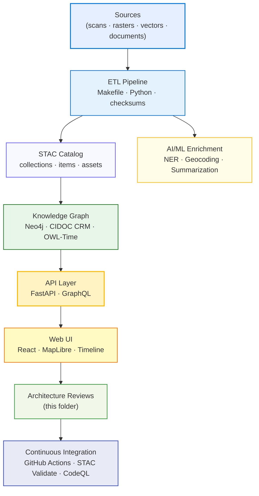

</div>

---

## 🎯 Objective

Architecture review templates guarantee the **Kansas Frontier Matrix (KFM)** maintains:

- 🧩 **Modularity** — clearly defined ETL → STAC → Knowledge Graph → API → Web UI boundaries.  
- 📘 **Reproducibility** — each review captures commits, checksums, and CI results.  
- 🌐 **Interoperability** — rooted in open standards (STAC 1.0, CIDOC CRM, OWL-Time, GeoJSON, COG).  
- 🔍 **Observability** — all validation logs and evidence stored with documentation.  
- 🖥️ **Readability** — GitHub-safe Markdown + Mermaid syntax for full repository rendering.

---

## 🗂️ Directory Layout

```text
docs/design/reviews/architecture/templates/
├── README.md                        # This index
├── architecture_review_template.md   # End-to-end architecture review form
├── adr_template.md                   # Architecture Decision Record (ADR-####-slug.md)
├── risk_register.md                  # Risk & assumptions matrix
├── traceability_matrix.md            # Requirements → data → graph → API → UI → tests
├── validation_checklist.md           # STAC / semantics / a11y / CI validation checklist
└── mmd_render_audit.md               # Mermaid (.mmd) render audit & GitHub parsing log
````

---

## 🧩 Template Scopes

| Review Type              | Scope                                                   | Deliverables                              | Owner          |
| ------------------------ | ------------------------------------------------------- | ----------------------------------------- | -------------- |
| **Architecture Review**  | Validate stack flow and component contracts (ETL → Web) | Annotated Markdown + Mermaid + provenance | System Leads   |
| **ADR**                  | Record decision context and outcomes                    | ADR-####-slug.md                          | Architects     |
| **Risk Register**        | Identify project risks, impacts, and mitigations        | Likelihood × impact × owner matrix        | All reviewers  |
| **Traceability Matrix**  | Map requirements to data → graph → API → UI → tests     | Linked coverage table                     | QA / CI        |
| **Validation Checklist** | Confirm STAC, CIDOC CRM, OWL-Time, accessibility, CI    | MCP-aligned checklist                     | Reviewers / CI |

---

## 🧠 Review Process (MCP-Aligned)

1. **Create** — copy `architecture_review_template.md` into a new dated folder:
   `docs/design/reviews/architecture/YYYY-MM-DD_<topic>/README.md`
2. **Link** — reference diagrams, commits, data sources; include checksum evidence.
3. **Evaluate** — assess clarity, scalability, and compliance with standards.
4. **Document** — record findings in tables (issues · actions · owners · due dates).
5. **Validate** — run `make validate`, CodeQL, Trivy, STAC validator; include CI links.
6. **Approve** — tag reviewers, update `status=approved`, bump semantic version.
7. **Archive** — move superseded reviews to `/archive/` for long-term provenance.

---

## 🧩 Example Architecture Flow



---

## 🧰 Templates & Tools

| File                                | Description                                                    |
| ----------------------------------- | -------------------------------------------------------------- |
| **architecture_review_template.md** | Base form for documenting architecture evaluations             |
| **adr_template.md**                 | Decision log format (`ADR-####-slug.md`)                       |
| **risk_register.md**                | Structured risk log (likelihood · impact · mitigation · owner) |
| **traceability_matrix.md**          | Maps requirement → dataset → graph → API → UI → test coverage  |
| **validation_checklist.md**         | Checklist for STAC / semantics / CI / accessibility            |
| **mmd_render_audit.md**             | Logs Mermaid rendering compliance for GitHub + MkDocs builds   |

**Tools Used:**

* 🧮 **Mermaid CLI / Live Editor** — validate syntax and visual consistency
* 📘 **STAC Validator** — schema compliance for all JSON metadata
* 🧩 **GraphQL Inspector** — detect schema drift between releases
* 🧱 **MkDocs / GitHub Pages** — validate documentation build & link integrity

---

## ⚙️ Continuous Integration (Template Validation)

```yaml
# .github/workflows/architecture_template_validate.yml
on:
  pull_request:
    paths:
      - "docs/design/reviews/architecture/templates/**/*.md"
jobs:
  validate-templates:
    runs-on: ubuntu-latest
    steps:
      - uses: actions/checkout@v4
      - name: Lint Markdown Templates
        run: npx markdownlint-cli2 "docs/design/reviews/architecture/templates/**/*.md"
      - name: Validate Mermaid Syntax
        run: npx @mermaid-js/mermaid-cli -i docs/design/reviews/architecture/templates/README.md -o /tmp/validate.svg
```

---

## 🧾 Provenance Metadata Example

```yaml
review_id: "architecture_review_{{component}}_{{version}}"
reviewed_by:
  - "@architecture-team"
date: "{{ ISO8601_DATE }}"
commit: "{{ GIT_COMMIT }}"
scope: "system | pipeline | ui | provenance"
status: "approved"
confidence: "high"
notes: "Validated using MCP templates and CI verification workflow"
```

---

## 🪪 License

All template files are released under **Creative Commons CC-BY 4.0**
© 2025 Kansas Frontier Matrix Design Collective

---

<div align="center">

### 🧱 Kansas Frontier Matrix — MCP Architecture Documentation Framework

**Modular · Reproducible · Interoperable · Auditable**

</div>
