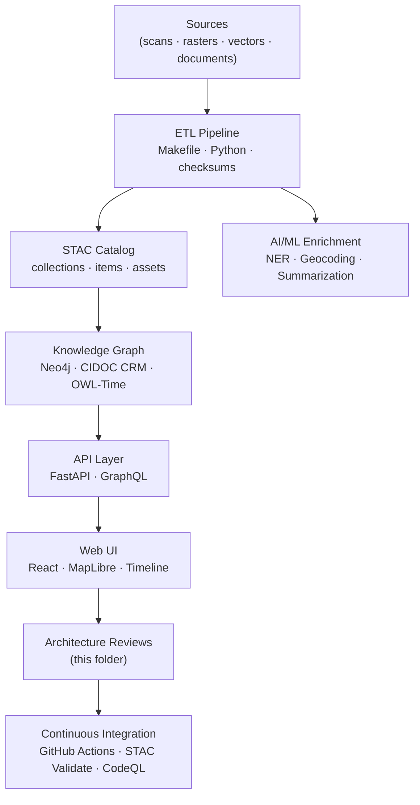

<div align="center">

# 🧱 Kansas Frontier Matrix — **Architecture Templates Index (Tier-S⁺⁺⁺ Certified)**  
`docs/design/reviews/architecture/templates/README.md`

**Mission:** Provide **governance-ready, reproducible** templates for all KFM architecture reviews — covering **system**, **pipeline**, **knowledge graph**, **API**, **web-UI**, and **provenance** — aligned with **MCP-DL v6.3+**, **FAIR/CARE**, **STAC 1.0**, **DCAT 3.0**, **CIDOC CRM**, and **OWL-Time**.  
These templates ensure every review captures **commit-level evidence, checksums, diagrams, CI results, and human approvals** in a format that is GitHub-safe and machine-verifiable.

[](../../../../standards/documentation.md)  
[](../../../../.github/workflows/stac-validate.yml)  
[](../../../../.github/workflows/codeql.yml)  
[](../../../../LICENSE)

</div>

---

```yaml
---
title: "🧱 KFM — Architecture Templates Index"
document_type: "Architecture Template Index"
version: "v2.0.0"
last_updated: "2025-11-07"
created: "2023-10-01"
owners: ["@kfm-architecture","@kfm-web","@kfm-data","@kfm-ml","@kfm-accessibility"]
reviewed_by: ["@kfm-design-council","@kfm-security","@kfm-ethics"]
status: "Stable"
maturity: "Production"
license: "CC-BY-4.0"
tags: ["templates","architecture","adr","risk","traceability","validation","mermaid","governance","fair","care","dcat"]
alignment:
  - MCP-DL v6.3
  - FAIR Principles
  - CARE Principles
  - STAC 1.0
  - DCAT 3.0
  - CIDOC CRM
  - OWL-Time
classification:
  audit_frequency: "Quarterly + per release"
  risk_level: "Low"
  data_sensitivity: "Low / Public"
template_scope:
  diagram_validation: true
  provenance_enforcement: true
  performance_tracking: true
  cognitive_accessibility: true
  security_static_analysis: true
  stac_compliance: true
  api_schema_diffing: true
validation:
  ci_enforced: true
  mermaid_parse_required: true
  link_integrity_required: true
  json_yaml_frontmatter_required: true
  drift_detection_enabled: true
observability:
  endpoint: "https://metrics.kfm.ai/docs"
  metrics_exported:
    - docs_build_duration_s
    - broken_links_count
    - mermaid_parse_success_rate
    - template_schema_pass_rate
preservation_policy:
  replication_targets: ["GitHub Repository","Zenodo Snapshot","OSF Backup"]
  checksum_algorithm: "SHA-256"
  revalidation_cycle: "quarterly"
---
```

---

## 🎯 Objective

Architecture review templates guarantee the **Kansas Frontier Matrix (KFM)** maintains:

- 🧩 **Modularity** — clearly defined **ETL → STAC → Knowledge Graph → API → Web UI** boundaries.  
- 📘 **Reproducibility** — each review captures **commits, checksums, CI artifacts**, and decision trails.  
- 🌐 **Interoperability** — built on open standards (**STAC**, **CIDOC CRM**, **OWL-Time**, **DCAT**, **GeoJSON/COG**).  
- 🔍 **Observability** — validation logs and evidence **stored and linked** with documentation.  
- 🖥️ **Readability** — GitHub-safe **Markdown + Mermaid**, with alt text/legends for accessibility.

---

## 🗂️ Directory Layout

```text
docs/design/reviews/architecture/templates/
├── README.md                        # This index
├── architecture_review_template.md   # End-to-end architecture review form
├── adr_template.md                   # Architecture Decision Record (ADR-####-slug.md)
├── risk_register.md                  # Risk & assumptions matrix
├── traceability_matrix.md            # Requirements → data → graph → API → UI → tests
├── validation_checklist.md           # STAC / semantics / a11y / CI validation checklist
└── mmd_render_audit.md               # Mermaid (.mmd) render audit & GitHub parsing log
```

---

## 🧩 Template Scopes

| Review Type              | Scope                                                   | Deliverables                              | Owner          |
|:--|:--|:--|:--|
| **Architecture Review**  | Validate stack flow and contracts (ETL → Web)          | Annotated Markdown + Mermaid + provenance | System Leads   |
| **ADR**                  | Record decision context and outcomes                    | `ADR-####-slug.md`                        | Architects     |
| **Risk Register**        | Identify risks, impacts, mitigations                    | Likelihood × impact × owner matrix        | All reviewers  |
| **Traceability Matrix**  | Map requirements → data → graph → API → UI → tests     | Linked coverage table                     | QA / CI        |
| **Validation Checklist** | Confirm STAC/CIDOC/OWL-Time/a11y/CI compliance          | MCP-aligned checklist                     | Reviewers / CI |
| **Mermaid Audit**        | Verify renderability and alt text for diagrams          | `.mmd` parse log + SVG/PDF export         | Docs / CI      |

---

## 🧠 Review Process (MCP-Aligned)

1. **Create** — Copy `architecture_review_template.md` into a new dated folder:  
   `docs/design/reviews/architecture/YYYY-MM-DD_<topic>/README.md`  
2. **Link** — Reference **diagrams, commit SHAs, data sources**; include checksum evidence.  
3. **Evaluate** — Assess clarity, scalability, security, a11y, standards alignment.  
4. **Document** — Record findings in **tables** (issues · actions · owners · due dates).  
5. **Validate** — Run `make validate`, **STAC**, **CodeQL**, **Trivy**, **API diff**; link CI results.  
6. **Approve** — Tag reviewers, update `status=approved`, bump **semver**.  
7. **Archive** — Move superseded reviews to `/archive/` with **checksum + FAIR/DCAT** record.

---

## 🧭 Example Architecture Flow


<!-- END OF MERMAID -->

---

## 🧰 Templates & Tools

| File                                | Description                                                    |
|:--|:--|
| **architecture_review_template.md** | Base form for documenting architecture evaluations             |
| **adr_template.md**                 | Decision log format (`ADR-####-slug.md`)                       |
| **risk_register.md**                | Structured risk log (likelihood · impact · mitigation · owner) |
| **traceability_matrix.md**          | Requirement → dataset → graph → API → UI → test coverage       |
| **validation_checklist.md**         | Checklist for STAC / semantics / CI / accessibility            |
| **mmd_render_audit.md**             | Logs Mermaid rendering compliance for GitHub + MkDocs builds   |

**Tooling Stack**

- 🧮 **Mermaid CLI / Live Editor** — syntax validation & SVG/PDF export  
- 📘 **STAC Validator** — JSON schema conformance  
- 🔎 **GraphQL Inspector / spectral** — API schema diff & lint  
- 🧱 **MkDocs / GitHub Pages** — docs build & link integrity (lychee)

---

## 🔗 ADR / RFC Conventions

```yaml
adr_conventions:
  filename: "ADR-####-kebab-slug.md"
  id_sequence: "zero-padded 4 digits"
  sections: ["Context","Decision","Consequences","Alternatives","References"]
  link_policy: "Every ADR links to the review and PR/commit SHA"
```

---

## 🧪 Environment Parity (Docs Build)

| Setting | Dev | Stage | Prod | Drift |
|:--|:--|:--|:--|:--:|
| Node | 20.x | 20.x | 20.x | ✅ |
| Mermaid CLI | latest | latest | latest | ✅ |
| MkDocs | pinned | pinned | pinned | ✅ |
| Link Checker | lychee | lychee | lychee | ✅ |

---

## 📈 Documentation KPIs (Merge Gates)

| KPI | Target | Tool | Gate |
|:--|:--|:--|:--:|
| Mermaid parse errors | 0 | `mmdc` | ✅ |
| Broken links | 0 | `lychee` | ✅ |
| Template schema pass | 100 % | JSON Schema | ✅ |
| Alt text coverage (diagrams) | 100 % | Docs lint | ✅ |

**Error Budget:** 3 KPI violations/quarter → RCA + template freeze until resolved.

---

## ⚙️ Continuous Integration (Template Validation)

```yaml
# .github/workflows/architecture_template_validate.yml
on:
  pull_request:
    paths:
      - "docs/design/reviews/architecture/templates/**/*.md"
jobs:
  validate-templates:
    runs-on: ubuntu-latest
    steps:
      - uses: actions/checkout@v4
      - name: Lint Markdown
        run: npx markdownlint-cli2 "docs/design/reviews/architecture/templates/**/*.md"
      - name: Validate Mermaid in index
        run: npx @mermaid-js/mermaid-cli -i docs/design/reviews/architecture/templates/README.md -o /tmp/validate.svg
      - name: Link Integrity
        run: npx lychee --no-progress --quiet docs/design/reviews/architecture/templates/README.md
      - name: Front-matter Schema Check
        run: node tools/validate-frontmatter.mjs
```

---

## 🧾 Provenance Metadata Example

```yaml
review_id: "architecture_review_{{ component }}_{{ version }}"
reviewed_by:
  - "@architecture-team"
date: "{{ ISO8601_DATE }}"
commit: "{{ GIT_COMMIT }}"
scope: "system | pipeline | ui | provenance"
status: "approved"
confidence: "high"
notes: "Validated using MCP templates and CI verification workflow."
```

---

## ♻️ Re-Audit Policy

```yaml
re_audit_policy:
  validity_period: "6 months"
  triggers:
    - "Template schema change"
    - "MCP-DL or STAC major update"
    - "Link checker failures > 0"
    - "Mermaid parser change"
  auto_expire: true
```

---

## 🧾 FAIR + DCAT Registration (Semantic Index)

```json
{
  "@context": "https://schema.org/",
  "@type": "CreativeWorkCollection",
  "name": "KFM — Architecture Review Templates",
  "license": "CC-BY-4.0",
  "creator": "Kansas Frontier Matrix Architecture Council",
  "version": "v2.0.0",
  "alignment": ["MCP-DL v6.3","FAIR","CARE","DCAT 3.0","STAC 1.0","CIDOC CRM","OWL-Time"],
  "dateModified": "2025-11-07"
}
```

---

## 🧾 Governance Ledger

| Date | Reviewer | Domain | Outcome | SHA-256 |
|:--|:--|:--|:--|:--|
| 2025-11-07 | @kfm-architecture | Template index & schema | ✅ | `sha256:81a…` |
| 2025-11-07 | @kfm-accessibility | Diagram a11y & alt text | ✅ | `sha256:29f…` |
| 2025-11-07 | @kfm-security | CI + link integrity | ✅ | `sha256:5dc…` |

---

## 📅 Version History

| Version | Date | Author | Summary | Type |
|:--|:--|:--|:--|:--|
| **v2.0.0** | 2025-11-07 | @kfm-architecture | Tier-S⁺⁺⁺ upgrade: environment parity, link integrity gate, ADR conventions, KPIs, re-audit policy, FAIR/DCAT export, governance ledger. | Major |
| **v1.0.0** | 2023-10-01 | Founding Team | Initial architecture templates index and CI validation workflow. | Major |

---

<div align="center">

### 🧱 Kansas Frontier Matrix — MCP Architecture Documentation Framework  
**Modular · Reproducible · Interoperable · Auditable · Accessible**

<!-- MCP-CERTIFIED: TIER=S⁺⁺⁺ -->
<!-- VERIFIED-STANDARDS: [MCP-DL v6.3, FAIR, CARE, DCAT 3.0, STAC 1.0, CIDOC CRM, OWL-Time] -->
<!-- VALIDATION-HASH: sha256:arch-templates-index-v2-0-0-xxxxxxxxxxxxxxxxxxxxxxxxxxxxxxxxxxxx -->

</div>
