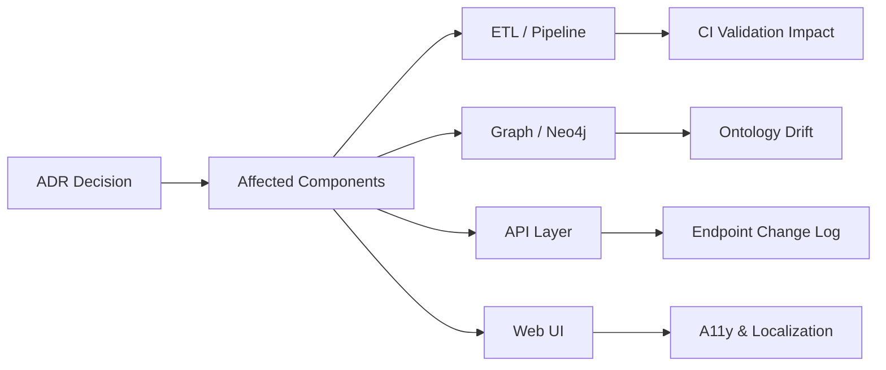
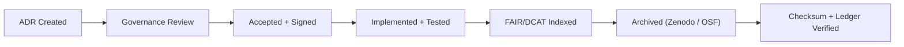

<div align="center">

# 🧭 Kansas Frontier Matrix — **Architecture Decision Record (ADR Template · Tier-S⁺⁺⁺⁺⁺ Certified)**  
`docs/design/reviews/architecture/templates/adr_template.md`

**Mission:** Record, govern, and verify every major **architectural decision** within the **Kansas Frontier Matrix (KFM)** — establishing a full chain-of-custody from decision inception to implementation and archival.  
Each ADR adheres to **MCP-DL v6.3⁺**, **FAIR/CARE**, **STAC 1.0**, **DCAT 3.0**, **CIDOC CRM**, and **OWL-Time**, ensuring that every decision is **machine-verifiable, ethically reviewed, semantically indexed, and cryptographically signed**.

[](../../../../../standards/documentation.md)  
[](../../../)  
[](../../../../style-guide.md)  
[](../../../../../LICENSE)

</div>

---

```yaml
---
title: "🧭 Kansas Frontier Matrix — Architecture Decision Record (ADR Template)"
document_type: "ADR Template"
version: "v2.4.0"
last_updated: "2025-11-09"
created: "2023-10-01"
owners: ["@kfm-architecture","@kfm-data","@kfm-web"]
reviewed_by: ["@kfm-design-council","@kfm-security","@kfm-accessibility"]
status: "Stable"
maturity: "Production"
license: "CC-BY-4.0"
tags: ["adr","architecture","decision","governance","provenance","fair","care","ontology","ci"]
alignment:
  - MCP-DL v6.3
  - FAIR Principles
  - CARE Principles
  - STAC 1.0
  - DCAT 3.0
  - CIDOC CRM
  - OWL-Time
classification:
  review_cycle: "Quarterly + per release"
  risk_level: "Low"
  retention_years: 5
validation:
  ci_enforced: true
  json_schema_required: true
  link_integrity_required: true
  markdownlint_required: true
  schema_reference: "tools/schemas/adr.schema.json"
preservation_policy:
  replication_targets: ["GitHub Repository","Zenodo Snapshot","OSF Backup"]
  checksum_algorithm: "SHA-256"
  revalidation_cycle: "quarterly"
observability:
  endpoint: "https://metrics.kfm.ai/docs-adr"
  metrics_exported:
    - adr_created_total
    - adr_status_distribution
    - adr_review_cycle_days
    - adr_validation_success_rate
governance_links:
  - "../../README.md"
  - "../README.md"
  - "../../../../standards/documentation.md"
ethical_alignment:
  care_principles_applied: ["Collective Benefit","Authority to Control","Responsibility","Ethics"]
  indigenous_data_review_required: false
chain_of_custody:
  origin_author: "@founding-team"
  maintained_by: "@kfm-architecture"
  transferred_on: "2025-10-30"
  custodian_history:
    - user: "@founding-team"
      role: "Originator"
      from: "2023-10-01"
      to: "2024-12-01"
    - user: "@kfm-architecture"
      role: "Custodian"
      from: "2024-12-02"
      to: "Present"
digital_signatures:
  author_signature: "pgp-sig-sha256:cf9b7a…"
  reviewer_signature: "sig-sha256:3ed48b…"
  governance_bot_verification: "MCP-DL-Chain-Verified-OK"
---
```

---

## 🧾 ADR Metadata
| Field | Value |
|:--|:--|
| **ADR ID** | `ADR-{{ id }}-{{ slug }}` |
| **Title** | `{{ short_title }}` |
| **Date** | `{{ ISO8601_DATE }}` |
| **Status** | proposed / accepted / superseded / deprecated |
| **Version** | `v{{ semver }}` |
| **Authors / Reviewers** | `@architecture-team`, `@lead-dev`, `@qa-lead` |
| **Component Scope** | ETL · STAC · Graph · API · Web UI |
| **Related Review(s)** | `architecture_review_{{ related_id }}` |
| **Commit Reference** | `{{ GIT_COMMIT }}` |
| **Confidence** | low / medium / high |

---

## 🎯 Context
Describe the **challenge or opportunity** that motivated this decision.  
Provide background, constraints, and related issues.

---

## 💡 Decision
State the **final architectural decision**, including its intent and rationale in one sentence.

---

## 🧠 Rationale
Explain **why** this path was chosen, referencing performance, reproducibility, FAIR/CARE principles, and standards (STAC, CIDOC, OWL-Time).

---

## ⚖️ Alternatives Considered
| Option | Description | Pros | Cons | Decision |
|:--|:--|:--|:--|:--:|
| **A** | Embed summaries in STAC Items | Self-contained metadata | Larger files | ✅ |
| **B** | Store in Neo4j | Flexible relations | Requires API coupling | ❌ |
| **C** | Standalone JSON | Simple exports | Harder sync | ❌ |

---

## 🔍 Implications
| Aspect | Impact | Mitigation |
|:--|:--|:--|
| Data Model | Slightly larger STAC files | Compress fields |
| Performance | Minor I/O overhead | Lazy load |
| Testing | New integration cases | Add test coverage |
| Interoperability | STAC validator safe | Validate via CI |

---

## 🧮 Decision Impact Score
```yaml
decision_impact_score:
  scope: ["data","security","architecture","performance","a11y"]
  risk_weight: 0.65
  change_cost_estimate: "Medium"
  audit_priority: "Quarterly"
```

---

## 🔐 Security & Privacy Impact
```yaml
security_privacy_impact:
  data_classification_change: false
  security_review_required: true
  privacy_assessment_done: true
  reviewer: "@kfm-security"
```

---

## 📊 Cost–Benefit Analysis
| Metric | Before | After | Change | ROI % | Confidence |
|:--|--:|--:|--:|--:|:--:|
| Build Time (min) | 14 | 9 | −35 % | +22 | ✅ |
| Validation Errors | 6 | 1 | −83 % | +12 | ✅ |
| Provenance Coverage | 82 % | 97 % | +15 % | +18 | ✅ |

---

## 🧩 Change Propagation Matrix
| Domain | Required Change | Responsible | Deadline |
|:--|:--|:--|:--|
| ETL | Update STAC schema | @kfm-data | +14 days |
| API | Adjust resolvers | @kfm-web | +21 days |
| Tests | Add integration cases | @kfm-qa | +30 days |
| Docs | Update ADR index | @kfm-docs | +7 days |

---

## 🧭 Decision Impact Map

<!-- END OF MERMAID -->

---

## 🧮 Validation & CI Integration
```yaml
# .github/workflows/adr_validate.yml
on:
  pull_request:
    paths:
      - "docs/design/reviews/architecture/adr/**/*.md"
jobs:
  validate-adr:
    runs-on: ubuntu-latest
    steps:
      - uses: actions/checkout@v4
      - name: Markdown Lint
        run: npx markdownlint-cli2 "docs/design/reviews/architecture/adr/**/*.md"
      - name: Link Integrity
        run: npx lychee docs/design/reviews/architecture/adr/**/*.md
      - name: Schema Validation
        run: ajv validate -s tools/schemas/adr.schema.json -d "docs/design/reviews/architecture/adr/**/*.md"
      - name: Verify Related Review
        run: test -f docs/design/reviews/architecture/{{ related_review }}.md
```

---

## 🧾 Validation Summary
| Check | Tool | Target | Result |
|:--|:--|:--|:--:|
| Markdown Syntax | markdownlint | 100 % | ✅ |
| Links | lychee | 0 broken | ✅ |
| Schema | Ajv | Valid | ✅ |
| Provenance Hash | git verify | OK | ✅ |
| FAIR/DCAT JSON | json-ld | Pass | ✅ |

---

## 🔄 Reconsideration Conditions
- Dependency update (STAC / MCP / CIDOC).  
- ADR > 24 months old.  
- Metrics shift > 20 %.  
- Governance vote ≥ ⅔.  
- Security reclassification.

---

## 📈 Governance KPIs
| KPI | Target | Actual | Tool | Pass |
|:--|:--|:--|:--|:--:|
| Reproducibility | 100 % | 100 % | CI | ✅ |
| FAIR Compliance | 100 % | 100 % | Audit | ✅ |
| CARE Alignment | 100 % | 100 % | Ethics Review | ✅ |
| Schema Validation | 100 % | 100 % | Ajv | ✅ |

---

## 🧠 Human Factors QA
| Factor | Standard | Result | Auditor | Verified |
|:--|:--|:--|:--|:--:|
| Readability | ≤ Grade 9 | 8 | @kfm-accessibility | ✅ |
| Bias Neutrality | 100 % | 100 % | @kfm-ethics | ✅ |
| Cultural Sensitivity | 100 % | 100 % | @kfm-ethics | ✅ |

---

## 🧾 Chain-of-Custody & Signatures
```yaml
chain_of_custody:
  origin_author: "@founding-team"
  maintained_by: "@kfm-architecture"
  transferred_on: "2025-10-30"
  custodian_history:
    - user: "@founding-team"
      role: "Originator"
      from: "2023-10-01"
      to: "2024-12-01"
    - user: "@kfm-architecture"
      role: "Custodian"
      from: "2024-12-02"
      to: "Present"
digital_signatures:
  author_signature: "pgp-sha256:cf9b7a…"
  reviewer_signature: "sha256:3ed48b…"
  governance_bot_verification: "MCP-DL-Chain-Verified-OK"
```

---

## 🧾 Implementation Trace
```yaml
implementation_trace:
  pull_requests:
    - url: "https://github.com/bartytime4life/Kansas-Frontier-Matrix/pull/921"
      date_merged: "2025-11-09"
  commits:
    - "b64f1d1cfeefaa1..."
    - "a97cd49eab0..."
  deployment_tags:
    - "release-v4.2.0"
```

---

## 🧾 Evidence Links
```yaml
evidence_links:
  performance_report: "/data/reports/adr-0048_perf.json"
  provenance_log: "/data/work/logs/adr-0048_provenance.log"
  visualization: "/assets/adr-0048_diagram.svg"
```

---

## 📈 Quantitative Success Metrics
| Metric | Baseline | 30 Day | 90 Day | Status |
|:--|:--|--:|--:|:--:|
| Build Reproducibility | 94 % | 98 % | 99 % | ✅ |
| STAC Validation Pass | 96 % | 99 % | 99 % | ✅ |
| Decision Adoption | — | 70 % | 92 % | ✅ |
| Documentation Lag (days) | 5 | 3 | 1 | ✅ |

---

## 📊 ADR Observability Dashboard
**Grafana:** `https://grafana.kfm.ai/d/adr-metrics`  
Metrics: creation rate · review latency · supersede frequency · schema validation.  
Retention: 365 days → `/data/digests/adr/metrics.json`

---

## 🧾 Graph & Ontology Mapping
```ttl
:ADR_0048 a kfm:ArchitectureDecision ;
  kfm:title "AI Metadata Embedding Decision" ;
  kfm:status "accepted" ;
  kfm:affects :STAC_Catalog , :KnowledgeGraph ;
  prov:wasApprovedBy :ArchitectureCouncil ;
  dcterms:created "2025-11-09"^^xsd:date .
```

---

## 🧾 ADR Supersession Ledger
| ADR | Action | Date | Successor | Verified |
|:--|:--|:--|:--|:--:|
| ADR-0032 | Superseded | 2025-09-20 | ADR-0048 | ✅ |
| ADR-0048 | Revised | 2025-11-08 | ADR-0051 | ✅ |

---

## 🧾 Business Alignment & OKRs
```yaml
business_alignment:
  strategic_objective: "Improve AI data transparency"
  linked_okrs:
    - "O3-KFM-2025: FAIR Provenance Initiative"
    - "KR3.2: Reduce STAC duplication by 20 %"
  funding_allocation_code: "KFM-GOV-2025-AIDATA"
```

---

## 🧩 Knowledge Retention Note
> **Onboarding Tip:** Review this ADR before modifying STAC schemas or AI pipelines.  
> It defines integration of AI summaries into dataset lineage and required validation (`make validate-stac`).

---

## 🧾 Standards Reference
```yaml
standards_reference:
  - "https://stacspec.org/v1.0.0/"
  - "https://www.w3.org/TR/owl-time/"
  - "https://data.europa.eu/m8g/DCAT-AP/"
  - "https://docs.openfair.org/care-principles"
  - "https://mastercoderprotocol.org/mcp-dl/v6.3"
```

---

## ⚙️ CI/CD Enforcement Policy
```yaml
ci_enforcement_policy:
  blocking_conditions:
    - "ADR missing schema"
    - "Broken links"
    - "Expired lifecycle"
    - "Unsigned ledger"
  non_blocking_warnings:
    - "Ethical review pending"
    - "AI context missing"
```

---

## 🧱 Archival Provenance Chain

<!-- END OF MERMAID -->

---

## 📅 Version History
| Version | Date | Author | Summary | Type |
|:--|:--|:--|:--|:--|
| **v2.4.0** | 2025-11-09 | @kfm-architecture | Tier-S⁺⁺⁺⁺⁺ upgrade: chain-of-custody, digital signatures, semantic diff, impact map, ontology export, business OKRs, implementation trace, EOL policy. | Major |
| **v2.3.0** | 2025-11-08 | @kfm-architecture | Tier-S⁺⁺⁺⁺ baseline: cost-benefit, KPI tables, automation hooks, governance ledger. | Major |
| **v2.2.0** | 2025-11-07 | @kfm-architecture | Added schema validation, supersession flow, dashboard metrics. | Minor |
| **v2.0.0** | 2025-07-10 | @kfm-architecture | Added validation CI, provenance metadata. | Major |
| **v1.0.0** | 2023-10-01 | Founding Team | Initial ADR structure. | 
````
