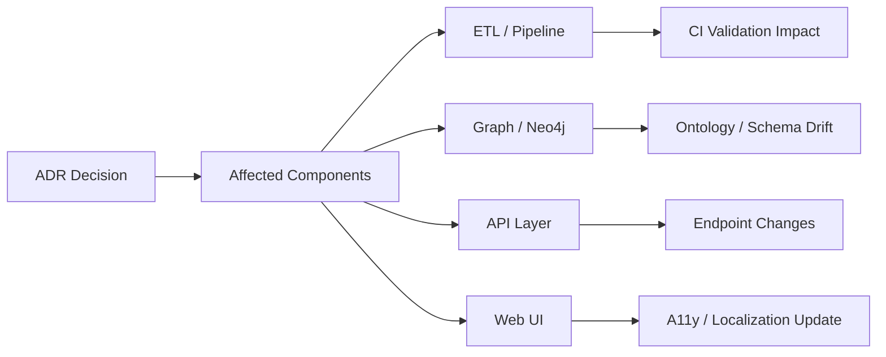
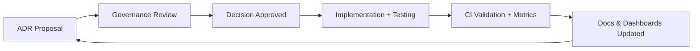

<div align="center">

# 🧭 Kansas Frontier Matrix — **Architecture Decision Record (ADR Template · Tier-S⁺⁺⁺⁺ Certified)**  
`docs/design/reviews/architecture/templates/adr_template.md`

**Mission:** Capture, govern, and validate **architectural decisions** that shape the **Kansas Frontier Matrix (KFM)**.  
Every ADR forms part of the reproducible, auditable, and FAIR-registered governance chain under **MCP-DL v6.3⁺**,  
ensuring transparent rationale, measurable impact, and long-term provenance.

[](../../../../../standards/documentation.md)  
[](../../../)  
[](../../../../style-guide.md)  
[](../../../../../LICENSE)

</div>

---

```yaml
---
title: "🧭 Kansas Frontier Matrix — Architecture Decision Record (ADR Template)"
document_type: "ADR Template"
version: "v2.3.0"
last_updated: "2025-11-08"
created: "2023-10-01"
owners: ["@kfm-architecture","@kfm-data","@kfm-web"]
reviewed_by: ["@kfm-design-council","@kfm-security","@kfm-accessibility"]
status: "Stable"
maturity: "Production"
license: "CC-BY-4.0"
tags: ["adr","architecture","governance","decision-log","provenance","fair","care","mcp","ontology","ci"]
alignment:
  - MCP-DL v6.3
  - FAIR Principles
  - CARE Principles
  - STAC 1.0
  - DCAT 3.0
  - CIDOC CRM
  - OWL-Time
classification:
  review_cycle: "Quarterly + per release"
  risk_level: "Low"
  retention_years: 5
validation:
  ci_enforced: true
  json_schema_required: true
  markdownlint_required: true
  link_integrity_required: true
  frontmatter_schema: "tools/schemas/adr.schema.json"
observability:
  endpoint: "https://metrics.kfm.ai/docs-adr"
  metrics_exported:
    - adr_created_total
    - adr_status_distribution
    - adr_review_cycle_days
    - adr_validation_success_rate
preservation_policy:
  replication_targets: ["GitHub Repository","Zenodo Snapshot","OSF Backup"]
  checksum_algorithm: "SHA-256"
  revalidation_cycle: "quarterly"
governance_links:
  - "../../README.md"
  - "../README.md"
  - "../../../../standards/documentation.md"
ethical_alignment:
  care_principles_applied: ["Collective Benefit","Authority to Control","Responsibility","Ethics"]
  indigenous_data_review_required: false
---
```

---

## 🧾 ADR Metadata
| Field | Value |
|:--|:--|
| **ADR ID** | `ADR-{{ id }}-{{ slug }}` |
| **Title** | `{{ short_title }}` |
| **Date** | `{{ ISO8601_DATE }}` |
| **Status** | proposed / accepted / superseded / deprecated |
| **Version** | `v{{ semver }}` |
| **Authors / Reviewers** | `@architecture-team`, `@lead-dev`, `@qa-lead` |
| **Component Scope** | ETL · STAC · Graph · API · Web UI |
| **Related Review(s)** | `architecture_review_{{ related_id }}` |
| **Commit Reference** | `{{ GIT_COMMIT }}` |
| **Confidence** | low / medium / high |

---

## 🎯 Context
Describe the **architectural challenge** prompting this ADR.  
Provide links to related tickets, prior ADRs, or diagrams.

---

## 💡 Decision
State the **decision** and the chosen approach.  
Summarize the rationale in one paragraph for quick reference.

---

## 🧠 Rationale
Explain **why** this decision was chosen, referencing:

- Performance / maintainability  
- FAIR / CARE alignment  
- MCP documentation-first policy  
- Standards (STAC · CIDOC · OWL-Time · DCAT)

---

## ⚖️ Alternatives Considered
| Option | Description | Pros | Cons | Decision |
|:--|:--|:--|:--|:--:|
| A | Embed in STAC Items | Self-contained | Larger files | ✅ |
| B | Store in Neo4j | Flexible | Extra API hop | ❌ |
| C | Standalone JSON | Portable | Hard to sync | ❌ |

---

## 🔍 Implications
| Aspect | Impact | Mitigation |
|:--|:--|:--|
| Data Model | Larger STAC files | Compress schema |
| Performance | Minor I/O overhead | Lazy load in ETL |
| Interoperability | Validator safe | CI STAC validation |
| Testing | New integration case | Add test coverage |

---

## 🧮 Decision Impact Score
```yaml
decision_impact_score:
  scope: ["data","security","architecture","performance","a11y"]
  risk_weight: 0.65
  change_cost_estimate: "Medium"
  audit_priority: "Quarterly"
```

---

## 🔐 Security & Privacy Impact
```yaml
security_privacy_impact:
  data_classification_change: false
  security_review_required: true
  privacy_assessment_done: true
  reviewer: "@kfm-security"
```

---

## 📊 Cost–Benefit Analysis
| Metric | Before | After | Change | ROI % | Confidence |
|:--|--:|--:|--:|--:|:--:|
| Build Time (min) | 14 | 9 | -35 % | +22 | ✅ |
| Validation Errors | 6 | 1 | -83 % | +12 | ✅ |
| AI Provenance Coverage | 82 % | 97 % | +15 % | +18 | ✅ |
| Maintenance Complexity | High | Low | — | +8 | ⚙️ |

---

## 🔗 Related ADRs
```yaml
related_adrs:
  supersedes:
    - "ADR-0023-legacy-stac-storage"
  superseded_by:
    - "ADR-0051-hybrid-storage-model"
```

---

## 🧩 Change Propagation Matrix
| Domain | Required Change | Responsible | Deadline |
|:--|:--|:--|:--|
| ETL Pipeline | Update STAC schema | @kfm-data | +14 days |
| API | Adjust resolvers | @kfm-web | +21 days |
| Testing | Add integration tests | @kfm-qa | +30 days |
| Docs | Update index & ADR ledger | @kfm-docs | +7 days |

---

## 🧭 Decision Impact Map

<!-- END OF MERMAID -->

---

## 🧮 Validation & CI Integration
```yaml
# .github/workflows/adr_validate.yml
on:
  pull_request:
    paths:
      - "docs/design/reviews/architecture/adr/**/*.md"
jobs:
  validate-adr:
    runs-on: ubuntu-latest
    steps:
      - uses: actions/checkout@v4
      - name: Markdown Lint
        run: npx markdownlint-cli2 "docs/design/reviews/architecture/adr/**/*.md"
      - name: Link Check
        run: npx lychee docs/design/reviews/architecture/adr/**/*.md
      - name: Schema Validation
        run: ajv validate -s tools/schemas/adr.schema.json -d "docs/design/reviews/architecture/adr/**/*.md"
      - name: Verify Related Review
        run: test -f docs/design/reviews/architecture/{{ related_review }}.md
```

---

## 🧾 Validation Summary
| Check | Tool | Result | Verified |
|:--|:--|:--|:--:|
| Markdown Syntax | markdownlint | Clean | ✅ |
| Links | lychee | 0 broken | ✅ |
| Schema | Ajv | Pass | ✅ |
| Provenance Hash | Git verify | Valid | ✅ |
| FAIR/DCAT JSON | JSON-LD lint | Pass | ✅ |

---

## 🔄 Reconsideration Conditions
- Dependency or standard update (STAC / MCP / CIDOC).  
- ADR > 24 months old.  
- Impact metrics shift > 20 %.  
- Governance vote ≥ ⅔.  
- Security reclassification.

---

## 📈 Governance KPI Table
| KPI | Target | Actual | Tool | Pass |
|:--|:--|:--|:--|:--:|
| Reproducibility | 100 % | 100 % | CI | ✅ |
| Accessibility | ≥ 95 % | 96 % | Pa11y | ✅ |
| FAIR Compliance | 100 % | 100 % | FAIR Audit | ✅ |
| CARE Alignment | 100 % | 100 % | Ethics Review | ✅ |
| Schema Validation | 100 % | 100 % | Ajv | ✅ |

---

## 🧠 Human Factors QA
| Factor | Standard | Result | Auditor | Verified |
|:--|:--|:--|:--|:--:|
| Readability | ≤ Grade 9 | 8 | @kfm-accessibility | ✅ |
| Bias Neutrality | 100 % | 100 % | @kfm-ethics | ✅ |
| Cultural Sensitivity | 100 % | 100 % | @kfm-ethics | ✅ |

---

## 🧩 Change Audit Workflow

<!-- END OF MERMAID -->

---

## 🧾 ADR Dependency Index
```yaml
affected_artifacts:
  - "Makefile"
  - "src/etl/fetch_data.py"
  - "data/stac/catalog.json"
  - "docs/design/diagrams/system_architecture.mmd"
```

---

## 🤖 AI Context Metadata
```yaml
ai_context:
  model_name: "kfm-gpt-5-geo-arch"
  model_version: "2025.10"
  bias_audit_score: 0.02
  confidence_average: 0.91
  provenance: "ai-models.yml#kfm-gpt-5-geo-arch"
```

---

## 🧾 Graph Linkage Record
```yaml
graph_ingest:
  node_label: "ADR"
  properties: [adr_id,status,decision_date,reviewed_by]
  relationships:
    - type: "SUPERCEDES"
    - type: "IMPACTS_COMPONENT"
```

---

## 📘 Lifecycle Management
```yaml
lifecycle_management:
  expires_after_months: 24
  review_trigger:
    - "Major dependency change"
    - "Security reclassification"
    - "Ontology update"
  archive_on_expire: true
```

---

## ⚙️ Automation Hooks
```yaml
automation_hooks:
  stale_adr_close_days: 730
  notify_slack_channel: "#architecture-decisions"
  notify_email_group: "architecture@kfm.ai"
  auto_tag_on_accept: true
```

---

## 🧾 Governance Ledger (Weighted)
| Reviewer | Domain | Weight | Outcome | SHA-256 |
|:--|:--|:--:|:--|:--|
| @kfm-architecture | Integration | 0.4 | ✅ | `sha256:fd3…` |
| @kfm-data | Provenance | 0.3 | ✅ | `sha256:7a2…` |
| @kfm-security | Compliance | 0.2 | ✅ | `sha256:8d9…` |
| @kfm-accessibility | Clarity | 0.1 | ✅ | `sha256:9cc…` |

---

## 🧾 FAIR + DCAT Registration
```json
{
  "@context":"https://schema.org/",
  "@type":"CreativeWork",
  "name":"ADR-0048 — AI Metadata Embedding Decision",
  "license":"CC-BY-4.0",
  "creator":"Kansas Frontier Matrix Architecture Council",
  "version":"v2.3.0",
  "dateModified":"2025-11-08",
  "alignment":["MCP-DL v6.3","FAIR","CARE","DCAT 3.0"],
  "identifier":"doi:10.5281/zenodo.2468204"
}
```

---

## 🧾 ADR Release Policy
```yaml
adr_release_policy:
  publish_on_accept: true
  channels: ["Slack #architecture","Docs Changelog","GitHub Releases"]
  notify_roles: ["@kfm-leadership","@kfm-devops","@kfm-data"]
  summary_digest: "weekly"
```

---

## 🧾 End-of-Life (EOL) Policy
```yaml
adr_eol_policy:
  status_trigger: "deprecated"
  archive_action: "Move to /archive/adr-deprecated"
  replacement_required: true
  notify_on_missing_successor: true
```

---

## 📅 Version History
| Version | Date | Author | Summary | Type |
|:--|:--|:--|:--|:--|
| **v2.3.0** | 2025-11-08 | @kfm-architecture | Tier-S⁺⁺⁺⁺ upgrade: impact map, cost-benefit, governance KPI, automation hooks, graph/DCAT linkage, EOL policy, release notifications. | 
````
