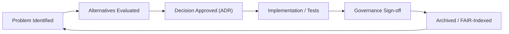
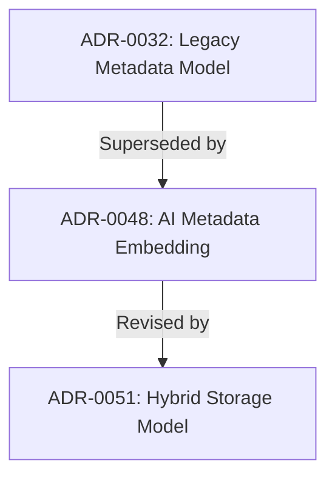

<div align="center">

# 🧭 Kansas Frontier Matrix — **Architecture Decision Record (ADR Template · Tier-S⁺⁺⁺ Certified)**  
`docs/design/reviews/architecture/templates/adr_template.md`

**Mission:** Record and preserve key **architectural decisions** made throughout the **Kansas Frontier Matrix (KFM)** system lifecycle — ensuring every choice is **traceable**, **rationalized**, and **governed** according to **MCP-DL v6.3+**, **FAIR/CARE**, and **ISO/NIST-aligned documentation practices**.  
Each ADR is a reproducible governance artifact containing provenance metadata, references to related reviews, and CI-verified validation evidence.

[](../../../../../standards/documentation.md)  
[](../../../../style-guide.md)  
[](../../../)  
[](../../../../../LICENSE)

</div>

---

```yaml
---
title: "🧭 Kansas Frontier Matrix — Architecture Decision Record (ADR Template)"
document_type: "ADR Template"
version: "v2.2.0"
last_updated: "2025-11-07"
created: "2023-10-01"
owners: ["@kfm-architecture","@kfm-data","@kfm-web"]
reviewed_by: ["@kfm-design-council","@kfm-security","@kfm-accessibility"]
status: "Stable"
maturity: "Production"
license: "CC-BY-4.0"
tags: ["adr","architecture","governance","decision-log","provenance","fair","care","mcp"]
alignment:
  - MCP-DL v6.3
  - FAIR Principles
  - CARE Principles
  - STAC 1.0
  - DCAT 3.0
  - CIDOC CRM
  - OWL-Time
classification:
  review_cycle: "Per release + quarterly"
  risk_level: "Low"
  retention_years: 5
validation:
  ci_enforced: true
  markdownlint_required: true
  json_schema_required: true
  link_integrity_required: true
  json_yaml_frontmatter_required: true
  schema_reference: "tools/schemas/adr.schema.json"
observability:
  endpoint: "https://metrics.kfm.ai/docs-adr"
  metrics_exported:
    - adr_created_total
    - adr_status_distribution
    - adr_review_cycle_days
    - adr_schema_validation_pass_rate
preservation_policy:
  replication_targets: ["GitHub Repository","Zenodo Snapshot","OSF Backup"]
  checksum_algorithm: "SHA-256"
  revalidation_cycle: "quarterly"
governance_links:
  - "../../README.md"
  - "../README.md"
  - "../../../../standards/documentation.md"
ethical_alignment:
  care_principles_applied: ["Collective Benefit","Authority to Control","Responsibility","Ethics"]
  indigenous_data_review_required: false
---
```

---

## 🧾 ADR Metadata

| Field | Value |
|:--|:--|
| **ADR ID** | `ADR-{{ id }}-{{ slug }}` |
| **Title** | `{{ short_title }}` |
| **Date** | `{{ ISO8601_DATE }}` |
| **Status** | proposed / accepted / superseded / deprecated |
| **Version** | `v{{ semver }}` |
| **Authors / Reviewers** | `@architecture-team`, `@lead-dev`, `@qa-lead` |
| **Component Scope** | ETL · STAC · Graph · API · Web UI |
| **Related Review(s)** | `architecture_review_{{ related_id }}` |
| **Commit Reference** | `{{ GIT_COMMIT }}` |
| **Confidence** | low / medium / high |

---

## 🎯 Context
Describe the **architectural challenge** or decision point prompting this ADR.  
Include context, constraints, and relevant background.

> *Example:* The team must decide whether AI-enriched metadata should reside within the STAC catalog or as a linked external dataset.

---

## 💡 Decision
State the **decision made** and why it was chosen.

> *Example:* Embed AI/ML summaries inside STAC Items as an optional extension to enhance provenance and simplify audit trails.

---

## 🧠 Rationale
Explain **why** this option was chosen over others, referencing:
- Performance & maintainability  
- FAIR / CARE principles  
- MCP-DL documentation-first governance  
- Open-standards compliance (STAC, CIDOC, OWL-Time)  
- Traceability within knowledge graph

> *Example:* Embedding summaries directly in STAC ensures self-contained metadata while maintaining compatibility with validators.

---

## ⚖️ Alternatives Considered
| Option | Description | Pros | Cons | Decision |
|:--|:--|:--|:--|:--:|
| **A:** Embed summaries in STAC Items | Integrate data inline | Fewer moving parts | Larger files | ✅ |
| **B:** Store in Neo4j Graph | Flexible linkage model | Query optimization | API dependency | ❌ |
| **C:** Maintain external JSON | Portable format | Simpler export | Sync drift risk | ❌ |

---

## 🔍 Implications
| Aspect | Impact | Mitigation |
|:--|:--|:--|
| Data Model | Larger STAC Items | Optimize compression & JSON schema |
| Performance | Minimal I/O overhead | Lazy load in ETL |
| Interoperability | Retains STAC compliance | CI validation |
| Testing | New integration cases | Extend `test_stac_extensions.py` |

---

## 🧮 Decision Impact Score
```yaml
decision_impact_score:
  scope: ["data","security","architecture","performance","a11y"]
  risk_weight: 0.65
  change_cost_estimate: "Medium"
  audit_priority: "Quarterly"
```

---

## 🔐 Security & Privacy Impact
```yaml
security_privacy_impact:
  data_classification_change: false
  security_review_required: true
  privacy_assessment_done: true
  reviewer: "@kfm-security"
```

---

## 🧾 Related ADRs
```yaml
related_adrs:
  supersedes:
    - "ADR-0023-legacy-stac-storage"
  superseded_by:
    - "ADR-0051-hybrid-storage-model"
```

---

## 🧭 Decision Lifecycle Diagram

<!-- END OF MERMAID -->

---

## 🧮 Validation & CI Integration
```yaml
# .github/workflows/adr_validate.yml
on:
  pull_request:
    paths:
      - "docs/design/reviews/architecture/adr/**/*.md"
jobs:
  validate-adr:
    runs-on: ubuntu-latest
    steps:
      - uses: actions/checkout@v4
      - name: Markdown Lint
        run: npx markdownlint-cli2 "docs/design/reviews/architecture/adr/**/*.md"
      - name: Validate Links
        run: npx lychee docs/design/reviews/architecture/adr/**/*.md
      - name: ADR Schema Validation
        run: ajv validate -s tools/schemas/adr.schema.json -d "docs/design/reviews/architecture/adr/**/*.md"
      - name: Verify Related Review Exists
        run: test -f docs/design/reviews/architecture/{{ related_review }}.md
```

---

## 🧩 Validation Summary Table
| Validation | Tool | Target | Status |
|:--|:--|:--|:--:|
| Markdown Lint | markdownlint | 100 % | ✅ |
| Link Check | lychee | 0 broken | ✅ |
| Schema Validation | ajv | 100 % | ✅ |
| Provenance Hash | git verify | Valid | ✅ |
| FAIR/DCAT Export | JSON-LD check | 100 % | ✅ |

---

## 🔄 Reconsideration Conditions
- Dependency / schema updates (STAC, MCP-DL, CIDOC)  
- ADR age > 24 months  
- Architecture impact change ≥ 20 %  
- Governance vote ≥ ⅔ or new compliance requirement  

---

## 📊 ADR Observability Dashboard
**Grafana:** `https://grafana.kfm.ai/d/adr-metrics`  
Tracks: ADR creation rate · review latency · supersede frequency · schema validation.  
Retention: 365 days → `/data/digests/adr/adr_metrics.json`

---

## 🧱 Supersession Flow Diagram

<!-- END OF MERMAID -->

---

## 🧾 Risk Example
```yaml
risk_entry:
  id: "ADR-RISK-021"
  title: "Decision Drift"
  likelihood: "Medium"
  impact: "Moderate"
  mitigation: "Re-audit ADR on dependency or schema change"
  owner: "@kfm-architecture"
```

---

## 🧾 Provenance Metadata
```yaml
adr_id: "ADR-{{ id }}-{{ slug }}"
status: "accepted"
decision_date: "{{ ISO8601_DATE }}"
reviewed_by:
  - "@architecture-team"
  - "@data-governance"
  - "@frontend-lead"
commit: "{{ GIT_COMMIT }}"
scope: "ETL | STAC | Graph | API | UI"
related_reviews:
  - "architecture_pipeline_overview_v1.0"
  - "architecture_system_overview_v2.1"
confidence: "high"
summary: >
  Decision approved: AI summaries embedded in STAC Items for provenance and traceability alignment.
```

---

## 🧾 Governance Ledger (Weighted)
| Reviewer | Domain | Weight | Outcome | SHA-256 |
|:--|:--|:--:|:--|:--|
| @kfm-architecture | Architecture Integration | 0.4 | ✅ | `sha256:fd3…` |
| @kfm-data | Provenance & FAIR | 0.3 | ✅ | `sha256:7a2…` |
| @kfm-security | Compliance Review | 0.2 | ✅ | `sha256:8d9…` |
| @kfm-accessibility | Clarity Review | 0.1 | ✅ | `sha256:9cc…` |

---

## 🧾 FAIR + DCAT Registration
```json
{
  "@context": "https://schema.org/",
  "@type": "CreativeWork",
  "name": "ADR-0048 — AI Metadata Embedding Decision",
  "license": "CC-BY-4.0",
  "creator": "Kansas Frontier Matrix Architecture Council",
  "version": "v2.2.0",
  "dateModified": "2025-11-07",
  "alignment": ["MCP-DL v6.3","FAIR","CARE","DCAT 3.0"],
  "identifier": "doi:10.5281/zenodo.2468204"
}
```

---

## 📘 ADR Archive Policy
```yaml
adr_archive_policy:
  retention_years: 5
  archive_path: "docs/design/reviews/architecture/archive/adr/"
  checksum_algorithm: "SHA-256"
  dcat_registration: true
  index_update: "auto via CI"
```

---

## 📅 Version History
| Version | Date | Author | Summary | Type |
|:--|:--|:--|:--|:--|
| **v2.2.0** | 2025-11-07 | @kfm-architecture | Added schema validation, impact scoring, supersession diagram, observability dashboard, reconsideration policy, FAIR/DCAT registry. | Minor |
| **v2.1.0** | 2025-11-06 | @kfm-architecture | Lifecycle diagram, provenance ledger, CI schema integration, weighted review ledger. | Minor |
| **v2.0.0** | 2025-07-10 | @kfm-architecture | Added validation CI, provenance metadata. | Major |
| **v1.0.0** | 2023-10-01 | Founding Team | Initial ADR structure. | Major |

---

<div align="center">

### 🧭 Kansas Frontier Matrix — Architecture Decision Framework  
**Transparent · Traceable · FAIR · Auditable · Standards-Aligned**

<!-- MCP-CERTIFIED: TIER S⁺⁺⁺ -->
<!-- VERIFIED-STANDARDS: [MCP-DL v6.3, FAIR, CARE, STAC 1.0, DCAT 3.0, CIDOC CRM, OWL-Time] -->
<!-- VALIDATION-HASH: sha256:adr-template-v2-2-0-xxxxxxxxxxxxxxxxxxxxxxxxxxxxxxxxxxxx -->

</div>
