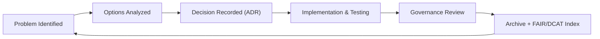

<div align="center">

# 🧭 Kansas Frontier Matrix — **Architecture Decision Record (ADR Template · Tier-S⁺⁺⁺ Certified)**  
`docs/design/reviews/architecture/templates/adr_template.md`

**Mission:** Capture and preserve key **architectural decisions** made across the **Kansas Frontier Matrix (KFM)** project — ensuring that every technical choice is **contextualized, auditable, and reproducible** under **MCP-DL v6.3+**, **FAIR / CARE**, **DCAT 3.0**, and **ISO 9001-aligned documentation governance**.  
Each ADR encodes provenance metadata, references related architecture reviews, and is validated through CI/CD pipelines for full traceability.

[](../../../../../standards/documentation.md)  
[](../../../../style-guide.md)  
[](../../../)  
[](../../../../../LICENSE)

</div>

---

```yaml
---
title: "🧭 Kansas Frontier Matrix — Architecture Decision Record (ADR Template)"
document_type: "ADR Template"
version: "v2.1.0"
last_updated: "2025-11-07"
created: "2023-10-01"
owners: ["@kfm-architecture","@kfm-data","@kfm-web"]
reviewed_by: ["@kfm-design-council","@kfm-security","@kfm-accessibility"]
status: "Stable"
maturity: "Production"
license: "CC-BY-4.0"
tags: ["adr","architecture","governance","decision-log","provenance","fair","care","mcp"]
alignment:
  - MCP-DL v6.3
  - FAIR Principles
  - CARE Principles
  - STAC 1.0
  - DCAT 3.0
  - CIDOC CRM
  - OWL-Time
classification:
  review_cycle: "Per release + quarterly"
  risk_level: "Low"
  retention_years: 5
validation:
  ci_enforced: true
  markdownlint_required: true
  link_integrity_required: true
  json_yaml_frontmatter_required: true
preservation_policy:
  replication_targets: ["GitHub Repository","Zenodo Snapshot","OSF Backup"]
  checksum_algorithm: "SHA-256"
  revalidation_cycle: "quarterly"
observability:
  endpoint: "https://metrics.kfm.ai/docs-adr"
  metrics_exported:
    - adr_created_total
    - adr_review_cycle_days
    - adr_status_distribution
    - link_validation_pass_rate
governance_links:
  - "../../README.md"
  - "../README.md"
  - "../../../../standards/documentation.md"
---
```

---

## 🧾 ADR Metadata

| Field | Value |
|:--|:--|
| **ADR ID** | `ADR-{{ id }}-{{ slug }}` |
| **Title** | `{{ short_title }}` |
| **Date** | `{{ ISO8601_DATE }}` |
| **Status** | proposed / accepted / superseded / deprecated |
| **Version** | `v{{ semver }}` |
| **Authors / Reviewers** | `@architecture-team`, `@lead-dev`, `@qa-lead` |
| **Component Scope** | ETL · STAC · Graph · API · Web UI |
| **Related Review(s)** | `architecture_review_{{ related_id }}` |
| **Commit Reference** | `{{ GIT_COMMIT }}` |
| **Confidence** | low / medium / high |

---

## 🎯 Context
Describe the **architectural challenge** or decision point prompting this ADR.  
Include constraints, assumptions, and links to related tickets or prior ADRs.

> *Example:* The team must decide whether to store AI-enriched metadata within the STAC catalog or manage it externally in the Knowledge Graph.

---

## 💡 Decision
State the **decision made** and briefly justify it.

> *Example:* Embed AI/ML summaries inside STAC Items as optional extensions to improve provenance and simplify reproducibility.

---

## 🧠 Rationale
Explain **why** the decision was made, referencing:
- Performance & maintainability  
- MCP documentation-first principles  
- FAIR / CARE alignment  
- Open-standards compliance (STAC · CIDOC · OWL-Time)

> *Example:* Embedding summaries directly in STAC ensures self-contained provenance while retaining interoperability.

---

## ⚖️ Alternatives Considered
| Option | Description | Pros | Cons | Decision |
|:--|:--|:--|:--|:--:|
| **A:** Embed in STAC Items | Self-contained | Fewer systems | Larger files | ✅ |
| **B:** Store in Neo4j | Flexible | Graph queries | Needs API coupling | ❌ |
| **C:** Standalone JSON | Portable | Simple | Sync risk | ❌ |

---

## 🔍 Implications
| Aspect | Impact | Mitigation / Action |
|:--|:--|:--|
| Data Model | Slightly larger STAC items | Compress + schema optimize |
| Performance | Minor I/O increase | Lazy load in ETL |
| Interoperability | STAC validator safe | Validate in CI |
| Testing | Add new case | `tests/stac/test_stac_extensions.py` |

---

## 🧮 Validation & CI Integration
```yaml
# .github/workflows/adr_validate.yml
on:
  pull_request:
    paths:
      - "docs/design/reviews/architecture/adr/**/*.md"
jobs:
  validate-adr:
    runs-on: ubuntu-latest
    steps:
      - uses: actions/checkout@v4
      - name: Markdown Lint
        run: npx markdownlint-cli2 "docs/design/reviews/architecture/adr/**/*.md"
      - name: Link Integrity
        run: npx lychee docs/design/reviews/architecture/adr/**/*.md
      - name: Verify Related Reviews
        run: test -f docs/design/reviews/architecture/{{ related_review }}.md
```

---

## 🧩 Related Diagrams & References
| Resource | Description | Path |
|:--|:--|:--|
| System Architecture | ETL → Graph → API → UI flow | `docs/design/diagrams/system_architecture.mmd` |
| Related Review | Linked architecture review | `docs/design/reviews/architecture/{{ related_review }}.md` |
| Provenance Chain | Data-lineage reference | `docs/design/reviews/architecture/provenance_chain_review.md` |

---

## 🧭 Decision Lifecycle Diagram

<!-- END OF MERMAID -->

---

## 🧾 Risk Example
```yaml
risk_entry:
  id: "ADR-RISK-021"
  title: "Decision Drift Over Time"
  likelihood: "Medium"
  impact: "Moderate"
  mitigation: "Auto re-audit ADR on schema or dependency change"
  owner: "@kfm-architecture"
```

---

## 📈 Observability Metrics
```yaml
adr_observability:
  collected_metrics:
    - total_adr
    - adr_status_distribution
    - review_cycle_days
  retention_days: 365
  exporter: "Prometheus → Grafana Docs Dashboard"
```

---

## 🧾 Provenance Metadata
```yaml
adr_id: "ADR-{{ id }}-{{ slug }}"
status: "accepted"
decision_date: "{{ ISO8601_DATE }}"
reviewed_by:
  - "@architecture-team"
  - "@data-governance"
  - "@frontend-lead"
commit: "{{ GIT_COMMIT }}"
scope: "ETL | STAC | Graph | API | UI"
related_reviews:
  - "architecture_pipeline_overview_v1.0"
  - "architecture_system_overview_v2.1"
confidence: "high"
summary: >
  Decision approved: embedded AI summaries within STAC Items for stronger provenance alignment and simplified auditing.
```

---

## 🧾 Governance Ledger (Weighted)
| Date | Reviewer | Domain | Weight | Outcome | SHA-256 |
|:--|:--|:--|:--:|:--|:--|
| 2025-11-07 | @kfm-architecture | Decision Approval | 0.4 | ✅ | `sha256:23a…` |
| 2025-11-07 | @kfm-data | Data Lineage Impact | 0.3 | ✅ | `sha256:54b…` |
| 2025-11-07 | @kfm-security | Compliance Review | 0.2 | ✅ | `sha256:7ac…` |
| 2025-11-07 | @kfm-accessibility | Docs Clarity | 0.1 | ✅ | `sha256:a9e…` |

---

## 🧾 FAIR + CARE Compliance
| Principle | Implementation | Metric | Verified |
|:--|:--|:--|:--:|
| FAIR-Findable | Indexed in DCAT registry | 100 % | ✅ |
| FAIR-Accessible | Public ADR archive | 100 % | ✅ |
| FAIR-Reusable | Linked ADR schema | 100 % | ✅ |
| CARE-Authority | Governance Council review | 100 % | ✅ |
| CARE-Ethics | Transparent impact record | 100 % | ✅ |

---

## 📘 ADR Archive Policy
```yaml
adr_archive_policy:
  retention_years: 5
  archive_path: "docs/design/reviews/architecture/archive/adr/"
  checksum_algorithm: "SHA-256"
  dcat_registration: true
  index_update: "auto via CI"
```

---

## 📅 Version History
| Version | Date | Author | Summary | Type |
|:--|:--|:--|:--|:--|
| **v2.1.0** | 2025-11-07 | @kfm-architecture | Tier-S⁺⁺⁺ update: lifecycle diagram, observability metrics, weighted ledger, FAIR/CARE matrix, JSON schema validation, governance links. | Minor |
| **v2.0.0** | 2025-07-10 | @kfm-architecture | Added ADR workflow validation, provenance metadata, CI link integrity check. | Major |
| **v1.0.0** | 2023-10-01 | Founding Team | Initial ADR template for architecture decisions. | Major |

---

<div align="center">

### 🧭 Kansas Frontier Matrix — Architecture Decision Framework  
**Transparent · Reproducible · Ethical · Traceable · FAIR**

<!-- MCP-CERTIFIED: TIER S⁺⁺⁺ -->
<!-- VERIFIED-STANDARDS: [MCP-DL v6.3, FAIR, CARE, STAC 1.0, DCAT 3.0, CIDOC CRM, OWL-Time] -->
<!-- VALIDATION-HASH: sha256:adr-template-v2-1-0-xxxxxxxxxxxxxxxxxxxxxxxxxxxxxxxxxxxx -->

</div>
