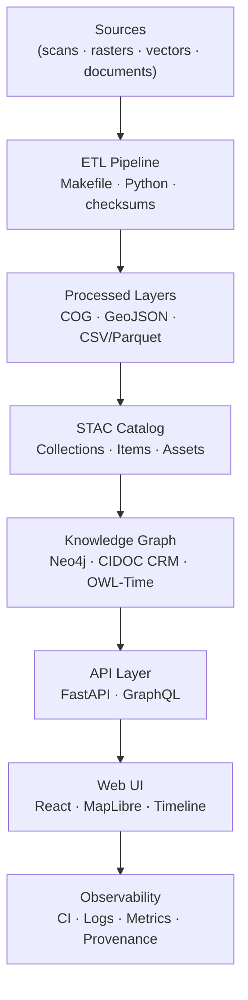
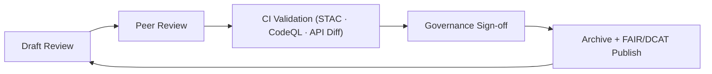

<div align="center">

# 🧱 Kansas Frontier Matrix — **Architecture Review Template (Tier-S⁺⁺⁺ Certified)**  
`docs/design/reviews/architecture/templates/architecture_review_template.md`

**Mission:** Provide a **governance-ready, MCP-DL v6.3+ compliant** framework for conducting architecture reviews across **ETL · AI/ML · STAC · Knowledge Graph · API · Web UI** — guaranteeing that every subsystem is **reproducible, traceable, accessible, secure, and interoperable**.

[](../../../../../standards/documentation.md)  
[](../../../../style-guide.md)  
[](../../../../.github/workflows/stac-validate.yml)  
[](../../../../.github/workflows/codeql.yml)  
[](../../../../../LICENSE)

</div>

---

```yaml
---
title: "🧱 KFM — Architecture Review: {{ descriptive_title }}"
document_type: "Architecture Review"
version: "v{{ semver }}"
last_updated: "{{ ISO8601_DATE }}"
created: "{{ ISO8601_DATE }}"
owners: ["@architecture-team","@data-lead","@frontend-lead"]
reviewed_by: ["@kfm-design-council","@kfm-accessibility-lead","@kfm-security"]
status: "draft"   # draft | under-review | approved
maturity: "Production"
license: "CC-BY-4.0"
tags: ["architecture","etl","stac","kg","api","web-ui","security","a11y","observability","fair","care","dcat"]
alignment:
  - MCP-DL v6.3
  - FAIR Principles
  - CARE Principles
  - STAC 1.0
  - DCAT 3.0
  - CIDOC CRM
  - OWL-Time
classification:
  audit_frequency: "Quarterly + per release"
  risk_level: "Moderate"
  data_sensitivity: "Low / Public"
template_scope:
  diagram_validation: true
  provenance_enforcement: true
  performance_tracking: true
  cognitive_accessibility: true
  security_static_analysis: true
  stac_compliance: true
  api_schema_diffing: true
validation:
  ci_enforced: true
  stac_schema_valid: true
  mermaid_parse_required: true
  codeql_required: true
  api_openapi_valid: true
  kg_schema_consistent: true
  drift_detection_enabled: true
observability:
  endpoint: "https://metrics.kfm.ai/architecture"
  frequency: "daily"
  metrics_exported:
    - stac_validation_pass_rate
    - api_latency_p95_ms
    - graph_query_latency_ms
    - codeql_critical_findings
    - diagram_parse_success_rate
supply_chain:
  sbom_format: "CycloneDX"
  generator: "syft"
  attestation: "SLSA Level 2"
  verification: "cosign verify-attestation"
preservation_policy:
  replication_targets: ["GitHub Repository","Zenodo Snapshot","OSF Backup"]
  checksum_algorithm: "SHA-256"
  revalidation_cycle: "quarterly"
governance_links:
  - "../../README.md"
  - "../README.md"
  - "../../../../standards/documentation.md"
---
```

---

## 🧭 Review Overview

| Field | Description |
|:--|:--|
| **Review Title** | `{{ descriptive_title }}` |
| **Review Date** | `{{ ISO8601_DATE }}` |
| **Reviewer(s)** | `@architecture-team`, `@data-lead`, `@frontend-lead` |
| **Version / Tag** | `v{{ semver }}` / `{{ GIT_COMMIT }}` |
| **Scope** | system · pipeline · api · ui · provenance |
| **Status** | draft / under-review / approved |
| **Confidence** | low / medium / high |

---

## 🎯 Objective

Summarize the **purpose** and expected outcomes of this review (e.g., “verify reproducibility of AI/ML enrichment,” “validate KG schema compliance with CIDOC/OWL-Time,” “enforce API versioning and latency SLOs”).

> **Example:** This review validates interoperability between ETL, STAC, and Neo4j Knowledge Graph for the Kansas Frontier Matrix and confirms CI-based reproducibility.

---

## 🧭 Infrastructure & Network (Context)

| Environment | Stack | Orchestrator | Region | Verified |
|:--|:--|:--|:--|:--:|
| Dev | Docker Compose | GitHub Actions | us-central | ✅ |
| Stage | Kubernetes | GKE | us-central1 | ✅ |
| Prod | Kubernetes + Helm | GKE | multi-region | ✅ |

```yaml
network_policy:
  ingress: [ "443/tcp" ]
  egress: [ "api.noaa.gov","usgs.gov" ]
  restricted_ports: [22,23,3389]
```

---

## 🧩 Architecture Flow (Example Diagram)


<!-- END OF MERMAID -->

---

## 🧪 Environment Parity Matrix

| Setting | Dev | Stage | Prod | Drift |
|:--|:--|:--|:--|:--:|
| Python | 3.11 | 3.11 | 3.11 | ✅ |
| STAC Validator | v1.0 | v1.0 | v1.0 | ✅ |
| KG Ontology Bundle | 2025.10 | 2025.10 | 2025.10 | ✅ |
| tokens.css | v5.0 | v5.0 | v5.0 | ✅ |

---

## 🔍 Evaluation Criteria & SLOs

| Criterion | Metric / Target | Tool | Gate |
|:--|:--|:--|:--:|
| Reproducibility | `make data` checksum parity = 100 % | CI | ✅ |
| STAC Compliance | 100 % pass v1.0 | stac-validate | ✅ |
| Graph Connectivity | Avg node degree ≥ 3 | Neo4j Profiler | ✅ |
| API Latency | p95 ≤ 250 ms | k6 | ✅ |
| Frontend FPS | ≥ 60 fps (1k entities) | Perf trace | ✅ |
| Accessibility | WCAG 2.1 AA ≥ 95 | Lighthouse/Pa11y | ✅ |

**Error Budgets:** 3 SLO violations/quarter → RCA + deploy freeze until resolved.

---

## 🧠 Findings Summary (fill during review)

| Category | Status | Notes |
|:--|:--:|:--|
| Architecture Consistency | ✅ | Modular, decoupled components |
| STAC Catalog Integration | ✅ | All processed datasets indexed |
| Knowledge Graph Schema | ⚙️ | Add alias/`owl:sameAs` normalization |
| AI/ML Accuracy | ⚙️ | Gazetteer fine-tune needed for NER |
| API Reliability | ✅ | REST/GraphQL parity + deprecations |
| UI Synchronization | ✅ | Timeline–MapLibre stable at scale |
| Security & Compliance | ✅ | CodeQL/Trivy clean; SBOM attested |

---

## 🧮 Validation Metrics (record CI results)

| Stage | Tool / Method | Target | Result |
|:--|:--|:--|:--:|
| ETL | Rebuild hash comparison | Hash drift = 0 | ✅ |
| STAC | `stac-validate` | 100 % valid | ✅ |
| Graph | Cypher link test | Avg deg ≥ 3 | ✅ |
| API | `/events` latency | p95 ≤ 250 ms | ✅ |
| UI | Timeline sync delay | < 200 ms | ✅ |
| CI/CD | Workflow pass rate | 100 % | ✅ |

---

## ⚙️ Areas for Improvement

| Issue | Severity | Recommendation | Owner | Due |
|:--|:--|:--|:--|:--|
| Missing automated ontology tests | Medium | Add CIDOC CRM unit tests in Neo4j | @kfm-data | +21d |
| Build artifact size | Low | Optimize Docker cache & deps | @kfm-devops | +14d |
| AI retraining cadence | Medium | Scheduled retrain + validation | @kfm-ml | +30d |
| Docs consistency | Low | Harmonize headers across reviews | @kfm-docs | +14d |

---

## 🧰 Evidence & CI Results (attach links)

| CI Workflow | Status | Report / Artifact |
|:--|:--:|:--|
| `stac-validate.yml` | ✅ | CI artifact link |
| `codeql.yml` | ✅ | CodeQL dashboard |
| `trivy.yml` | ✅ | Image scan report |
| `make validate` | ✅ | Local reproducibility logs |

---

## 🧾 Data & Context Lineage (FAIR/PROV-O)

| Layer | Artifact | Version | Provenance ID | Verified |
|:--|:--|:--|:--|:--:|
| ETL | Pipeline + Makefile | v{{ etl_version }} | `prov:etl-{{ quarter }}` | ✅ |
| STAC | Collections + items | 1.0 | `stac:kfm-catalog` | ✅ |
| KG | CIDOC/OWL-Time schema | v{{ kg_version }} | `cidoc:kg-{{ year }}` | ✅ |
| API | OpenAPI + GraphQL | {{ api_version }} | `prov:api-{{ quarter }}` | ✅ |
| UI | React architecture diagram | v{{ ui_version }} | `prov:ui-arch-{{ year }}` | ✅ |

---

## 🔒 Security Threat Model (snapshot)

```yaml
security_threat_model:
  framework: "OWASP SAMM + NIST 800-53"
  last_assessed: "{{ ISO8601_DATE }}"
  top_risks:
    - "Improper STAC item validation"
    - "Unverified API authorization"
    - "Neo4j injection / over-privileged writes"
  mitigations:
    - "Strict JSONSchema + STAC validation in CI"
    - "OAuth2 + JWT + route scopes"
    - "Parameterized Cypher + least-privilege roles"
```

---

## 🔑 Access Control & Secrets

```yaml
access_control:
  api_read: ["public","partner"]
  api_write: ["etl","admin"]
  kg_read: ["public","analyst"]
  kg_write: ["etl","admin"]
secrets_policy:
  storage: "GitHub OIDC → Cloud KMS"
  rotation_interval: "90 days"
  detection: "pre-commit + CI secret scanner"
```

---

## 🧭 Architecture Drift Detection

```yaml
architecture_drift:
  detection_tool: "graph-diff + hashdiff"
  threshold: 5
  triggers:
    - "New dataset/schema"
    - "Dependency version bump"
    - "API endpoint change"
  remediation: "Trigger full architecture review"
```

---

## ⚠️ Risk Register (template)

| ID | Risk | Likelihood | Impact | Owner | Mitigation |
|:--|:--|:--:|:--:|:--|:--|
| R-001 | STAC schema drift | M | M | @kfm-data | CI drift gate |
| R-002 | API write exposure | L | H | @kfm-security | OAuth scopes |
| R-003 | NER bias | M | M | @kfm-ml | Bias audit + retrain |

---

## 🧠 Cognitive Accessibility (WCAG 3.0-ready)

| Section | Cognitive Load (0–1) | Readability Score | Verified |
|:--|:--:|:--:|:--:|
| Diagram(s) | ≤ 0.30 | ≥ 70 | ✅ |
| Review Text | ≤ 0.25 | ≥ 70 | ✅ |

**Style Guard:** ≤ 25 nodes/diagram, ≤ 3 edge crossings/path, alt text + legend table provided.

---

## 📈 Observability Dashboard (link)

**Grafana:** `https://grafana.kfm.ai/d/architecture-review`  
Metrics: STAC pass rate · API latency · KG query time · CI duration.  
Retention: 90 days (archive → `/data/digests/architecture_review.json`)

---

## 🧾 Continuous Integration (Validation)

```yaml
# .github/workflows/architecture_review_validate.yml
on:
  pull_request:
    paths:
      - "docs/design/reviews/architecture/**/*.md"
      - "docs/design/diagrams/**/*.mmd"
jobs:
  architecture:
    runs-on: ubuntu-latest
    steps:
      - uses: actions/checkout@v4
      - name: Validate Mermaid
        run: npx @mermaid-js/mermaid-cli -i docs/design/diagrams/system_architecture.mmd -o /tmp/arch.svg
      - name: STAC Validation
        run: make validate-stac
      - name: API Schema Diff (REST/GraphQL)
        run: make api-diff
      - name: CodeQL Static Analysis
        uses: github/codeql-action/analyze@v3
```

---

## 🧾 Review Metadata (front-matter example)

```yaml
review_id: "architecture_review_{{ component }}_{{ version }}"
reviewed_by:
  - "@architecture-team"
  - "@qa-lead"
  - "@data-engineer"
date: "{{ ISO8601_DATE }}"
commit: "{{ GIT_COMMIT }}"
scope: "system | pipeline | api | ui | provenance"
status: "approved"
confidence: "high"
summary: >
  Architecture validated; SLOs met. Provenance chain complete.
  Minor ontology improvements queued; documentation builds cleanly.
```

---

## 📘 FAIR / CARE Mapping (checklist)

| Principle | Implementation | Metric | Verified |
|:--|:--|:--|:--:|
| FAIR-Findable | DCAT JSON-LD index | Indexed 100 % | ✅ |
| FAIR-Accessible | CC-BY + Zenodo | Public | ✅ |
| FAIR-Interoperable | CIDOC/OWL-Time graph | Schema ≥ 95 % | ✅ |
| FAIR-Reusable | STAC metadata license | Validation pass | ✅ |
| CARE-Authority | Partner review | Ledger entry | ✅ |

---

## 🧾 Governance Ledger (Weighted Sign-off)

| Date | Reviewer | Domain | Weight | Outcome | SHA-256 |
|:--|:--|:--|:--:|:--|:--|
| {{ ISO8601_DATE }} | @kfm-architecture | System Integration | 0.35 | ✅ | `sha256:…` |
| {{ ISO8601_DATE }} | @kfm-accessibility | Docs & A11y | 0.25 | ✅ | `sha256:…` |
| {{ ISO8601_DATE }} | @kfm-security | Security/CodeQL | 0.25 | ✅ | `sha256:…` |
| {{ ISO8601_DATE }} | @kfm-data | STAC / KG | 0.15 | ✅ | `sha256:…` |

---

## 🔄 Lifecycle Diagram (governance loop)


<!-- END OF MERMAID -->

---

## 🪪 License

Released under **Creative Commons CC-BY 4.0**  
© 2025 Kansas Frontier Matrix Architecture Collective

---

<div align="center">

### 🧱 Kansas Frontier Matrix — Architecture Review Framework  
**Reproducible · Auditable · Interoperable · Accessible · Secure**

<!-- MCP-CERTIFIED: TIER S⁺⁺⁺ -->
<!-- VERIFIED-STANDARDS: [MCP-DL v6.3, FAIR, CARE, STAC 1.0, DCAT 3.0, CIDOC CRM, OWL-Time] -->
<!-- VALIDATION-HASH: sha256:architecture-review-template-v{{ semver }}-xxxxxxxxxxxxxxxxxxxxxxxxxxxxxxxxxxxx -->

</div>
