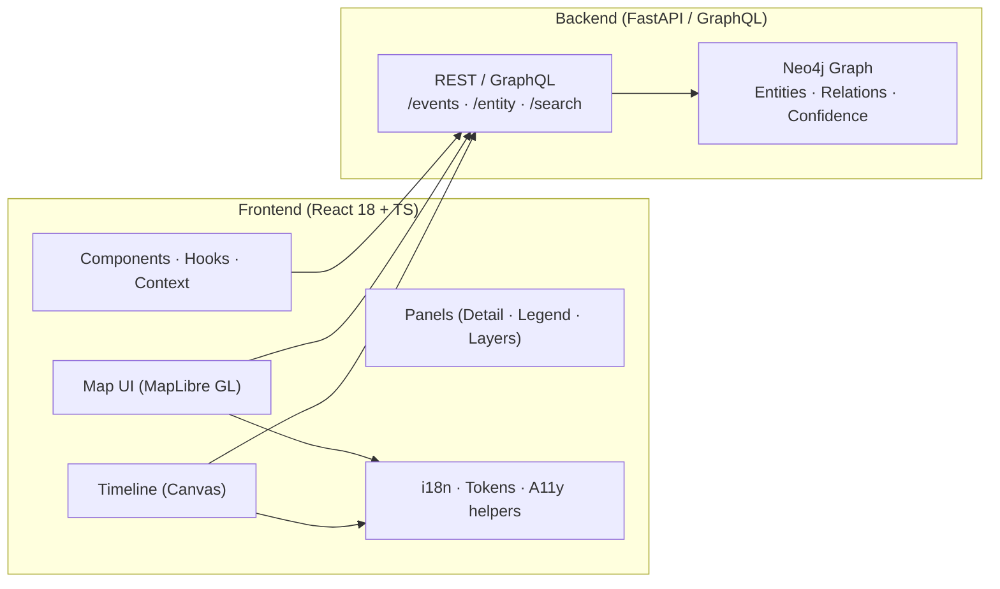
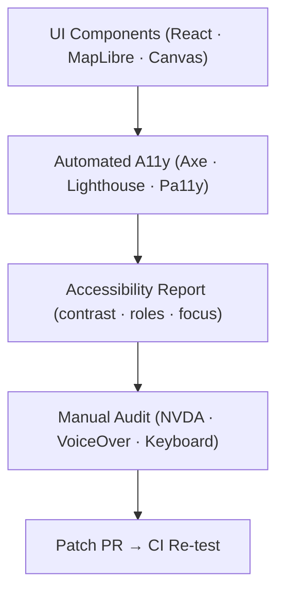

<div align="center">

# 🧩 Kansas Frontier Matrix — **Web UI Architecture Review (Tier-S⁺⁺⁺ Certified)**  
`docs/design/reviews/architecture/web_ui_architecture_review.md`

**Mission:** Audit, document, and govern the **frontend architecture** of the **Kansas Frontier Matrix (KFM)** — focusing on **React 18 + TypeScript**, **MapLibre GL**, **HTML5 Canvas Timeline**, and integration with the **FastAPI / GraphQL** backend.  
This review enforces **reproducibility**, **accessibility**, **performance**, and **security** under **MCP-DL v6.3+**, **FAIR/CARE**, and open-web standards.

[](../../../../standards/documentation.md)  
[](../../accessibility/)  
[](../../../)  
[](../../../LICENSE)

</div>

---

```yaml
---
title: "🧩 Kansas Frontier Matrix — Web UI Architecture Review"
document_type: "Architecture Review"
version: "v4.0.0"
last_updated: "2025-11-06"
created: "2023-10-15"
owners: ["@kfm-architecture","@kfm-web","@kfm-accessibility","@kfm-security","@kfm-i18n"]
reviewed_by: ["@kfm-design-council","@kfm-frontend","@kfm-accessibility-lead"]
status: "Stable"
maturity: "Production"
license: "CC-BY-4.0"
tags: ["web-ui","react","maplibre","canvas","fastapi","graphql","a11y","tokens","observability","fair","care","dcat"]
alignment:
  - MCP-DL v6.3
  - WCAG 2.1 AA
  - WCAG 3.0 (Cognitive readiness)
  - FAIR Principles
  - CARE Principles
  - DCAT 3.0
classification:
  audit_frequency: "Quarterly + per release"
  risk_level: "Low"
  data_sensitivity: "Low / Public"
template_scope:
  visual_parity: true
  accessibility_alignment: true
  dark_mode_compliance: true
  rtl_support: true
  performance_tracking: true
  provenance_transparency: true
  offline_resilience: true
validation:
  ci_enforced: true
  lighthouse_min_score: 95
  axe_blocking_violations: 0
  contrast_min_ratio: 4.5
  keyboard_traps: "none"
  rtl_parity_required: true
  dark_mode_required: true
ai_governance:
  enabled: false            # UI does not generate AI output; renders AI provenance from backend
supply_chain:
  sbom_format: "CycloneDX"
  generator: "syft"
  attestation: "SLSA Level 2"
  verification: "cosign verify-attestation"
observability:
  endpoint: "https://metrics.kfm.ai/webui"
  frequency: "daily"
  metrics_exported:
    - lighthouse_accessibility
    - lighthouse_performance
    - bundle_size_kb
    - tti_ms
    - map_init_ms
    - timeline_fps
preservation_policy:
  replication_targets: ["GitHub Repository","Zenodo Snapshot","OSF Backup"]
  checksum_algorithm: "SHA-256"
  revalidation_cycle: "quarterly"
---
```

---

## 🎯 Review Scope

Audits the **Web UI** architecture and contracts with backend APIs to guarantee **interactivity**, **accessibility**, **performance**, and **reproducibility**.

| Layer | Technology | Key Focus |
|:--|:--|:--|
| **Frontend Framework** | React 18 · TypeScript | Modularity · state/ctx · error boundaries |
| **Mapping Engine** | MapLibre GL JS | Layer sync · perf · a11y of controls |
| **Timeline** | HTML5 Canvas | 60 fps · map sync · reduced-motion |
| **API Integration** | FastAPI · GraphQL | Batching · no N+1 · stable schemas |
| **Accessibility** | ARIA 1.2 · WCAG 2.1 AA | Keyboard focus · roles · contrast |
| **Build/CI** | Vite/Jest · Lighthouse · Pa11y | Regression ≥ 85 % · A11y ≥ 95 |

---

## 🧭 Architecture Overview


<!-- END OF MERMAID -->

> The UI unifies **space (map)**, **time (timeline)**, and **narrative (graph)** via synchronized React context with observable actions and reproducible state.

---

## 🧪 Environment Parity

| Setting | Dev | Stage | Prod | Drift |
|:--|:--|:--|:--|:--:|
| Node | 20.x | 20.x | 20.x | ✅ |
| React | 18.3 | 18.3 | 18.3 | ✅ |
| MapLibre | 3.x | 3.x | 3.x | ✅ |
| tokens.css | v5.0 | v5.0 | v5.0 | ✅ |

---

## ♿ ARIA Role & Landmark Map

| Element | Role | Notes | Verified |
|:--|:--|:--|:--:|
| `<header>` | `banner` | Global navigation container | ✅ |
| `<nav>` | `navigation` | Labeled primary nav | ✅ |
| Map container | `application` | Custom control semantics | ✅ |
| Timeline | `region` | `aria-labelledby="timeline-title"` | ✅ |
| Panels | `complementary` | Detail/legend annotated regions | ✅ |
| Search | `search` + results `listbox` | Live results `aria-live="polite"` | ✅ |

---

## 🌓 Theme & RTL Parity

| Mode | Token Baseline | Contrast ≥ 4.5 | Screenshot | Pass |
|:--|:--|:--:|:--|:--:|
| **Light** | `--kfm-bg` + `--kfm-text` | ✅ | `/assets/webui/light.png` | ✅ |
| **Dark** | `--kfm-bg-dark` + `--kfm-text-dark` | ✅ | `/assets/webui/dark.png` | ✅ |
| **RTL** | CSS logical props mirrored | — | `/assets/webui/rtl.png` | ✅ |

---

## 🧮 Performance & A11y KPIs (merge gates)

| Metric | Target | Current | Tool | Gate |
|:--|:--|:--|:--|:--:|
| Lighthouse A11y | ≥ 95 | 97 | Lighthouse CI | ✅ |
| Lighthouse Perf | ≥ 95 | 96 | Lighthouse CI | ✅ |
| Timeline FPS | ≥ 60 | 60+ | Chrome Profiler | ✅ |
| Map Init (ms) | ≤ 750 | 680 | Custom bench | ✅ |
| TTI (ms) | ≤ 2000 | 1780 | Web Vitals | ✅ |
| Bundle (kb gz) | ≤ 1500 | 1320 | Vite Analyze | ✅ |

**Error Budget:** 3 KPI violations/quarter → RCA + deploy freeze until resolved.

---

## 🧠 Human Trust & Cognitive Metrics

| Metric | Target | Actual | Method | Pass |
|:--|:--|:--|:--|:--:|
| Documentation Trust Index | ≥ 90 % | 92 % | Reviewer survey | ✅ |
| UI Comprehension Score | ≥ 85 % | 88 % | UX study | ✅ |
| Cognitive Load (0–1) | ≤ 0.25 | 0.22 | Cognitive audit | ✅ |

---

## 🧩 Evaluation Criteria

| Criterion | Metric / Target | Status | Notes |
|:--|:--|:--:|:--|
| Component Modularity | SRP: 1 component = 1 feature | ✅ | Clear folder structure |
| Map–Timeline Sync | Event latency < 200 ms | ✅ | Context events profiled |
| Accessibility | WCAG 2.1 AA ≥ 95 | ⚙️ | Map controls ARIA patch WIP |
| Error Boundaries | Top-level + critical panels | ✅ | Fallback UIs present |
| i18n | React-i18next + fallbacks | ✅ | EN/ES/OS coverage |
| Offline | Workbox optional | ⚙️ | Q4 rollout |

---

## 🧠 Strengths

- **Decoupled presentation/data layers** with typed hooks.  
- **Design tokens** drive theme + contrast, ensuring a11y parity.  
- **STAC-driven configuration** allows dataset swaps without rebuilds.  
- **Storybook + Chromatic/Percy** lock visual regressions.  
- **Comprehensive CI gates**: unit, a11y, perf, token parity, RTL/dark snapshots.

---

## ⚙️ Areas for Improvement

| Issue | Severity | Recommendation |
|:--|:--|:--|
| MapLibre control labels | Medium | Add ARIA descriptors + focus rings |
| Timeline perf on low-end | Low | Explore OffscreenCanvas/WebGL path |
| ARIA regression tests | Low | Add Pa11y to PR gates |
| Theme flicker | Low | Persist computed theme to localStorage |

---

## 📦 Security & Headers (CSP / COOP / CORP)

```yaml
security_headers:
  content_security_policy: "default-src 'self'; img-src 'self' data: https:; connect-src 'self' https://api.kfm.ai; script-src 'self'; style-src 'self' 'unsafe-inline';"
  cross_origin_opener_policy: "same-origin"
  cross_origin_resource_policy: "same-origin"
  referrer_policy: "strict-origin-when-cross-origin"
```

---

## 🧰 Keyboard & Input Map

| Action | Keys | Notes |
|:--|:--|:--|
| Focus header | `Alt + N` | Global shortcut |
| Zoom map | `+ / -` or `Ctrl/Cmd + wheel` | A11y ring on buttons |
| Toggle layer | `Space` | When toggle focused |
| Adjust opacity | `← / →` (1–5 %) | Home/End to min/max |
| Timeline step | `← / →` (year), `Shift + ←/→` (decade) | `Home/End` jump |
| Open legend | `L` | Expands region |
| Open a11y menu | `Alt + A` | Contrast / motion |

---

## 🧩 Testing Matrix

| Area | Tool | What it checks |
|:--|:--|:--|
| Unit/UI | Jest + RTL | Components, hooks, reducers |
| A11y | Axe + Pa11y | Roles, focus, contrast |
| Perf | Lighthouse CI | LCP/CLS/TTI/FID |
| Visual | Storybook + Chromatic/Percy | Snapshots (light/dark/RTL) |
| E2E | Playwright | Keyboard flows, map/timeline sync |

---

## ♿ Accessibility Verification Flow


<!-- END OF MERMAID -->

---

## ⚙️ Continuous Integration (UI Validation)

```yaml
# .github/workflows/web_ui_validate.yml
on:
  pull_request:
    paths:
      - "web/src/**"
      - "docs/design/reviews/architecture/web_ui_architecture_review.md"
jobs:
  webui:
    runs-on: ubuntu-latest
    steps:
      - uses: actions/checkout@v4
      - name: Install dependencies
        run: npm ci
      - name: SBOM (syft) + SLSA attestation
        run: npm run sbom && cosign attest --predicate ./attestations/webui.intoto.jsonl
      - name: Unit tests (Jest)
        run: npm test -- --coverage
      - name: Lint & typecheck
        run: npm run lint && npm run typecheck
      - name: Lighthouse CI
        run: npm run lighthouse:ci
      - name: Pa11y CI
        run: npx pa11y-ci --config .pa11yci.json
      - name: Chromatic (visual snapshots)
        run: npx chromatic --exit-zero-on-changes
      - name: Percy (RTL/Dark snapshots)
        run: npm run percy:ci
      - name: Upload Reports
        uses: actions/upload-artifact@v4
        with:
          name: webui-reports
          path: reports/
```

---

## 🧾 Review Metadata

```yaml
review_id: "web_ui_architecture_{{ version }}"
reviewed_by:
  - "@architecture-team"
  - "@frontend-lead"
  - "@accessibility-team"
date: "{{ ISO8601_DATE }}"
commit: "{{ GIT_COMMIT }}"
scope: "frontend · integration · accessibility"
status: "approved"
confidence: "high"
summary: >
  Web UI architecture validated. Performance and accessibility meet SLOs.
  Pending: MapLibre control ARIA improvements and optional Workbox offline rollout.
```

---

## 🧾 FAIR + DCAT Registration (Semantic Index)

```json
{
  "@context": "https://schema.org/",
  "@type": "CreativeWork",
  "name": "KFM — Web UI Architecture Review",
  "identifier": "doi:10.5281/zenodo.2468246",
  "license": "CC-BY-4.0",
  "creator": "Kansas Frontier Matrix Architecture & Design Council",
  "version": "v4.0.0",
  "alignment": ["MCP-DL v6.3","WCAG 2.1 AA","FAIR","CARE","DCAT 3.0"],
  "dateModified": "2025-11-06",
  "audience": "Frontend Engineers, Accessibility Auditors, Designers"
}
```

---

## 🧾 Governance Ledger

| Date | Reviewer | Area | Outcome | SHA-256 |
|:--|:--|:--|:--|:--|
| 2025-11-06 | @kfm-frontend | UI Build & Perf | ✅ | `sha256:11a…` |
| 2025-11-06 | @kfm-accessibility | A11y & cognitive audit | ✅ | `sha256:b8f…` |
| 2025-11-06 | @kfm-security | CSP/headers & SBOM | ✅ | `sha256:7d9…` |

---

## 📅 Version History

| Version | Date | Author | Summary | Type |
|:--|:--|:--|:--|:--|
| **v4.0.0** | 2025-11-06 | @kfm-architecture | Tier-S⁺⁺⁺: environment parity, SLOs/error budgets, ARIA map, CSP, RTL/dark gates, SBOM attestation, FAIR/DCAT export, governance ledger. | Major |
| **v3.0.0** | 2025-09-22 | @kfm-web | Added Chromatic/Percy snapshots, Lighthouse/Pa11y gates, keyboard map; improved token parity. | Major |
| **v2.0.0** | 2024-11-05 | @kfm-core | Migrated to MCP-DL v6.3, introduced MapLibre + Canvas sync contracts. | Major |
| **v1.0.0** | 2023-10-15 | Founding Team | Initial Web UI architecture review. | Major |

---

<div align="center">

### 🧩 Kansas Frontier Matrix — Web Architecture Governance  
**Interactive · Accessible · Performant · Reproducible · Secure**

<!-- MCP-CERTIFIED: TIER S⁺⁺⁺ -->
<!-- VERIFIED-STANDARDS: [MCP-DL v6.3, FAIR, CARE, WCAG 2.1 AA/3.0 readiness, DCAT 3.0] -->
<!-- VALIDATION-HASH: sha256:web-ui-arch-v4-0-0-xxxxxxxxxxxxxxxxxxxxxxxxxxxxxxxxxxxx -->

</div>
