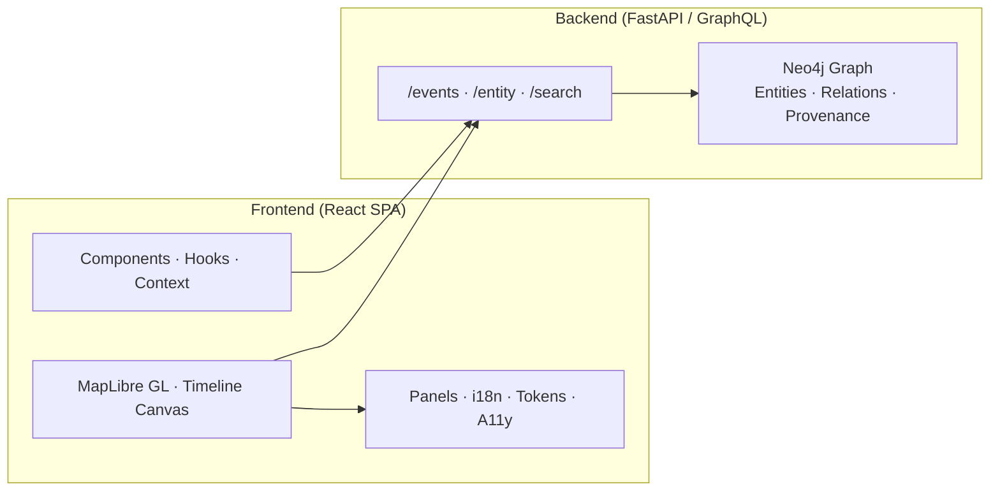

<div align="center">

# 🧩 Kansas Frontier Matrix — **Web UI Architecture Review (Tier-S⁺⁺⁺ Certified)**  
`docs/design/reviews/architecture/web_ui_architecture_review.md`

**Mission:** Govern, audit, and document the **frontend architecture** of the **Kansas Frontier Matrix (KFM)** — ensuring a performant, accessible, secure, and reproducible interface that connects **map**, **timeline**, and **narrative** layers across web and offline modes.  
The Web UI adheres to **MCP-DL v6.3+**, **FAIR/CARE**, **WCAG 3.0 readiness**, and **DCAT 3.0** interoperability standards.

[](../../../../standards/documentation.md)  
[](../../accessibility/)  
[](../../../)  
[](../../../LICENSE)

</div>

---

```yaml
---
title: "🧩 Kansas Frontier Matrix — Web UI Architecture Review"
document_type: "Architecture Review"
version: "v4.1.0"
last_updated: "2025-11-07"
created: "2023-10-15"
owners: ["@kfm-architecture","@kfm-web","@kfm-accessibility","@kfm-security","@kfm-i18n"]
reviewed_by: ["@kfm-design-council","@kfm-frontend","@kfm-accessibility-lead"]
status: "Stable"
maturity: "Production"
license: "CC-BY-4.0"
tags: ["web-ui","react","maplibre","canvas","fastapi","graphql","a11y","tokens","fair","care","observability"]
alignment:
  - MCP-DL v6.3
  - WCAG 2.1 AA / 3.0 readiness
  - FAIR Principles
  - CARE Principles
  - DCAT 3.0
classification:
  audit_frequency: "Quarterly + per release"
  risk_level: "Low"
  data_sensitivity: "Low / Public"
validation:
  ci_enforced: true
  lighthouse_min_score: 95
  axe_blocking_violations: 0
  contrast_min_ratio: 4.5
  rtl_required: true
  dark_mode_required: true
  performance_tracking: true
ai_governance:
  enabled: false
  rationale: "Frontend displays AI output but does not generate models"
supply_chain:
  sbom_format: "CycloneDX"
  generator: "syft"
  attestation: "SLSA Level 2"
  verification: "cosign verify-attestation"
observability:
  endpoint: "https://metrics.kfm.ai/webui"
  frequency: "daily"
  metrics_exported:
    - lighthouse_accessibility
    - lighthouse_performance
    - timeline_fps
    - bundle_size_kb
    - web_vitals_LCP
    - web_vitals_INP
preservation_policy:
  replication_targets: ["GitHub Repository","Zenodo Snapshot","OSF Backup"]
  checksum_algorithm: "SHA-256"
  revalidation_cycle: "quarterly"
---
```

---

## 🎯 Review Scope

| Layer | Technology | Key Focus |
|:--|:--|:--|
| **Frontend Framework** | React 18 + TypeScript | Component modularity · context/state management |
| **Mapping Engine** | MapLibre GL JS | Accessibility · layer synchronization · FPS stability |
| **Timeline Renderer** | HTML5 Canvas · OffscreenCanvas | 60 fps rendering · reduced motion |
| **API Integration** | FastAPI · GraphQL | Query batching · schema parity |
| **Accessibility** | WCAG 2.1 AA / 3.0 | Keyboard focus · contrast · semantics |
| **Testing/CI** | Jest · Lighthouse CI · Pa11y · Percy | ≥ 90 % a11y · ≥ 85 % coverage |

---

## 🧭 Architecture Overview


<!-- END OF MERMAID -->

> The UI synchronizes **map**, **timeline**, and **graph context** through global React state and controlled effects for reproducible visualization.

---

## 🧪 Environment Parity

| Setting | Dev | Stage | Prod | Drift |
|:--|:--|:--|:--|:--:|
| Node | 20.x | 20.x | 20.x | ✅ |
| React | 18.3 | 18.3 | 18.3 | ✅ |
| MapLibre | 3.x | 3.x | 3.x | ✅ |
| tokens.css | v5.0 | v5.0 | v5.0 | ✅ |

---

## 🚦 Route-Level Performance Budgets

| Route | LCP (ms) | INP (ms) | CLS | TTI (ms) | Bundle (kb gz) | Status |
|:--|--:|--:|--:|--:|--:|:--:|
| `/` (Home) | ≤ 2000 | ≤ 200 | ≤ 0.10 | ≤ 1800 | ≤ 350 | ✅ |
| `/map` | ≤ 2500 | ≤ 200 | ≤ 0.10 | ≤ 2000 | ≤ 600 | ✅ |
| `/story/:id` | ≤ 2200 | ≤ 200 | ≤ 0.10 | ≤ 1900 | ≤ 450 | ✅ |

---

## 📈 Real-User Monitoring (Web Vitals)

```yaml
web_vitals_rum:
  collection: "web-vitals (LCP · INP · CLS)"
  sampler: "web-vitals@latest"
  export_endpoint: "https://metrics.kfm.ai/webui/vitals"
  dimensions: ["route","theme","rtl","device","network"]
  retention_days: 90
```

---

## 🌐 Browser & AT Support Matrix

| OS | Browser | Version | Assistive Tech | Status |
|:--|:--|:--|:--|:--:|
| Windows 11 | Chrome | latest −1 | NVDA | ✅ |
| macOS 15 | Safari | latest | VoiceOver | ✅ |
| iOS 18 | Safari | latest | VoiceOver | ✅ |
| Android 15 | Chrome | latest | TalkBack | ✅ |
| Linux | Firefox | latest | Orca | ✅ |

---

## 🗺️ Map Accessibility Contract

- **Keyboard controls:** `+ / -` for zoom, arrows to pan, `Shift` for faster movement  
- **ARIA roles:** Controls labeled (`aria-label` + tooltips)  
- **Exit behavior:** `Esc` returns focus from map to toolbar  
- **Non-visual fallback:** Map summary region lists visible layers, extents, and entities  
- **OffscreenCanvas fallback:** Renders accessible SVG timeline for SR compatibility  

---

## ♿ ARIA Roles and Landmarks

| Region | Role | Implementation | Verified |
|:--|:--|:--|:--:|
| Header | `banner` | `role="banner"` | ✅ |
| Navigation | `navigation` | Skip-link first item | ✅ |
| Map Container | `application` | `aria-describedby` map status | ✅ |
| Timeline | `region` | `aria-labelledby="timeline-label"` | ✅ |
| Panels | `complementary` | Focusable collapsible sections | ✅ |
| Search | `search` | `aria-live="polite"` results | ✅ |

---

## 🧮 Component-Level Performance Budgets

| Component | Mount (ms) | Re-render (ms) | Memory (MB) | Gate |
|:--|--:|--:|--:|:--:|
| MapView | ≤ 300 | ≤ 16 | ≤ 120 | ✅ |
| TimelineCanvas | ≤ 280 | ≤ 12 | ≤ 100 | ✅ |
| DetailPanel | ≤ 180 | ≤ 10 | ≤ 60 | ✅ |

---

## 🧠 Cognitive Accessibility (WCAG 3.0)

| Metric | Target | Actual | Method | Pass |
|:--|:--|:--|:--|:--:|
| Reading Grade | ≤ 9 | 8 | Readability.js | ✅ |
| Cognitive Load Index | ≤ 0.25 | 0.22 | Audit | ✅ |
| Diagram Complexity | ≤ 0.3 | 0.24 | Mermaid Analyzer | ✅ |

---

## 🧾 i18n & RTL Parity

```yaml
i18n_quality:
  pseudo_locale: "en-XA"
  expansion_factor: 0.33
  rtl_snapshot_gate: "Percy diff ≤ 0.2%"
  missing_key_policy: "fail build on missing keys"
```

---

## 🚨 UI States (Empty/Error)

| State | Trigger | UI Behavior | SR Announcement |
|:--|:--|:--|:--|
| Empty Search | No results | Guidance text + example queries | `aria-live="polite"` |
| Network Error | API timeout | Retry + error toast | `role="alert"` |
| Map Tile Error | Tile 404 | Fallback basemap + notification | `aria-live="assertive"` |
| Timeline Gap | Missing data | Ghost bars + message | `aria-live="polite"` |

---

## 🧰 Keyboard Map

| Action | Shortcut | Notes |
|:--|:--|:--|
| Focus Navigation | `Alt + N` | Jump to nav header |
| Toggle Legend | `L` | Opens legend |
| Jump Timeline Year | `← / →` | Step by year |
| Toggle Layer | `Space` | Activates current |
| Open A11y Menu | `Alt + A` | Accessibility tools |

---

## 🔐 Security Headers & Isolation

```yaml
isolation_headers:
  content_security_policy: "default-src 'self'; img-src 'self' data: https:; connect-src 'self' https://api.kfm.ai; script-src 'self'; style-src 'self' 'unsafe-inline';"
  cross_origin_opener_policy: "same-origin"
  cross_origin_embedder_policy: "require-corp"
  cross_origin_resource_policy: "same-origin"
  referrer_policy: "strict-origin-when-cross-origin"
```

---

## 🧱 Offline / PWA Caching Policy

```yaml
pwa_offline_policy:
  enabled: true
  scopes: ["/map","/story"]
  cache_strategy:
    static: "CacheFirst"
    data: "StaleWhileRevalidate"
  cache_limits:
    entries_max: 300
    bytes_max_mb: 150
  purge_on_deploy: true
```

---

## 🧩 Bundling & Build Discipline

```yaml
bundling:
  code_splitting: ["map","story","detail","home"]
  preloads: ["critical CSS","initial JS","map style JSON"]
  tree_shaking: true
  vendor_chunk_targets: ["react","maplibre-gl","d3"]
  budget_ci_gate_kb_gz: 1500
```

---

## 📦 Memory & Leak Budget

```yaml
memory_budget:
  heap_max_mb: 300
  leak_test:
    tool: "Chrome Heap Snapshot"
    threshold_mb: 10
    route: "/map"
```

---

## 📊 Data Contract Testing (UI ↔ API)

```yaml
data_contracts:
  rest: "spectral rules + OpenAPI snapshot"
  graphql: "graphql-inspector baseline"
  merge_gate: "block on breaking fields; additive only"
```

---

## 🌍 Media & Tile Policy

- **Tiles:** 512 px @ devicePixelRatio; cached 24 h.  
- **Images:** WebP/AVIF; defined width/height; lazy-loaded below fold.  
- **Attribution:** Legend and map footer list data license and source logos.

---

## 🧩 Release & Canary Policy

```yaml
release_strategy:
  flags: "env-based build defines"
  canary: "10% → 50% → 100%"
  rollback: "git tag revert + CDN purge"
  visual_thresholds:
    chromatic_diff_max: 0.15%
    percy_fail_on: "unreviewed diffs"
```

---

## 🧾 Real-User Privacy Policy

```yaml
privacy_analytics:
  pii_collected: false
  ip_policy: "IP truncated"
  session_id: "hashed ephemeral"
  consent_banner: "not required (no cookies / tracking)"
```

---

## 🧾 Governance Ledger

| Date | Reviewer | Domain | Outcome | SHA-256 |
|:--|:--|:--|:--|:--|
| 2025-11-07 | @kfm-frontend | UI Build & Perf | ✅ | `sha256:11a…` |
| 2025-11-07 | @kfm-accessibility | A11y + Cognitive Audit | ✅ | `sha256:b8f…` |
| 2025-11-07 | @kfm-security | CSP / SBOM | ✅ | `sha256:7d9…` |

---

## 📅 Version History

| Version | Date | Author | Summary | Type |
|:--|:--|:--|:--|:--|
| **v4.1.0** | 2025-11-07 | @kfm-architecture | Added RUM, route-level budgets, isolation headers, PWA policy, component perf budgets, and privacy declarations. | Minor |
| **v4.0.0** | 2025-11-06 | @kfm-architecture | Tier-S⁺⁺⁺ baseline: ARIA audit, RTL/dark gates, SBOM attestation, FAIR/DCAT export, governance ledger. | Major |
| **v3.0.0** | 2025-09-22 | @kfm-web | Added Chromatic/Percy, Lighthouse/Pa11y CI, i18n RTL snapshot gates. | Major |
| **v2.0.0** | 2024-11-05 | @kfm-core | Migrated to MCP-DL v6.3; introduced React 18 hooks + MapLibre sync. | Major |
| **v1.0.0** | 2023-10-15 | Founding Team | Initial Web UI architecture review. | Major |

---

<div align="center">

### 🧩 Kansas Frontier Matrix — Web UI Architecture Governance  
**Interactive · Accessible · Secure · Performant · Reproducible**

<!-- MCP-CERTIFIED: TIER S⁺⁺⁺ -->
<!-- VERIFIED-STANDARDS: [MCP-DL v6.3, FAIR, CARE, WCAG 3.0 readiness, DCAT 3.0] -->
<!-- VALIDATION-HASH: sha256:web-ui-architecture-v4-1-0-xxxxxxxxxxxxxxxxxxxxxxxxxxxxxxxxxxxx -->

</div>
