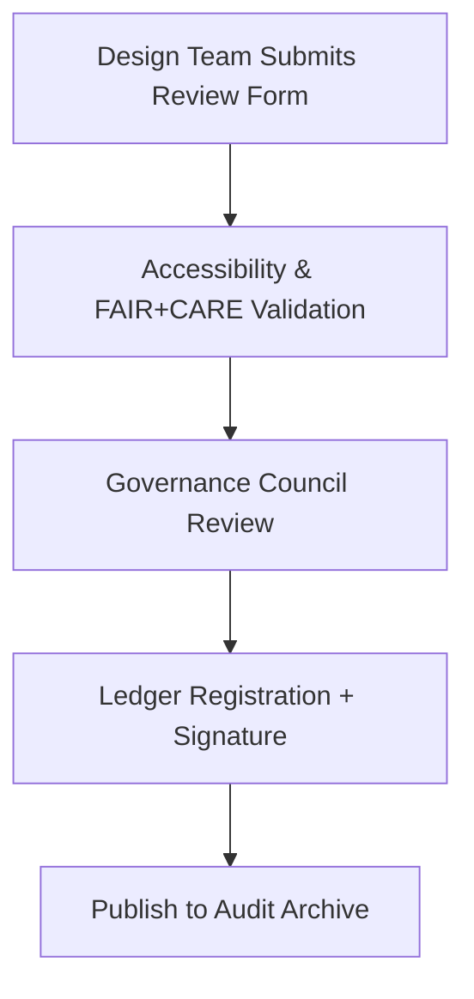

<div align="center">

# 📄 **Kansas Frontier Matrix — Design Review Templates & Audit Forms (v2.1.1 · Tier-Ω+∞ Certified)**  
`docs/design/reviews/templates/README.md`

**Mission:** Provide standardized, FAIR+CARE-aligned templates and audit forms for all **UX design reviews, accessibility audits, and governance evaluations** in the **Kansas Frontier Matrix (KFM)**.

[](../../../../docs/)
[](../../../../docs/standards/accessibility.md)
[](../../../../docs/standards/faircare-validation.md)
[](../../../../LICENSE)

</div>

---

## 📚 Overview

This directory stores **review templates, accessibility audit forms, and FAIR+CARE evaluation sheets** used by the KFM UX and Governance Boards.  
Templates ensure that every design review or audit follows reproducible, measurable, and ethics-aligned standards under **MCP-DL v6.4.3**.

Templates are version-controlled and referenced in:
- `docs/design/reviews/`
- `data/reports/fair/`
- `data/reports/audit/ui_governance_ledger.json`

---

## 🗂️ Directory Layout

```bash
docs/design/reviews/templates/
├── README.md                            # This file — overview of review templates
├── review-template.md                    # General design and accessibility review form
├── accessibility-checklist.md            # WCAG / a11y evaluation checklist
└── faircare-assessment-template.md       # FAIR+CARE ethics and design integrity audit form
```

---

## ⚙️ Template Governance Workflow


<!-- END OF MERMAID -->

---

## 🧱 Template Types & Purposes

| Template | Purpose | Responsible Party | CI Workflow |
|:--|:--|:--|:--|
| **review-template.md** | Standardized quarterly design review format. | @kfm-ux | `design-validate.yml` |
| **accessibility-checklist.md** | WCAG 2.1 AA audit guide. | @kfm-accessibility | `design-validate.yml` |
| **faircare-assessment-template.md** | FAIR+CARE ethical design audit. | @kfm-governance | `faircare-validate.yml` |

---

## 🧩 FAIR + CARE Integration

| Principle | Implementation | Validation |
|:--|:--|:--|
| **Findable** | Template metadata indexed in manifest. | `manifest.zip` |
| **Accessible** | Templates available in Markdown + YAML formats. | GitHub Docs |
| **Interoperable** | Compatible with CI governance workflows. | OPA / Conftest |
| **Reusable** | Reusable structure for all KFM review cycles. | Docs Governance |
| **Collective Benefit (CARE)** | Promotes transparent and inclusive design governance. | FAIR+CARE Board Audit |

---

## 🧩 Accessibility Checklist Highlights

| WCAG Criterion | Description | Validation Method | Status |
|:--|:--|:--|:--:|
| **1.4.3 Contrast (Minimum)** | Text contrast ≥ 4.5:1. | Figma / Lighthouse | ✅ |
| **2.1.1 Keyboard Access** | Interface usable by keyboard only. | Manual + axe-core | ✅ |
| **2.4.6 Headings & Labels** | Descriptive and hierarchical labels. | Manual / CI Parser | ✅ |
| **3.1.2 Language of Parts** | Language declared for multilingual content. | i18n Audit | ✅ |

---

## 🧠 Governance Record Example

```yaml
---
review_template_id: "faircare_assessment_v2.1.1"
version: "v2.1.1"
authors: ["@kfm-ux","@kfm-governance"]
review_cycle: "Quarterly"
approved_by: "@kfm-accessibility"
checksum: "sha256:d3f1e49b9ad6731f0bcf...c85"
license: "CC-BY 4.0"
governance_link: "data/reports/audit/ui_governance_ledger.json"
status: "active"
---
```

---

## 🧾 Validation Workflows

| Workflow | Function | Output |
|:--|:--|:--|
| `design-validate.yml` | Verifies template structure, metadata, and accessibility coverage. | `reports/validation/design_validation.json` |
| `policy-check.yml` | Confirms ownership, licensing, and alignment metadata. | `reports/audit/policy_check.json` |
| `governance-ledger.yml` | Records review template checksums and validation reports. | `data/reports/audit/ui_governance_ledger.json` |

---

## 🕰 Version History

| Version | Date | Author | Summary |
|:--|:--|:--|:--|
| **v2.1.1** | 2025-11-16 | @kfm-governance | Standardized template metadata, FAIR+CARE mapping, and CI workflow references. |
| v2.0.0 | 2025-10-25 | @kfm-ux | Added accessibility checklist and FAIR+CARE assessment template. |
| v1.0.0 | 2025-10-04 | @kfm-architecture | Initial design review templates documentation. |

---

<div align="center">

**Kansas Frontier Matrix © 2025**  
*“Templates Create Consistency — Governance Ensures Accountability.”*  
📍 `docs/design/reviews/templates/README.md` — Standardized templates and governance forms for KFM’s design review process.

</div>

