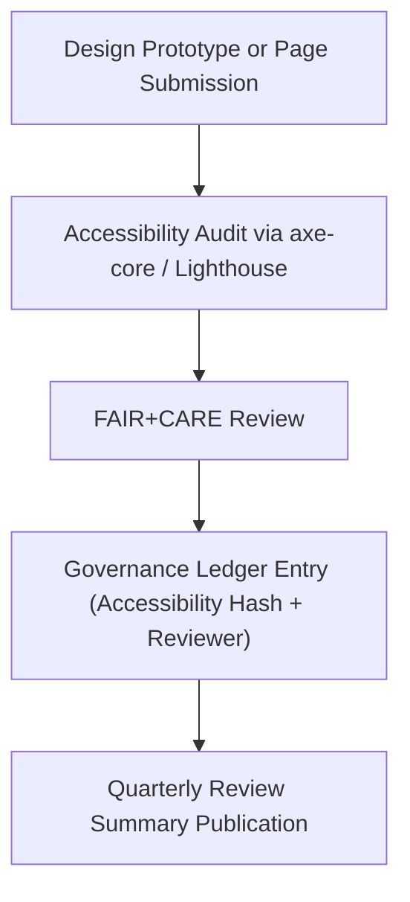

<div align="center">

# ♿ **Kansas Frontier Matrix — Accessibility Review Checklist (WCAG 2.1 AA · Tier-Ω+∞ Certified)**  
`docs/design/reviews/templates/accessibility-checklist.md`

**Mission:** Provide a reproducible, FAIR+CARE-compliant checklist for validating accessibility across all  
**Kansas Frontier Matrix (KFM)** UI components, diagrams, and user interactions in accordance with **WCAG 2.1 AA / 3.0** standards.

[](../../../../docs/standards/accessibility.md)
[](../../../../docs/standards/faircare-validation.md)
[](../../../../LICENSE)

</div>

---

## 📋 Accessibility Review Purpose

The **Accessibility Review Checklist** serves as the official audit form used by the **UX & Accessibility Council**  
to evaluate whether all design assets, documentation, and web UI components meet **accessibility, inclusivity, and ethics compliance** benchmarks.

Each completed checklist must be:
- 🧾 Stored in the **design review archive** (`docs/design/reviews/`).  
- 🔏 Logged in the **governance ledger** with checksum.  
- 🧠 Reviewed quarterly by the **FAIR+CARE Accessibility Committee**.

---

## ✅ Accessibility Audit Checklist

| WCAG Ref | Category | Requirement | Status | Notes |
|:--|:--|:--|:--:|:--|
| **1.1.1** | Text Alternatives | All non-text content has descriptive alt text. | ☐ |  |
| **1.3.1** | Info and Relationships | Structure conveyed through proper HTML semantics. | ☐ |  |
| **1.4.3** | Contrast (Minimum) | Text contrast ratio ≥ 4.5:1. | ☐ |  |
| **1.4.11** | Non-Text Contrast | UI components and graphics have sufficient contrast. | ☐ |  |
| **1.4.12** | Text Spacing | Layout does not break under user-defined spacing. | ☐ |  |
| **2.1.1** | Keyboard Accessibility | All actions available via keyboard navigation. | ☐ |  |
| **2.1.2** | No Keyboard Trap | Users can exit modals and menus via keyboard. | ☐ |  |
| **2.2.2** | Pause, Stop, Hide | Users can control motion, autoplay, or animations. | ☐ |  |
| **2.4.1** | Bypass Blocks | Mechanism to skip repetitive content exists. | ☐ |  |
| **2.4.6** | Headings and Labels | Descriptive headings and form labels used consistently. | ☐ |  |
| **2.4.7** | Focus Visible | Keyboard focus indicator visible and high contrast. | ☐ |  |
| **3.1.2** | Language of Parts | All multilingual elements properly tagged. | ☐ |  |
| **3.2.3** | Consistent Navigation | UI components behave consistently across pages. | ☐ |  |
| **3.3.2** | Labels or Instructions | Clear input guidance provided where required. | ☐ |  |
| **4.1.2** | Name, Role, Value | ARIA attributes correctly implemented and validated. | ☐ |  |

---

## ⚙️ FAIR + CARE Cross-Compliance

| FAIR+CARE Principle | Accessibility Implementation | Validation Method |
|:--|:--|:--|
| **Findable** | Labels and ARIA roles indexed for assistive technology. | axe-core / Lighthouse |
| **Accessible** | WCAG 2.1 AA verified on all UI elements. | Accessibility Audit |
| **Interoperable** | HTML, ARIA, and WCAG semantics validated programmatically. | axe-core CI |
| **Reusable** | Documented design components with governance metadata. | Figma Tokens + Governance Ledger |
| **Collective Benefit (CARE)** | Inclusive, multilingual design accessible to all. | FAIR+CARE Council Review |

---

## 🧠 Accessibility Audit Workflow


<!-- END OF MERMAID -->

---

## 🧩 Accessibility Validation Tools

| Tool | Function | Output |
|:--|:--|:--|
| **axe-core** | Automated WCAG rule validation | JSON report |
| **Lighthouse** | Accessibility and performance scoring | CI HTML report |
| **TPGi Color Contrast Analyzer** | Manual color and visual validation | Reviewer log |
| **Figma a11y Plugin** | Component-level accessibility review | Accessibility metadata |
| **OpenTelemetry** | Tracks accessibility metrics and user feedback | Telemetry dashboard |

---

## 🔍 Governance Integration

| Workflow | Purpose | Output |
|:--|:--|:--|
| `design-validate.yml` | Runs automated a11y validation and metadata checks. | `reports/validation/design_validation.json` |
| `policy-check.yml` | Verifies that accessibility metadata fields exist. | `reports/audit/policy_check.json` |
| `governance-ledger.yml` | Logs accessibility audit records with checksum. | `data/reports/audit/ui_governance_ledger.json` |

---

## 🧾 Accessibility Record Template

```yaml
---
audit_id: "a11y_2025Q4_timeline_component"
review_date: "2025-11-12"
reviewer: "@kfm-accessibility"
component: "Timeline Navigation"
a11y_score: 98
wcag_status: "compliant"
issues_found: 2
issues_resolved: 2
checksum: "sha256:1e9b8dcd8427b4e1f7..."
status: "approved"
ledger_entry: "data/reports/audit/ui_governance_ledger.json"
---
```

---

## 🧾 Version History

| Version | Date | Author | Summary |
|:--|:--|:--|:--|
| **v2.1.1** | 2025-11-16 | @kfm-accessibility | Standardized WCAG checklist, FAIR+CARE mapping, and audit governance workflow. |
| v2.0.0 | 2025-10-25 | @kfm-ux | Added cross-validation with Lighthouse and axe-core integration. |
| v1.0.0 | 2025-10-04 | @kfm-architecture | Initial accessibility checklist and metadata fields. |

---

<div align="center">

**Kansas Frontier Matrix © 2025**  
*“Accessibility is Ethics in Action.”*  
📍 `docs/design/reviews/templates/accessibility-checklist.md` — Standardized accessibility review checklist for the Kansas Frontier Matrix.

</div>

