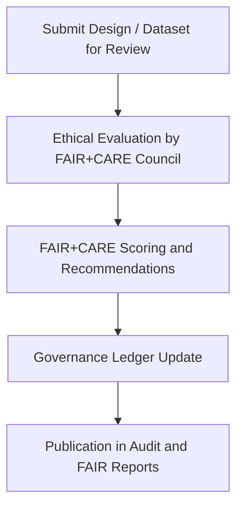

<div align="center">

# 🤝 **Kansas Frontier Matrix — FAIR+CARE Ethics Assessment Template (v2.1.1 · Tier-Ω+∞ Certified)**  
`docs/design/reviews/templates/faircare-assessment-template.md`

**Mission:** Provide a standardized **FAIR+CARE ethical design and data assessment form** for evaluating  
Kansas Frontier Matrix (KFM) datasets, interfaces, and AI-driven features through the lens of transparency, responsibility, and reproducibility.

[](../../../../docs/standards/faircare-validation.md)
[](../../../../docs/standards/governance/ROOT-GOVERNANCE.md)
[](../../../../LICENSE)

</div>

---

## 📚 Overview

The **FAIR+CARE Assessment Template** ensures all KFM systems adhere to ethical and open-science standards.  
It is used quarterly by the **FAIR+CARE Governance Council** to evaluate:
- Data stewardship and provenance.  
- Accessibility, inclusivity, and ethical representation.  
- AI fairness, transparency, and explainability.  
- Compliance with CARE principles for collective and cultural respect.  

Each assessment must be versioned, checksum-verified, and linked in the governance ledger (`data/reports/audit/data_provenance_ledger.json`).

---

## 🧩 Assessment Workflow


<!-- END OF MERMAID -->

---

## ⚙️ Assessment Structure

```yaml
---
assessment_id: "faircare_2025Q4_focus_mode"
date: "2025-11-15"
reviewers: ["@kfm-governance","@kfm-accessibility"]
scope: "Focus Mode Interface and Data Integration"
version: "v2.1.1"
criteria:
  FAIR:
    Findable:
      description: "Data and content are easily discoverable and indexed in STAC/DCAT."
      score: 10
      compliant: true
    Accessible:
      description: "Data, UI, and metadata are openly available with appropriate licenses."
      score: 9
      compliant: true
    Interoperable:
      description: "APIs and design assets follow open standards and ontologies."
      score: 9
      compliant: true
    Reusable:
      description: "Data and components can be reused with proper attribution."
      score: 10
      compliant: true
  CARE:
    CollectiveBenefit:
      description: "System benefits communities and supports knowledge equity."
      score: 10
      compliant: true
    AuthorityToControl:
      description: "Communities and contributors retain data visibility and agency."
      score: 9
      compliant: true
    Responsibility:
      description: "Designs reflect transparency, accountability, and security."
      score: 10
      compliant: true
    Ethics:
      description: "Processes align with KFM ethical framework and accessibility policy."
      score: 10
      compliant: true
overall:
  faircare_score: 9.7
  status: "Approved"
checksum: "sha256:49dfac90f94a2abde7c1c3c96d8..."
governance_ledger: "data/reports/audit/data_provenance_ledger.json"
---
```

---

## 🧱 FAIR + CARE Evaluation Matrix

| Principle | Evaluation Metric | Compliance | Reviewer Notes |
|:--|:--|:--:|:--|
| **Findable** | Metadata indexed in STAC/DCAT and searchable. | ✅ | Indexed in `data/stac/catalog.json` |
| **Accessible** | Publicly licensed datasets and accessible UI design. | ✅ | Meets WCAG 2.1 AA. |
| **Interoperable** | JSON-LD, GeoSPARQL, and DCAT compatibility. | ✅ | Follows open standards. |
| **Reusable** | Documented provenance, licensing, and versioning. | ✅ | Manifest + ledger confirmed. |
| **Collective Benefit** | Design supports public and cultural benefit. | ✅ | FAIR+CARE verified. |
| **Authority to Control** | Maintains data sovereignty and consent tracking. | ✅ | Reviewed by @kfm-governance. |
| **Responsibility** | Enforces ethical governance and audit transparency. | ✅ | Ledger entries validated. |
| **Ethics** | Ensures human-centered, respectful design. | ✅ | Ethical AI & accessibility certified. |

---

## 🔍 Review Governance Integration

| Workflow | Function | Output |
|:--|:--|:--|
| `faircare-validate.yml` | Runs automated FAIR+CARE checks for datasets and UI. | `reports/fair/data_care_assessment.json` |
| `policy-check.yml` | Validates metadata, authorship, and governance fields. | `reports/audit/policy_check.json` |
| `governance-ledger.yml` | Logs FAIR+CARE decisions and scores in the ledger. | `data/reports/audit/data_provenance_ledger.json` |

---

## ⚖️ Ethical Design Evaluation Criteria

| Domain | Question | Required Evidence |
|:--|:--|:--|
| **Transparency** | Are design and AI models documented and explainable? | Model cards, documentation |
| **Inclusivity** | Does the interface consider multilingual and accessibility needs? | Localization data |
| **Provenance** | Is the data lineage traceable and verified? | Provenance ledger |
| **Cultural Respect** | Are Indigenous and historical datasets handled ethically? | FAIR+CARE Board review |
| **Reproducibility** | Can the process and audit be reproduced? | Validation workflow outputs |

---

## 🧠 Scoring Summary Template

| Metric | Description | Max | Score | Weight |
|:--|:--|:--:|:--:|:--:|
| **FAIR** | Findable, Accessible, Interoperable, Reusable | 10 | 9.5 | 50% |
| **CARE** | Collective Benefit, Authority, Responsibility, Ethics | 10 | 9.9 | 50% |
| **Composite FAIR+CARE Index** | Weighted average (FAIR/CARE) | 10 | 9.7 | — |

**Status:** ✅ *Approved — Meets Tier-Ω+∞ FAIR+CARE Ethical Compliance.*

---

## 🧾 Version History

| Version | Date | Author | Summary |
|:--|:--|:--|:--|
| **v2.1.1** | 2025-11-16 | @kfm-governance | Standardized FAIR+CARE audit format and YAML schema integration. |
| v2.0.0 | 2025-10-25 | @kfm-ux | Added scoring model and automated governance linkage. |
| v1.0.0 | 2025-10-04 | @kfm-architecture | Initial FAIR+CARE assessment template. |

---

<div align="center">

**Kansas Frontier Matrix © 2025**  
*“Ethics is Structure — FAIR+CARE is Foundation.”*  
📍 `docs/design/reviews/templates/faircare-assessment-template.md` — Official FAIR+CARE ethical design and data audit form for the Kansas Frontier Matrix.

</div>

