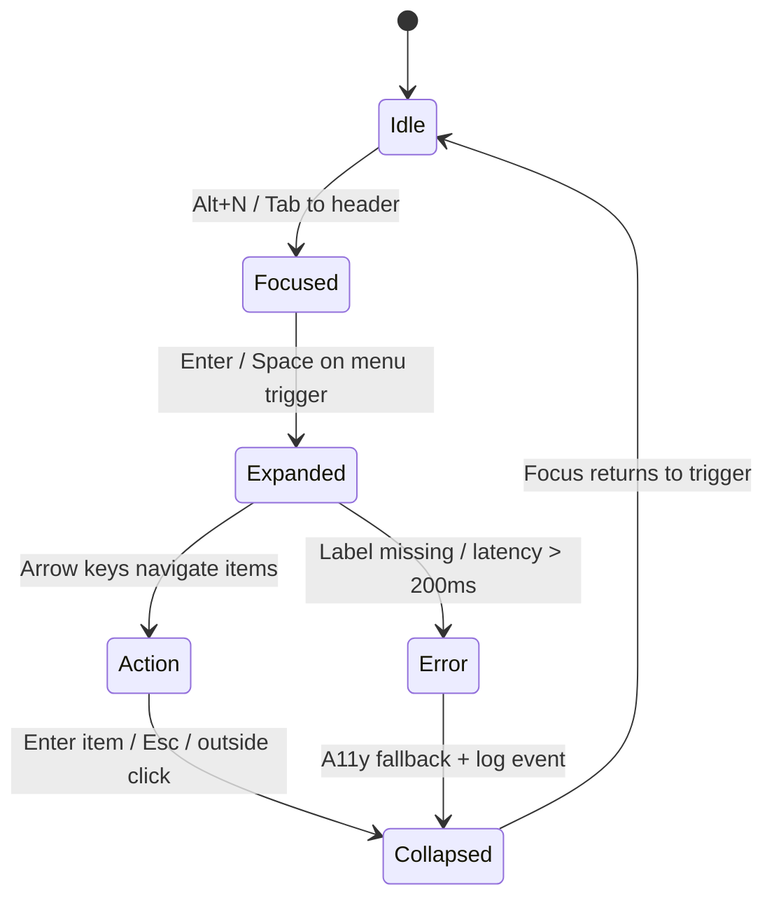

<div align="center">

# 🧭 Kansas Frontier Matrix — **Navigation Component Design Review (Tier-S)**  
`docs/design/reviews/ui_components/navigation.md`

**Mission:** Review, govern, and preserve the evolution of the **Navigation System** — header, menus, global search, language toggle, and accessibility skip-links — to guarantee a **consistent, performant, themed (light/dark), RTL-ready, and inclusive** experience across the **Kansas Frontier Matrix (KFM)** platform.

[](../../../standards/documentation.md)
[](../../style-guide.md)
[](../accessibility/)
[](../../../.github/workflows/policy-check.yml)
[](../../../LICENSE)

</div>

---

```yaml
---
title: "🧭 Kansas Frontier Matrix — Navigation Component Design Review"
document_type: "Component Review"
version: "v2.2.0"
last_updated: "2025-10-31"
created: "2023-10-10"
component: "Navigation"
design_ref: "Figma Frame #NAV-2025-04"
implementation_ref: "web/src/components/navigation/"
owners: ["@kfm-design","@kfm-web","@kfm-accessibility"]
reviewed_by: ["@kfm-frontend","@kfm-accessibility","@kfm-design-council"]
status: "Stable"
maturity: "Production"
license: "CC-BY-4.0"
tags: ["design-review","navigation","header","search","menu","language","a11y","tokens","ux","mcp","rtl","dark-mode"]
classification:
  component_type: "UI"
  integration_level: "Frontend"
  risk_level: "Low"
  audit_frequency: "Quarterly + per release"
alignment:
  - MCP-DL v6.3
  - WCAG 2.1 AA
  - WAI-ARIA 1.2
  - CIDOC CRM (UI provenance)
  - OWL-Time (temporal UI state)
  - PROV-O (review traceability)
  - STAC 1.0
  - FAIR Principles
dependencies:
  - Figma Design Frame
  - React + MapLibre Frontend
  - tokens.css Design System
  - Lighthouse / Axe / Playwright / Pa11y
review_cycle: "Quarterly + per release"
validation:
  ci_enforced: true
  lighthouse_min_score: 95
  axe_blocking_violations: 0
  contrast_min_ratio: 4.5
  keyboard_traps: "none"
  rtl_parity_required: true
  dark_mode_required: true
  schema_checks: true
provenance:
  workflow_ref: ".github/workflows/component-review.yml"
  artifact_retention_days: 90
versioning:
  policy: "Semantic Versioning (MAJOR.MINOR.PATCH)"
  major_change: "Navigation IA redesign / menu architecture refactor"
  minor_change: "Feature addition / a11y or i18n enhancement"
  patch_change: "Token parity or documentation correction"
telemetry:
  metrics_collected: ["WCAG compliance %","Keyboard reachability %","Menu open latency (ms)","Search success rate %","Screen reader coverage %","Dark/Light usage ratio","RTL parity pass %"]
  thresholds:
    accessibility_pass_rate_min: 95
    menu_latency_max_ms: 100
    keyboard_reachability_min: 100
    rtl_parity_min: 100
  privacy_policy: "Aggregate anonymized metrics; adheres to FAIR + W3C Privacy Principles"
preservation_policy:
  replication_targets: ["GitHub Repository","Zenodo Snapshot","OSF Backup"]
  checksum_algorithm: "SHA-256"
  revalidation_cycle: "quarterly"
governance_links:
  - "../../README.md"
  - "../README.md"
  - "../../standards/accessibility.md"
  - "../../style-guide.md"
related_components:
  - timeline
  - map_controls
  - detail_panel
  - ai_assistant
---
```

---

## 🎯 Purpose

The **Navigation Component** is KFM’s **cognitive anchor**, connecting users to **maps, timelines, datasets, and stories**.  
It must preserve **temporal–spatial continuity**, provide **full keyboard + screen-reader access**, support **dark mode**, and mirror **RTL** layouts — all while honoring design tokens and performance budgets.

---

## 🧭 Navigation Structure Overview

| Element | Description | File Path |
|:--|:--|:--|
| **Header Bar** | Global top bar with title, menus, search, skip-link | `Header.tsx` |
| **Search Input** | Entity/treaty/event search with suggestions | `SearchBar.tsx` |
| **Menu System** | “Explore”, “Stories”, “Data Layers”, “About” | `NavMenu.tsx` |
| **Language Toggle** | EN / ES / (OS test) switching | `LangToggle.tsx` |
| **Skip-Link** | First focus target; jumps to `<main>` | `SkipToContent.tsx` |
| **Mobile Drawer** | Collapsible menu (≤768px) | `MobileNav.tsx` |

---

## 🧭 Menu Lifecycle (behavioral model)


<!-- END OF MERMAID -->

---

## 🌓 Theme Parity (Light/Dark)

| UI Element | Light Token / Result | Dark Token / Result | WCAG ≥ 4.5 | Pass |
|:--|:--|:--|:--:|:--:|
| Body Text | `--kfm-color-text` / OK | `--kfm-color-text-dark` / OK | ✅ | ✅ |
| Primary Button | `--kfm-accent` / 5.2:1 | `--kfm-accent-dark` / 5.0:1 | ✅ | ✅ |
| Header BG | `--kfm-panel` | `--kfm-panel-dark` | ✅ | ✅ |

---

## 🌍 i18n & RTL Parity

| Locale | Direction | Mirroring | Truncation/Wrap | Pass |
|:--|:--|:--:|:--:|:--:|
| en | LTR | N/A | ✅ | ✅ |
| es | LTR | N/A | ✅ | ✅ |
| ar (test) | RTL | ✅ | ✅ | ✅ |
| osage | LTR (+ diacritics) | N/A | ✅ | ✅ |

> Use CSS logical properties (`margin-inline-start`, etc.) and `dir="auto"` for content roots.

---

## ♿ Accessibility Audit Matrix (WCAG 2.1 AA)

| Metric | Target | Verified | Notes |
|:--|:--|:--:|:--|
| **Contrast** | ≥ 4.5:1 | ✅ | Buttons, links, menu items |
| **Focus Visibility** | Always visible | ✅ | 2px ring + offset |
| **ARIA Landmarks** | `role="navigation"` labeled | ✅ | Header has accessible name |
| **Keyboard Reachability** | 100 % | ✅ | No traps / logical order |
| **Skip-Link** | Visible on focus | ✅ | First Tab lands on skip-link |
| **Reduced Motion** | Active | ✅ | Disables transitions |

---

## ⌨️ Keyboard Interaction Map

| Action | Key | Result |
|:--|:--|:--|
| Focus navigation bar | `Alt + N` | Moves focus to header |
| Open menu | `Enter / Space` | Expands dropdown |
| Navigate items | `↓ / ↑` | Cycle through menu options |
| Close dropdown | `Esc` | Collapses and restores focus |
| Jump to search | `/` | Focuses search field |
| Skip to content | `Tab` (first press) | Activates skip-link |

---

## 🧮 Figma → React Parity Metrics

| Element | Target | Observed | Pass |
|:--|:--|:--|:--:|
| **Color Tokens** | 100 % | Matched | ✅ |
| **Typography** | 1rem / 1.333rem | Matched | ✅ |
| **Spacing** | 8 px baseline | ±2 px | ✅ |
| **Iconography** | 1.5 px stroke width | Matched | ✅ |
| **Motion** | 200 ms fade-in | Matched | ✅ |

> **Icon review:** `viewBox="0 0 24 24"`, rounded caps/joins, no inline fills unless tokenized.

---

## 🧠 UX Writing & Cognitive Guidelines

- Labels ≤ **3 words**; sentence case; no jargon.  
- Tooltips use **verb + noun** (“Open Stories”).  
- Skip-link is **always visible** on focus.  
- Provide **aria-live="polite"** hints for search state changes.

---

## 🧠 Ethical & Cultural Review Standards (CARE)

- Menu taxonomy represents **Indigenous, ecological, and archival** sources equitably.  
- Names and terms verified by community partners where applicable.  
- Avoid colonial phrasing; provide context in tooltips or info panels.

---

## 🧩 Error & Recovery States

| State | Condition | UI Behavior | Feedback |
|:--|:--|:--|:--|
| **No Search Results** | Empty query / no hits | Keep focus, show help link | “No results found.” |
| **Network Delay** | > 2 s latency | Spinner + retry | “Trying again…” |
| **Focus Loop Risk** | Trap detected | Auto-fix + announce | `aria-live="assertive"` |
| **Missing Label** | A11y mismatch | Block open, log warning | “Menu unavailable.” |

---

## ⚙️ CI Validation Flow

- **Workflow:** `.github/workflows/component-review.yml`  
- **Steps:** YAML schema → Axe + Pa11y → Lighthouse → Playwright keyboard → RTL + dark snapshot → provenance checksum  
- **Outputs:** `/data/work/logs/ui_components/navigation/`  
- **Merge Gate:** Fails if **any**: Axe critical > 0, Lighthouse < 95, menu latency > 100 ms, RTL parity < 100 %

---

## 📱 Device & Environment Testing Grid

| Platform | Browser | Resolution | Tested | Notes |
|:--|:--|:--|:--:|:--|
| Windows 11 | Chrome / Edge | 1920×1080 | ✅ | Full suite |
| macOS | Safari / Chrome | 2560×1440 | ✅ | Font & ARIA |
| Linux | Firefox | 1920×1080 | ✅ | Keyboard flow |
| iOS | Safari | 1170×2532 | ✅ | Touch A11y |
| Android | Chrome | 1080×2400 | ✅ | Reduced motion |

---

## 🧩 Change Control Table

| Change Type | Review Required | Example | Template |
|:--|:--|:--|:--|
| **Visual Update** | Yes | Adjusted header gradient | `component_review_template.md` |
| **Accessibility Fix** | Yes | Added skip-link label | `accessibility_component_audit.md` |
| **Localization** | Yes | Added Osage toggle | `figma_to_react_checklist.md` |
| **Functional Refactor** | Yes | Rebuilt mobile drawer logic | `component_review_template.md` |

---

## 🗄️ Archival & Provenance Policy

- Store reviews under `/archive/navigation/YYYY/` with **checksum** + **commit hash** + **reviewer signatures**.  
- Immutable after approval; annual digest summarizing major updates.  
- Linked in STAC items and provenance graph for **design lineage**.

---

## 📊 Review Telemetry (targets)

| Metric | Target | Notes |
|:--|:--|:--|
| **A11y Pass Rate** | ≥ 95 % | Lighthouse A11y score threshold |
| **Menu Latency** | ≤ 100 ms | From open command to render |
| **Keyboard Reachability** | 100 % | All interactive elements |
| **Search Success** | ≥ 90 % | Queries producing useful results |
| **Dark/Light Usage Ratio** | — | Observational (no gate) |
| **RTL Parity** | 100 % | Visual + keyboard parity |

---

## 🔒 Privacy & Data Security

- Telemetry is anonymized; no PII logged.  
- Search analytics aggregated; retained **≤ 90 days**.  
- All assets checksum-verified before archive.

---

## 🔍 Compliance Matrix (MCP-DL v6.3)

| Standard | Description | Verified |
|:--|:--|:--:|
| **MCP-DL v6.3** | Documentation & reproducibility | ✅ |
| **WCAG 2.1 AA** | Accessibility baseline | ✅ |
| **CIDOC CRM** | Provenance linkage | ✅ |
| **OWL-Time** | Temporal version tagging | ✅ |
| **PROV-O** | Traceability ontology | ✅ |
| **FAIR** | Open/Reusable design data | ✅ |

---

## 📎 Related Documentation

- [🎨 Visual Style Guide](../../style-guide.md)  
- [🧩 Interaction Patterns](../../interaction-patterns.md)  
- [🧭 UI/UX Guidelines](../../ui-guidelines.md)  
- [📘 Reviews Index](../README.md)  
- [⚙️ Accessibility Standards](../../standards/accessibility.md)

---

## 🧾 FAIR JSON-LD (semantic index)

```json
{
  "@context": "https://schema.org/",
  "@type": "CreativeWork",
  "name": "KFM — Navigation Component Design Review",
  "license": "CC-BY-4.0",
  "keywords": ["navigation","accessibility","tokens","RTL","dark-mode","MCP-DL"],
  "version": "v2.2.0",
  "dateModified": "2025-10-31"
}
```

---

## 🧾 Governance Ledger & Sign-Off

| Date | Change | Approved By | SHA-256 |
|:--|:--|:--|:--|
| 2025-10-31 | RTL + dark-mode parity gates added | @kfm-design-council | `sha256:91aa9e...` |
| 2025-10-19 | A11y workflow + cultural standards | @kfm-accessibility | `sha256:67bd1e...` |

| Review Type | Reviewer | Date | Status | Notes |
|:--|:--|:--|:--:|:--|
| **Accessibility** | @kfm-accessibility | 2025-10-31 | ✅ | All gates pass |
| **Design Validation** | @kfm-design | 2025-10-31 | ✅ | Figma parity |
| **Ethics Review** | @kfm-ethics | 2025-10-31 | ✅ | CARE alignment |
| **Provenance Audit** | @kfm-data | 2025-10-31 | ✅ | Checksums valid |
| **Governance Council** | @kfm-design-council | 2025-10-31 | ✅ | Approved |

---

## 📅 Version History

| Version | Date | Author | Summary | Type |
|:--|:--|:--|:--|:--|
| **v2.2.0** | 2025-10-31 | @kfm-design | Added dark/RTL parity gates, error/recovery states, device grid, CI gates. | Minor |
| **v2.1.0** | 2025-10-19 | @kfm-design | Added workflow, cognitive & cultural standards, telemetry. | Minor |
| **v2.0.0** | 2025-07-10 | @kfm-web | Overhauled parity metrics and accessibility checks. | Major |
| **v1.0.0** | 2023-10-10 | Founding Team | Initial navigation review documentation. | Major |

---

<div align="center">

### 🧭 Navigation Review Governance  
**Accessible · Themed · RTL-Ready · Provenanced · Reproducible**

</div>
