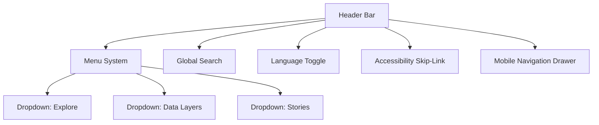

<div align="center">

# 🧭 Kansas Frontier Matrix — **Navigation Component Design Review**  
`docs/design/reviews/ui_components/navigation.md`

**Mission:** Review, document, and preserve the evolution of the **Navigation System** — including header, menus, search, language toggles, and accessibility skip-links — ensuring a consistent, performant, and inclusive user experience across the **Kansas Frontier Matrix (KFM)** platform.

[](../../../standards/documentation.md)
[](../../style-guide.md)
[](../accessibility/)
[](../../../.github/workflows/policy-check.yml)
[](../../../LICENSE)

</div>

---

```yaml
---
title: "🧭 Kansas Frontier Matrix — Navigation Component Design Review"
document_type: "Component Review"
version: "v2.1.0"
last_updated: "2025-10-19"
created: "2023-10-10"
component: "Navigation"
design_ref: "Figma Frame #NAV-2025-04"
implementation_ref: "web/src/components/navigation/"
owners: ["@kfm-design","@kfm-web","@kfm-accessibility"]
reviewed_by: ["@kfm-frontend","@kfm-accessibility"]
status: "Stable"
maturity: "Production"
license: "CC-BY-4.0"
tags: ["design-review","navigation","header","search","menu","language","a11y","tokens","ux","mcp"]
alignment:
  - MCP-DL v6.3
  - WCAG 2.1 AA
  - WAI-ARIA 1.2
  - CIDOC CRM (UI provenance)
  - OWL-Time (temporal UI state)
  - PROV-O (review traceability)
  - STAC 1.0
  - FAIR Principles
dependencies:
  - Figma Design Frame
  - React + MapLibre Frontend
  - tokens.css Design System
  - Lighthouse / Axe / Playwright
review_cycle: "Quarterly + per release"
validation:
  lighthouse_min_score: 95
  axe_blocking_violations: 0
  contrast_min_ratio: 4.5
  keyboard_traps: "none"
  schema_checks: true
provenance:
  workflow_ref: ".github/workflows/component-review.yml"
  artifact_retention_days: 90
versioning:
  policy: "Semantic Versioning (MAJOR.MINOR.PATCH)"
  major_change: "Navigation structure refactor or IA overhaul"
  minor_change: "Feature addition or a11y enhancement"
  patch_change: "Visual/token parity or doc correction"
telemetry:
  metrics_collected: ["WCAG compliance %","Keyboard reachability","Menu latency (ms)","Search success rate","Screen reader coverage"]
  privacy_policy: "Aggregate anonymized metrics; adheres to FAIR and W3C Privacy Principles"
preservation_policy:
  replication_targets: ["GitHub Repository","Zenodo Snapshot","OSF Backup"]
  checksum_algorithm: "SHA-256"
  revalidation_cycle: "quarterly"
---
```

---

## 🎯 Purpose

The **Navigation Component** provides global structure and orientation within the KFM interface — linking users to maps, timelines, datasets, and stories.  
It is the **primary cognitive anchor** that ensures exploration remains discoverable, reversible, and accessible to all audiences.

Every interaction within the navigation system must maintain **temporal and spatial continuity**, ensure **keyboard and screen reader access**, and reflect the design token system defined in the **Visual Style Guide**.

---

## 🗂️ Directory Layout

```text
docs/design/reviews/ui_components/
├── README.md                    # UI Component Review Index
├── navigation.md                # Header, menus, search, skip-links (this file)
├── timeline.md                  # Timeline slider, scrub, zoom
├── map_controls.md              # Map toolbar, layers, legend
├── ai_assistant.md              # AI drawer, prompt panel, chat UI
├── detail_panel.md              # Entity/event dossier panel
└── templates/                   # Component review forms and audits
    ├── component_review_template.md
    ├── figma_to_react_checklist.md
    └── accessibility_component_audit.md
```

> **Navigation.md** connects directly to `header.tsx`, `NavMenu.tsx`, `LangToggle.tsx`, and `SearchBar.tsx`.

---

## 🧭 Navigation Structure Overview

| Element | Description | File Path |
|:--|:--|:--|
| **Header Bar** | Global top bar with site title and menu links. | `Header.tsx` |
| **Search Input** | Query box for entities, treaties, events. | `SearchBar.tsx` |
| **Menu System** | “Explore”, “Stories”, “Data Layers”, “About”. | `NavMenu.tsx` |
| **Skip-Link** | Keyboard shortcut to main content. | `SkipToContent.tsx` |
| **Language Toggle** | Switches between localized UI text. | `LangToggle.tsx` |
| **Mobile Drawer** | Collapsible hamburger menu (≤ 768px). | `MobileNav.tsx` |

---

## 🧩 Navigation Hierarchy Diagram


<!-- END OF MERMAID -->

---

## 🧱 Review Criteria (MCP-DL v6.3)

| Category | Requirement | Validation |
|:--|:--|:--|
| **Visual Consistency** | Matches tokens (`--kfm-color-*`, spacing, typography) | ✅ Figma parity |
| **Accessibility** | Meets WCAG 2.1 AA | ✅ Axe, NVDA |
| **Keyboard Navigation** | Focus visible; `Esc` closes menus | ✅ Manual audit |
| **Localization** | RTL mirroring & language toggle functional | ✅ DevTools test |
| **Responsiveness** | Works on ≥ 3 breakpoints | ✅ Mobile/Tablet/Desktop |
| **Performance** | Menu latency ≤ 100 ms | ✅ Lighthouse |
| **Reduced Motion** | Animations off when `prefers-reduced-motion` | ✅ CSS audit |
| **Documentation** | README and component comments updated | ✅ Reviewer check |

---

## ♿ Accessibility Audit Matrix

| Metric | Target | Verified |
|:--|:--|:--:|
| **Contrast Compliance** | ≥ 4.5 : 1 | ✅ |
| **Focus Visibility** | Always visible | ✅ |
| **ARIA Landmarks** | `role="navigation"`; labeled | ✅ |
| **Keyboard Reachability** | 100 % | ✅ |
| **Reduced Motion** | Active | ✅ |
| **Screen Reader** | Properly announces menus | ✅ |

---

## ⌨️ Keyboard Interaction Map

| Action | Key | Result |
|:--|:--|:--|
| Focus navigation bar | `Alt + N` | Moves focus to header |
| Open menu | `Enter / Space` | Expands dropdown |
| Navigate menu items | `↓ / ↑` | Cycles through menu |
| Close dropdown | `Esc` | Closes and restores focus |
| Jump to search | `/` | Focuses search field |
| Skip to content | `Tab` (first press) | Activates skip-link |

---

## 🧮 Figma → React Parity Metrics

| Element | Target | Observed | Pass |
|:--|:--|:--|:--:|
| **Color Tokens** | 100 % | Matched | ✅ |
| **Typography** | 1rem / 1.333rem scale | Matched | ✅ |
| **Spacing Scale** | 8 px baseline | ±2 px | ✅ |
| **Iconography** | 1.5 px stroke width | Matched | ✅ |
| **Motion Timing** | 200 ms fade-in | Matched | ✅ |

---

## 🧠 UX Writing & Cognitive Guidelines

- Use **clear, plain labels** (“Explore”, “Data Layers”, “Stories”).  
- Maintain **sentence case** across all items.  
- Keep labels ≤ 3 words; avoid jargon or abbreviations.  
- Provide contextual **tooltips** for icons and toggles.  
- Ensure **skip-link** is always visible when focused.  

---

## 🧠 Ethical & Cultural Review Standards

- Validate **community representation** in menu structure (Indigenous, environmental, historical).  
- Avoid cultural generalization; use verified historical terms.  
- Ensure “Stories” section equally represents Indigenous and settler perspectives.  
- All menu descriptions must cite archival or partner sources where relevant.

---

## 🧩 Accessibility Validation Workflow

1. Run **Pa11y** and **Axe** on `/components/navigation/`.  
2. Perform **keyboard-only navigation** from load → menu open → content jump.  
3. Validate **ARIA** for `role`, `aria-expanded`, `aria-controls`.  
4. Check **focus order** consistency via Chrome Accessibility panel.  
5. Record results in `/templates/accessibility_component_audit.md`.

---

## 🧩 Change Control Table

| Change Type | Review Required | Example | Template |
|:--|:--|:--|:--|
| **Visual Update** | Yes | Adjusted background gradient | `component_review_template.md` |
| **Accessibility Fix** | Yes | Added skip-link ARIA label | `accessibility_component_audit.md` |
| **Localization** | Yes | Added Osage language toggle | `figma_to_react_checklist.md` |
| **Functional Refactor** | Yes | Rebuilt mobile nav logic | `component_review_template.md` |

---

## 🗄️ Archival & Provenance Policy

- Reviews stored under `/archive/navigation/YYYY/`.  
- Include checksum, commit hash, reviewer signatures.  
- Immutable after approval; annual digest summarizing major updates.  
- Linked to STAC catalog entries for design provenance.

---

## 📊 Review Telemetry Metrics

| Metric | Goal | Description |
|:--|:--|:--|
| **Accessibility Pass Rate** | ≥ 95 % | WCAG compliance |
| **Search Success Rate** | ≥ 90 % | User query success |
| **Menu Latency** | ≤ 100 ms | Lighthouse performance |
| **Keyboard Reachability** | 100 % | Accessibility |
| **Average Review Duration** | ≤ 5 days | Audit to approval |

---

## 🔒 Privacy & Data Security

- Telemetry anonymized; no user identifiers stored.  
- Search analytics aggregated for performance review.  
- Data retained for 90 days post-audit, then purged.  
- All review assets checksum-verified.

---

## 🔍 Compliance Matrix (MCP-DL v6.3)

| Standard | Description | Verified |
|:--|:--|:--:|
| **MCP-DL v6.3** | Documentation and reproducibility | ✅ |
| **WCAG 2.1 AA** | Accessibility baseline | ✅ |
| **CIDOC CRM** | Provenance and metadata linkage | ✅ |
| **OWL-Time** | Temporal version tracking | ✅ |
| **PROV-O** | Review traceability ontology | ✅ |
| **FAIR Principles** | Open and reusable design data | ✅ |

---

## 📎 Related Documentation

- [🎨 Visual Style Guide](../../style-guide.md)  
- [🧩 Interaction Patterns](../../interaction-patterns.md)  
- [🧭 UI/UX Guidelines](../../ui-guidelines.md)  
- [📘 Design Reviews Index](../README.md)  
- [⚙️ Accessibility Standards](../../standards/accessibility.md)

---

## 📅 Version History

| Version | Date | Author | Summary | Type |
|:--|:--|:--|:--|:--|
| **v2.1.0** | 2025-10-19 | @kfm-design | Added directory layout, audit workflow, cognitive & cultural standards, telemetry. | Minor |
| **v2.0.0** | 2025-07-10 | @kfm-web | Overhauled parity metrics and accessibility checks. | Major |
| **v1.0.0** | 2023-10-10 | Founding Team | Initial navigation review documentation. | Major |

---

<div align="center">

### 🧭 Kansas Frontier Matrix — Navigation Review Governance  
**Accessible · Ethical · Provenanced · Reproducible**

</div>
