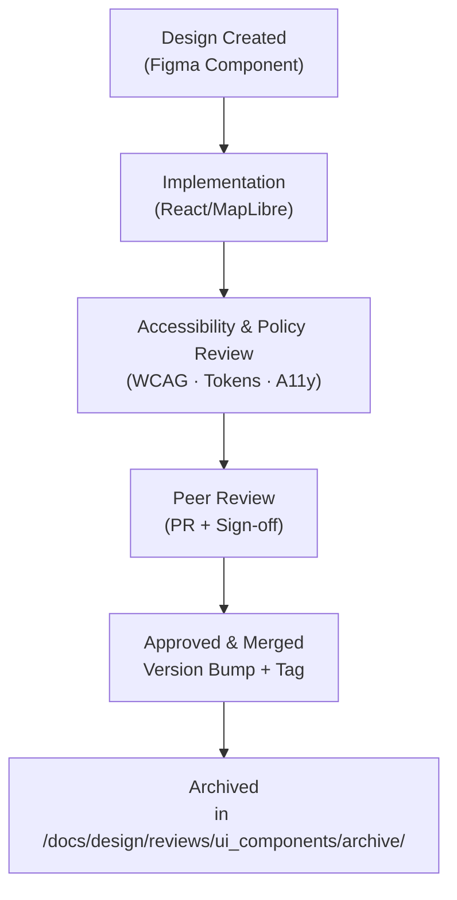

<div align="center">

# 🧭 Kansas Frontier Matrix — **UI Component Design Reviews**  
`docs/design/reviews/ui_components/`

**Mission:** Maintain a unified, reproducible audit record for every **user-interface component** in  
the **Kansas Frontier Matrix (KFM)** — from Figma design frames to React/MapLibre implementations —  
ensuring that each component remains **accessible**, **performant**, and **aligned with MCP-DL v6.3**  
principles of documentation-first reproducibility.

[](../../../standards/documentation.md)
[](../../)
[](../accessibility/)
[](../../../.github/workflows/policy-check.yml)
[](../../../LICENSE)

</div>

---

```yaml
---
title: "🧭 Kansas Frontier Matrix — UI Component Design Reviews"
document_type: "README"
version: "v2.2.0"
last_updated: "2025-10-19"
created: "2023-09-14"
owners: ["@kfm-design","@kfm-web","@kfm-accessibility","@kfm-architecture"]
status: "Stable"
maturity: "Production"
license: "CC-BY-4.0"
tags: ["design-review","ui","ux","component","figma","react","maplibre","accessibility","a11y","tokens"]
alignment:
  - MCP-DL v6.3
  - WCAG 2.1 AA
  - WAI-ARIA 1.2
  - CIDOC CRM (component provenance)
  - OWL-Time (temporal trace)
  - STAC 1.0
  - FAIR Principles
dependencies:
  - Figma
  - React + MapLibre
  - tokens.css Design System
  - Lighthouse / Axe / Playwright
review_cycle: "Per component release and quarterly audit"
governance_board: ["@kfm-design-council","@kfm-accessibility-lead"]
maturity_score: "A+"
validation:
  lighthouse_min_score: 95
  axe_blocking_violations: 0
  contrast_min_ratio: 4.5
  keyboard_traps: "none"
  figma_to_react_parity: true
  schema_checks: true
provenance:
  reviewed_by: ["@kfm-accessibility","@kfm-frontend","@kfm-design-council"]
  workflow_ref: ".github/workflows/component-review.yml"
  artifact_retention_days: 90
versioning:
  policy: "Semantic Versioning (MAJOR.MINOR.PATCH)"
  major_change: "Breaking redesign or architecture refactor"
  minor_change: "New components, tokens, or accessibility features"
  patch_change: "Fixes, typos, metadata corrections"
telemetry:
  metrics_collected: ["Figma→React Parity %","WCAG Compliance %","Keyboard Reachability %","Average Review Duration (days)"]
  privacy_policy: "Aggregate and anonymized metrics only; no PII; W3C Privacy compliance."
preservation_policy:
  replication_targets: ["GitHub Repository","Zenodo Snapshot","OSF Backup"]
  checksum_algorithm: "SHA-256"
  revalidation_cycle: "quarterly"
semantic_alignment:
  - CIDOC CRM (review provenance)
  - OWL-Time (temporal versioning)
  - PROV-O (design traceability)
  - FAIR Principles (reusability)
---
```

---

## 🎯 Objective

This directory tracks **UI component design reviews** to ensure that every interactive element meets  
**visual**, **behavioral**, and **accessibility** standards. Each review documents the component’s full lifecycle:  
**design → implementation → review → versioning → archival**.

UI components are the bridge between **data (Neo4j knowledge graph)** and **interaction (map + timeline)**;  
every change must preserve **time–space–story alignment** in the Kansas Frontier Matrix.

---

## 🗂️ Directory Layout

```text
docs/design/reviews/ui_components/
├── README.md                    # This index
├── navigation.md                # Header, search, menus
├── timeline.md                  # Timeline slider, scrub, zoom
├── map_controls.md              # Map toolbar, layers, legend
├── ai_assistant.md              # AI drawer, prompt panel, chat UI
├── detail_panel.md              # Entity/event dossier panel
└── templates/                   # Forms for component-level reviews
    ├── component_review_template.md
    ├── figma_to_react_checklist.md
    └── accessibility_component_audit.md
```

Each markdown file includes:
- **Design reference:** Figma node ID / frame name.  
- **Implementation reference:** React component path (`web/src/components/...`).  
- **Review metadata:** commit, reviewers, checklist, decisions.

---

## 🧩 Review Criteria (MCP-Aligned)

| Category | Requirement | Validation |
|:--|:--|:--|
| **Visual Consistency** | Matches design tokens (`--kfm-color-*`, typography, spacing) | ✅ Figma → React parity |
| **Responsiveness** | Adapts across ≥ 3 breakpoints | ✅ Chrome DevTools audit |
| **Accessibility** | Meets WCAG 2.1 AA; ARIA roles verified | ✅ Screen reader + tab test |
| **Performance** | ≤ 16 ms paint for animation or transition | ✅ Lighthouse/Profiler |
| **Interaction Feedback** | Clear hover/focus/active states | ✅ Manual test |
| **State Management** | Uses Context or props (stateless logic) | ✅ Code review |
| **Documentation** | README + comments updated | ✅ Reviewer check |
| **Versioning** | Semantic version bump logged | ✅ semver in front matter |

---

## 🧠 Component Review Lifecycle


<!-- END OF MERMAID -->

**Workflow Steps**
1. 🧱 **Open Review** — Copy template from `/templates/component_review_template.md`.  
2. 🎨 **Link Assets** — Reference Figma frame + React path.  
3. ♿ **Evaluate** — Follow MCP checklist (clarity · consistency · compliance · reproducibility).  
4. 🧾 **Document** — Include screenshots, accessibility notes, code diffs.  
5. ✅ **Approve** — ≥ 2 reviewer sign-offs; PR tagged `design-review`.  
6. 🗄️ **Archive** — Move to `/archive/` after merge for provenance tracking.

---

## ♿ Accessibility & Keyboard Review Matrix

| Feature | Rule | Example |
|:--|:--|:--|
| **Keyboard Navigation** | All focusable elements reachable | Tab + Shift+Tab sequence |
| **Focus Ring** | 2px accent outline | `outline: 2px solid var(--color-accent);` |
| **ARIA Roles** | Correct for widget type | `role="dialog"`, `aria-expanded`, etc. |
| **Contrast** | ≥ 4.5:1 for text, ≥ 3:1 for icons | Verified via Pa11y |
| **Reduced Motion** | Honors user preference | `prefers-reduced-motion` test |
| **Screen Reader** | Descriptive labels for icons | `aria-label="Toggle Map Layer"` |

---

## ⌨️ Keyboard Testing Map

| Action | Key | Result |
|:--|:--|:--|
| Next interactive element | `Tab` | Moves focus logically through UI |
| Previous element | `Shift+Tab` | Reverse focus order |
| Toggle state | `Space / Enter` | Button pressed + live region update |
| Exit modal/drawer | `Esc` | Returns focus to trigger |
| Activate tooltip/help | `Alt+/` | Opens help overlay |

---

## 🧮 Accessibility Audit Metrics

| Metric | Target | Verified |
|:--|:--|:--:|
| **Contrast compliance** | ≥ 4.5 : 1 | ✅ |
| **Keyboard reachability** | 100 % | ✅ |
| **Screen reader support** | 100 % tested | ✅ |
| **Reduced motion** | 100 % functional | ✅ |
| **ARIA accuracy** | ≥ 95 % | ✅ |

---

## 🧩 Example Component Review (Schema)

```yaml
---
component: "TimelineSlider"
design_ref: "Figma Frame #1203"
implementation_ref: "web/src/components/timeline/TimelineSlider.tsx"
commit: "a3c9d1f"
reviewed_by: ["@kfm-web","@kfm-accessibility"]
approved_on: "2025-10-19"
wcag_level: "AA"
contrast_ratio: "4.7:1"
keyboard_focus_order: ["input","slider","reset"]
status: "Approved"
semver_bump: "minor"
---
```

---

## 🧠 Ethical & Cognitive Design Standards

- Use plain, inclusive, and neutral language for all labels/tooltips.  
- Avoid cognitive overload — ≤ 5 actionable UI elements per viewport.  
- Provide alternate text for icons and metaphors.  
- Include cultural/Indigenous data disclaimers where relevant.  
- AI-related interfaces must display confidence and citations clearly.  

---

## 🗄️ Archival & Provenance Policy

- Reviews are **immutable** post-approval.  
- Archived under `/archive/YYYY/` by year.  
- Metadata includes commit SHA, reviewer list, checksum.  
- Annual digest summarizes all component updates.  

---

## 📊 Review Metrics & Telemetry

| Metric | Goal | Description |
|:--|:--|:--|
| **Figma→React Parity** | ≥ 95% | Design implementation alignment |
| **Accessibility Pass Rate** | ≥ 95% | WCAG/ARIA conformance |
| **Keyboard Coverage** | 100% | Focus order verification |
| **Avg. Review Duration** | ≤ 5 days | From PR open to approval |
| **Archival Compliance** | 100% | All reviews archived in `/archive/` |

---

## ⚙️ Continuous Integration (Component QA)

**Workflow:** `.github/workflows/component-review.yml`

- Validates YAML front matter + template compliance.  
- Checks ARIA and WCAG compliance via Axe + Pa11y.  
- Confirms parity between Figma tokens and React CSS exports.  
- Posts summary comment with pass/fail report.

---

## 🔍 Compliance Matrix (MCP-DL v6.3)

| Standard | Description | Verified |
|:--|:--|:--:|
| **MCP-DL v6.3** | Review governance compliance | ✅ |
| **WCAG 2.1 AA** | Accessibility baseline | ✅ |
| **CIDOC CRM** | Component provenance alignment | ✅ |
| **OWL-Time** | Versioning timeline | ✅ |
| **STAC 1.0** | Linked design assets | ✅ |
| **FAIR Principles** | Reusability & interoperability | ✅ |

---

## 📎 Related Documentation

- [🎨 Visual Style Guide](../../style-guide.md)  
- [🧭 UI/UX Guidelines](../../ui-guidelines.md)  
- [🧩 Interaction Patterns](../../interaction-patterns.md)  
- [📖 Storytelling & Narrative Design](../../storytelling.md)  
- [🧱 Architecture Components](../../../architecture/component-architecture.md)  
- [⚙️ Accessibility Standards](../../standards/accessibility.md)

---

## 📅 Version Policy & History

| Level | Trigger | Example |
|:--|:--|:--|
| **Major** | Component structure refactor | v3.0.0 |
| **Minor** | New checklist/template | v2.2.0 |
| **Patch** | Metadata or link fix | v2.1.1 |

| Version | Date | Author | Summary | Type |
|:--|:--|:--|:--|:--|
| **v2.2.0** | 2025-10-19 | @kfm-design | Added telemetry, cognitive standards, CI workflow, and example schema. | Minor |
| **v2.1.0** | 2025-08-12 | @kfm-web | Introduced parity checks and archive policies. | Minor |
| **v2.0.0** | 2024-11-05 | @kfm-core | Migrated to MCP-DL v6.3 framework. | Major |
| **v1.0.0** | 2023-09-14 | Founding Team | Initial UI component review index. | Major |

---

<div align="center">

### 🧭 Kansas Frontier Matrix — **UI Component Review Governance**

**Visual · Accessible · Provenanced · Reproducible**

</div>
