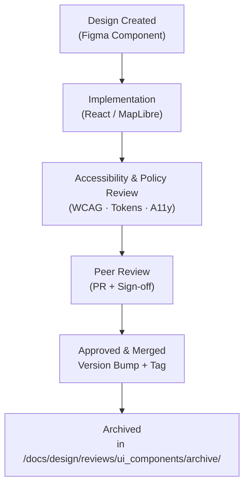
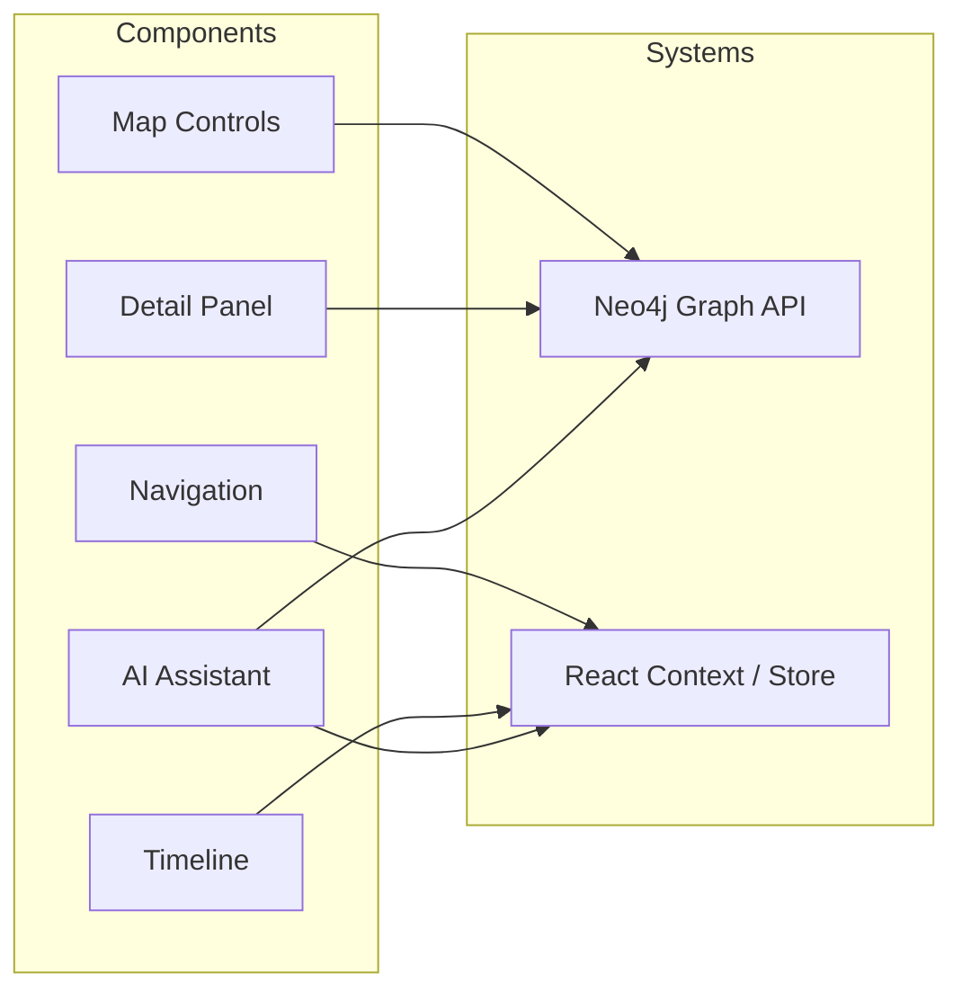

<div align="center">

# 🧭 Kansas Frontier Matrix — **UI Component Design Reviews**  
`docs/design/reviews/ui_components/`

**Mission:** Maintain a unified, reproducible audit record for every **user-interface component**  
in the **Kansas Frontier Matrix (KFM)** — from Figma design frames to React/MapLibre implementations —  
ensuring that each component is **accessible**, **performant**, and **aligned** with **MCP-DL v6.3**  
principles of documentation-first reproducibility and open design governance.

[](../../../standards/documentation.md)
[](../../)
[](../accessibility/)
[](../../../.github/workflows/policy-check.yml)
[](../../../LICENSE)

</div>

---

```yaml
---
title: "🧭 Kansas Frontier Matrix — UI Component Design Reviews"
document_type: "README"
version: "v2.3.0"
last_updated: "2025-10-19"
created: "2023-09-14"
owners: ["@kfm-design","@kfm-web","@kfm-accessibility","@kfm-architecture"]
status: "Stable"
maturity: "Production"
license: "CC-BY-4.0"
tags: ["design-review","ui","ux","component","figma","react","maplibre","accessibility","tokens","mcp"]
alignment:
  - MCP-DL v6.3
  - WCAG 2.1 AA
  - WAI-ARIA 1.2
  - CIDOC CRM (component provenance)
  - OWL-Time (temporal release mapping)
  - PROV-O (traceability ontology)
  - STAC 1.0
  - FAIR Principles
dependencies:
  - Figma
  - React + MapLibre
  - tokens.css Design System
  - Lighthouse / Axe / Playwright
  - GitHub Actions CI
review_cycle: "Per component release and quarterly audit"
governance_board: ["@kfm-design-council","@kfm-accessibility-lead"]
maturity_score: "A+"
review_frequency: "Per release + quarterly governance review"
validation:
  lighthouse_min_score: 95
  axe_blocking_violations: 0
  contrast_min_ratio: 4.5
  keyboard_traps: "none"
  figma_to_react_parity: true
  schema_checks: true
provenance:
  reviewed_by: ["@kfm-accessibility","@kfm-frontend","@kfm-design-council"]
  workflow_ref: ".github/workflows/component-review.yml"
  artifact_retention_days: 90
versioning:
  policy: "Semantic Versioning (MAJOR.MINOR.PATCH)"
  major_change: "Breaking redesign or refactor"
  minor_change: "New component, token, or accessibility feature"
  patch_change: "Typo, link, or metadata update"
telemetry:
  metrics_collected: ["Figma↔React parity %","WCAG success ratio","Keyboard reachability %","Avg. review duration (days)"]
  privacy_policy: "Aggregate metrics only; W3C Privacy compliant; no PII."
preservation_policy:
  replication_targets: ["GitHub Repository","Zenodo Snapshot","OSF Backup"]
  checksum_algorithm: "SHA-256"
  revalidation_cycle: "quarterly"
semantic_alignment:
  - CIDOC CRM (review provenance)
  - OWL-Time (temporal versioning)
  - PROV-O (design traceability)
  - FAIR Principles (reusability)
---
```

---

## 🎯 Objective

This directory tracks **UI component design reviews** to ensure all interface elements meet  
KFM’s **visual**, **interaction**, and **accessibility** standards. Each record documents the component lifecycle —  
**design → implementation → review → versioning → archival** — providing a transparent provenance chain.

Every UI component connects **data (Neo4j graph)** and **interaction (Map + Timeline)**, ensuring  
time, space, and story stay synchronized within the Kansas Frontier Matrix.

---

## 🗂️ Directory Layout

```text
docs/design/reviews/ui_components/
├── README.md                    # This index
├── navigation.md                # Header, search, menus
├── timeline.md                  # Timeline slider, scrub, zoom
├── map_controls.md              # Map toolbar, layers, legend
├── ai_assistant.md              # AI drawer, prompt panel, chat UI
├── detail_panel.md              # Entity/event dossier panel
└── templates/                   # Component-level review forms
    ├── component_review_template.md
    ├── figma_to_react_checklist.md
    └── accessibility_component_audit.md
```

---

## 🧭 Component Taxonomy

| Category | Components | Reviewer Roles |
|:--|:--|:--|
| **Navigation** | Header, menus, search | UI + Accessibility |
| **Map** | Toolbar, layers, legends | Interaction + MapLibre |
| **Timeline** | Scrubber, slider, zoom | UX + Performance |
| **Panels** | Detail drawers, modals | Accessibility + Content |
| **AI Assistant** | Prompt panel, summaries | AI UX + Design Council |

---

## 🧠 Component Review Lifecycle


<!-- END OF MERMAID -->

---

## 🧩 Review Criteria (MCP-Aligned)

| Category | Requirement | Validation |
|:--|:--|:--|
| **Visual Consistency** | Matches design tokens (`--kfm-color-*`, typography, spacing) | ✅ Figma → React parity |
| **Responsiveness** | Adapts across ≥ 3 breakpoints | ✅ Chrome DevTools audit |
| **Accessibility** | Meets WCAG 2.1 AA; ARIA roles verified | ✅ Screen reader + tab test |
| **Performance** | ≤ 16 ms paint for animation/transition | ✅ Lighthouse profiler |
| **Feedback States** | Hover/focus/active visible | ✅ Manual test |
| **State Management** | Context or props (stateless) | ✅ Code review |
| **Documentation** | README/comments updated | ✅ Reviewer sign-off |
| **Versioning** | Semver bump logged | ✅ Front-matter check |

---

## 🧮 Figma → React Parity Metrics

| Metric | Target | Tool | Verified |
|:--|:--|:--|:--:|
| **Color Tokens** | 100 % | Token diff script | ✅ |
| **Typography Scale** | ±1 px | Figma inspect | ✅ |
| **Spacing Grid** | ±2 px | Overlay grid | ✅ |
| **Motion Timing** | Exact match | CSS vs Figma compare | ✅ |
| **Iconography Match** | 100 % | SVG diff | ✅ |

---

## ♿ Accessibility & Keyboard Audit

| Feature | Rule | Example |
|:--|:--|:--|
| **Keyboard Navigation** | All elements reachable | `Tab`, `Shift+Tab` cycle |
| **Focus Ring** | 2px accent outline | `outline: 2px solid var(--accent)` |
| **ARIA Roles** | Accurate widget mapping | `role="dialog"`, `aria-expanded` |
| **Contrast** | ≥ 4.5:1 | Validated by Pa11y |
| **Reduced Motion** | Honors user settings | Fades only |
| **Screen Reader** | Descriptive labels | `aria-label="Toggle Map Layer"` |

---

## 🧩 Accessibility Validation Workflow

1. Run **Axe/Pa11y** automated tests.  
2. Perform **manual keyboard** navigation (`Tab`, `Shift+Tab`, `Esc`, `Enter`).  
3. Validate **ARIA roles/names** via DevTools Accessibility pane.  
4. Test **screen reader output** (NVDA/VoiceOver).  
5. Record all results in `accessibility_component_audit.md`.

---

## ⌨️ Keyboard Testing Map

| Action | Key | Result |
|:--|:--|:--|
| Next element | `Tab` | Focus moves sequentially |
| Previous element | `Shift+Tab` | Reverse focus |
| Toggle state | `Enter / Space` | Updates role + live region |
| Close panel/modal | `Esc` | Returns focus |
| Help / Shortcuts | `Alt + /` | Opens help overlay |

---

## 🧠 Cognitive & UX Writing Guidelines

- Use **plain, active-voice** labels (“Open Panel”, “View Map”).  
- Keep control labels ≤ 7 words.  
- Avoid compound actions in a single control.  
- Tooltips = verbs + nouns, not full sentences.  
- Ensure all text strings are i18n-enabled and neutral in tone.

---

## 🧠 Ethical & Cultural Review Standards

- Respect Indigenous data sovereignty in contextual elements.  
- Provide content warnings for sensitive topics.  
- Never conflate tribal names or historical entities.  
- Require explicit citation for AI-generated text or imagery.  

---

## 🗄️ Archival & Provenance Policy

- Reviews become **immutable** post-approval.  
- Stored under `/archive/YYYY/` by year.  
- Each includes checksum, reviewer list, and commit SHA.  
- Annual digest summarizes component evolution.  

---

## 🧩 Change Control & Traceability Table

| Change Type | Review Required | Example | Template |
|:--|:--|:--|:--|
| **Visual Update** | Yes (Figma–React) | Adjusted button color | `component_review_template.md` |
| **Interaction Logic** | Yes (QA + CI) | Modified hover delay | `figma_to_react_checklist.md` |
| **Accessibility Fix** | Yes (manual/auto) | Added `aria-expanded` | `accessibility_component_audit.md` |
| **Refactor** | Yes (Peer + Maintainer) | Migrated props/state | `component_review_template.md` |

---

## 📊 Review Metrics & Telemetry

| Metric | Goal | Description |
|:--|:--|:--|
| **Figma→React Parity** | ≥ 95 % | Visual implementation fidelity |
| **Accessibility Pass Rate** | ≥ 95 % | WCAG/ARIA conformance |
| **Keyboard Coverage** | 100 % | Tab order reachability |
| **Avg. Review Duration** | ≤ 5 days | PR to merge time |
| **Archival Compliance** | 100 % | All reviews archived |

---

## 🔒 Privacy & Data Security

- Reviews log **no personal data** or identifiable telemetry.  
- Telemetry metrics are aggregate and anonymous.  
- AI assistant logs are redacted before archival.  
- Checksum verification ensures integrity across releases.  

---

## 🧩 Component Dependencies Diagram


<!-- END OF MERMAID -->

---

## ⚙️ Continuous Integration (Component QA)

**Workflow:** `.github/workflows/component-review.yml`

- Validates YAML + front matter completeness.  
- Checks ARIA and WCAG compliance via Axe & Pa11y.  
- Verifies parity between Figma tokens and CSS exports.  
- Posts pass/fail report to PR with visual regression summary.

---

## 🔍 Compliance Matrix (MCP-DL v6.3)

| Standard | Description | Verified |
|:--|:--|:--:|
| **MCP-DL v6.3** | Documentation + Governance Framework | ✅ |
| **WCAG 2.1 AA** | Accessibility Baseline | ✅ |
| **CIDOC CRM** | Component Provenance Schema | ✅ |
| **OWL-Time** | Versioning Alignment | ✅ |
| **STAC 1.0** | Linked Asset Registry | ✅ |
| **FAIR Principles** | Ethical + Reusable Metadata | ✅ |

---

## 🔗 Related Documentation

- [🎨 Visual Style Guide](../../style-guide.md)  
- [🧭 UI/UX Guidelines](../../ui-guidelines.md)  
- [🧩 Interaction Patterns](../../interaction-patterns.md)  
- [📖 Storytelling & Narrative Design](../../storytelling.md)  
- [📘 Design Reviews Index](../README.md)  
- [⚙️ Accessibility Standards](../../standards/accessibility.md)

---

## 📅 Version Policy & History

| Level | Trigger | Example |
|:--|:--|:--|
| **Major** | Breaking structure or design refactor | v3.0.0 |
| **Minor** | New checklist or CI pipeline | v2.3.0 |
| **Patch** | Metadata or doc correction | v2.2.1 |

| Version | Date | Author | Summary | Type |
|:--|:--|:--|:--|:--|
| **v2.3.0** | 2025-10-19 | @kfm-design | Added taxonomy, parity metrics, a11y workflow, dependency diagram, and cognitive rules. | Minor |
| **v2.2.0** | 2025-08-15 | @kfm-web | Enhanced CI validation and Figma parity script. | Minor |
| **v2.1.0** | 2025-06-02 | @kfm-accessibility | Added accessibility audit workflow. | Minor |
| **v2.0.0** | 2024-11-05 | @kfm-core | Migrated to MCP-DL v6.3 framework. | Major |
| **v1.0.0** | 2023-09-14 | Founding Team | Initial component review directory. | Major |

---

<div align="center">

### 🧭 Kansas Frontier Matrix — **UI Component Review Governance**

**Accessible · Ethical · Provenanced · Reproducible**

</div>
