<div align="center">

# 🧭 Kansas Frontier Matrix — **Navigation Component Design Review**  
`docs/design/reviews/ui_components/navigation.md`

**Mission:** Review and document the **Navigation System** — including header, menus, search, and accessibility skip-links — ensuring consistent, accessible, and responsive implementation across all **Kansas Frontier Matrix (KFM)** web and app interfaces.  
The navigation system connects **time, space, and story**, enabling users to traverse Kansas’s layered history reproducibly and intuitively.

[](../../../standards/documentation.md)
[](../../style-guide.md)
[](../accessibility/)
[](../../../.github/workflows/policy-check.yml)
[](../../../LICENSE)

</div>

---

```yaml
---
title: "🧭 Kansas Frontier Matrix — Navigation Component Design Review"
document_type: "Component Review"
version: "v2.0.0"
last_updated: "2025-10-19"
created: "2023-10-10"
component: "Navigation"
design_ref: "Figma Frame #NAV-2025-04"
implementation_ref: "web/src/components/navigation/"
owners: ["@kfm-design","@kfm-web","@kfm-accessibility"]
reviewed_by: ["@kfm-accessibility","@kfm-frontend"]
status: "Stable"
maturity: "Production"
license: "CC-BY-4.0"
tags: ["design-review","navigation","header","search","menu","a11y","tokens","ui-component"]
alignment:
  - MCP-DL v6.3
  - WCAG 2.1 AA
  - WAI-ARIA 1.2
  - CIDOC CRM (UI provenance)
  - OWL-Time (temporal UI state)
  - PROV-O (traceability)
  - STAC 1.0
  - FAIR Principles
dependencies:
  - React + MapLibre Frontend
  - tokens.css Design System
  - Figma (Navigation Frame)
  - Lighthouse / Axe / Playwright
review_cycle: "Quarterly + per release"
validation:
  lighthouse_min_score: 95
  axe_blocking_violations: 0
  contrast_min_ratio: 4.5
  keyboard_traps: "none"
  focus_visible: true
  schema_checks: true
provenance:
  workflow_ref: ".github/workflows/component-review.yml"
  artifact_retention_days: 90
versioning:
  policy: "Semantic Versioning (MAJOR.MINOR.PATCH)"
  major_change: "Navigation architecture or hierarchy overhaul"
  minor_change: "New features (dropdowns, search improvements)"
  patch_change: "Styling or metadata fix"
telemetry:
  metrics_collected: ["WCAG compliance %","Search success rate","Keyboard reachability","Dropdown latency (ms)","Menu open duration (ms)"]
  privacy_policy: "Anonymous aggregate analytics only; adheres to W3C Privacy Principles."
preservation_policy:
  replication_targets: ["GitHub Repository","Zenodo Snapshot","OSF Backup"]
  checksum_algorithm: "SHA-256"
  revalidation_cycle: "quarterly"
---
```

---

## 🎯 Purpose

The **Navigation Component** defines how users orient, traverse, and search within the Kansas Frontier Matrix platform.  
It is central to **spatial and temporal discovery**, linking the **timeline**, **map**, and **story panels** via clear, responsive controls.

Every user — scholar, researcher, or community member — must be able to **find**, **understand**, and **return** from any point  
in the KFM interface with zero ambiguity or accessibility barriers.

---

## 🗺️ Component Overview

| Element | Description | Source |
|:--|:--|:--|
| **Header Bar** | Top-level navigation with title, main menu, search, and accessibility link. | `web/src/components/navigation/Header.tsx` |
| **Search Input** | Global search for entities, locations, treaties, or dates. | `SearchBar.tsx` |
| **Dropdown Menus** | “Explore”, “Data Layers”, “Stories”, “About” | `NavMenu.tsx` |
| **Skip-Link** | Keyboard shortcut link to main content. | `SkipToContent.tsx` |
| **Language Toggle** | Switch between English / Spanish / Osage (if enabled). | `LangToggle.tsx` |
| **Mobile Menu** | Collapsible hamburger menu for smaller screens. | `MobileNav.tsx` |

---

## 🧠 Navigation Hierarchy Diagram

```mermaid
flowchart TD
  A["Header Bar"] --> B["Menu System"]
  B --> C["Dropdown: Explore"]
  B --> D["Dropdown: Data Layers"]
  B --> E["Dropdown: Stories"]
  A --> F["Global Search"]
  A --> G["Language Toggle"]
  A --> H["Accessibility Skip-Link"]
  A --> I["Mobile Nav Drawer (≤768px)"]
```


<!-- END OF MERMAID -->

---

## 🧩 Review Criteria (MCP-DL v6.3 Aligned)

| Category | Requirement | Validation |
|:--|:--|:--|
| **Visual Consistency** | Matches tokens (`--kfm-color-bg`, `--kfm-font-sans`) | ✅ Figma → React parity |
| **Accessibility** | Meets WCAG 2.1 AA; screen-reader roles valid | ✅ Axe + NVDA |
| **Keyboard Navigation** | Fully traversable; focus visible; `Esc` closes menus | ✅ Manual audit |
| **Performance** | Menu open latency ≤ 100 ms | ✅ Lighthouse |
| **Localization** | RTL support; i18n keys loaded | ✅ Chrome i18n emulation |
| **Reduced Motion** | Animations disabled if `prefers-reduced-motion` | ✅ CSS audit |
| **Responsiveness** | Functional on ≥3 breakpoints | ✅ DevTools test |
| **Documentation** | Component README + design reference | ✅ Reviewer verified |

---

## ⌨️ Keyboard & Screen Reader Map

| Action | Key | Result |
|:--|:--|:--|
| Focus navigation | `Alt + N` | Moves focus to header bar |
| Open menu | `Enter / Space` | Expands dropdown, announces ARIA label |
| Navigate dropdown | `↓ / ↑` | Cycles through items |
| Close menu | `Esc` | Closes dropdown, returns focus |
| Open search | `/` | Focuses global search input |
| Skip to content | `Tab` (first press) | Activates hidden skip-link |

---

## ♿ Accessibility Audit

| Metric | Target | Status |
|:--|:--|:--:|
| **Contrast** | ≥ 4.5 : 1 | ✅ |
| **Focus Visibility** | Always visible | ✅ |
| **Screen Reader Roles** | Landmarks, menus, links labeled | ✅ |
| **Keyboard Reachability** | 100 % | ✅ |
| **Reduced Motion** | Animation-free fallback | ✅ |
| **Language Toggle** | Screen reader announces change | ✅ |

---

## 🧮 Figma → React Parity Validation

| Element | Expected | Observed | Pass |
|:--|:--|:--|:--:|
| Color tokens | `--kfm-color-accent` | Matching | ✅ |
| Font size hierarchy | h1=2rem, h2=1.5rem | Matching | ✅ |
| Spacing scale | 8px baseline | ±2px | ✅ |
| Icon placement | 16px padding | Matching | ✅ |
| Motion | 200ms fade-in | Matching | ✅ |

---

## 🧩 Accessibility Validation Workflow

1. Run **Axe + Pa11y** automated tests.  
2. Perform **manual keyboard** traversal.  
3. Validate **ARIA**: `aria-expanded`, `aria-controls`, `role="menu"`.  
4. Test **screen reader** on dropdown open/close announcements.  
5. Confirm **reduced-motion** variant (CSS media query).  

---

## 🧠 Cognitive & UX Writing Rules

- Keep menu labels ≤ 3 words; avoid jargon (“Data Layers”, not “Geospatial Asset Sets”).  
- Use sentence case (`Explore`, not `EXPLORE`).  
- Provide descriptive tooltip text for icons.  
- Maintain consistent capitalization and ordering between desktop/mobile menus.  
- Always include visible **skip-link** for keyboard users.

---

## 🧠 Ethical & Cultural Standards

- Ensure “Stories” dropdown includes Indigenous and community perspectives equitably.  
- Use culturally respectful naming; review place names with community partners.  
- Avoid biased phrasing (e.g., “settlement expansion” → “settlement development”).  
- Prioritize inclusive content and verified sources in linked menus.

---

## 🧩 Change Control & Traceability

| Change Type | Review Required | Example | Template |
|:--|:--|:--|:--|
| **Visual Update** | Yes | Updated nav color tokens | `component_review_template.md` |
| **Accessibility Fix** | Yes | Added `aria-expanded` to menu | `accessibility_component_audit.md` |
| **Localization Update** | Yes | Added Osage translation | `figma_to_react_checklist.md` |
| **Structural Change** | Yes | Refactored header layout | `component_review_template.md` |

---

## 🗄️ Archival & Provenance Policy

- Each review includes commit SHA, reviewers, checksum.  
- Archived in `/archive/navigation/YYYY/`.  
- Immutable post-approval; checksum logged under `/data/checksums/`.  
- Annual digest summarizes major navigation updates.

---

## ⚙️ Continuous Integration

**Workflow:** `.github/workflows/component-review.yml`

- Lints Markdown, YAML, and tokens.  
- Runs accessibility tests via **Axe + Pa11y**.  
- Validates parity between **Figma JSON exports** and React components.  
- Posts pass/fail summary in PR comment.  
- Publishes audit results to `/data/work/logs/design/ui_components/`.

---

## 📊 Review Telemetry Metrics

| Metric | Target | Description |
|:--|:--|:--|
| **Accessibility Pass Rate** | ≥ 95% | WCAG compliance |
| **Search Success Rate** | ≥ 90% | Query results within 1s |
| **Menu Response Time** | < 100ms | Measured via Lighthouse |
| **Keyboard Reachability** | 100% | No focus traps |
| **Review Duration** | ≤ 5 days | From PR open to sign-off |

---

## 🔒 Privacy & Data Security

- Navigation telemetry (menu clicks, search queries) anonymized.  
- No user identifiers stored.  
- Logs retained 90 days for performance audit only.  
- All files protected by repository permissions and checksum validation.

---

## 🔍 Compliance Matrix (MCP-DL v6.3)

| Standard | Description | Verified |
|:--|:--|:--:|
| **MCP-DL v6.3** | Documentation & reproducibility | ✅ |
| **WCAG 2.1 AA** | Accessibility baseline | ✅ |
| **CIDOC CRM** | Provenance metadata structure | ✅ |
| **OWL-Time** | Temporal release tracking | ✅ |
| **PROV-O** | Review traceability ontology | ✅ |
| **FAIR Principles** | Ethical metadata reuse | ✅ |

---

## 📎 Related Documentation

- [🎨 Visual Style Guide](../../style-guide.md)  
- [🧩 Interaction Patterns](../../interaction-patterns.md)  
- [🧭 UI/UX Guidelines](../../ui-guidelines.md)  
- [📘 Design Review Index](../README.md)  
- [⚙️ Accessibility Standards](../../standards/accessibility.md)

---

## 📅 Version History

| Version | Date | Author | Summary | Type |
|:--|:--|:--|:--|:--|
| **v2.0.0** | 2025-10-19 | @kfm-design | Added full audit workflow, parity metrics, UX writing rules, and cultural standards. | Major |
| **v1.1.0** | 2025-06-10 | @kfm-web | Added keyboard map and telemetry. | Minor |
| **v1.0.0** | 2023-10-10 | Founding Team | Initial navigation component review. | Major |

---

<div align="center">

### 🧭 Kansas Frontier Matrix — Navigation Review Governance  
**Accessible · Ethical · Provenanced · Reproducible**

</div>
