<div align="center">

# 🧭 Kansas Frontier Matrix — **Navigation Component Design Review (Tier-S⁺ Certified)**  
`docs/design/reviews/ui_components/navigation.md`

**Mission:** Audit, document, and govern the evolution of the **Navigation System** — header, menus, search, language toggles, accessibility skip-links, and mobile drawers — ensuring a **consistent, performant, themed (light/dark), RTL-ready, and inclusive** user experience across the **Kansas Frontier Matrix (KFM)**.

[](../../../standards/documentation.md)
[](../../style-guide.md)
[](../accessibility/)
[](../../../.github/workflows/policy-check.yml)
[](../../../LICENSE)

</div>

---

```yaml
---
title: "🧭 Kansas Frontier Matrix — Navigation Component Design Review"
document_type: "Component Review"
version: "v2.3.0"
last_updated: "2025-10-31"
created: "2023-10-10"
component: "Navigation"
design_ref: "Figma Frame #NAV-2025-04"
implementation_ref: "web/src/components/navigation/"
owners: ["@kfm-design","@kfm-web","@kfm-accessibility"]
reviewed_by: ["@kfm-frontend","@kfm-accessibility","@kfm-design-council"]
status: "Stable"
maturity: "Production"
license: "CC-BY-4.0"
tags: ["navigation","header","menu","search","language","a11y","rtl","dark-mode","tokens","ux","mcp","fair","care"]
classification:
  component_type: "UI"
  integration_level: "Frontend"
  risk_level: "Low"
  audit_frequency: "Quarterly + per release"
alignment:
  - MCP-DL v6.3
  - WCAG 2.1 AA
  - WAI-ARIA 1.2
  - CIDOC CRM
  - PROV-O
  - OWL-Time
  - STAC 1.0
  - FAIR Principles
dependencies:
  - Figma Design Frame
  - React + MapLibre
  - tokens.css Design System
  - Lighthouse / Axe / Playwright / Pa11y
template_scope:
  visual_parity: true
  functional_equivalence: true
  accessibility_alignment: true
  localization_readiness: true
  dark_mode_compliance: true
  rtl_support: true
  performance_tracking: true
  ai_assistant_integration: true
review_cycle: "Quarterly + per release"
validation:
  ci_enforced: true
  lighthouse_min_score: 95
  axe_blocking_violations: 0
  contrast_min_ratio: 4.5
  keyboard_traps: "none"
  rtl_parity_required: true
  dark_mode_required: true
provenance:
  workflow_ref: ".github/workflows/navigation-validate.yml"
  artifact_retention_days: 90
versioning:
  policy: "Semantic Versioning (MAJOR.MINOR.PATCH)"
  major_change: "Navigation architecture or IA refactor"
  minor_change: "Feature or a11y enhancement"
  patch_change: "Token or documentation parity"
telemetry:
  metrics_collected:
    - "WCAG compliance %"
    - "Keyboard reachability %"
    - "Menu latency (ms)"
    - "Search success rate %"
    - "Screen reader coverage %"
    - "Dark/Light mode usage ratio"
    - "RTL parity %"
  thresholds:
    accessibility_pass_rate_min: 95
    menu_latency_max_ms: 100
    keyboard_reachability_min: 100
    rtl_parity_min: 100
  privacy_policy: "Aggregate anonymized metrics per FAIR & W3C privacy standards"
preservation_policy:
  replication_targets: ["GitHub Repository","Zenodo Snapshot","OSF Backup"]
  checksum_algorithm: "SHA-256"
  revalidation_cycle: "quarterly"
---
```

---

## 🎯 Purpose
The **Navigation Component** is the **cognitive anchor** of KFM — linking users to maps, timelines, datasets, and stories.  
It must maintain **spatial, temporal, and narrative continuity**, ensure **full keyboard and screen-reader accessibility**, and support **RTL mirroring**, **dark/light themes**, and **AI assistant hooks** while staying token-aligned.

---

## 🧩 Structure Overview
| Element | Description | File Path |
|:--|:--|:--|
| **Header Bar** | Global top bar (logo, menus, skip-link, search) | `Header.tsx` |
| **Menu System** | “Explore”, “Stories”, “Data Layers”, “About” | `NavMenu.tsx` |
| **Search Input** | Entity/treaty search with suggestions | `SearchBar.tsx` |
| **Language Toggle** | EN / ES / Osage switch | `LangToggle.tsx` |
| **Skip-Link** | First focusable link → `<main>` | `SkipToContent.tsx` |
| **Mobile Drawer** | Hamburger menu ≤ 768 px | `MobileNav.tsx` |

---

## 🧭 Behavioral Flow

```mermaid
stateDiagram-v2
  [*] --> Idle
  Idle --> Focused : Alt+N / Tab
  Focused --> Expanded : Enter / Space
  Expanded --> Action : ↓ / ↑ keys
  Action --> Collapsed : Enter / Esc / outside click
  Expanded --> Error : Missing label or >200 ms latency
  Error --> Collapsed : Recovery + announce
```


<!-- END OF MERMAID -->

---

## 🧠 ARIA Role & Landmark Map
| Element | ARIA Role | Label | Verified |
|:--|:--|:--|:--:|
| `<header>` | `banner` | “Kansas Frontier Matrix” | ✅ |
| `<nav>` | `navigation` | “Primary Navigation” | ✅ |
| `<ul>` | `list` | — | ✅ |
| `<a>` | `link` | Menu targets | ✅ |
| `<button>` | `menuitem` | Expand/collapse | ✅ |
| `<div id="skip">` | `region` | “Skip to Main Content” | ✅ |

---

## 🌓 Theme & Contrast Parity
| UI Element | Light Token | Dark Token | Contrast ≥ 4.5 | Pass |
|:--|:--|:--|:--:|:--:|
| Body Text | `--kfm-text` | `--kfm-text-dark` | ✅ | ✅ |
| Primary Button | `--kfm-accent` | `--kfm-accent-dark` | ✅ | ✅ |
| Header BG | `--kfm-panel` | `--kfm-panel-dark` | ✅ | ✅ |

---

## 🌍 Localization & RTL
| Locale | Direction | Mirrored | Wrap/Truncate | Pass |
|:--|:--|:--:|:--:|:--:|
| English | LTR | — | ✅ | ✅ |
| Spanish | LTR | — | ✅ | ✅ |
| Arabic | RTL | ✅ | ✅ | ✅ |
| Osage | LTR + diacritics | — | ✅ | ✅ |

> Uses CSS logical props (`margin-inline-start`, etc.) and `dir="auto"` on root containers.

---

## ♿ Accessibility Matrix (WCAG 2.1 AA)
| Metric | Target | Verified | Notes |
|:--|:--|:--:|:--|
| Contrast Ratio | ≥ 4.5 : 1 | ✅ | Meets all |
| Focus Visibility | Always | ✅ | 2 px outline |
| ARIA Landmarks | `navigation`/`banner` present | ✅ | Verified |
| Keyboard Reach | 100 % | ✅ | No traps |
| Reduced Motion | Supported | ✅ | CSS check |
| Screen Reader | Announces menus correctly | ✅ | NVDA test |

---

## ⌨️ Keyboard Map
| Action | Key | Result |
|:--|:--|:--|
| Focus header | `Alt + N` | Jump to nav |
| Open menu | `Enter / Space` | Expand dropdown |
| Move items | `↓ / ↑` | Cycle |
| Close | `Esc` | Collapse |
| Search focus | `/` | Jump to input |
| Skip content | `Tab` (first) | Trigger skip-link |

---

## 🧮 Parity & Telemetry Metrics
| Interaction | Metric | Target | Observed | Pass |
|:--|:--|:--|:--|:--:|
| Menu Open | Latency (ms) | ≤ 100 | 84 | ✅ |
| Menu Close | Latency (ms) | ≤ 100 | 70 | ✅ |
| Search Focus | Delay (ms) | ≤ 150 | 120 | ✅ |
| Keyboard Response | Delay (ms) | ≤ 50 | 45 | ✅ |

---

## 🧠 UX Writing & Cognitive Guidelines
- Use **plain, sentence-case labels** (“Explore”, “Stories”).  
- Keep labels ≤ 3 words.  
- Provide **ARIA hints** (`aria-live="polite"`) for search updates.  
- Avoid idioms; use universal action verbs.  

### Readability Metrics
| Metric | Target | Actual | Tool | Pass |
|:--|:--|:--|:--|:--:|
| Flesch Reading Ease | ≥ 70 | 78 | Textlint | ✅ |
| Sentence Length | ≤ 20 words | 15 | Hemingway | ✅ |
| Jargon Density | ≤ 5 % | 2 % | Glossary Validator | ✅ |

---

## 🧠 Ethical & Cultural Review (CARE)
- Verify equitable representation in menu taxonomy (Indigenous, ecological, historical).  
- Avoid colonial phrasing; cite verified archives.  
- “Stories” menu alternates between community and institutional narratives.  
- Ethics Council approval required for label or taxonomy changes.  

---

## 🧩 AI Assistant Integration (Readiness)
```yaml
ai_assistant_integration:
  enabled: true
  supported_commands:
    - "open stories"
    - "search treaties"
    - "toggle language"
  voice_output_tested: false
  accessibility_verified: true
```

---

## ⚙️ CI Workflow & Automation
- **Workflow:** `.github/workflows/navigation-validate.yml`
- **Checks:**  
  - YAML schema + field validation  
  - Axe + Pa11y (a11y)  
  - RTL snapshot diff (Chromatic)  
  - Dark-mode audit (Percy)  
  - Lighthouse performance < 100 ms latency  
  - Provenance checksum validation  
- **Merge Gate:** Fails if any metric below threshold.  
- **Outputs:** `/data/work/logs/ui_components/navigation/validation.json`

---

## 🧩 Visual Drift Change Log
| Date | Token | Previous | New | Reviewer | SHA-256 |
|:--|:--|:--|:--|:--|:--|
| 2025-10-25 | `--kfm-color-accent` | #c77d02 | #c67d00 | @kfm-design | `sha256:a32…` |
| 2025-09-19 | `--kfm-font-size-body` | 1 rem | 0.9375 rem | @kfm-web | `sha256:b47…` |

---

## 🧱 User Testing Summary
| Persona | Method | Finding | Issues |
|:--|:--|:--|:--|
| Screen Reader User | NVDA / VoiceOver | “Menus reachable.” | 0 |
| Keyboard-only | Manual | “Focus clear; no traps.” | 0 |
| Mobile Voice User | VoiceOver | “Search works.” | 1 minor |
| Low Vision User | ZoomText | “Contrast strong.” | 0 |

---

## 🧩 Change Control
| Type | Review Required | Example | Template |
|:--|:--|:--|:--|
| Visual Update | ✅ | Gradient adjust | `component_review_template.md` |
| Accessibility Fix | ✅ | Added skip-link label | `accessibility_component_audit.md` |
| Localization | ✅ | Added Osage toggle | `figma_to_react_checklist.md` |
| Functional Refactor | ✅ | Rebuilt mobile drawer | `component_review_template.md` |

---

## 🔒 Privacy & Security
- No PII stored.  
- Analytics aggregated (90-day retention).  
- Checksum verified for all audit files.  

---

## 🧩 Re-Audit Policy
```yaml
re_audit_policy:
  validity_period: "12 months"
  triggers:
    - "WCAG update"
    - "Token change > 5 %"
    - "Menu architecture refactor"
  auto_expire: true
```

---

## 🧾 Ethical & Localization Ledger
| Date | Focus | Reviewer | Outcome | SHA-256 |
|:--|:--|:--|:--|:--|
| 2025-10-30 | Indigenous representation | @kfm-ethics | Approved | `sha256:f20…` |
| 2025-10-31 | Multilingual parity | @kfm-localization | Verified | `sha256:a13…` |

---

## 🧾 Provenance JSON (LD)
```json
{
  "@context": ["https://schema.org", {"kfm":"https://kfm.ai/schema#"}],
  "@type": "ComponentDesignReview",
  "component": "Navigation",
  "version": "v2.3.0",
  "reviewedBy": ["@kfm-design","@kfm-accessibility"],
  "alignment": ["MCP-DL v6.3","WCAG 2.1 AA","FAIR","CARE"],
  "governance": {
    "workflow": ".github/workflows/navigation-validate.yml",
    "sha256": "auto-generated"
  }
}
```

---

## 🧾 FAIR + DCAT Registration
```json
{
  "@context": "https://schema.org/",
  "@type": "CreativeWork",
  "name": "KFM Navigation Component Design Review",
  "identifier": "doi:10.5281/zenodo.9876543",
  "license": "CC-BY-4.0",
  "creator": "Kansas Frontier Matrix Design Council",
  "version": "v2.3.0",
  "alignment": ["MCP-DL v6.3","WCAG 2.1 AA","FAIR","CARE","DCAT 3.0"],
  "dateModified": "2025-10-31",
  "audience": "Developers, Designers, Accessibility Auditors"
}
```

---

## 🧠 Observability Hooks for Telemetry
```yaml
observability:
  endpoint: "https://metrics.kfm.ai/nav"
  frequency: "daily"
  metrics_exported:
    - accessibility_pass_rate
    - menu_latency_ms
    - rtl_parity_percent
    - dark_mode_usage_ratio
    - search_success_rate
```

---

## 🔍 Compliance Matrix (MCP-DL v6.3)
| Standard | Description | Verified |
|:--|:--|:--:|
| **MCP-DL v6.3** | Documentation + reproducibility | ✅ |
| **WCAG 2.1 AA** | Accessibility baseline | ✅ |
| **CIDOC CRM** | Provenance linkage | ✅ |
| **OWL-Time** | Temporal version tracking | ✅ |
| **PROV-O** | Review traceability ontology | ✅ |
| **FAIR/CARE** | Open + ethical metadata | ✅ |

---

## 📘 Related Docs
- [🎨 Visual Style Guide](../../style-guide.md)  
- [🧩 Interaction Patterns](../../interaction-patterns.md)  
- [🧭 UI/UX Guidelines](../../ui-guidelines.md)  
- [📘 Reviews Index](../README.md)  
- [⚙️ Accessibility Standards](../../standards/accessibility.md)

---

## 📅 Version History
| Version | Date | Author | Summary | Type |
|:--|:--|:--|:--|:--|
| **v2.3.0** | 2025-10-31 | @kfm-design | Tier-S⁺ release — added scope, ARIA map, telemetry, FAIR metadata, observability. | Major |
| **v2.2.0** | 2025-10-31 | @kfm-design | Dark/RTL parity + device grid + error recovery states. | Minor |
| **v2.1.0** | 2025-10-19 | @kfm-design | Added cognitive + cultural standards and telemetry. | Minor |
| **v2.0.0** | 2025-07-10 | @kfm-web | Overhauled parity metrics and accessibility checks. | Major |
| **v1.0.0** | 2023-10-10 | Founding Team | Initial navigation component review documentation. | Major |

