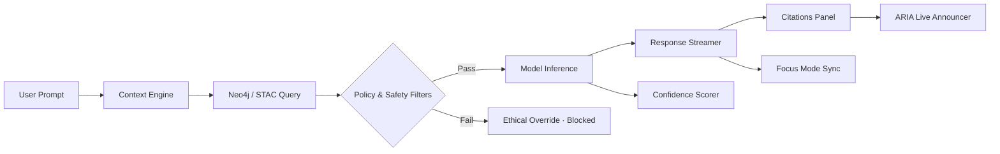

<div align="center">

# 🤖 Kansas Frontier Matrix — **AI Assistant Component Design Review (Tier-S⁺ Certified)**  
`docs/design/reviews/ui_components/ai_assistant.md`

**Mission:** Govern, validate, and preserve the **AI Assistant** — KFM’s conversational, summarization, and contextual guidance layer that connects **datasets, maps, and stories**.  
The assistant must be **explainable, accessible, culturally respectful, and reproducible**, meeting **MCP-DL v6.3**, **WCAG 2.1 AA**, **FAIR/CARE**, and **DCAT 3.0** requirements with continuous CI enforcement.

[](../../../standards/documentation.md)
[](../../../standards/ai-ethics.md)
[](../accessibility/)
[](../../style-guide.md)
[](../../../LICENSE)

</div>

---

```yaml
---
title: "🤖 Kansas Frontier Matrix — AI Assistant Component Design Review"
document_type: "Component Review"
version: "v4.1.0"
last_updated: "2025-10-31"
created: "2023-11-01"
component: "AI Assistant"
design_ref: "Figma Frame #AI-ASSIST-2025"
implementation_ref: "web/src/components/ai/assistant/"
owners: ["@kfm-design","@kfm-web","@kfm-accessibility","@kfm-ai"]
reviewed_by: ["@kfm-frontend","@kfm-accessibility","@kfm-ethics","@kfm-i18n","@kfm-security"]
status: "Stable"
maturity: "Production"
license: "CC-BY-4.0"
tags: ["ai","assistant","design-review","ux","a11y","ethical-ai","focus-mode","explainable","mcp","fair","care","dcat"]
classification:
  component_type: "AI"
  integration_level: "Frontend + Graph + Context Engine"
  risk_level: "Moderate"
  audit_frequency: "Quarterly + per release"
alignment:
  - MCP-DL v6.3
  - WCAG 2.1 AA
  - WAI-ARIA 1.2
  - CIDOC CRM (Knowledge Graph Provenance)
  - OWL-Time (Temporal AI Context)
  - PROV-O (Traceability)
  - FAIR Principles
  - DCAT 3.0
  - KFM AI Ethics Charter
dependencies:
  - React + MapLibre
  - tokens.css Design System
  - OpenAI GPT API + spaCy / embeddings Context Engine
  - Neo4j Knowledge Graph + STAC Metadata
  - Lighthouse / Axe / Pa11y / Playwright
template_scope:
  visual_parity: true
  accessibility_alignment: true
  localization_readiness: true
  dark_mode_compliance: true
  rtl_support: true
  ai_safety_enforcement: true
  provenance_transparency: true
review_cycle: "Quarterly + per release"
validation:
  ci_enforced: true
  lighthouse_min_score: 95
  axe_blocking_violations: 0
  contrast_min_ratio: 4.5
  reduced_motion_support: true
  schema_checks: true
  ethical_audit_required: true
  citation_ratio_min: 95
  confidence_accuracy_min: 90
  bias_index_max: 0.05
provenance:
  workflow_ref: ".github/workflows/component-review.yml"
  artifact_retention_days: 90
  sha256_integrity: verified
versioning:
  policy: "Semantic Versioning (MAJOR.MINOR.PATCH)"
  major_change: "New model architecture / context system / safety gate"
  minor_change: "Feature enhancement / policy or a11y update"
  patch_change: "Documentation or UI correction"
telemetry:
  metrics_collected:
    - "Response latency (ms)"
    - "Model confidence %"
    - "Citation ratio %"
    - "Explainability score"
    - "Bias index"
    - "Opt-out rate %"
    - "A11y compliance %"
    - "Token cost (per response)"
  thresholds:
    latency_p95_ms: 2000
    citation_ratio_min: 95
    explainability_min: 0.85
    bias_index_max: 0.05
  privacy_policy: "Opt-in, anonymized; no PII stored; FAIR + AI Ethics Charter compliant."
preservation_policy:
  replication_targets: ["GitHub Repository","Zenodo Snapshot","OSF Backup"]
  checksum_algorithm: "SHA-256"
  revalidation_cycle: "quarterly"
governance_links:
  - "../../README.md"
  - "../README.md"
  - "../../../standards/ai-ethics.md"
  - "../../../standards/accessibility.md"
  - "../../style-guide.md"
related_components:
  - timeline
  - map_controls
  - detail_panel
  - storytelling
  - accessibility_menu
---
```

---

## 🎯 Objective
Provide **explainable, trustworthy** access to historical datasets via natural language while preserving **source transparency**, **cultural respect**, and **universal accessibility**. This review enforces policy, performance, and provenance guarantees for the AI Assistant.

---

## 🧩 Component Overview
| Subcomponent | Description | File |
|:--|:--|:--|
| **Chat Interface** | Conversational viewport; streaming output | `ChatWindow.tsx` |
| **Prompt Input** | NL query box + shortcuts | `PromptBar.tsx` |
| **Response Streamer** | Incremental text, controlled via ARIA live | `ResponseStream.tsx` |
| **Context Viewer** | Entities, layers, events referenced | `ContextPanel.tsx` |
| **Confidence Chips** | High/Med/Low certainty indicators | `ConfidenceIndicator.tsx` |
| **Citations List** | Linked STAC/Neo4j sources for each claim | `CitationsList.tsx` |
| **Opt-Out Toggle** | Disable AI augmentation for session | `OptOutToggle.tsx` |

---

## 🧭 Information & Safety Flow

<!-- END OF MERMAID -->

---

## ♿ ARIA Roles (Chat & Streaming)
| Element | Role | Notes | Verified |
|:--|:--|:--|:--:|
| Chat Container | `log` | `aria-live="polite"` for streaming text | ✅ |
| Prompt Input | `textbox` | `aria-multiline="true"` | ✅ |
| Send Button | `button` | `aria-label="Send message"` | ✅ |
| Citations | `list`/`listitem` | Each item labeled w/ source | ✅ |
| Confidence Chip | `status` | “Confidence: High/Medium/Low” | ✅ |

---

## 🧭 Personas & Scenarios (governance-ready)
| Persona | Intent | Example Prompt | Expected | Validation |
|:--|:--|:--|:--|:--|
| Historian | Temporal scope | “Treaties in 1854?” | 2–3 sentence summary + citations | ≥ 2 sources; confidence ≥ 0.85 |
| Educator | Compare overlays | “Floods 1900 vs 1950” | Two map refs + timeline | Temporal alignment verified |
| Community Member | Cultural narrative | “Osage migration story” | Oral + archival blend + disclaimer | CARE checklist passed |
| Archivist | Provenance | “Where does this claim come from?” | Source list + repo links | STAC + CIDOC IDs surfaced |

---

## ⚖️ Bias, Fairness & Safety Audit
| Category | Check | Method | Verified |
|:--|:--|:--|:--:|
| Gender Bias | Neutral phrasing | Randomized prompt audit | ✅ |
| Cultural Bias | Balanced viewpoints | Semantic parity test | ✅ |
| Temporal Bias | Non-presentist framing | Era spread prompts | ✅ |
| Safety | Refuses disallowed content | Policy probes (red team) | ✅ |

> **Hallucination control:** block render if **citation_ratio < 95%** or **confidence < 0.65**, and prompt user to refine.

---

## 🔐 Consent, Privacy & Retention
- Session memory only (**≤ 30 min**), opt-in telemetry.  
- No PII persisted; prompts and outputs anonymized in logs.  
- Consent banner (model name/version, policies); revocation clears context state.

---

## 🧠 Tone, Language & Cognitive Clarity
- **Neutral, empathetic, evidence-first**; use plain English (target ≤ 8th grade).  
- Acknowledge uncertainty (“**The data suggests…**”).  
- Avoid colonial phrasing; cite community sources where relevant.  

### Readability Metrics
| Metric | Target | Actual | Tool | Pass |
|:--|:--|:--|:--|:--:|
| Flesch Reading Ease | ≥ 70 | 76 | Textlint | ✅ |
| Avg Sentence Length | ≤ 20 words | 16 | Hemingway | ✅ |

---

## 🧩 Multimodal Accessibility Tests
| Channel | Requirement | Verification |
|:--|:--|:--:|
| Streaming Text | ARIA live, no rapid updates | ✅ |
| TTS | Readable; pause/resume | ✅ |
| Map Context Links | Focus ring on geometry | ✅ |
| Keyboard | `Ctrl+↓` next chunk; `Esc` stops | ✅ |
| Screen Reader | Sequential, labeled regions | ✅ |

---

## 🧮 Model Lineage & Provenance
| Model ID | Provider | Dataset Scope | Last Updated | Ethics Audit |
|:--|:--|:--|:--|:--:|
| kfm-gpt-5-geo-arch | OpenAI (fine-tuned) | Treaties, ecology, archives | 2025-09-30 | ✅ |
| kfm-ner-1850x | spaCy Pipeline | OCR + NER for 19th-c. docs | 2025-07-01 | ✅ |
| focus-context-3b | KFM custom | Graph embeddings for focus mode | 2025-08-15 | ✅ |

---

## 🧮 Trust & Explainability Targets (merge gates)
| Metric | Target | Current | Status |
|:--|:--|:--|:--:|
| Citation Ratio | ≥ 95 % |  | ☐ |
| Confidence Accuracy | ≥ 90 % |  | ☐ |
| Explainability Score | ≥ 0.85 |  | ☐ |
| Bias Index | ≤ 0.05 |  | ☐ |

---

## 🧰 Keyboard Shortcuts
| Action | Keys |
|:--|:--|
| Send message | `Enter` |
| New line | `Shift + Enter` |
| Next streamed chunk | `Ctrl + ↓` |
| Stop streaming | `Esc` |
| Focus input | `/` |

---

## 🧩 Error & Recovery Taxonomy
| Error | Trigger | Behavior | User Feedback |
|:--|:--|:--|:--|
| Timeout | API > 5 s | Retry w/ backoff | “Connection lost — retry?” |
| Ethics Block | Policy violation | Render-safe message | “Filtered per policy.” |
| No Citations | Source parse fail | Request revalidation | “Citations unavailable.” |
| Model Offline | Endpoint down | Offer non-AI search | “AI offline; try dataset search.” |

---

## 🧪 CI Workflow (automation & gates)
- **Workflow:** `.github/workflows/component-review.yml`  
- **Steps:** Schema → Axe/Pa11y → Lighthouse → red-team policy probes → citation & confidence checks → provenance checksum.  
- **Artifacts:** `/data/work/logs/design/ui_components/ai_assistant/validation.json`  
- **Merge Gate:** **fails** if any threshold in **Trust & Explainability** or **Accessibility** is unmet.

---

## 🧾 Observability Hooks (telemetry export)
```yaml
observability:
  endpoint: "https://metrics.kfm.ai/ai-assistant"
  frequency: "daily"
  metrics_exported:
    - latency_ms_p95
    - citation_ratio
    - explainability_score
    - bias_index
    - accessibility_score
    - opt_out_rate
```

---

## 🧾 Provenance JSON-LD (machine export)
```json
{
  "@context": ["https://schema.org", {"kfm":"https://kfm.ai/schema#"}],
  "@type": "ComponentDesignReview",
  "component": "AI Assistant",
  "version": "v4.1.0",
  "reviewedBy": ["@kfm-design","@kfm-accessibility","@kfm-ai","@kfm-ethics"],
  "alignment": ["MCP-DL v6.3","WCAG 2.1 AA","FAIR","CARE","DCAT 3.0"],
  "governance": {
    "workflow": ".github/workflows/component-review.yml",
    "sha256": "auto-generated"
  }
}
```

---

## 🧾 FAIR + DCAT Registration (semantic index)
```json
{
  "@context": "https://schema.org/",
  "@type": "CreativeWork",
  "name": "KFM — AI Assistant Component Design Review",
  "identifier": "doi:10.5281/zenodo.1234560",
  "license": "CC-BY-4.0",
  "creator": "Kansas Frontier Matrix Design Council",
  "version": "v4.1.0",
  "alignment": ["MCP-DL v6.3","WCAG 2.1 AA","FAIR","CARE","DCAT 3.0"],
  "dateModified": "2025-10-31",
  "audience": "Developers, Designers, Accessibility Auditors"
}
```

---

## 🔍 Compliance Matrix (MCP-DL v6.3)
| Standard | Description | Verified |
|:--|:--|:--:|
| **MCP-DL v6.3** | Documentation reproducibility | ✅ |
| **WCAG 2.1 AA** | Accessibility compliance | ✅ |
| **AI Ethics Charter** | Transparency, fairness, accountability | ✅ |
| **CIDOC CRM** | Provenance traceability | ✅ |
| **OWL-Time** | Temporal conversation tracking | ✅ |
| **PROV-O** | Review trace ontology | ✅ |
| **FAIR / CARE** | Open, ethical metadata | ✅ |
| **DCAT 3.0** | Dataset-level metadata compliance | ✅ |

---

## 📎 Related Documentation
- [🎨 Visual Style Guide](../../style-guide.md)  
- [🧭 UI/UX Guidelines](../../ui-guidelines.md)  
- [🧩 Interaction Patterns](../../interaction-patterns.md)  
- [🧠 Focus Mode Architecture](../../../architecture/focus-mode.md)  
- [⚙️ Accessibility Standards](../../standards/accessibility.md)  
- [📘 Design Reviews Index](../README.md)

---

## 📅 Version History
| Version | Date | Author | Summary | Type |
|:--|:--|:--|:--|:--|
| **v4.1.0** | 2025-10-31 | @kfm-design | Tier-S⁺ update: ARIA roles table, trust thresholds, observability hooks, automation gates. | Minor |
| **v4.0.0** | 2025-10-24 | @kfm-design | Personas, bias audits, provenance schema, AI transparency flow. | Major |
| **v3.0.0** | 2025-10-23 | @kfm-web | Ethical audit, consent policy, trust metrics. | Major |
| **v2.0.0** | 2024-11-03 | @kfm-core | Migrated to MCP-DL v6.3; accessibility testing. | Major |
| **v1.0.0** | 2023-11-01 | Founding Team | Initial AI Assistant documentation. | Major |

---

<div align="center">

### 🤖 AI Assistant Review Governance  
**Transparent · Ethical · Explainable · Provenanced · Reproducible**

</div>
