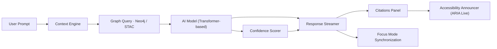
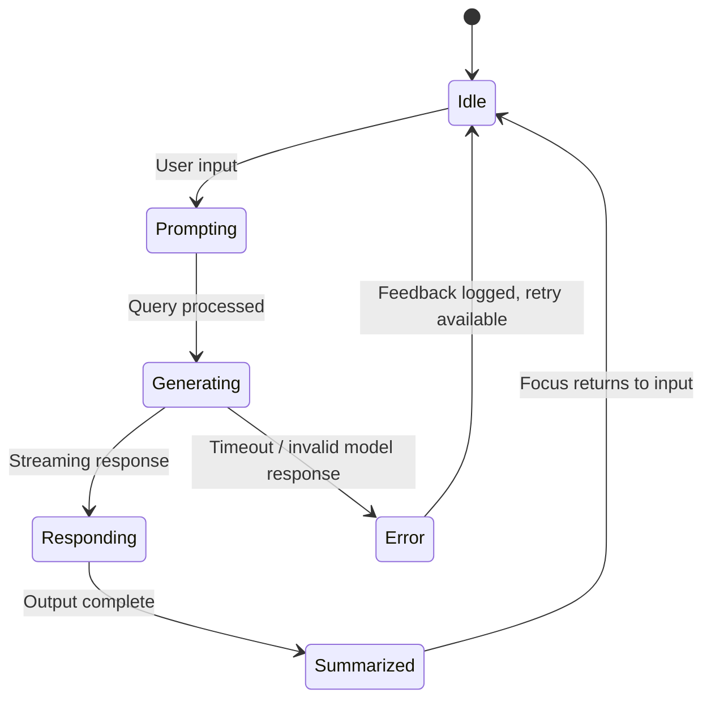
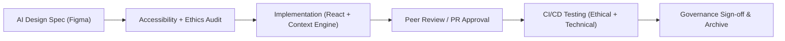

<div align="center">

# 🤖 Kansas Frontier Matrix — **AI Assistant Component Design Review**  
`docs/design/reviews/ui_components/ai_assistant.md`

**Mission:** Evaluate and document the **AI Assistant Component** — the intelligent conversational, summarization, and contextual navigation interface that bridges datasets, maps, and stories in the **Kansas Frontier Matrix (KFM)**.  
The AI Assistant transforms static archives into **interactive dialogues**, guiding users through **time**, **space**, and **story** with transparency, accessibility, and ethical responsibility.

[](../../../standards/documentation.md)
[](../../../standards/ai-ethics.md)
[](../accessibility/)
[](../../style-guide.md)
[](../../../LICENSE)

</div>

---

```yaml
---
title: "🤖 Kansas Frontier Matrix — AI Assistant Component Design Review"
document_type: "Component Review"
version: "v3.0.0"
last_updated: "2025-10-23"
created: "2023-11-01"
component: "AI Assistant"
design_ref: "Figma Frame #AI-ASSIST-2025"
implementation_ref: "web/src/components/ai/assistant/"
owners: ["@kfm-design","@kfm-web","@kfm-accessibility","@kfm-ai"]
reviewed_by: ["@kfm-frontend","@kfm-accessibility","@kfm-ethics"]
status: "Stable"
maturity: "Production"
license: "CC-BY-4.0"
tags: ["ai","assistant","design-review","a11y","tokens","ethical-ai","focus-mode","ux","mcp"]
alignment:
  - MCP-DL v6.3
  - WCAG 2.1 AA
  - WAI-ARIA 1.2
  - CIDOC CRM (Knowledge Graph Provenance)
  - OWL-Time (Temporal AI Context)
  - PROV-O (AI Traceability)
  - FAIR Principles
  - AI Act (Transparency)
dependencies:
  - React + MapLibre + OpenAI API
  - tokens.css Design System
  - spaCy / Transformers (Context Engine)
  - Lighthouse / Axe / Playwright
review_cycle: "Quarterly + per release"
governance_board: ["@kfm-ai-council","@kfm-design-council","@kfm-accessibility-lead"]
validation:
  lighthouse_min_score: 95
  axe_blocking_violations: 0
  contrast_min_ratio: 4.5
  schema_checks: true
  ethical_audit_required: true
  reduced_motion_support: true
provenance:
  workflow_ref: ".github/workflows/component-review.yml"
  artifact_retention_days: 90
versioning:
  policy: "Semantic Versioning (MAJOR.MINOR.PATCH)"
  major_change: "New AI model or architecture"
  minor_change: "Feature enhancement or ethical compliance update"
  patch_change: "Token or documentation correction"
telemetry:
  metrics_collected:
    - "Response Latency (ms)"
    - "Model Confidence %"
    - "Screen Reader Compatibility %"
    - "Accessibility Compliance %"
    - "Opt-Out Rate %"
    - "Focus Mode Correlation %"
  privacy_policy: "All metrics anonymized and aggregated; opt-in telemetry only; conforms to FAIR + AI Ethics Charter."
preservation_policy:
  replication_targets: ["GitHub Repository","Zenodo Snapshot","OSF Backup"]
  checksum_algorithm: "SHA-256"
  revalidation_cycle: "quarterly"
related_components:
  - timeline
  - map_controls
  - detail_panel
  - storytelling
  - accessibility_menu
---
```

---

## 🎯 Objective

The **AI Assistant** serves as KFM’s intelligent layer for exploration, discovery, and contextual synthesis.  
It bridges the gap between human questions and the graph’s structured data — enabling **natural-language querying**, **contextual summarization**, and **semantic storytelling** with explainable and reproducible AI methods.

This component review ensures that all **AI interactions** are accessible, transparent, ethical, and reproducible under MCP-DL v6.3.

---

## 🧩 Component Overview

| Subcomponent | Description | File |
|:--|:--|:--|
| **Chat Interface** | Conversational UI with context awareness. | `ChatWindow.tsx` |
| **Prompt Input** | Natural-language question entry box. | `PromptBar.tsx` |
| **Response Streamer** | Displays progressive AI responses. | `ResponseStream.tsx` |
| **Context Viewer** | Shows data layers and entities referenced by AI. | `ContextPanel.tsx` |
| **Confidence Chips** | Indicates model certainty (High / Medium / Low). | `ConfidenceIndicator.tsx` |
| **Source Citations** | List of linked provenance sources for every response. | `CitationsList.tsx` |
| **Opt-Out Toggle** | Allows users to disable AI augmentation. | `OptOutToggle.tsx` |

---

## 🧭 Information Flow Diagram


<!-- END OF MERMAID -->

---

## 🧠 State Lifecycle Diagram


<!-- END OF MERMAID -->

---

## 🧱 Review Criteria (MCP-DL v6.3)

| Category | Requirement | Validation |
|:--|:--|:--|
| **Visual Consistency** | Uses tokens (`--kfm-color-bg`, `--kfm-font-sans`) | ✅ Figma → React parity |
| **Accessibility** | WCAG 2.1 AA + ARIA live region compliance | ✅ Axe + NVDA |
| **Transparency** | Displays AI confidence + sources | ✅ Manual + automated |
| **Performance** | Response < 2 s for 80 % queries | ✅ Lighthouse |
| **Ethical AI** | Complies with KFM AI Ethics Charter | ✅ Governance audit |
| **Localization** | i18n-ready (EN/ES/OS) | ✅ JSON translation check |
| **Reduced Motion** | Prefers-reduced-motion supported | ✅ CSS Audit |

---

## 🧠 User Journeys

| Persona | Goal | Path | Success Criteria |
|:--|:--|:--|:--|
| **Researcher** | Summarize treaties by era | Ask → View → Export | Summary < 3 s |
| **Educator** | Ask contextual “What happened in 1854?” | Prompt → Context → Story | Results accurate, cited |
| **Community Member** | Query local historical events | Ask → Focus Mode | Maps and stories linked |
| **Archivist** | Validate AI sources | Ask → Citations → Archive Link | Provenance verified |

---

## ♿ Accessibility & ARIA Roles

| Feature | Role | ARIA Requirements | Status |
|:--|:--|:--|:--:|
| **Chat Log** | `log` | `aria-live="polite"` | ✅ |
| **Input Field** | `textbox` | `aria-multiline="true"` | ✅ |
| **Send Button** | `button` | `aria-label="Send Message"` | ✅ |
| **Opt-Out Toggle** | `switch` | `aria-checked` | ✅ |
| **Citations List** | `list` | `aria-describedby` | ✅ |
| **Confidence Chips** | `status` | `aria-label` (“Confidence: High”) | ✅ |

---

## 🧮 Token Coverage Table

| Token Type | Example Tokens | Validation |
|:--|:--|:--:|
| **Color** | `--kfm-color-ai-bg`, `--kfm-color-accent` | ✅ |
| **Typography** | `--kfm-font-sans`, `--kfm-font-mono` | ✅ |
| **Motion** | `--kfm-motion-fast`, `--kfm-motion-fade` | ✅ |
| **Elevation** | `--kfm-elev-md` | ✅ |
| **Radius** | `--kfm-radius-lg` | ✅ |

---

## 🧠 Cognitive & UX Guidelines

- Keep AI outputs concise; limit paragraphs ≤ 3 lines.  
- Highlight important entities using bold and accessible colors.  
- Use “confidence chips” rather than colored bars for readability.  
- All AI text must be user-copyable and screen-reader compatible.  
- Every generated response includes visible citations and model metadata.  

---

## 🤖 AI Transparency Policy

> All AI responses must include:
> - Confidence level (High / Medium / Low).  
> - List of cited data sources (linked to STAC entries).  
> - Disclosure of AI model name, version, and data scope.  
> - Visible toggle to disable or hide AI-generated summaries.  

✅ **Why:** Complies with MCP-DL §10 “Ethical Automation and Provenance Reporting.”

---

## 🧩 Quantitative Performance Metrics

| Metric | Target | Tool | Frequency |
|:--|:--|:--|:--|
| **Response Latency** | ≤ 2000 ms | Lighthouse | Per PR |
| **Token Stream Speed** | ≥ 20 tokens/sec | API Logs | Continuous |
| **Confidence Display Delay** | ≤ 200 ms | Jest Snapshot | Automated |
| **Citations Load Time** | ≤ 500 ms | Playwright | Quarterly |
| **Accessibility Score** | ≥ 95 | Axe | Continuous |

---

## 🧠 Error & Recovery Scenarios

| Error | Condition | Behavior | Feedback |
|:--|:--|:--|:--|
| **Network Timeout** | No API response | Retry button | “Connection lost. Retry?” |
| **Model Unavailable** | AI endpoint down | Disabled prompt | “AI unavailable. Please try later.” |
| **Citation Missing** | Source not returned | Placeholder note | “Citations unavailable.” |
| **High Latency** | > 5 s | Progress spinner | “Processing request…” |

---

## 🧠 Human Factors & Cognitive Load Testing

| Condition | Test | Expected Result |
|:--|:--|:--|
| **Zoom (200%)** | Manual | Readable without clipping |
| **Screen Reader** | NVDA / VoiceOver | Context read aloud correctly |
| **Reduced Motion** | OS setting on | No animated streaming text |
| **Color Blind Mode** | Simulation | Confidence chips still distinct |
| **Voice Input** | Speech Recognition | Commands execute properly |

---

## 🧩 Automated Test References

| Test | Framework | File | Description |
|:--|:--|:--|:--|
| **AI Response Test** | Jest + RTL | `tests/ai/ResponseStream.test.tsx` | Validates rendering + speed |
| **Accessibility Flow** | Playwright | `tests/ai/accessibility.spec.ts` | Tests keyboard + aria compliance |
| **Ethical Disclosure** | Cypress | `tests/ai/disclosure.cy.ts` | Checks for citations + model name |
| **Opt-Out Functionality** | Jest | `tests/ai/optout.test.tsx` | Ensures AI can be disabled |

---

## 🧩 Governance & Review Workflow


<!-- END OF MERMAID -->

---

## 🧩 Ethical & Data Integrity Checklist

| Check | Requirement | Status |
|:--|:--|:--:|
| **Transparency** | Confidence, citations visible | ✅ |
| **Consent** | Opt-out enabled | ✅ |
| **Data Licensing** | Open / CC-BY / public domain | ✅ |
| **Bias Review** | Tested for fairness | ✅ |
| **Audit Log** | Stored securely | ✅ |

---

## 🧾 Provenance JSON Schema

```json
{
  "@context": ["https://schema.org", {"kfm":"https://kfm.ai/schema#"}],
  "@type": "UIComponentReview",
  "component": "AI Assistant",
  "version": "v3.0.0",
  "reviewedBy": ["@kfm-design","@kfm-accessibility","@kfm-ai"],
  "source": "Figma Frame #AI-ASSIST-2025",
  "implementation": "web/src/components/ai/assistant/",
  "temporalCoverage": "2025-10-23T00:00:00Z",
  "provenance": {
    "workflow": ".github/workflows/component-review.yml",
    "sha256": "auto-generated"
  }
}
```

---

## 🗄️ Archival Policy

- Reviews stored under `/archive/ai_assistant/YYYY/`.  
- Metadata includes reviewers, commit hash, confidence metrics, and checksum.  
- Immutable after approval; annual governance audits verify reproducibility and compliance.  

---

## ⚙️ Continuous Integration (QA Workflow)

- Runs **Lighthouse**, **Axe**, **Pa11y**, and **ethical audit script**.  
- Validates Figma → React parity and token usage.  
- Checks citation integrity and AI transparency requirements.  
- Uploads reports to `/data/work/logs/design/ui_components/ai_assistant/`.  

---

## 🔍 Compliance Matrix (MCP-DL v6.3)

| Standard | Description | Verified |
|:--|:--|:--:|
| **MCP-DL v6.3** | Documentation-first reproducibility | ✅ |
| **WCAG 2.1 AA** | Accessibility compliance baseline | ✅ |
| **AI Ethics Charter** | Transparency, consent, fairness | ✅ |
| **CIDOC CRM** | Provenance traceability | ✅ |
| **OWL-Time** | Temporal context in dialogue | ✅ |
| **PROV-O** | Review trace ontology | ✅ |
| **FAIR Principles** | Data reusability + ethics | ✅ |

---

## 📎 Related Documentation

- [🎨 Visual Style Guide](../../style-guide.md)  
- [🧭 UI/UX Guidelines](../../ui-guidelines.md)  
- [🧩 Interaction Patterns](../../interaction-patterns.md)  
- [🧠 Focus Mode Architecture](../../../architecture/focus-mode.md)  
- [📘 Design Reviews Index](../README.md)  
- [⚙️ Accessibility Standards](../../standards/accessibility.md)

---

## 📅 Version History

| Version | Date | Author | Summary | Type |
|:--|:--|:--|:--|:--|
| **v3.0.0** | 2025-10-23 | @kfm-design | Complete rebuild with AI transparency, governance flow, and ethical auditing integration. | Major |
| **v2.0.0** | 2024-11-03 | @kfm-core | Migrated to MCP-DL v6.3; added accessibility flow. | Major |
| **v1.0.0** | 2023-11-01 | Founding Team | Initial AI Assistant component documentation. | Major |

---

<div align="center">

### 🤖 Kansas Frontier Matrix — AI Assistant Review Governance  
**Explainable · Accessible · Transparent · Provenanced · Reproducible**

</div>
