<div align="center">

# 🤖 Kansas Frontier Matrix — **AI Assistant Component Design Review**  
`docs/design/reviews/ui_components/ai_assistant.md`

**Mission:** Evaluate, document, and govern the **AI Assistant Component** — the conversational, summarization, and contextual guidance interface that bridges datasets, maps, and stories within the **Kansas Frontier Matrix (KFM)**.  
The AI Assistant transforms KFM’s structured data and archival resources into **interactive, explainable dialogues**, enabling users to explore **time, space, and story** transparently and reproducibly under MCP-DL v6.3.

[](../../../standards/documentation.md)
[](../../../standards/ai-ethics.md)
[](../accessibility/)
[](../../style-guide.md)
[](../../../LICENSE)

</div>

---

```yaml
---
title: "🤖 Kansas Frontier Matrix — AI Assistant Component Design Review"
document_type: "Component Review"
version: "v4.0.0"
last_updated: "2025-10-24"
created: "2023-11-01"
component: "AI Assistant"
design_ref: "Figma Frame #AI-ASSIST-2025"
implementation_ref: "web/src/components/ai/assistant/"
owners: ["@kfm-design","@kfm-web","@kfm-accessibility","@kfm-ai"]
reviewed_by: ["@kfm-frontend","@kfm-accessibility","@kfm-ethics","@kfm-i18n"]
status: "Stable"
maturity: "Production"
license: "CC-BY-4.0"
tags: ["ai","assistant","design-review","ux","a11y","tokens","ethical-ai","focus-mode","explainable","mcp"]
alignment:
  - MCP-DL v6.3
  - WCAG 2.1 AA
  - WAI-ARIA 1.2
  - CIDOC CRM (Knowledge Graph Provenance)
  - OWL-Time (Temporal AI Context)
  - PROV-O (Traceability)
  - FAIR Principles
  - DCAT 3.0
  - AI Ethics Charter (KFM)
dependencies:
  - React + MapLibre Frontend
  - tokens.css Design System
  - OpenAI GPT API + spaCy Context Engine
  - Lighthouse / Axe / Playwright / Pa11y
  - Neo4j Knowledge Graph + STAC Metadata
review_cycle: "Quarterly + per release"
governance_board: ["@kfm-ai-council","@kfm-design-council","@kfm-accessibility-lead"]
validation:
  lighthouse_min_score: 95
  axe_blocking_violations: 0
  contrast_min_ratio: 4.5
  schema_checks: true
  ethical_audit_required: true
  reduced_motion_support: true
provenance:
  workflow_ref: ".github/workflows/component-review.yml"
  artifact_retention_days: 90
  sha256_integrity: verified
versioning:
  policy: "Semantic Versioning (MAJOR.MINOR.PATCH)"
  major_change: "New model architecture or context system"
  minor_change: "Feature enhancement or ethical policy update"
  patch_change: "Documentation or UI correction"
telemetry:
  metrics_collected:
    - "Response Latency (ms)"
    - "Model Confidence %"
    - "Citation Ratio %"
    - "Accessibility Compliance %"
    - "Opt-Out Rate %"
    - "Bias Index Score"
  privacy_policy: "All metrics anonymized, opt-in only; conforms to FAIR + KFM AI Ethics Charter."
preservation_policy:
  replication_targets: ["GitHub Repository","Zenodo Snapshot","OSF Backup"]
  checksum_algorithm: "SHA-256"
  revalidation_cycle: "quarterly"
governance_links:
  - "../../README.md"
  - "../README.md"
  - "../../../standards/ai-ethics.md"
  - "../../../standards/accessibility.md"
  - "../../style-guide.md"
related_components:
  - timeline
  - map_controls
  - storytelling
  - detail_panel
  - accessibility_menu
---
```

---

## 🎯 Objective

The **AI Assistant** component powers conversational access to KFM’s integrated datasets and historical archives.  
It converts queries into graph-level searches, contextualizes results, and presents verified information with confidence and transparency.  
This document ensures compliance with **ethical AI standards**, **WCAG accessibility**, and **reproducibility under MCP-DL v6.3**.

---

## 🧩 Component Overview

| Subcomponent | Description | File |
|:--|:--|:--|
| **Chat Interface** | Main conversational viewport with response streaming. | `ChatWindow.tsx` |
| **Prompt Input** | Natural-language question entry bar. | `PromptBar.tsx` |
| **Response Streamer** | Displays incremental AI responses with live ARIA output. | `ResponseStream.tsx` |
| **Context Viewer** | Displays related data layers and events. | `ContextPanel.tsx` |
| **Confidence Chips** | Color-coded indicators for model certainty. | `ConfidenceIndicator.tsx` |
| **Citations List** | Linked source references from STAC/Neo4j. | `CitationsList.tsx` |
| **Opt-Out Toggle** | Disables AI augmentation on demand. | `OptOutToggle.tsx` |

---

## 🧭 Information Flow Diagram

```mermaid
flowchart LR
  U["User Prompt"] --> CE["Context Engine"]
  CE --> GQ["Graph Query · Neo4j / STAC"]
  GQ --> M["AI Model Inference"]
  M --> R["Response Streamer"]
  M --> CF["Confidence Scorer"]
  CF --> R
  R --> C["Citations Panel"]
  R --> F["Focus Mode Synchronization"]
  C --> A11Y["ARIA Live Announcer"]
```


<!-- END OF MERMAID -->

---

## 🧠 AI Interaction Lifecycle


<!-- END OF MERMAID -->

---

## 🧱 Review Criteria (MCP-DL v6.3)

| Category | Requirement | Validation |
|:--|:--|:--|
| **Accessibility** | WCAG 2.1 AA + ARIA live compliance | ✅ Axe / NVDA |
| **Transparency** | Shows confidence + sources + model ID | ✅ Ethics Review |
| **Visual Consistency** | Follows design tokens & type scales | ✅ Figma parity |
| **Performance** | <2 s for 80 % responses | ✅ Lighthouse |
| **Ethical Compliance** | Meets AI Ethics Charter standards | ✅ Audit |
| **Localization** | i18n + L10n ready | ✅ JSON audit |
| **Reduced Motion** | Supported + user preference honored | ✅ CSS audit |

---

## 🧭 Conversational Personas & Scenarios

| Persona | Intent | Example Prompt | Expected Response | Validation |
|:--|:--|:--|:--|:--|
| **Historian** | Temporal inquiry | “Summarize Kansas treaties in 1854.” | 3-sentence summary + citations | AI cites ≥ 2 sources |
| **Educator** | Comparative view | “Show floods from 1900 vs 1950.” | Two maps + timeline reference | Correct temporal mapping |
| **Community Member** | Cultural narrative | “Tell the Osage migration story.” | Mixed oral + archival content | Culturally contextual tone |
| **Archivist** | Provenance validation | “Where does this treaty info come from?” | List of sources + repository links | STAC + CIDOC IDs visible |

---

## ⚖️ Bias & Fairness Audit

| Category | Check | Test Method | Verified |
|:--|:--|:--|:--:|
| **Gender Bias** | Neutral pronouns in summaries | Random prompt audit | ✅ |
| **Cultural Bias** | Balanced representation | Semantic parity test | ✅ |
| **Temporal Bias** | Equal emphasis across eras | Chronological prompt variance | ✅ |
| **Algorithmic Bias** | Stable answers across re-runs | Variance testing (5x runs) | ✅ |

---

## 🔐 AI Data & Consent Policy

- No user query data is persisted beyond the session (≤30 minutes).  
- All logs anonymized before aggregation.  
- Users informed of AI context switching events.  
- Consent banner presented at first use (AI model name, version, policy).  
- Revoking consent deletes session memory immediately.  

---

## 🧠 Conversational Tone & Language Guidelines

| Principle | Description |
|:--|:--|
| **Neutral & Empathetic** | Uses inclusive, respectful language. |
| **Evidence-Based** | References data before interpretation. |
| **Transparent** | Communicates uncertainty clearly (“The data suggests…”). |
| **Culturally Respectful** | Avoids colonial phrasing; honors Indigenous sources. |
| **Readable** | 8th-grade reading level target. |

---

## 🧩 Multimodal Accessibility Tests

| Channel | Requirement | Verification |
|:--|:--|:--:|
| **Text Stream** | ARIA live announces stream | ✅ |
| **Audio Narration** | TTS supported | ✅ |
| **Map Context Links** | Focus ring visible on geometry | ✅ |
| **Keyboard Control** | `Ctrl+↓` advances response | ✅ |
| **Screen Reader** | Context read sequentially | ✅ |

---

## 🧩 Model Lineage & Provenance

| Model ID | Provider | Dataset Scope | Last Updated | Ethical Audit |
|:--|:--|:--|:--|:--:|
| **kfm-gpt-5-geo-arch** | OpenAI (Fine-tuned) | Treaties, ecology, history datasets | 2025-09-30 | ✅ |
| **kfm-ner-1850x** | spaCy Pipeline | OCR text + named entity data | 2025-07-01 | ✅ |
| **focus-context-3b** | Custom KFM | Graph embeddings & AI focus contexts | 2025-08-15 | ✅ |

---

## 🧮 Confidence Visualization Tokens

| Confidence | Color Token | UI Behavior | User Hint |
|:--|:--|:--|:--|
| **High (≥0.85)** | `--kfm-color-success` | Normal display | “Strongly supported.” |
| **Medium (0.65–0.84)** | `--kfm-color-warning` | Underlined | “Verify in sources.” |
| **Low (<0.65)** | `--kfm-color-error` | Dotted underline | “Interpret cautiously.” |

---

## 🧩 AI Feedback & Correction Workflow

- Each AI message includes “**Suggest Correction**” option.  
- Feedback generates a GitHub issue with `ai-feedback` label.  
- Reviewers validate corrections weekly.  
- Approved feedback informs retraining dataset updates quarterly.  

---

## 🧠 Quantitative Trust & Explainability Metrics

| Metric | Target | Description |
|:--|:--|:--|
| **Citation Ratio** | ≥ 95 % | Responses with ≥1 verifiable source. |
| **Confidence Accuracy** | ≥ 90 % | Predicted vs empirical validation. |
| **Explainability Score** | ≥ 0.85 | % responses with reasoning metadata. |
| **Bias Index** | ≤ 0.05 | Mean normalized bias value. |

---

## 🧩 Ethical & Data Integrity Checklist

| Check | Requirement | Status |
|:--|:--|:--:|
| **Transparency** | Confidence + citations displayed | ✅ |
| **Consent** | Opt-in + revocable | ✅ |
| **Licensing** | CC-BY 4.0 or public domain | ✅ |
| **Bias Review** | Audited quarterly | ✅ |
| **Audit Log** | Encrypted + stored 90 days | ✅ |

---

## 🧠 Error & Recovery Scenarios

| Error | Condition | Behavior | Feedback |
|:--|:--|:--|:--|
| **Timeout** | API delay >5s | Retry option | “Connection lost — retry?” |
| **Model Offline** | Endpoint unavailable | Opt-out enabled | “AI temporarily offline.” |
| **Missing Citation** | No sources found | Placeholder + alert | “Citations unavailable.” |
| **Ethical Filter Trigger** | Policy violation | Blocked output | “Query filtered for compliance.” |

---

## 🧠 AI Safety & Fail-Safe Flow

```mermaid
flowchart TD
  U["User Query"] --> A["Context Engine"]
  A --> B{"Policy Check"}
  B -->|Pass| M["AI Model Inference"]
  B -->|Fail| F["Ethical Override · Blocked"]
  M --> C["Citations Extractor"]
  C --> E["Response Streamer"]
  E --> X{"Citations Present?"}
  X -->|Yes| H["Render Output"]
  X -->|No| R["Source Revalidation → Retry"]
  R --> H
```


<!-- END OF MERMAID -->

---

## 🧩 Governance & Review Workflow

```mermaid
flowchart LR
  D["Figma Spec + Context Design"] --> A["Accessibility & Ethics Audit"]
  A --> I["Implementation (React + AI Context Engine)"]
  I --> P["Peer Review · PR Approval"]
  P --> C["CI/CD Testing · Ethical Compliance"]
  C --> G["Governance Sign-Off & Archive"]
```


<!-- END OF MERMAID -->

---

## 🧾 Provenance JSON Schema

```json
{
  "@context": ["https://schema.org", {"kfm":"https://kfm.ai/schema#"}],
  "@type": "UIComponentReview",
  "component": "AI Assistant",
  "version": "v4.0.0",
  "reviewedBy": ["@kfm-design","@kfm-accessibility","@kfm-ai","@kfm-ethics"],
  "source": "Figma Frame #AI-ASSIST-2025",
  "implementation": "web/src/components/ai/assistant/",
  "temporalCoverage": "2025-10-24T00:00:00Z",
  "bias_audit": {
    "last_audit": "2025-10-21",
    "audited_by": ["@kfm-ethics","@kfm-accessibility"],
    "results": {
      "gender_bias": 0.01,
      "cultural_bias": 0.00,
      "temporal_bias": 0.02
    }
  },
  "provenance": {
    "workflow": ".github/workflows/component-review.yml",
    "sha256": "auto-generated"
  }
}
```

---

## 🗄️ Archival & Governance Policy

- Reviews stored under `/archive/ai_assistant/YYYY/`.  
- Metadata includes model lineage, reviewer list, confidence stats, and checksum.  
- Immutable after approval; verified quarterly by the **AI Governance Council**.  
- Annual digests stored in `/data/digests/design/ai/`.  

---

## ⚙️ Continuous Integration (QA Workflow)

- Runs Lighthouse, Axe, Pa11y, and Ethical Policy Validator.  
- Checks citation completeness and model transparency fields.  
- Ensures accessibility of streaming responses.  
- Uploads logs to `/data/work/logs/design/ui_components/ai_assistant/`.  
- Blocks merges on any ethical or accessibility regression.  

---

## 🔍 Compliance Matrix (MCP-DL v6.3)

| Standard | Description | Verified |
|:--|:--|:--:|
| **MCP-DL v6.3** | Documentation reproducibility | ✅ |
| **WCAG 2.1 AA** | Accessibility compliance baseline | ✅ |
| **AI Ethics Charter** | Transparency, fairness, accountability | ✅ |
| **CIDOC CRM** | Provenance traceability | ✅ |
| **OWL-Time** | Temporal conversation tracking | ✅ |
| **PROV-O** | Review trace ontology | ✅ |
| **FAIR Principles** | Data reusability & ethical access | ✅ |
| **DCAT 3.0** | Dataset-level metadata compliance | ✅ |

---

## 📎 Related Documentation

- [🎨 Visual Style Guide](../../style-guide.md)  
- [🧭 UI/UX Guidelines](../../ui-guidelines.md)  
- [🧩 Interaction Patterns](../../interaction-patterns.md)  
- [🧠 Focus Mode Architecture](../../../architecture/focus-mode.md)  
- [⚙️ Accessibility Standards](../../standards/accessibility.md)  
- [📘 Design Reviews Index](../README.md)

---

## 📅 Version History

| Version | Date | Author | Summary | Type |
|:--|:--|:--|:--|:--|
| **v4.0.0** | 2025-10-24 | @kfm-design | Full rebuild including personas, bias audits, provenance schema, and AI transparency flow. | Major |
| **v3.0.0** | 2025-10-23 | @kfm-web | Added ethical audit, consent policy, and trust metrics. | Major |
| **v2.0.0** | 2024-11-03 | @kfm-core | Migrated to MCP-DL v6.3; added accessibility testing. | Major |
| **v1.0.0** | 2023-11-01 | Founding Team | Initial AI Assistant documentation. | Major |

---

<div align="center">

### 🤖 Kansas Frontier Matrix — AI Assistant Review Governance  
**Transparent · Ethical · Explainable · Provenanced · Reproducible**

</div>
