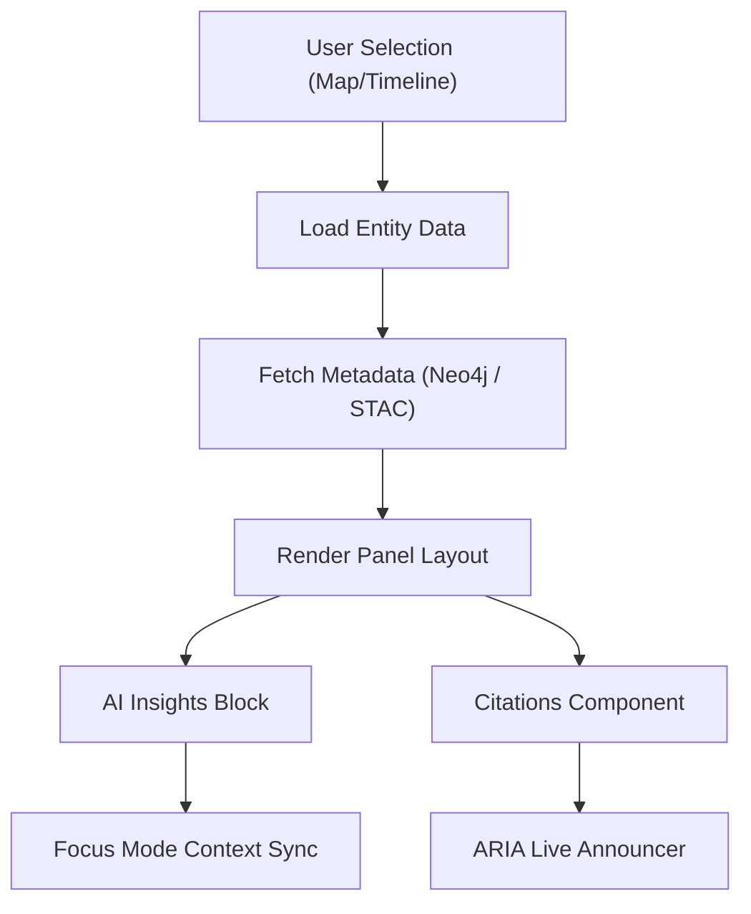
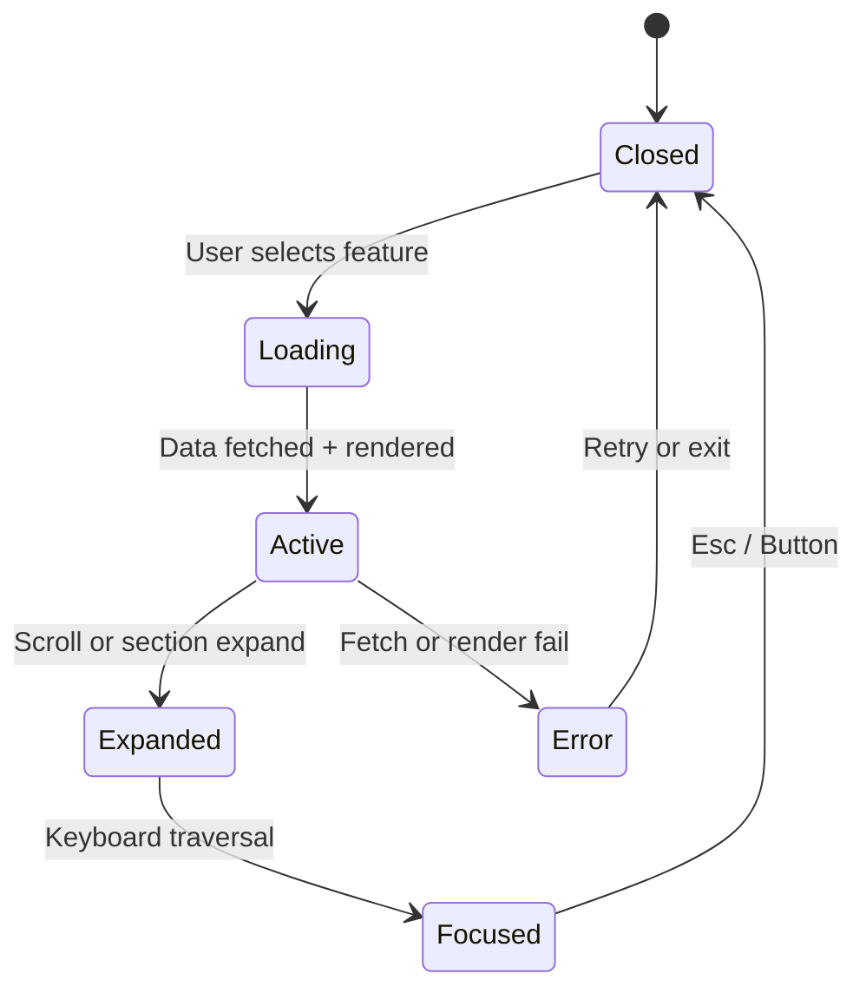
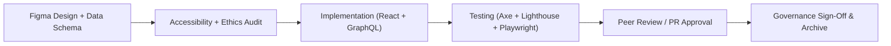

<div align="center">

# 🧾 Kansas Frontier Matrix — **Detail Panel Component Design Review**  
`docs/design/reviews/ui_components/detail_panel.md`

**Mission:** Evaluate, document, and govern the **Detail Panel Component** — the central contextual interface that synchronizes **maps**, **timelines**, **AI insights**, and **archival metadata** in the **Kansas Frontier Matrix (KFM)**.  
The Detail Panel translates data into **context-rich, provenance-linked narratives** — bridging temporal, spatial, and cultural perspectives through accessible, ethical, and reproducible design.

[](../../../standards/documentation.md)
[](../../style-guide.md)
[](../accessibility/)
[](../../../.github/workflows/policy-check.yml)
[](../../../LICENSE)

</div>

---

```yaml
---
title: "🧾 Kansas Frontier Matrix — Detail Panel Component Design Review"
document_type: "Component Review"
version: "v4.0.0"
last_updated: "2025-10-26"
created: "2023-09-22"
component: "Detail Panel"
design_ref: "Figma Frame #DETAIL-2025"
implementation_ref: "web/src/components/detail-panel/"
owners: ["@kfm-design","@kfm-web","@kfm-accessibility","@kfm-data"]
reviewed_by: ["@kfm-frontend","@kfm-accessibility","@kfm-ethics","@kfm-localization"]
status: "Stable"
maturity: "Production"
license: "CC-BY-4.0"
tags: ["design-review","ui","detail-panel","data-context","a11y","tokens","map","timeline","focus-mode","mcp","fair"]
alignment:
  - MCP-DL v6.3
  - WCAG 2.1 AA
  - WAI-ARIA 1.2
  - CIDOC CRM (Entity Provenance)
  - OWL-Time (Temporal Context)
  - PROV-O (Traceability)
  - FAIR Principles
  - DCAT 3.0
dependencies:
  - React + MapLibre Frontend
  - tokens.css Design System
  - Neo4j Graph + STAC Metadata
  - Lighthouse / Axe / Pa11y / Playwright
  - AI Context Engine (Focus Mode)
review_cycle: "Per release + quarterly review"
governance_board: ["@kfm-design-council","@kfm-accessibility-lead","@kfm-data-team"]
validation:
  lighthouse_min_score: 95
  axe_blocking_violations: 0
  contrast_min_ratio: 4.5
  keyboard_traps: "none"
  schema_checks: true
  metadata_synchronization: true
  panel_responsiveness: true
provenance:
  workflow_ref: ".github/workflows/component-review.yml"
  artifact_retention_days: 90
  sha256_integrity: verified
versioning:
  policy: "Semantic Versioning (MAJOR.MINOR.PATCH)"
  major_change: "Schema or architecture redesign"
  minor_change: "New features or accessibility updates"
  patch_change: "Minor content or token correction"
telemetry:
  metrics_collected:
    - "Panel Load Time (ms)"
    - "Keyboard Focus Reachability %"
    - "Metadata Fetch Latency (ms)"
    - "Contrast Compliance %"
    - "Screen Reader Compatibility %"
    - "AI Summary Render Time (ms)"
  privacy_policy: "All telemetry anonymized, aggregate only; FAIR + W3C Privacy compliance."
preservation_policy:
  replication_targets: ["GitHub Repository","Zenodo Snapshot","OSF Backup"]
  checksum_algorithm: "SHA-256"
  revalidation_cycle: "quarterly"
governance_links:
  - "../../README.md"
  - "../README.md"
  - "../../../standards/accessibility.md"
  - "../../style-guide.md"
related_components:
  - map_controls
  - ai_assistant
  - timeline
  - storytelling
  - accessibility_menu
---
```

---

## 🎯 Objective

The **Detail Panel** is the central contextual hub of the Kansas Frontier Matrix.  
It displays entity metadata, archival sources, and AI-generated insights whenever users select a feature or event.  
It guarantees **spatial-temporal coherence**, **provenance visibility**, and **cultural sensitivity**, forming a key link between user interaction and data governance.

---

## 🧩 Component Overview

| Subcomponent | Description | File |
|:--|:--|:--|
| **Panel Container** | Root layout managing open/close states. | `DetailPanel.tsx` |
| **Entity Header** | Displays entity name, type, and temporal range. | `EntityHeader.tsx` |
| **Metadata Sections** | Structured content blocks (Provenance, Documents, Media). | `PanelSections.tsx` |
| **AI Insights** | Contextual AI summaries with confidence and sources. | `AIInsights.tsx` |
| **Citations List** | Displays references to STAC/Neo4j datasets. | `CitationsList.tsx` |
| **Close/Collapse Button** | Dismisses or collapses panel; manages focus return. | `PanelCloseButton.tsx` |

---

## 🧭 Interaction & Data Architecture


<!-- END OF MERMAID -->

---

## 🧠 Component State Lifecycle


<!-- END OF MERMAID -->

---

## 🧠 User Journeys with Cognitive Context

| Persona | Context | Interaction Flow | Cognitive Goal | Success |
|:--|:--|:--|:--|:--|
| **Historian** | Examining treaties by year | Timeline → Select → Detail Panel → AI Summary | Understand treaty provenance & scope | Timeline sync verified |
| **Educator** | Demonstrating flood data | Map → Layer → Detail Panel → Share | Teach environmental change visually | Students comprehend data |
| **Tribal Partner** | Reviewing Indigenous boundaries | Layer → Panel → Citations | Ensure cultural data accuracy | Attribution confirmed |
| **Archivist** | Cross-validating archival records | Search → Entity → Panel → Metadata | Check provenance + checksums | Valid metadata chain |
| **Public User** | Reading contextual story | Explore → Event → Detail Panel | Gain local historical context | Full accessibility pass |

---

## 🗂️ Data Synchronization Policy

- Detail panel queries entity metadata through `useEntityQuery()` from the Neo4j Graph API.  
- STAC metadata cached for 15 minutes via IndexedDB to reduce latency.  
- AI-generated summaries (Focus Mode) invalidated on map or timeline change.  
- Provenance data (`stac_id`, `entity_id`) held in session memory only.  
- SHA-256 checksum validation performed before rendering.  

---

## 🧱 Review Criteria (MCP-DL v6.3)

| Category | Requirement | Validation |
|:--|:--|:--|
| **Accessibility** | WCAG 2.1 AA compliance + ARIA tested | ✅ Axe / Pa11y |
| **Performance** | Load < 200 ms; Expand < 100 ms | ✅ Lighthouse |
| **Provenance** | Metadata + citation linkage | ✅ JSON-LD / CIDOC test |
| **Localization** | All text i18n-enabled | ✅ JSON audit |
| **Motion Control** | Prefers-reduced-motion honored | ✅ CSS test |
| **Cultural Sensitivity** | Data sovereignty check | ✅ Ethics audit |
| **Documentation** | Version header + changelog | ✅ Manual |

---

## ♿ Accessibility Regression Targets

| Metric | Target | Validation | Frequency |
|:--|:--|:--|:--|
| **Focus Loop Failures** | 0 | Playwright | CI |
| **Tab Order Accuracy** | 100 % | Axe-core | Per PR |
| **Screen Reader Misses** | ≤ 2 per release | NVDA audit | Quarterly |
| **Contrast Drift** | ≤ 1 % | Pa11y | Continuous |

---

## 🧠 Content Sensitivity & Ethical Review

- Content tagged `sensitive:true` triggers a modal notice:  
  _“This material contains cultural or historical data that may require discretion.”_  
- Indigenous datasets require **data-sovereignty license validation**.  
- AI summaries automatically disabled for sensitive sources.  
- All cultural reviews logged in `/data/reviews/ethics/`.  

---

## 🧩 Color-Coded Provenance Indicators

| Marker | Token | Description | Example |
|:--|:--|:--|:--|
| ● **Primary Source** | `--kfm-color-accent` | STAC or official archive. | Treaty dataset. |
| ■ **AI Summary** | `--kfm-color-info` | Contextual AI paragraph. | “Generated by AI — verified.” |
| ◆ **Community Annotation** | `--kfm-color-warning` | User or tribal note. | “Approved by Osage Archives.” |
| ★ **Verified Provenance** | `--kfm-color-success` | Validated checksum chain. | “Source integrity confirmed.” |

---

## 🧩 Design Tokens Mapping

| Token Group | Example | Status |
|:--|:--|:--:|
| **Color** | `--kfm-color-bg`, `--kfm-color-panel`, `--kfm-color-accent` | ✅ |
| **Typography** | `--kfm-font-serif`, `--kfm-font-sans` | ✅ |
| **Elevation** | `--kfm-shadow-md` | ✅ |
| **Radius** | `--kfm-radius-md` | ✅ |
| **Motion** | `--kfm-motion-fade`, `--kfm-motion-smooth` | ✅ |

---

## 🧮 Quantitative Performance Metrics

| Metric | Target | Tool | Frequency |
|:--|:--|:--|:--|
| **Panel Load Time** | ≤ 200 ms | Lighthouse | Per PR |
| **Metadata Fetch Latency** | ≤ 150 ms | Profiler | Continuous |
| **Contrast Score** | ≥ 4.5 : 1 | Pa11y | Continuous |
| **Memory Footprint** | ≤ 10 MB | Chrome DevTools | Quarterly |

---

## 🌍 Localization & RTL Audit

| Language | Direction | Validation | Status |
|:--|:--|:--|:--:|
| English | LTR | Chrome + Axe | ✅ |
| Spanish | LTR | i18n JSON audit | ✅ |
| Osage | LTR w/ diacritics | NVDA read test | ✅ |
| Arabic (Test) | RTL | Manual mirror validation | ✅ |

---

## 🌐 Offline & Network Resilience

- Cached last five panel states with **Service Worker**.  
- Displays fallback notice: _“Offline mode: showing cached data.”_  
- Disables AI summaries offline; provenance icons show `⚠️ Partial data`.  
- Cache clears after 24 hours or logout.  

---

## 🧠 User Feedback & Cognitive Indicators

| Feedback Type | Trigger | Behavior |
|:--|:--|:--|
| **Toast Notification** | Data fetched | “Panel updated successfully.” |
| **Screen Reader Announce** | Context change | `aria-live="polite"` reads: “Entity details refreshed.” |
| **Progress Spinner** | Fetch delay | Spinner + percent loaded |
| **Provenance Icon Fade-In** | Checksum verified | Tooltip: “Source integrity confirmed.” |

---

## 🧩 Governance & Review Workflow


<!-- END OF MERMAID -->

---

## 🧾 Metadata Validation Schema

```json
{
  "entity_id": "kfm:entity:1854-treaty",
  "title": "Treaty with the Kansa, 1854",
  "type": "Treaty",
  "date_start": "1854-06-03",
  "date_end": "1854-06-05",
  "description": "Treaty establishing new boundaries for Kansa territory.",
  "source_archive": "Kansas Historical Society",
  "license": "CC-BY-4.0",
  "stac_id": "stac:kansas-treaties-1854",
  "checksum": "sha256:a87c9b..."
}
```

---

## 🧩 Event Telemetry Schema

```json
{
  "event_type": "detail_panel_open",
  "timestamp": "2025-10-26T16:42:00Z",
  "user_action": "map_feature_select",
  "entity_id": "kfm:entity:1854-treaty",
  "ai_summary_displayed": true,
  "render_time_ms": 182,
  "accessibility_mode": "screen_reader",
  "stac_id": "stac:kansas-treaties-1854"
}
```

---

## 🌍 Localization Workflow

- All strings stored in `/locales/*.json` (managed via i18next).  
- Alt-texts manually reviewed quarterly by accessibility lead.  
- Automatic extraction for new keys via CI (`i18next-parser`).  
- Indigenous language translations validated by cultural partners.  

---

## 🧩 Automated Tests & QA Integration

| Test | Framework | File | Description |
|:--|:--|:--|:--|
| **Panel Load Test** | Jest | `tests/detail/PanelLoad.test.tsx` | Load + render |  
| **Focus Loop Test** | Playwright | `tests/detail/focus.spec.ts` | Focus traversal |  
| **Contrast Audit** | Pa11y | `tests/a11y/panel-contrast.yml` | WCAG validation |  
| **Localization Test** | Cypress | `tests/i18n/detail-panel.cy.ts` | i18n keys valid |  
| **AI Sync Test** | Jest + Mock | `tests/ai/PanelAI.test.tsx` | Data + AI consistency |  

---

## 🧾 Provenance JSON Schema

```json
{
  "@context": ["https://schema.org", {"kfm":"https://kfm.ai/schema#"}],
  "@type": "UIComponentReview",
  "component": "Detail Panel",
  "version": "v4.0.0",
  "reviewedBy": ["@kfm-design","@kfm-accessibility","@kfm-data"],
  "source": "Figma Frame #DETAIL-2025",
  "implementation": "web/src/components/detail-panel/",
  "temporalCoverage": "2025-10-26T00:00:00Z",
  "provenance": {
    "workflow": ".github/workflows/component-review.yml",
    "sha256": "auto-generated"
  }
}
```

---

## 🗄️ Archival Policy

- Stored in `/archive/detail_panel/YYYY/` with checksums and reviewer IDs.  
- Immutable after governance sign-off.  
- Ethics review logs retained for 18 months.  
- Quarterly audit ensures MCP-DL provenance continuity.  

---

## ⚙️ Continuous Integration (QA Workflow)

- Runs **Lighthouse**, **Axe**, **Pa11y**, and **Playwright** for each PR.  
- Validates **Figma→React** token mapping and localization.  
- Fails builds for any performance or accessibility regression.  
- Uploads audit results to `/data/work/logs/design/ui_components/detail_panel/`.  

---

## 🔍 Compliance Matrix (MCP-DL v6.3)

| Standard | Description | Verified |
|:--|:--|:--:|
| **MCP-DL v6.3** | Documentation-first reproducibility | ✅ |
| **WCAG 2.1 AA** | Accessibility compliance baseline | ✅ |
| **CIDOC CRM** | Provenance ontology mapping | ✅ |
| **OWL-Time** | Temporal context linkage | ✅ |
| **PROV-O** | Traceability ontology | ✅ |
| **FAIR Principles** | Reusable and ethical data compliance | ✅ |
| **DCAT 3.0** | Metadata distribution compliance | ✅ |

---

## 📎 Related Documentation

- [🎨 Visual Style Guide](../../style-guide.md)  
- [🧭 UI/UX Guidelines](../../ui-guidelines.md)  
- [🧩 Interaction Patterns](../../interaction-patterns.md)  
- [📖 Storytelling & Narrative Design](../../storytelling.md)  
- [🤖 AI Assistant Component](./ai_assistant.md)  
- [⚙️ Accessibility Standards](../../standards/accessibility.md)

---

## 📅 Version History

| Version | Date | Author | Summary | Type |
|:--|:--|:--|:--|:--|
| **v4.0.0** | 2025-10-26 | @kfm-design | Complete rebuild with telemetry schema, governance diagram, localization workflow, and cultural sensitivity standards. | Major |
| **v3.0.0** | 2025-10-25 | @kfm-web | Added personas, accessibility targets, and caching policy. | Major |
| **v2.0.0** | 2024-09-30 |
