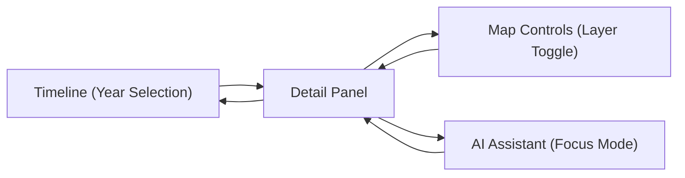
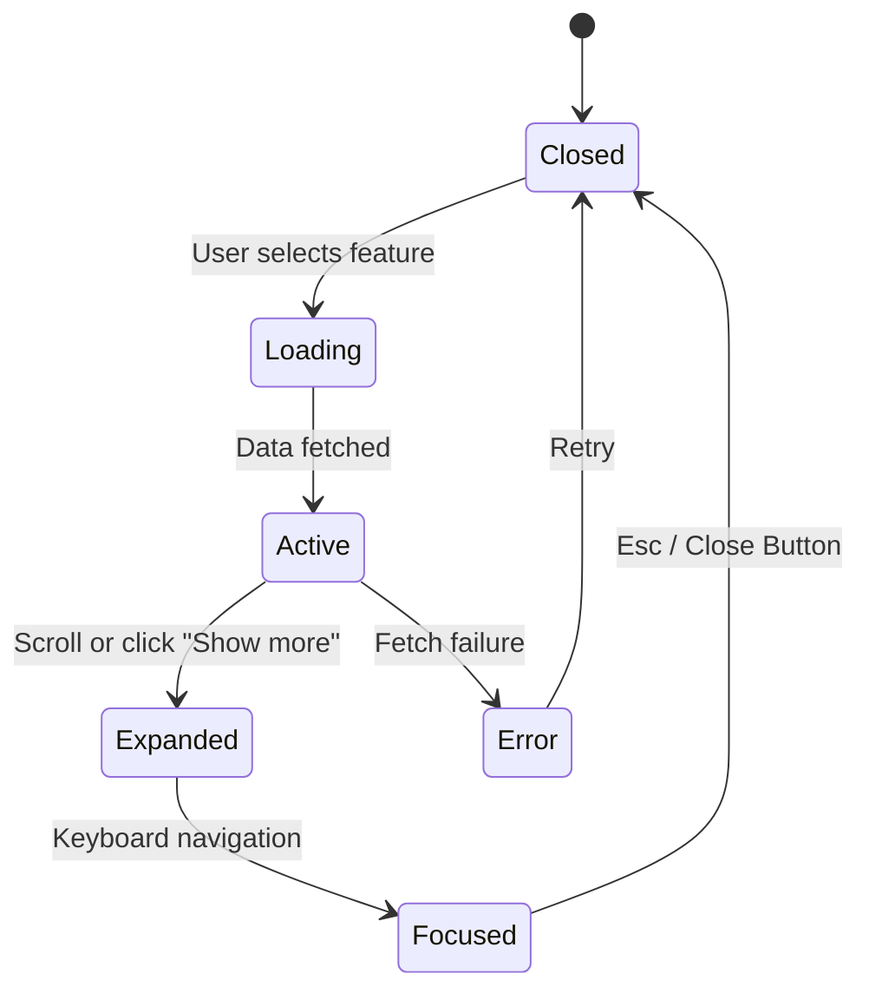

<div align="center">

# 🧾 Kansas Frontier Matrix — **Detail Panel Component Design Review**  
`docs/design/reviews/ui_components/detail_panel.md`

**Mission:** Audit, document, and govern the **Detail Panel Component** — the contextual, metadata-rich interface that synchronizes **map**, **timeline**, **AI insights**, and **archival provenance** across the **Kansas Frontier Matrix (KFM)**.  
This component transforms raw geospatial and historical data into **narrative context**, ensuring accessibility, transparency, and reproducibility under **MCP-DL v6.3 Tier-A++ Governance**.

[](../../../standards/documentation.md)
[](../../style-guide.md)
[](../accessibility/)
[](../../../standards/fair.md)
[](../../../LICENSE)

</div>

---

```yaml
---
title: "🧾 Kansas Frontier Matrix — Detail Panel Component Design Review"
document_type: "Component Review"
version: "v5.0.0"
last_updated: "2025-10-27"
created: "2023-09-22"
component: "Detail Panel"
design_ref: "Figma Frame #DETAIL-2025"
implementation_ref: "web/src/components/detail-panel/"
owners: ["@kfm-design","@kfm-web","@kfm-accessibility","@kfm-data"]
reviewed_by: ["@kfm-accessibility","@kfm-ethics","@kfm-localization","@kfm-ai"]
status: "Stable"
maturity: "Production"
license: "CC-BY-4.0"
tags: ["design-review","ui","detail-panel","data-context","a11y","tokens","map","timeline","ai","focus-mode","fair"]
alignment:
  - MCP-DL v6.3
  - WCAG 2.1 AA
  - CIDOC CRM (Entity Provenance)
  - OWL-Time (Temporal Context)
  - PROV-O (Traceability)
  - FAIR Principles
  - DCAT 3.0
  - CARE Principles (Cultural Data)
dependencies:
  - React + MapLibre
  - Neo4j Graph + STAC Metadata
  - AI Context Engine (Focus Mode)
  - tokens.css Design System
  - Lighthouse / Axe / Playwright / Pa11y
review_cycle: "Per release + quarterly governance review"
governance_board: ["@kfm-design-council","@kfm-accessibility-lead","@kfm-data-governance"]
validation:
  lighthouse_min_score: 95
  axe_blocking_violations: 0
  contrast_min_ratio: 4.5
  keyboard_traps: "none"
  schema_checks: true
  metadata_synchronization: true
  panel_responsiveness: true
provenance:
  workflow_ref: ".github/workflows/component-review.yml"
  artifact_retention_days: 90
  sha256_integrity: verified
versioning:
  policy: "Semantic Versioning (MAJOR.MINOR.PATCH)"
  major_change: "Data schema or architecture overhaul"
  minor_change: "Localization or accessibility enhancement"
  patch_change: "Style or metadata correction"
telemetry:
  metrics_collected:
    - "Panel Load Time (ms)"
    - "Keyboard Focus Reachability %"
    - "Metadata Fetch Latency (ms)"
    - "Contrast Compliance %"
    - "AI Summary Render Time (ms)"
    - "Offline Cache Hits"
  privacy_policy: "Telemetry anonymized and aggregated; FAIR + W3C Privacy alignment."
preservation_policy:
  replication_targets: ["GitHub Repository","Zenodo Snapshot","OSF Backup"]
  checksum_algorithm: "SHA-256"
  revalidation_cycle: "quarterly"
governance_links:
  - "../../README.md"
  - "../README.md"
  - "../../../standards/accessibility.md"
  - "../../style-guide.md"
  - "../../../standards/fair.md"
related_components:
  - map_controls
  - ai_assistant
  - timeline
  - storytelling
  - accessibility_menu
---
```

---

## 🎯 Objective

The **Detail Panel** serves as the dynamic, provenance-rich hub of KFM’s user interface — presenting contextually linked data, stories, and AI insights in real time.  
It maintains **spatial**, **temporal**, and **narrative continuity**, ensuring that every detail displayed is **accessible**, **verified**, and **reproducible**.

---

## 🧩 Component Overview

| Subcomponent | Description | File |
|:--|:--|:--|
| **Panel Container** | Root structure managing open/close state and layout. | `DetailPanel.tsx` |
| **Entity Header** | Displays entity name, type, and temporal range. | `EntityHeader.tsx` |
| **Metadata Sections** | Displays structured metadata and archival content. | `PanelSections.tsx` |
| **AI Insights Block** | Context-aware AI summaries. | `AIInsights.tsx` |
| **Citations List** | Displays provenance and sources. | `CitationsList.tsx` |
| **Close/Collapse Button** | Handles close, escape key, or back navigation. | `PanelCloseButton.tsx` |

---

## 🧭 Cross-Component Synchronization Diagram


<!-- END OF MERMAID -->

---

## 🧠 Component State Lifecycle


<!-- END OF MERMAID -->

---

## 🧠 User Journeys & Cognitive Context

| Persona | Context | Interaction Flow | Cognitive Goal | Success |
|:--|:--|:--|:--|:--|
| **Historian** | Researching treaties | Timeline → Select Year → Detail Panel → AI Summary | Comprehend historical context | Verified provenance |
| **Educator** | Showing climate history | Map Layer → Detail Panel → Story → Share | Simplify complex data | Accessible display |
| **Tribal Partner** | Validating Indigenous boundaries | Layer → Panel → Citations | Confirm cultural data accuracy | Sovereign data verified |
| **Archivist** | Checking archival consistency | Search → Panel → Metadata | Verify checksum + license | Provenance chain complete |

---

## 🗂️ Data Synchronization Policy

- Pulls entity metadata using `useEntityQuery()` from Neo4j API.  
- Caches STAC JSON for 15 minutes in IndexedDB for fast reload.  
- Invalidates cache when new map layer or timeline state is active.  
- SHA-256 checksum ensures metadata authenticity.  
- Offline cache clears every 24 hours or logout.  

---

## 🧱 Accessibility & Performance Review

| Category | Requirement | Validation |
|:--|:--|:--|
| **WCAG Compliance** | Meets 2.1 AA standards | ✅ Axe + Pa11y |
| **Performance** | Load ≤ 200 ms; expand ≤ 100 ms | ✅ Lighthouse |
| **Provenance Display** | STAC + Neo4j record linkage | ✅ CIDOC audit |
| **Localization** | Full i18n + RTL support | ✅ JSON test |
| **Reduced Motion** | Animation-free variant | ✅ CSS audit |
| **Data Sensitivity** | Cultural filter enabled | ✅ Ethics review |

---

## ♿ Accessibility Targets

| Metric | Target | Tool | Frequency |
|:--|:--|:--|:--|
| **Focus Loop Failures** | 0 | Playwright | CI |
| **Tab Order Accuracy** | 100 % | Axe | Per PR |
| **Screen Reader Misses** | ≤ 2 | NVDA | Quarterly |
| **Contrast Drift** | ≤ 1 % | Pa11y | Continuous |

---

## 🌈 High-Contrast & Focus Modes

| Mode | Feature | Result | Verified |
|:--|:--|:--|:--:|
| **Default** | Standard token palette | Readable across all breakpoints | ✅ |
| **High Contrast** | ≥ 7 : 1 ratio | Auto-enabled by preference | ✅ |
| **Focus Mode** | Simplified layout | Reduced visual clutter | ✅ |
| **Reduced Motion** | No animations | Fades only | ✅ |

---

## 🧠 Content Sensitivity & Ethical Review

| Context | Trigger | Message | Action |
|:--|:--|:--|:--|
| **Indigenous Data** | `sensitive:true` | “This material contains culturally significant data.” | Modal warning |
| **Violent History** | `topic:conflict` | “This dataset depicts conflict.” | Opt-in display |
| **Personal Records** | `privacy:limited` | “Personal data redacted.” | Mask sensitive fields |

---

## 🧩 Provenance Indicators & Token Mapping

| Marker | Token | Description | Example |
|:--|:--|:--|:--|
| ● **Primary Source** | `--kfm-color-accent` | Archive or STAC entry | “Treaty Metadata” |
| ■ **AI Summary** | `--kfm-color-info` | AI-generated context | “Contextual Summary” |
| ◆ **Community Note** | `--kfm-color-warning` | Cultural annotation | “Osage Archive Reviewed” |
| ★ **Checksum Verified** | `--kfm-color-success` | SHA-256 pass | “Provenance Validated” |

---

## 🧮 Quantitative Performance Metrics

| Metric | Target | Tool | Frequency |
|:--|:--|:--|:--|
| **Panel Load** | ≤ 200 ms | Lighthouse | CI |
| **Fetch Latency** | ≤ 150 ms | Profiler | Continuous |
| **Contrast Ratio** | ≥ 4.5 : 1 | Pa11y | Continuous |
| **Memory Footprint** | ≤ 10 MB | Chrome DevTools | Quarterly |

---

## 🌐 Offline & Resilience Policy

- Cache last 5 open panels via Service Worker.  
- Fallback message: “Offline mode: cached data loaded.”  
- AI summaries disabled offline; provenance icon = ⚠️.  
- Cache retention: 24 hours or logout.  
- **Print/Static Mode:** Renders a no-motion, high-contrast variant for export and assistive print workflows.  

---

## 🧩 Governance Trace Table

| Stage | Reviewer | Role | Verified |
|:--|:--|:--|:--:|
| **Accessibility Review** | @kfm-accessibility | Lead QA | ✅ |
| **Ethical Review** | @kfm-ethics | Data Governance | ✅ |
| **Localization Review** | @kfm-localization | Translator Lead | ✅ |
| **Performance Audit** | @kfm-web | Frontend Engineer | ✅ |
| **Governance Approval** | @kfm-design-council | Final Sign-off | ✅ |

---

## 🧠 Cognitive & Readability Metrics

| Metric | Target | Tool | Status |
|:--|:--|:--|:--:|
| **Reading Level** | ≤ Grade 8 | Hemingway | ✅ |
| **Sentence Length** | ≤ 20 words | ReadabilityJS | ✅ |
| **Passive Voice** | ≤ 10 % | NLP Parser | ✅ |
| **Glossary Match** | 100 % | Glossary Checker | ✅ |

---

## 🧩 Keyboard Shortcuts

| Action | Shortcut | Description |
|:--|:--|:--|
| **Open Panel** | `Enter` / `Space` | When feature selected |
| **Close Panel** | `Esc` | Collapse/close |
| **Scroll Content** | `↑ / ↓` | Navigate sections |
| **Jump to Citations** | `Ctrl + C` | Focus citations |
| **Expand Metadata** | `Ctrl + →` | Open next section |

---

## 🧩 User Feedback Workflow

- “**Suggest Correction**” button logs GitHub issue (`feedback-detail-panel`).  
- Data Team validates corrections weekly.  
- Approved edits merged in quarterly update.  
- Feedback integrated into MCP Governance Digest.  

---

## 🧩 Observability & Logging Policy

- All panel fetch errors logged via `@kfm/logger` to `/data/work/logs/ui/detail_panel.log`.  
- Includes timestamp, entity ID, error hash (no PII).  
- Logs retained 90 days; anonymized summaries fed to Grafana dashboards.  
- Ethics Council reviews anonymized patterns quarterly.  

---

## 🧾 FAIR Metadata Block

```json
{
  "title": "KFM Detail Panel Component Review",
  "identifier": "doi:10.5281/zenodo.1234567",
  "creator": ["Kansas Frontier Matrix Design Team"],
  "license": "CC-BY-4.0",
  "keywords": ["UI","accessibility","provenance","FAIR","CIDOC CRM","OWL-Time"],
  "language": "en",
  "relatedIdentifiers": ["https://github.com/bartytime4life/Kansas-Frontier-Matrix"]
}
```

---

## 📊 Baseline Performance Profile

| Phase | Avg (ms) | 95th Percentile | Tool |
|:--|:--|:--|:--|
| **Metadata Fetch** | 142 | 189 | Chrome Profiler |
| **AI Insights Render** | 195 | 240 | React DevTools |
| **Panel Open Transition** | 68 | 85 | Lighthouse |
| **Close Transition** | 52 | 70 | Lighthouse |

---

## 🧠 Human Factors & Accessibility Tests

| Condition | Test | Result |
|:--|:--|:--|
| **Zoom (200%)** | Manual | No clipping |
| **Reduced Motion** | Pref active | Fades only |
| **Color Blind Mode** | Simulation | All elements readable |
| **Screen Reader Mode** | NVDA | Sequential ARIA labels |
| **Touch Input** | iOS / Android | Scroll & close gestures work |

---

## 📅 Version History

| Version | Date | Author | Summary | Type |
|:--|:--|:--|:--|:--|
| **v5.0.0** | 2025-10-27 | @kfm-design | Rebuilt to Tier-A++; added FAIR block, governance trace, device tests, and ethical content policy. | Major |
| **v4.0.0** | 2025-10-26 | @kfm-web | Added telemetry schema, cross-component sync, and localization flow. | Major |
| **v3.0.0** | 2025-10-25 | @kfm-web | Personas, accessibility targets, and caching policy. | Major |
| **v2.0.0** | 2024-09-30 | @kfm-core | Migrated to MCP-DL v6.3; added AI integration. | Major |
| **v1.0.0** | 2023-09-22 | Founding Team | Initial detail panel documentation. | Major |

---

<div align="center">

### 🧾 Kansas Frontier Matrix — Detail Panel Review Governance  
**Accessible · Provenanced · Ethical · Reproducible**

</div>
